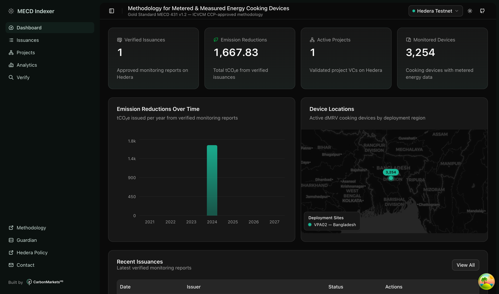
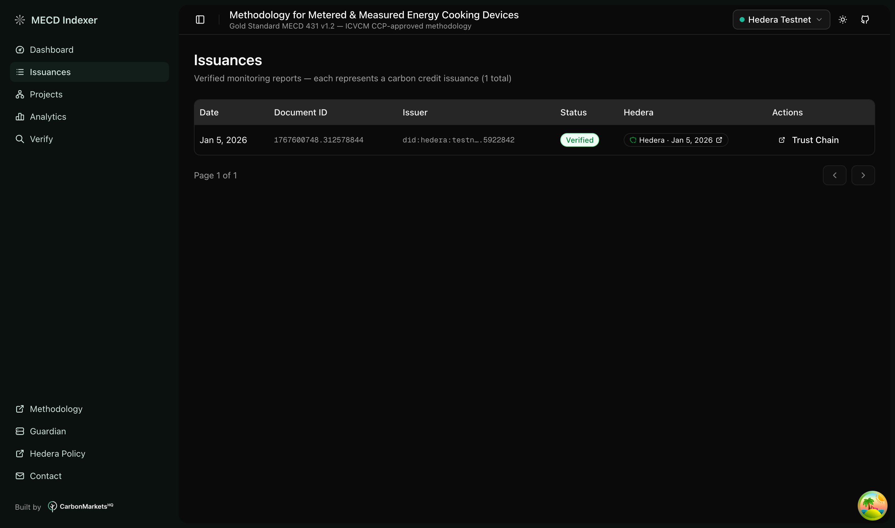
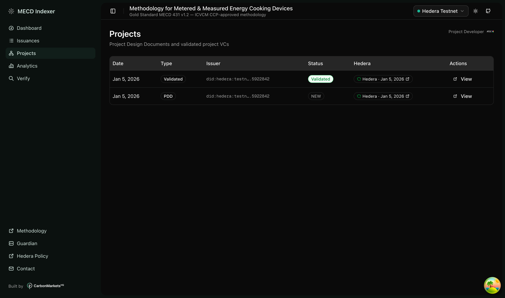
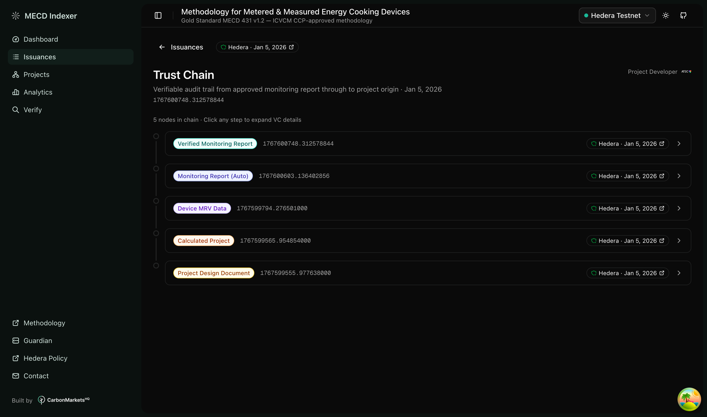
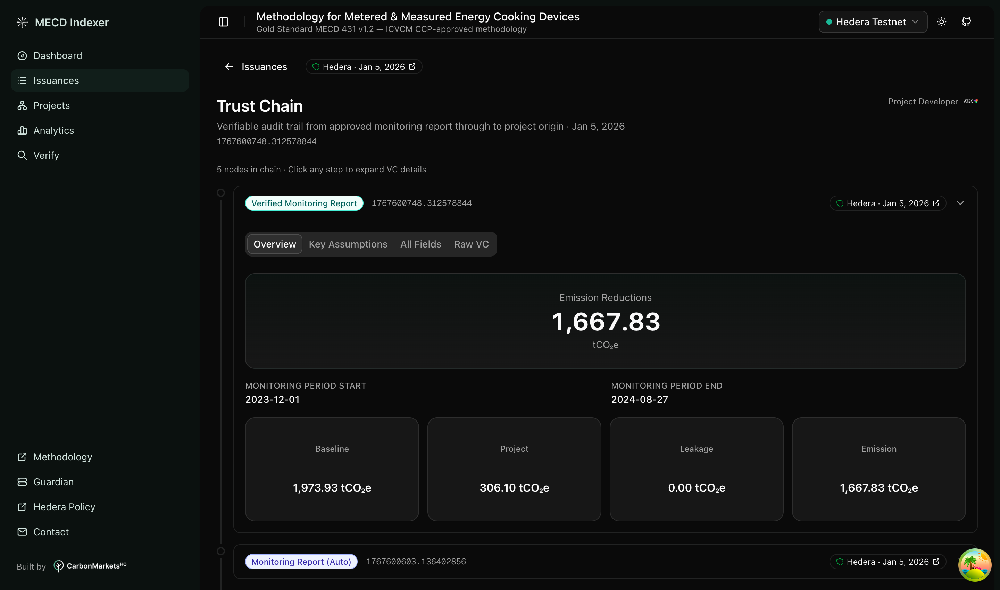
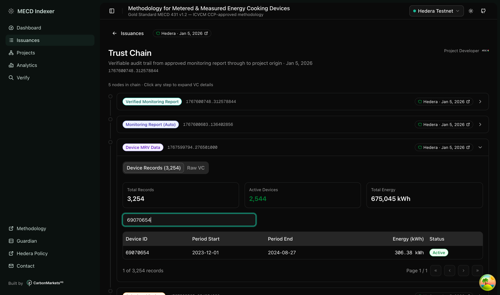
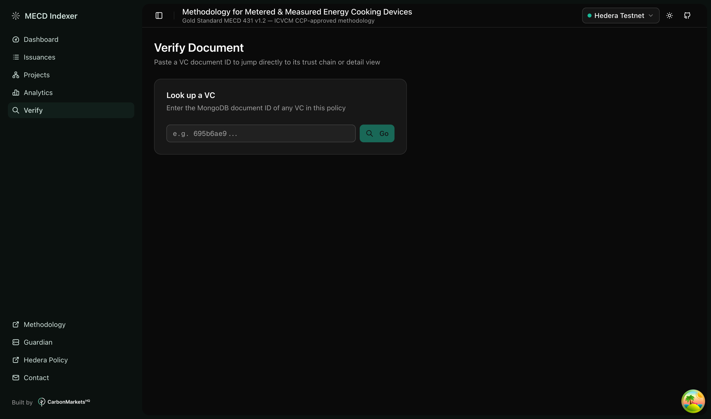

# MECD Indexer

Public dashboard for the [Gold Standard MECD 431](https://globalgoals.goldstandard.org/431_ee_ics_methodology-for-metered-measured-energy-cooking-devices/) methodology — Metered & Measured Energy Cooking Devices.

This indexer provides a transparent, read-only view of carbon credit issuances from a digitized MECD methodology running on [Hedera Guardian](https://github.com/hashgraph/guardian).

## Screenshots

### Dashboard


### Issuances


### Projects


### Trust Chain


### Monitoring Report


### Device ID Search


### Verify Document


## Features

- **Trust Chain Explorer** — Trace any issuance back to its project origin through the full Verifiable Credential chain
- **VC-Type Renderers** — Dedicated views for monitoring reports, verification reports, projects, device MRV data, and VVB registrations
- **Device Data Table** — Browse 3,254 metered cooking device records with search, sort, and pagination
- **Hedera Proof Links** — Every document links to its on-chain Hedera Consensus Service message
- **API Proxy** — Server-side auth proxy to the Guardian Indexer API (tokens never exposed to client)

## Tech Stack

Next.js 16 | React 19 | TanStack Query | shadcn/ui | Tailwind CSS 4 | Vitest

## Setup

```bash
npm install
cp .env.example .env.local   # Configure auth (see below)
npm run dev                   # http://localhost:3000
```

### Authentication

The indexer API requires a Bearer token. The app manages token lifecycle automatically — just provide your MGS credentials in `.env.local`:

```env
GUARDIAN_API_URL=https://guardianservice.app/api/v1
GUARDIAN_EMAIL=you@example.com
GUARDIAN_PASSWORD=your_password
```

If your email is linked to multiple Guardian users, the app will log an error with available user IDs. Pick one and set:

```env
GUARDIAN_USER_ID=6667c472175828bcc1d49ba4
```

**How it works:** On first request the server logs in via the MGS SSO chain (`loginByEmail` → `access-token` → `sso/generate`), caches the indexer token (14-day TTL), and refreshes it automatically before it expires. No manual token rotation needed.

**Static token fallback:** If you prefer to manage the token yourself, set `INDEXER_API_TOKEN` in `.env.local` and the auto-auth is skipped entirely.

## Testing

```bash
npm test        # Run all tests
npm run test:watch  # Watch mode
```

## Project Structure

```
app/              # Next.js App Router pages
  api/proxy/      # Auth proxy to Guardian Indexer
  dashboard/      # Overview with stats and recent issuances
  issuances/      # Issuance list + trust chain detail
  projects/       # Project list + detail
components/
  vc-views/       # Entity-type-specific VC renderers
  trust-chain/    # Trust chain visualization
  shared/         # Reusable components (DeviceDataTable, HederaProofBadge)
lib/
  api/            # API client and data fetching
  types/          # TypeScript DTOs
  utils/          # Formatting, Hedera URLs, trust chain logic
```

## Third-Party Logos & Trademarks

This project includes logos of third-party companies for identification purposes only. These logos remain the exclusive property of their respective owners:

- **Hedera** — The Hedera logo and HBAR symbol are trademarks of Hedera Hashgraph, LLC. Used with permission in the context of the Guardian open-source project.
- **ATEC Global** — The ATEC logo is a trademark of ATEC Global Ltd. Used with permission to identify the project developer in this demonstration.
- **Gold Standard** — References to the Gold Standard methodology are for identification purposes. Gold Standard is a trademark of The Gold Standard Foundation.

We do not claim ownership of any third-party logos or trademarks. If any rights holder requests removal of their logo from this repository, we will comply promptly.

## License

MIT

---

Built by [CarbonMarketsHQ](https://carbonmarketshq.com)
