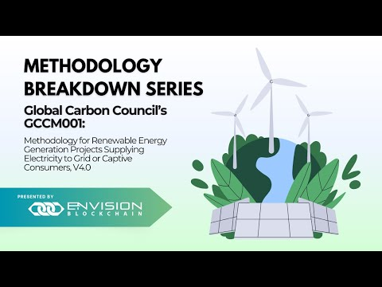
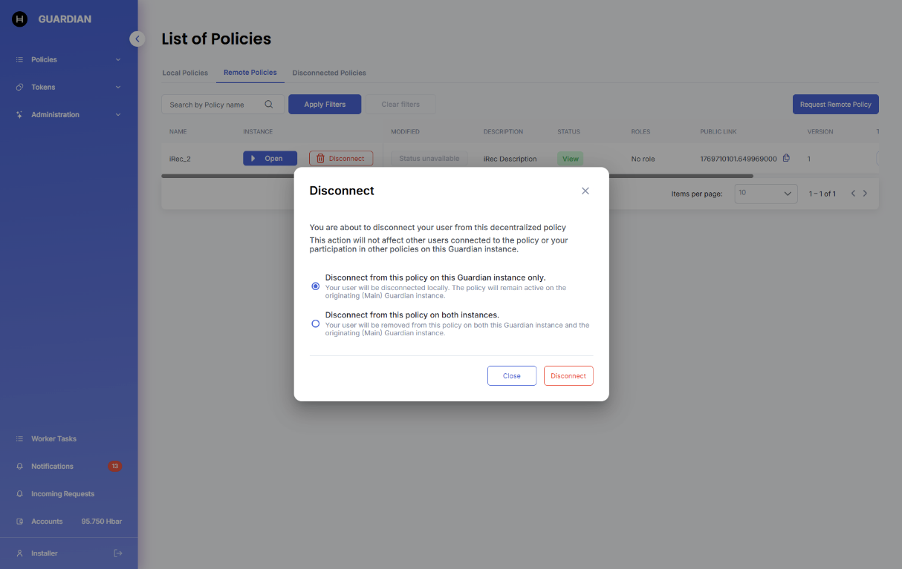

# 🏭 Carbon Development Mechanism (CDM) AMS-III.AR Policy

## **Table of Contents**

* [Introduction](carbon-development-mechanism-cdm-ams-iii.ar-policy.md#introduction)
* [Why the AMS-III.AR Methodology?](carbon-development-mechanism-cdm-ams-iii.ar-policy.md#why-ams-iii.ar-methodology)
* [Demo Video](carbon-development-mechanism-cdm-ams-iii.ar-policy.md#demo-video)
* [Policy Workflow](carbon-development-mechanism-cdm-ams-iii.ar-policy.md#policy-workflow)
* [Policy Guide](carbon-development-mechanism-cdm-ams-iii.ar-policy.md#policy-guide)
  * [Important Documents & Schemas](carbon-development-mechanism-cdm-ams-iii.ar-policy.md#important-documents-and-schemas)
  * [Token (Carbon Credit)](carbon-development-mechanism-cdm-ams-iii.ar-policy.md#token-carbon-credit)
  * [Step By Step](carbon-development-mechanism-cdm-ams-iii.ar-policy.md#step-by-step)

## **Introduction**

\
AMS-III.AR is a specific methodology under the Clean Development Mechanism (CDM) that aims to promote sustainable development by facilitating the substitution of fossil fuel-based lighting systems with energy-efficient LED/CFL lighting systems. This methodology focuses on reducing greenhouse gas emissions associated with lighting and improving energy efficiency in developing countries. The objective of AMS-III.AR is to encourage the adoption of LED (Light Emitting Diode) and CFL (Compact Fluorescent Lamp) lighting technologies as alternatives to traditional fossil fuel-based lighting systems such as incandescent bulbs or kerosene lamps. LED and CFL lighting systems are more energy-efficient, have longer lifespans, and produce significantly lower greenhouse gas emissions compared to their fossil fuel-based counterparts.

## **Why AMS-III.AR Methodology?**

\
Let's explore the drawbacks of fuel-based lighting and the compelling advantages offered by LED/CFL bulbs. It is widely acknowledged that fuel-based lighting falls short in terms of efficiency, delivering limited and low-quality illumination, while also subjecting users to significant health and fire hazards—especially in low and middle-income countries, where over 95% of fatal fire-related burns occur. Furthermore, the use of fuel-based lighting contributes to Greenhouse Gas (GHG) emissions, leading to increased indoor air pollution, health risks, decreased productivity, and compromised safety. Astonishingly, the total fuel consumption for lighting, equivalent to a staggering 1.3 million barrels of oil per day, results in approximately 190 million tons of carbon dioxide emissions annually.

On the other hand, LED/CFL bulbs emerge as superior options, and here's why. First and foremost, they are highly energy-efficient, utilizing up to 80% less energy compared to conventional bulbs. This not only translates into substantial energy savings but also aids in reducing carbon emissions, making LED/CFL bulbs an eco-friendly choice. In addition to their energy efficiency, these bulbs boast an impressively long lifespan—up to 25 times longer than traditional bulbs. This remarkable durability means fewer replacements, reduced waste generation, and lower maintenance costs. With LED/CFL bulbs, you can enjoy long-lasting illumination while minimizing your impact on the environment.

Moreover, LED bulbs are designed with sustainability in mind. Unlike conventional bulbs, they do not contain harmful substances like mercury, making them safer for both human health and the planet. Additionally, LED bulbs produce minimal heat, further enhancing their safety and sustainability. While CFL bulbs do contain small amounts of mercury, it's important to note that switching to compact fluorescent light bulbs still offers energy savings, reducing our reliance on fossil fuels burned for electricity generation. Furthermore, the increased efficiency and extended lifespan of LED/CFL bulbs contribute to resource conservation during the production process.

In conclusion, LED/CFL bulbs outshine fuel-based lighting on multiple fronts. They not only provide superior lighting quality but also bring significant energy savings, reduced carbon emissions, prolonged lifespan, and a more sustainable lighting solution. By adopting LED/CFL technology, we can make a positive impact on our environment.

## **Demo Video**

\
\*add webinar link

## **Policy Workflow**

\
The workflow for the AMS-III.AR policy involves four key roles to ensure transparency and accountability.

These roles are as follows:

* **Project Proponent** - The project proponent is responsible for executing the emission reduction project. They develop and implement strategies to substitute fossil fuel-based lighting systems with LED/CFL lighting systems. The project proponent must adhere to the requirements outlined by the CDM and provide evidence of the emission reductions achieved. Upon successful verification, the project proponent receives certified emission reduction (CER) tokens as an incentive for their emission\
  reductions.
* **Verification and Validation Body (VVB)** - The VVB plays a critical role in independently verifying and validating the project data submitted by the project proponent. They thoroughly assess the project's emission reduction potential, methodologies, and adherence to the policy guidelines. Based on their evaluation, the VVB either approves or rejects the project for registration.
* **Designated National Authority (DNA)** - The DNA is a governmental body representing the country where the emission reduction project is being implemented. They review and approve the project's eligibility in accordance with national policies and regulations. The DNA's endorsement is essential for the project to proceed with the AMS-III.AR policy.
* **Registry (UNFCCC)** - The United Nations Framework Convention on Climate Change (UNFCCC) serves as the registry for the CDM. They oversee the multiple workflow steps involved in the project's approval, including the verification and validation process by the VVB and the endorsement by the DNA. The UNFCCC's approval is necessary for the project's successful registration and issuance of CER tokens

\

<figure><figcaption></figcaption></figure>

## **Policy Guide**

\
This policy is published to the Hedera network and can either be imported via Github(.policy file) or IPFS timestamp.

### **Important Documents & Schemas**

**Project Description -** Project Proponent information, standard project information, methodology information, etc.

**Baseline Emissions –** Baseline emission calculation that automatically occurs without the need for a form.

**Default Values (Tool 33) -** Tool 33 is included as a module within the policy. This module is used to calculate default values for common parameters like emission factors for diesel generator systems.

### **Minimum Requirements for the Design Specifications of Project Lamps –**&#x20;

This schema is included in the policy as a form within the project information form, fields are included to collect the following information about the project:

* Lamp wattage (in Watts) and luminous flux output (in lumens)
* Rated lamp life (in hours)
* Where applicable, the type and rated capacity of the renewable energy equipment used for battery-charging (in Watts)
* Type (e.g. NiMH, Lead-Acid, Li-ion, Lithium-iron-phosphate, etc.), nominal voltage, and rated capacity of the batteries (in Ampere hours)
* Type of charge controller (e.g. active or passive)
* Autonomous time and DBT
* Solar Run Times(s) (SRT) for products with solar energy charging systems
* Where applicable, the amount of time to fully charge the product using mechanical means or a centralized charging system (e.g. the national grid)
* Physical protection against environmental factors (e.g. rain, heat, insect ingress)

**Project Emissions –** Schema included within the project information form; this is filled out by the project proponent to calculate project emissions per project lamp.

**Emissions Reduction –** Schema included within the project information form; this is filled out by the project proponent to calculate annual emission reductions.

**Monitoring Report –** The monitoring report is to be filled out based on the monitoring plan mentioned within the methodology.

## **Token (Carbon Credit)**

\
Certified Emission Reduction (CER) credits, each equivalent to one tonne of CO2.

## **Step By Step**

1.  The policy can be imported using IPFS timestamp 1687813769.029473000

    <figure><figcaption></figcaption></figure>
2. Enter the IPFS timestamp and select OK.

<figure><figcaption></figcaption></figure>

3. Select “Import”.

<figure><figcaption></figcaption></figure>

4. Place status in “Dry Run” and select “Go”.

<figure><figcaption></figcaption></figure>

5. By selecting the edit button in the operations tab, you can access the policy configurator and view the workflow blocks.

<figure><figcaption></figcaption></figure>

6. You can access and view the module by selecting the module tab in the policy configurator.

<figure><figcaption></figcaption></figure>

7. Going back to the policy workflow, add users by selecting the “create user” button. Then select the dropdown user menu and select “Virtual User 1”.

<figure><figcaption></figcaption></figure>

8. Now you can assign roles to each user

<figure><figcaption></figcaption></figure>

9. Virtual User 1 will be assigned to the Project\_Proponent

<figure><figcaption></figcaption></figure>

10. Virtual User 2 will be assigned to the VVB

<figure><figcaption></figcaption></figure>

11. Add the VVBs name

<figure><figcaption></figcaption></figure>

12. Once the VVB’s name has been added a new screen will show up that says, “Waiting for approval”. Continue to assign the final role to Virtual User 3.

<figure><figcaption></figcaption></figure>

13. The final role that will be assigned to Virtual User 3 is the Designated National Authority

<figure><figcaption></figcaption></figure>

14. Click on the Users dropdown menu and select Virtual User 1 (Project Proponent) and select the “New Project” button.

<figure><figcaption></figcaption></figure>

15. Once the form is completed, go to Virtual User 3’s (Designated National Authority) profile

<figure><figcaption></figcaption></figure>

16. The Designated National Authority can now view the project information document by selecting “view document” and then they can select validate or reject.

<figure><figcaption></figcaption></figure>

17. Go to the Administrator’s (Standard Registry) profile. The Standard Registry now has access to the project information document by clicking “view document” once they have reviewed it they can select “Add” to add the project to the project pipeline.

<figure><figcaption></figcaption></figure>

18. Navigate back to Virtual User 1’s (Project Proponent) profile and select “Add Report”.

<figure><figcaption></figcaption></figure>

19. Based on the methodologies monitoring plan fill out the monitoring form appropriately and select “Ok”.

<figure><figcaption></figcaption></figure>

20. Go to the Virtual User 2’s (VVB) profile. The VVB has access to the monitoring report form by selecting “View Document”. Then the VVB can select Verify or Reject.

<figure><figcaption></figcaption></figure>

21. Navigate back to the Administrator’s profile and select the “Mint” button.

<figure><figcaption></figcaption></figure>

22. The status should now say “Minted”.

<figure><figcaption></figcaption></figure>

23. By selecting the “Token History” tab you can see the number of tokens minted and then you can select “View TrustChain”

<figure><figcaption></figcaption></figure>

24. The Verified Presentation should now be open. You can view information like the recipients name, token amount, mint date, verified signature, etc.

<figure><figcaption></figcaption></figure>

25. By scrolling to the bottom of the page you can view the TrustChain.

<figure><figcaption></figcaption></figure>

26. The “VC File” button can be used to open each form for every step that was executed during the workflow of the policy.

<figure><figcaption></figcaption></figure>
