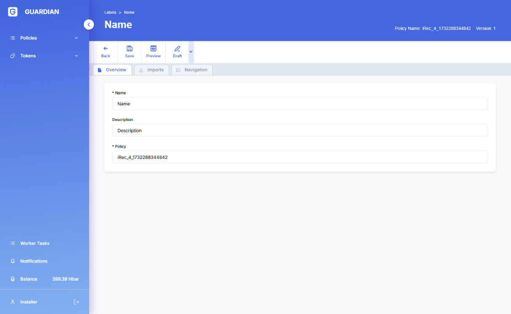
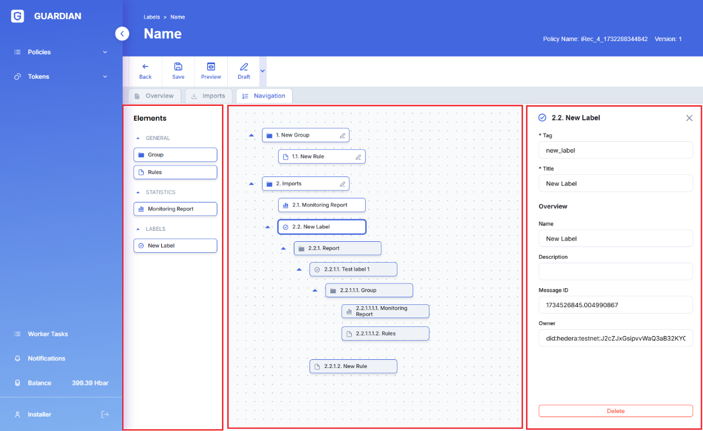
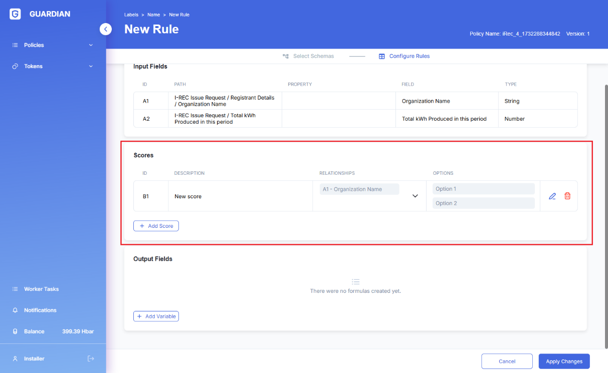

# 🏨 CDM AMS II.G

## Table of Contents

[Introduction](cdm-ams-ii.g.md#\_toc975016542)

[Need and Use for the AMS-II.G Policy](cdm-ams-ii.g.md#\_toc752136503)

[Demo Video](cdm-ams-ii.g.md#\_toc264453392)

[Policy Workflow](cdm-ams-ii.g.md#\_toc2070089206)

[Policy Guide](cdm-ams-ii.g.md#\_toc93669646)

[Available Roles](cdm-ams-ii.g.md#\_toc21187385)

[Important Documents & Schemas](cdm-ams-ii.g.md#\_toc1808393583)

[Token (Carbon Emission Reduction)](cdm-ams-ii.g.md#\_toc360615091)

[Step by Step](cdm-ams-ii.g.md#\_toc619173481)

## Introduction 

Access to clean cooking is a pressing global challenge, with billions of people still relying on traditional biomass fuels for their cooking needs, leading to immense human and environmental costs. In this context, the Clean Development Mechanism (CDM) offers a promising pathway to address this issue by introducing energy-efficient thermal energy generation units that utilize non-renewable biomass. AMS-II.G aims to promote sustainable development and mitigate greenhouse gas (GHG) emissions through the implementation of clean cookstove projects.

AMS-II.G focuses on driving energy efficiency improvements in thermal applications that utilize non-renewable biomass. This entails the introduction of high-efficiency biomass-fired devices, such as cookstoves, ovens, or dryers, either by replacing existing inefficient appliances or by retrofitting current units to enhance their performance. By doing so, the methodology facilitates significant savings in non-renewable biomass consumption, resulting in reduced GHG emissions. This approach aligns with CDM's mission to foster projects that contribute to sustainable development while combatting climate change.

The methodology's applicability is broad, encompassing single pot or multi-pot portable or in-situ cookstoves, as long as they meet a minimum efficiency threshold of 25%. To ensure credibility and compliance, project developers must adhere to specified testing and certification requirements, presenting relevant documentation to the Designated Operational Entity (DOE).

By providing an accessible and standardized framework for clean cooking initiatives, AMS-II.G allows project developers to pursue carbon finance opportunities and attract investments from governments, companies, and individuals seeking to support climate action and sustainable development.

Currently, the AMS-II.G Guardian policy uses the Thermal Energy Output (TEO) testing method to estimate fuel consumption, which plays a crucial role in determining the energy efficiency of thermal applications and evaluating associated emissions. As the policy undergoes future iterations, additional testing methods such as the water boiling test (WBT), controlled cooking test (CCT), and kitchen performance test (KPT) will be integrated to further enhance the accuracy and effectiveness of fuel consumption estimation. Moreover, the policy includes modules like tool 30 and tool 33, which can be utilized for default values or to calculate fNRB (non-renewable biomass fraction), a parameter that is used in the emission reductions calculation.

## Need and Use for the AMS-II.G Policy 

A methodology like AMS-II.G is needed to address the universal challenge of guaranteeing access to clean cooking. In developing countries, more than 3 billion people, representing a substantial portion of the global population, still rely on traditional biomass fuels for their primary cooking needs using open fires or traditional stoves. This reliance on solid-fuel cooking, such as wood, crop residues, and dung, leads to immense human costs in terms of health, environmental degradation, and economic burdens.

Traditional cooking methods using solid fuels result in significant health issues due to indoor air pollution, affecting especially women and children who spend significant time near the open fires or traditional stoves. Moreover, burning solid fuels releases greenhouse gases (GHGs) like carbon dioxide and short-lived climate pollutants (SLCPs) such as black carbon, contributing to global climate change. Solid-fuel cooking is responsible for generating around 1.5-3.0% of global CO2 emissions.

To combat these challenges and transition towards cleaner cooking practices, initiatives like AMS-II.G are essential. This methodology focuses on introducing energy-efficient thermal energy generation units that utilize non-renewable biomass, such as high-efficiency biomass-fired cookstoves, ovens, or dryers. By promoting the replacement of inefficient devices or retrofitting existing units, AMS-II.G aims to achieve significant savings in non-renewable biomass consumption and, subsequently, substantial reductions in GHG emissions.

AMS-II.G provides a standardized and measurable framework for clean cooking projects, allowing for reliable estimation and verification of emission reductions. The Guardian AMS-II.G Policy offers a unique technical opportunity for companies to streamline, enhance robustness, and establish trust and transparency within their clean cookstove projects. The guidelines and equations provided in the methodology are incorporated into schemas featuring built-in auto-calculation blocks, emission factors, and data from modules like tool 33. The results of the data provided undergo immutable and transparent verification by third parties. Ultimately, the emissions are tokenized, elevating tracking, transparency, accounting, and reporting, with the data structured to comply with AMS-II.G reporting requirements.

## Demo Video 

Coming Soon

## Policy Workflow 

<figure><figcaption></figcaption></figure>

## Policy Guide 

This policy is published to Hedera network and can either be imported via Github (.policy file) or IPSF timestamp.

Latest Version - 1695225791.622644989

### **Available Roles** 

Project Proponent - The project proponent is responsible for executing the emission reduction project. They develop and implement strategies to substitute fossil fuel-based lighting systems with LED/CFL lighting systems. The project proponent must adhere to the requirements outlined by the CDM and provide evidence of the emission reductions achieved. Upon successful verification, the project proponent receives certified emission reduction (CER) tokens as an incentive for their emission reductions.

Verification and Validation Body (VVB) - The VVB plays a critical role in independently verifying and validating the project data submitted by the project proponent. They thoroughly assess the project's emission reduction potential, methodologies, and adherence to the policy guidelines. Based on their evaluation, the VVB either approves or rejects the project for registration.

Designated National Authority (DNA) - The DNA is a governmental body representing the country where the emission reduction project is being implemented. They review and approve the project's eligibility in accordance with national policies and regulations. The DNA's endorsement is essential for the project to proceed with the AMS-III.AR policy.

Registry (UNFCCC) - The United Nations Framework Convention on Climate Change (UNFCCC) serves as the registry for the CDM. They oversee the multiple workflow steps involved in the project's approval, including the verification and validation process by the VVB and the endorsement by the DNA. The UNFCCC's approval is necessary for the project's successful registration and issuance of CER tokens

### Important Documents & Schemas 

1. Project Description - Project Proponent information, standard project information, methodology information, etc.
2. Emissions Reduction – Schema included within the project information form; this is filled out by the project proponent to calculate annual emission reductions.
3. Default Values (Tool 33) - Tool 33 is included as a module within the policy. This module is used to calculate default values for common parameters like fNRB (Fraction of non-renewable biomass).
4. Monitoring Report – The monitoring report is to be filled out based on the monitoring plan mentioned within the methodology.

### Token (Carbon Emission Reduction) 

Certified Emission Reduction (CER) credits, each equivalent to one tonne of CO2.

### Step by Step 

1. The policy can be imported using IPFS timestamp 1690462366.484472937

.png>)

2. Select “Import”.

.png>)

3. Place status in “Dry Run” and select “Go”.

4. By selecting the edit button in the operations tab, you can access the policy configurator and view the workflow blocks.

5. You can access and view the module by selecting the module tab in the policy configurator.

6. Going back to the policy workflow, add users by selecting the “create user” button. Then select the dropdown user menu and select “Virtual User 1”.

7. Virtual User 1 will be assigned to the Project\_Proponent

.png>)

8. Virtual User 2 will be assigned to the VVB

.png>)

9. Add the VVBs name

.png>)

10. The final role that will be assigned to Virtual User 3 is the Designated National Authority

11. Click on the Users dropdown menu and select Virtual User 1 (Project Proponent) and select the “New Project” button.

.png>)

12. Once the form is completed, go to Virtual User 3’s (Designated National Authority) profile. The Designated National Authority can now view the project information document by selecting “view document” and then they can select validate or reject.

13. Go to the Administrator’s (Standard Registry) profile. The Standard Registry can now approve the VVB.

.png>)

14. Stay on the Administrator’s (Standard Registry) profile. The Standard Registry now has access to the project information document by clicking “view document” once they have reviewed it they can select “Add” to add the project to the project pipeline.

15. Navigate back to Virtual User 1’s (Project Proponent) profile and assign the VVB.

16. Go to the Virtual User 2’s (VVB) profile. The VVB has access to the project form by selecting “View Document”. Then the VVB can select Verify or Reject.

17. Navigate back to the Administrator and select Add.

18. Navigate back to Virtual User 1’s (Project Proponent) profile and select “Add Report”.

19. Go to the Virtual User 2’s (VVB) profile. The VVB has access to the monitoring report form by selecting “View Document”. Then the VVB can select Verify or Reject.

20. Navigate back to the Administrator’s profile and select the “Mint” button.

.png>)

21. The status should now say “Minted”.

<figure><figcaption></figcaption></figure>

22. By selecting the “Token History” tab you can see the number of tokens minted and then you can select “View TrustChain”

<figure><figcaption></figcaption></figure>

23. The Verified Presentation should now be open. You can view information like the recipient's name, token amount, mint date, verified signature, etc.

<figure><figcaption></figcaption></figure>

24. By scrolling to the bottom of the page you can view the TrustChain.

<figure><figcaption></figcaption></figure>
