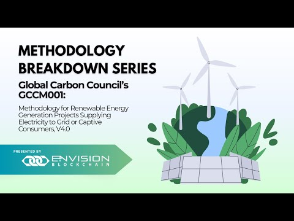

# 🏭 AMS-I.D: Grid Connected Renewable Electricity Generation – v.18.0

## Table of Contents

[Introduction](ams-i.d-grid-connected-renewable-electricity-generation-v.18.0.md#introduction)

[Scope](ams-i.d-grid-connected-renewable-electricity-generation-v.18.0.md#toc160021925)

[Applicability](ams-i.d-grid-connected-renewable-electricity-generation-v.18.0.md#toc160021926)

[Eligibility Conditions](ams-i.d-grid-connected-renewable-electricity-generation-v.18.0.md#toc160021927)

[Project Boundary](ams-i.d-grid-connected-renewable-electricity-generation-v.18.0.md#toc160021928)

[Baseline Scenarios](ams-i.d-grid-connected-renewable-electricity-generation-v.18.0.md#toc160021929)

[Important Parameters](ams-i.d-grid-connected-renewable-electricity-generation-v.18.0.md#toc160021930)

[Demo Video](ams-i.d-grid-connected-renewable-electricity-generation-v.18.0.md#toc160021931)

[Policy Workflow](ams-i.d-grid-connected-renewable-electricity-generation-v.18.0.md#toc160021932)

[Policy Guide](ams-i.d-grid-connected-renewable-electricity-generation-v.18.0.md#toc160021933)

[Available Roles](ams-i.d-grid-connected-renewable-electricity-generation-v.18.0.md#toc160021934)

[Important Documents & Schemas](ams-i.d-grid-connected-renewable-electricity-generation-v.18.0.md#toc160021935)

[Tools Referenced](ams-i.d-grid-connected-renewable-electricity-generation-v.18.0.md#toc160021936)

[Token (Carbon Emission Reduction)](ams-i.d-grid-connected-renewable-electricity-generation-v.18.0.md#toc160021936)

[Step by Step](ams-i.d-grid-connected-renewable-electricity-generation-v.18.0.md#toc160021937)

### Introduction &#x20;

The AMS-I.D Grid Connected Renewable Electricity Generation methodology presents a framework for the construction, operation, retrofit, rehabilitation, replacement, or capacity addition of power plants harnessing renewable energy sources to supply electricity to the grid. In the face of growing environmental concerns, this methodology serves as a vital instrument in curbing greenhouse gas emissions by displacing electricity that would otherwise be generated through more GHG-intensive means. With a focus on a diverse range of renewable sources such as photovoltaic, hydro, tidal/wave, wind, geothermal, and renewable biomass, the AMS-I.D methodology encapsulates projects contributing to sustainable and clean energy practices, ensuring a substantial impact on reducing the carbon footprint of electricity generation.

The significance of AMS-I.D extends beyond individual power plants, emphasizing the collective effort to transition towards a low-carbon energy landscape. By providing a quantitative approach applicable to various project scenarios, including the incorporation of new technologies and the retrofitting of existing facilities, it reinforces the commitment to renewable energy adoption. With considerations for eligibility criteria, baseline scenarios, and important parameters, AMS-I.D Grid Connected Renewable Electricity Generation can be used as a tool to quantify emission reductions.

### Scope 

This methodology encompasses the construction, operation, retrofit, rehabilitation, replacement, or capacity addition of power plants utilizing renewable energy sources to supply electricity to the grid. The primary focus is on mitigating greenhouse gas emissions through the displacement of electricity that would otherwise be provided to the grid by more GHG-intensive means.

### Applicability 

This methodology is applicable to project activities that:

* Install a Greenfield plant.
* Involve a capacity addition in existing plant(s).
* Involve retrofit, rehabilitation, or replacement of existing plant(s).
* Involve hydro power plants with reservoirs meeting specific conditions.

### Eligibility Conditions 

* Hydro power plants with specific reservoir conditions.
* New units with both renewable and non-renewable components, where the eligibility limit applies only to the renewable component.
* Combined heat and power (co-generation) systems are not eligible.
* Capacity addition of renewable energy generation units at existing facilities should have added capacity lower than 15 MW and be physically distinct from existing units.
* Landfill gas, waste gas, wastewater treatment, and agro-industries projects have specific eligibility conditions.

### Project Boundary 

The spatial extent of the project boundary includes the project power plant and all power plants physically connected to the electricity system that the project power plant is connected to.

### Baseline Scenarios 

For Greenfield power plants, the baseline scenario assumes the electricity delivered to the grid would have otherwise been generated by the operation of grid-connected power plants and by the addition of new generation sources into the grid.

For retrofit, rehabilitation, or replacement, the baseline scenario is the continuing operation of the existing plant until the time it would likely be retrofitted, rehabilitated, or replaced.

### Important Parameters 

At Validation:

* Grid Emission Factor: To be determined at validation and can also be monitored ex post.

At Monitoring Periods:

* Quantity of Net Electricity Supplied to the Grid
* Quantity of Biomass/Fossil Fuel Consumed
* Net Calorific Value of Biomass&#x20;

### Demo Video

[Youtube ](https://www.youtube.com/watch?v=QiH0R3NVKJo\&list=PLnld0e1pwLho3M7uAzcbyzyJobn-X9wG\_\&index=3)&#x20;

### Policy Workflow  

<figure><figcaption></figcaption></figure>

### Policy Guide  

This policy is published to Hedera network and can either be imported via Github (.policy file) or IPFS timestamp.&#x20;

### Available Roles  

**Project Participant** - The project participant is responsible for executing the emission reduction project. The project participant must adhere to the requirements outlined by the CDM and provide evidence of the emission reductions achieved. Upon successful verification, the project participant receives certified emission reduction (CER) tokens as an incentive for their emission reductions. &#x20;

**Verification and Validation Body (VVB)** - The VVB plays a critical role in independently verifying and validating the project data submitted by the project participant. They thoroughly assess the project's emission reduction potential, methodologies, and adherence to the policy guidelines. Based on their evaluation, the VVB either approves or rejects the project for registration. &#x20;

**Registry (UNFCCC)** - The United Nations Framework Convention on Climate Change (UNFCCC) serves as the registry for the CDM. They oversee the multiple workflow steps involved in the project's approval, including the verification and validation process by the VVB. The UNFCCC's approval is necessary for the project's successful registration and issuance of CER tokens.&#x20;

### Important Documents & Schemas  

1. Project Description - Project Participant information, standard project information, methodology information like baseline emissions, project emissions, etc.&#x20;
2. Emissions Reduction – Schema included within the project information form; this is filled out by the project participant to calculate annual emission reductions.&#x20;
3. Monitoring Report – The monitoring report is to be filled out based on the monitoring plan mentioned within the methodology.  &#x20;

### Tools Referenced 

* Methodological Tool 03 - Tool to calculate project or leakage CO2 emissions from fossil fuel combustion.&#x20;
* Methodological Tool 07 - Tool to calculate the emission factor for an electricity system.
* Methodological Tool 10 - Tool to determine the remaining lifetime of equipment.

### Token (Carbon Emission Reduction)  

Certified Emission Reduction (CER) credits, each equivalent to one tonne of CO2.&#x20;

### Step by Step   

1. Log in as the Standard Registry and import the policy either by file or through IPFS timestamp by selecting the third button at the top right.

<figure><figcaption></figcaption></figure>

2. To start using the policy you first have to change the status of the policy from “Draft” to “Dry Run” or “Publish”, then select the “Register” button.

<figure><figcaption></figcaption></figure>

<figure><figcaption></figcaption></figure>

3. Create a new user by clicking the “Create User” button and assign their role as Project Participant.

<figure><figcaption></figcaption></figure>

4. The Project Participant can now provide their name or the name they would like to see reflect when registering for this project (i.e. their organization’s name).

<figure><figcaption></figcaption></figure>

5. Сreate a new user again and assign their role as VVB.

<figure><figcaption></figcaption></figure>

6. The VVB can now provide their name or the name they would like users to see when reviewing projects (i.e. their organization’s name).
7. Log in as the SR and select the “Project Participants” or the “VVBs” tab to view the documents submitted by the Project Participant and by the VVB. The SR can approve their requests by clicking on the “Approve" button.

<figure><figcaption></figcaption></figure>

<figure><figcaption></figcaption></figure>

8. Log in as the Project Participant and create a new project by clicking on the "New Project" button. This form is used to collect information about the project, organization, and all the data needed to run the emission reduction calculations. Once all the required fields have been filled the “Create” button will turn dark blue. By selecting the “Create” button all the data will be sent to the SR for review/approval.

<figure><figcaption></figcaption></figure>

<figure><figcaption></figcaption></figure>

<figure><figcaption></figcaption></figure>

9. Log back in as the SR and after reviewing the document by selecting the “View Document” button, the SR can validate the project submitted by the Project Participant by clicking the “Validate” button. If the data does not satisfy the rules set by the SR, then the “Reject” button can be used.

<figure><figcaption></figcaption></figure>

<figure><figcaption></figcaption></figure>

10. Log in as the Project Participant and create a monitoring report by clicking on the “Add Report” button then fill out the monitoring report form.

<figure><figcaption></figcaption></figure>

<figure><figcaption></figcaption></figure>

11. After creating the monitoring report, the project participant assigns the VVB to verify it by navigating to the “Monitoring Reports” tab and selecting the dropdown under “Assign”.

<figure><figcaption></figcaption></figure>

12. Log in as the VVB and click the “Monitoring Reports” tab to review the document submitted by the Project Participant. After reviewing the monitoring report by selecting “View Document”, the VVB can select “Verify”.

<figure><figcaption></figcaption></figure>

<figure><figcaption></figcaption></figure>

13. Log in as the SR to review the monitoring report by selecting the “View Document” button in the “Monitoring Reports” tab. The SR can approve the monitoring report by selecting “Approve”. This will also trigger the minting process. You can see the minting status under “Status” change from “Minting” to “Minted”.

<figure><figcaption></figcaption></figure>

<figure><figcaption></figcaption></figure>

14. Once the minting process is completed, you can view the token amount by selecting the “Token History” tab.

<figure><figcaption></figcaption></figure>

15. The TrustChain can also be viewed by clicking on the “View TrustChain” button. Please note that the token amount may show “-1” when the tokens are still minting. Once the process is complete a notification will appear stating that the tokens have been minted and transferred.

<figure><figcaption></figcaption></figure>

<figure><figcaption></figcaption></figure>
