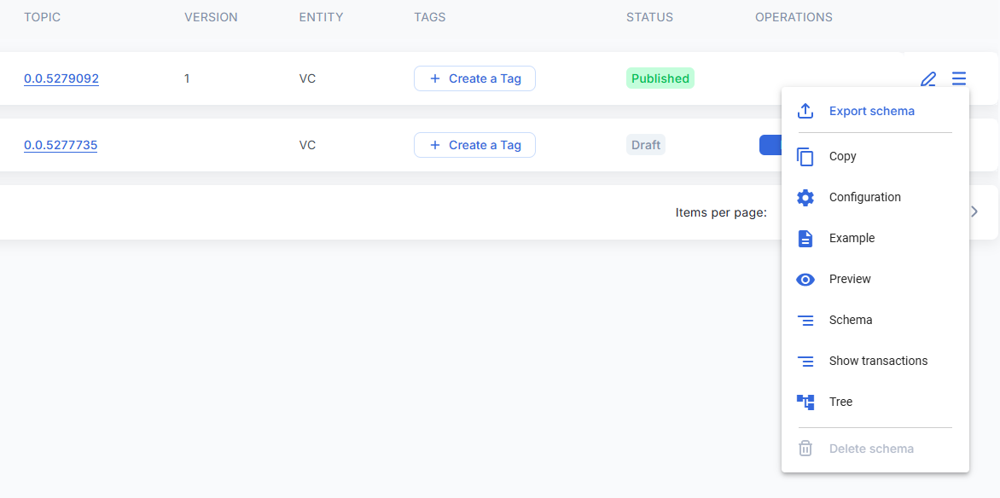

# 🍚 Methane Emission Reduction by Adjusted Water Management Practice in Rice Cultivation

## Table of Contents

[Introduction](methane-emission-reduction-by-adjusted-water-management-practice-in-rice-cultivation.md#introduction)

[Key Features](methane-emission-reduction-by-adjusted-water-management-practice-in-rice-cultivation.md#key-features)

[Potential Impact and Benefits](methane-emission-reduction-by-adjusted-water-management-practice-in-rice-cultivation.md#potential-impact-and-benefits)

[Demo Video](methane-emission-reduction-by-adjusted-water-management-practice-in-rice-cultivation.md#demo-video)

[Policy Workflow](methane-emission-reduction-by-adjusted-water-management-practice-in-rice-cultivation.md#policy-workflow)

[Policy Guide](methane-emission-reduction-by-adjusted-water-management-practice-in-rice-cultivation.md#policy-guide)

[Available Roles](methane-emission-reduction-by-adjusted-water-management-practice-in-rice-cultivation.md#available-roles)

[Important Documents & Schemas](methane-emission-reduction-by-adjusted-water-management-practice-in-rice-cultivation.md#important-documents-and-schemas)

[Token (Verified Emission Reductions)](methane-emission-reduction-by-adjusted-water-management-practice-in-rice-cultivation.md#token-verified-emission-reductions)

[Step By Step](methane-emission-reduction-by-adjusted-water-management-practice-in-rice-cultivation.md#step-by-step)

## Introduction

The Methane Emission Reduction in Rice Cultivation methodology offers a comprehensive approach to mitigating greenhouse gas emissions associated with rice production. Rice cultivation accounts for approximately 8% of agricultural greenhouse gas emissions globally, primarily due to methane emissions. This methodology addresses this issue by implementing various measures to reduce methane generation during rice cultivation.

## Key Features

* Water Regime Optimization: By transitioning from continuously flooded conditions to intermittently flooded conditions or shortening the period of flooded conditions, this methodology reduces the anaerobic decomposition of organic matter, thereby lowering methane emissions.
* Alternate Wetting and Drying (AWD) Method: AWD method allows for periodic drying and re-flooding of rice fields, creating aerobic conditions that inhibit methane production.
* Aerobic Rice Cultivation Methods: Adopting aerobic rice cultivation techniques further promotes aerobic conditions in the soil, minimizing methane emissions.
* Direct-Seeded Rice (DSR) Cultivation: Switching from transplanted to direct-seeded rice helps in reducing methane emissions by altering the water management practices and organic matter decomposition dynamics.

## Potential Impact and Benefits

* Implementing this methodology not only contributes to mitigating climate change by reducing methane emissions but also offers additional benefits:
* Income Generation for Farmers: By participating in emission reduction activities, farmers can generate additional income through the sale of carbon credits, contributing to their livelihoods.
* Corporate Sustainability Goals: Companies can use purchased carbon credits to offset their emissions and meet sustainability targets, including Scope 3 emissions related to their supply chains.
* Global Food Security: Sustainable rice production practices help safeguard local economies and ensure food security for millions of people worldwide, without compromising agricultural productivity.

## Demo Video

[Youtube](https://www.youtube.com/watch?v=UjngB\_hnUUs)

## Policy Workflow

## Policy Guide

This policy is published to Hedera network and can either be imported via Github (.policy file) or IPFS timestamp.

## Available Roles

* **Project Proponent** - The project proponent is responsible for executing the emission reduction project. The project proponent must adhere to the requirements outlined by Gold Standard’s Methodology for Methane Emission Reduction by Adjusted Water Management Practice in Rice Cultivation. Upon successful verification, the project proponent receives VERs as an incentive for their emission reduction activities.
* **Gold Standard Verification and Validation Body (GS-VVB)** - The VVB plays a critical role in independently verifying and validating the project data submitted by the project proponent. They thoroughly assess the project's emission reductions potential, methodologies, and adherence to the policy guidelines. Based on their evaluation, the VVB either approves or rejects the project for registration and certification.
* **Registry (Gold Standard)** – With Gold Standard as the registry they take on responsibilities that encompass project intake, pipeline management, and final review of project descriptions and monitoring reports. This process ensures that emissions reduction projects meet the highest standards before credits are issued.

## Important Documents & Schemas

1. Key Project Information - Key Information regarding the project activities and project developers.
2. Project Design Document - The project design document (PDD) is used by project developers to submit documentation for certification purposes.
3. Stakeholder Consultation – The aim of the stakeholder consultation is to meaningfully engage stakeholders and collect feedback.
4. Emission Reductions – The standard and simplified emission reductions form will collect all data that is required to calculate the projects reductions.
5. Annual Report - An annual report will be submitted with the monitoring report. This annual report will collect information about any changes that have occurred.
6. Monitoring Report – This monitoring report will cover information from all previous schemas allowing the project developer to make updates as needed.

## Token (Verified Emission Reductions)

Verified Emission Reductions (VER), each Gold Standard VER represents one metric ton of carbon dioxide equivalent (CO2e) emissions that the project has reduced or removed.

## Step by Step

1. Log in as the Standard Registry and import the policy either by file or through IPFS timestamp by selecting the third button at the top right.

<figure><figcaption></figcaption></figure>

<figure><figcaption></figcaption></figure>

<figure><figcaption></figcaption></figure>

<figure><figcaption></figcaption></figure>

2. Once the policy has successfully imported, you will be redirected to the policy configurator. To start using the policy you must first change the status of the policy from “Draft” to “Dry Run” or “Publish”, then select the “Register” or “Go” button. This can be done through the policy configurator page or though the “Manage Policies” page.

<figure><figcaption></figcaption></figure>

<figure><figcaption></figcaption></figure>

<figure><figcaption></figcaption></figure>

3. Create additional users by clicking the “Create User” button.

<figure><figcaption></figcaption></figure>

4. Once the users have been created go to each one and assign the appropriate role (i.e. Project Proponent, VVB, Technical Advisory Committee and NGO Supporters).

<figure><figcaption></figcaption></figure>

5. The VVB can provide their name or the name they would like users to see when reviewing projects.

<figure><figcaption></figcaption></figure>

6. Log in as the SR and select the “Approve VVB” tab to view the documents submitted by the VVB. The SR can approve their request by clicking on the “Approve" button.

<figure><figcaption></figcaption></figure>

7. Log in as the Project Proponent and create a new project by clicking on the "New Project" button.

<figure><figcaption></figcaption></figure>

8. You can input all the project details and data associated with the project in the “New Project” form.

<figure><figcaption></figcaption></figure>

9. The next step is to access the SR profile and include the project in the ”Project pipeline”. This can be achieved by navigating to the "Project Pipeline" tab and clicking on the "List" option.

<figure><figcaption></figcaption></figure>

10. The Project Proponent assigns the VVB to verify it by navigating to the “Projects” tab and selecting the dropdown under “Assign”.

<figure><figcaption></figcaption></figure>

11. After successfully assigning the VVB to the project, the next step is to access the VVB profile and click on the "validate" option located in the "Projects" tab. After clicking on the "Validate" button, the VVb needs to add a comment.

<figure><figcaption></figcaption></figure>

<figure><figcaption></figcaption></figure>

12. Log in as Project Proponent and create a monitoring report by clicking on the “Add Report” button then fill out the monitoring report form.

<figure><figcaption></figcaption></figure>

<figure><figcaption></figcaption></figure>

13. Log in as the VVB and click the “Monitoring Reports” tab to review the document submitted by the Project Proponent. After reviewing the monitoring report by selecting “View Document”, the VVB can select “Verify”.

<figure><figcaption></figcaption></figure>

14. Log in as the SR to review the monitoring report by selecting the “View Document” button in the “Monitoring Reports” tab. The SR can approve the monitoring report by selecting “Approve”.

<figure><figcaption></figcaption></figure>

15. After reviewing the monitoring report, the Technical Advisory Committee can provide comments. Log in as theTechnical Advisory Committee and create a comment by clicking on the “Comment” button in the “Monitoring Reports” tab.

<figure><figcaption></figcaption></figure>

16. Similarly, you can leave comments for the “NGO supporter” profile. Log in as the NGO supporter and create a comment by clicking on the “Comment” button in the “Monitoring Reports” tab.

<figure><figcaption></figcaption></figure>

17. The SR after approval of the monitoring report can start the minting process by clicking on the “mint” button.

<figure><figcaption></figcaption></figure>

18. Once the minting process is completed, you can view the token amount by navigating to the “Token History” tab

<figure><figcaption></figcaption></figure>

19. The TrustChain can also be viewed by clicking on the “View TrustChain” button.

<figure><figcaption></figcaption></figure>

<figure><figcaption></figcaption></figure>
