# Verra Redd VM0007 Demo UI Guide

This folder contains a sample file that is referenced in the Demo Usage Guide

1. Sample of Verra REDD Policy (`Verra REDD Policy 3 groups (1665667787.019450003).policy`)
2. Sample Schema design template for Verra REDD Policy (`REDD APD Schema Design Template.xlsx`)

1.The Guardian reference implementation comes with three predefined users:

* **Verra (Standard Registry)**
* **Project Proponent**
* **VVB**

2\. After running the installation commands, open a tab on your browser and navigate to [http://localhost:3000/](http://localhost:3000/). Typically, the way we start the reference implementation demonstration is by logging in as Verra. Click the Demo Admin Panel drop-down located in the upper right-hand corner of the login screen and select the Verra user.


3\. You'll now be prompted to configure your Verra account. Enter the details and then press the Generate button to generate a Hedera Operator ID and an Operator Key and enter the name of your Standard Registry. Press Connect when finished. This will now create Hedera Consensus Service Topics, fill the account with test hBar, create a DID document, create a Verifiable Credential, etc.

.png>)

4\. This could be one of the most interesting parts of the reference implementation. Now we will be creating the Policy. We have two ways to "create policies." The first way is to import an existing policy. This is the easiest way to get started. When you import a policy, all schemas and tokens that are required in the policy are automatically populated. To do this, you can use the sample policy that we have already uploaded to IPFS. Click on the import button and enter the one of the following Hedera message IDs:

```
REDD 1.1.0 = 1707207018.434778003
REDD 2.2.2 = 1707207149.487956003
Verra REDD Policy 3 groups = 1707207286.119377003
```

<figure><figcaption></figcaption></figure>

Once Policy is imported successfully, you get two options : Publish and Dry Run mode.

<figure>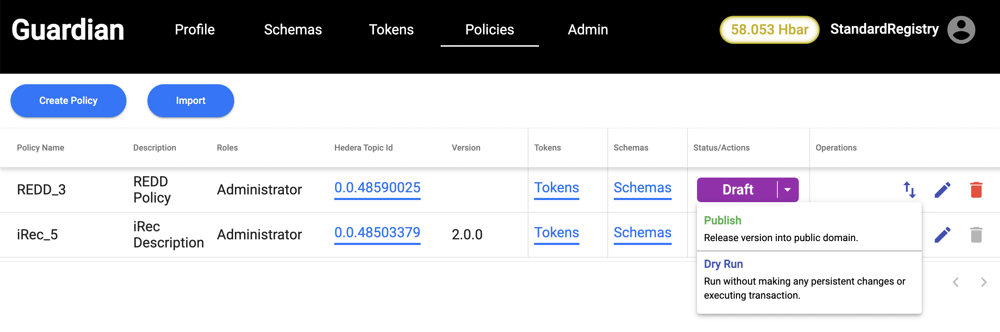<figcaption></figcaption></figure>

We select publish option to publish the Policy to the Hedera network.

<figure>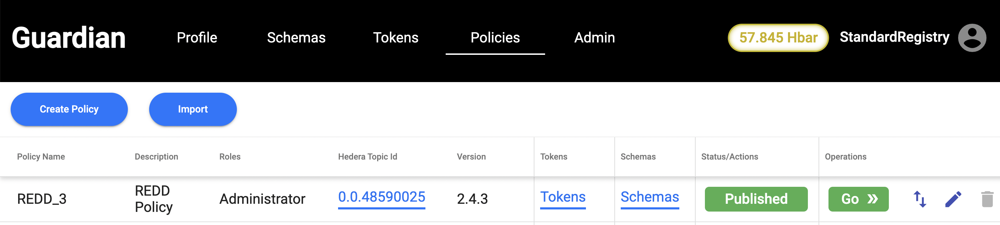<figcaption></figcaption></figure>

5\. Click on Standard Registry profile icon and select "Log Out." We will now go back into the Admin Panel. This time we will select VVB. We select Standard Registry in the dropdown, generate Operator ID and Operator Key and submit.

<figure>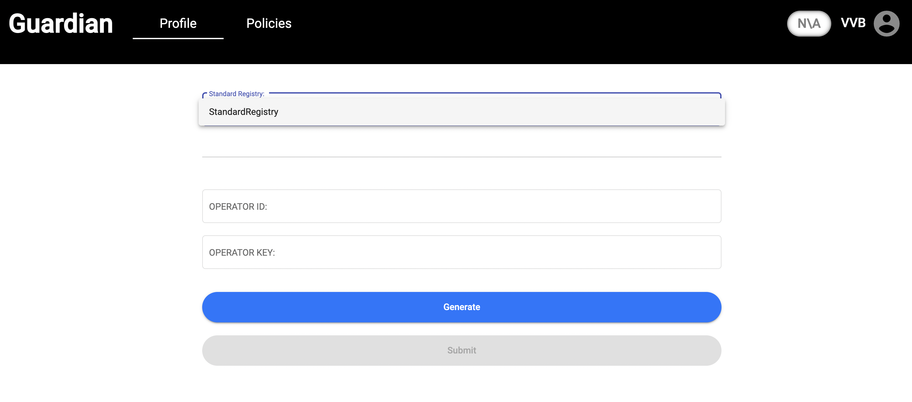<figcaption></figcaption></figure>

6\. Now, we can click on the Policies tab. This is where the specific actions required by the Policy Workflow will be found. We can click Go button to the right of the Verra Policy, the Verra created.

<figure>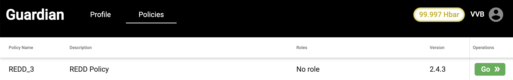<figcaption></figcaption></figure>

7\. We have an option to create a group or accept an invite. In this case, we create a new group by selecting VVBs group from the dropdown and adding a Group label as shown below:

<figure>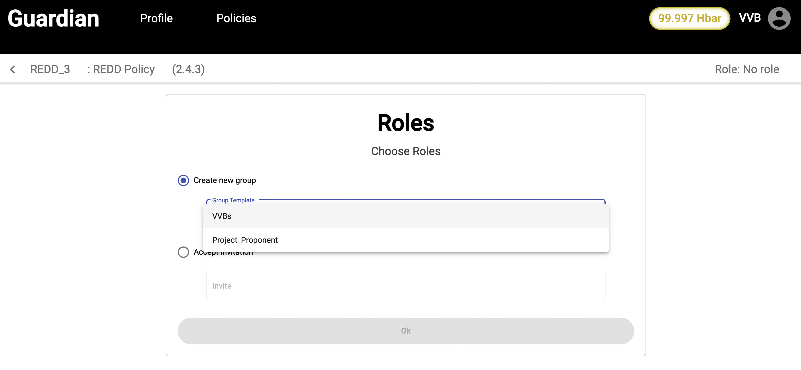<figcaption></figcaption></figure>

<figure>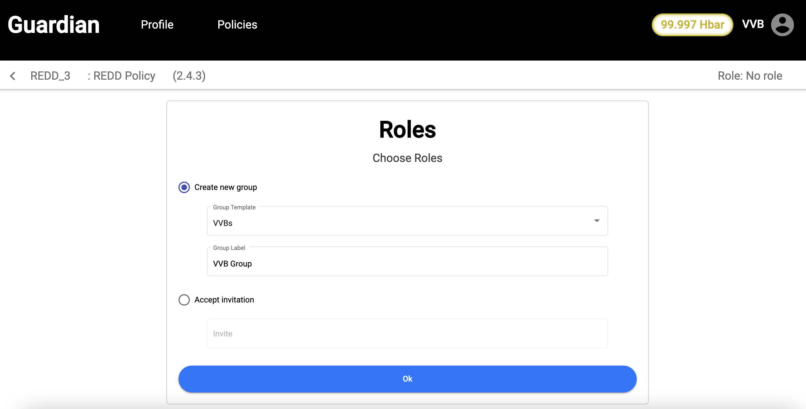<figcaption></figcaption></figure>

8\. Once the group is created, we need to create VVB by entering VVB name.

<figure>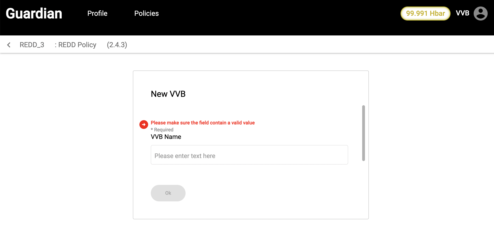<figcaption></figcaption></figure>

Once, VVB name is submitted, its waiting for the approval.

9\. Now, we logout as VVB and login as Standard Registry and review the document and approve VVB by clicking on Approve button.

<figure><figcaption></figcaption></figure>

10\. Now we login as Project Proponent and repeat same steps as Step 5, Step 6.

11\. Now, we select Project Proponent from the drop down in the Group and also enter the Group label as shown below.

<figure>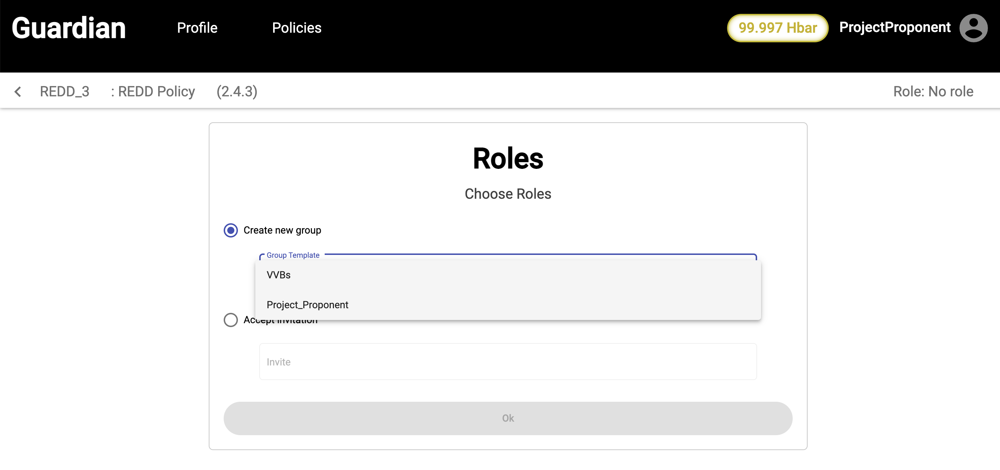<figcaption></figcaption></figure>

After creating the group, we will see the New Project button. When we click on the button, we get a form, where complete project details need to be added. We have uploaded a [Sample test data](../../../../Demo%20Artifacts/REDD%20APD%20Schema%20Design%20Template.xlsx) file in our repo.

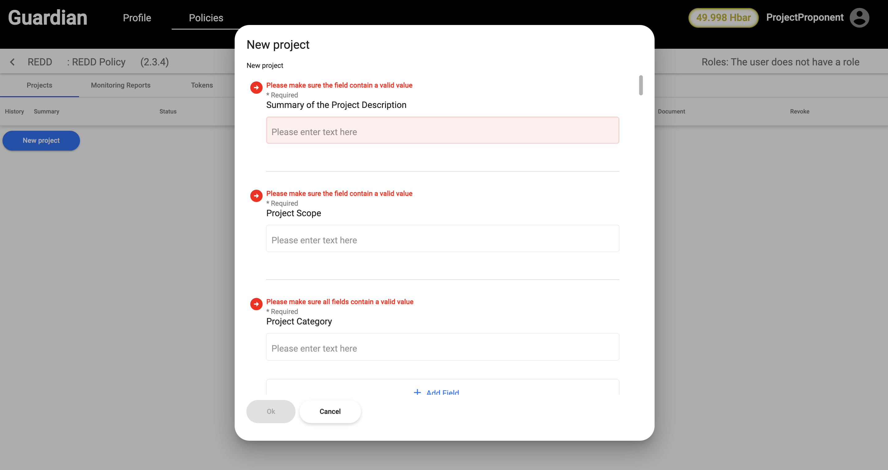

12\. The next step of our flow is to log out and sign back in as the Standard Registry. Navigate to the Policies tab and click the Open button on the far right. Here you will find the approval actions based on our Policy Workflow required by Verra. You will be able to view the Verifiable Credential prior to approval by selecting the View Document link. Once you are ready to approve the project details, you can click on the Add button.

<figure>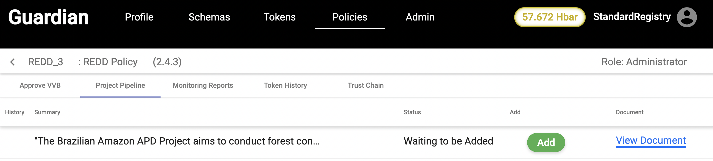<figcaption></figcaption></figure>

13\. Now, we login as Project Proponent and select VVB from the dropdown of Assign column for Validating the project details.

<figure>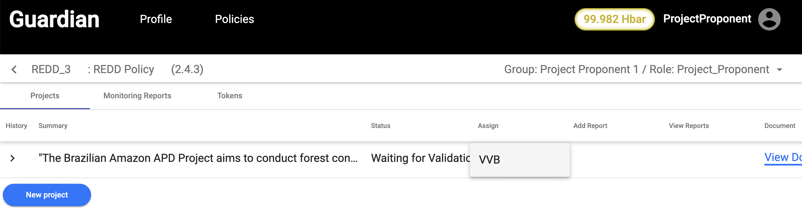<figcaption></figcaption></figure>

14\. The next step of our flow is to log out and sign back in as the VVB. We click on Members tab in the Policy and click on Get Invite button to create an invitation link. This invitation link is created to create VVB member.

<figure>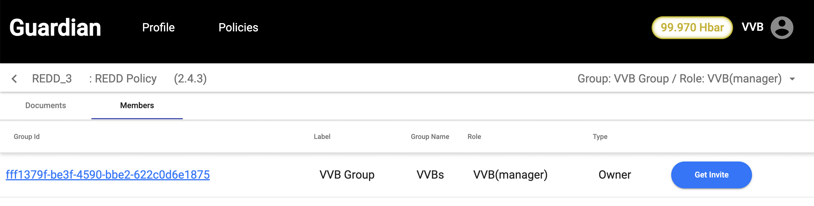<figcaption></figcaption></figure>

<figure>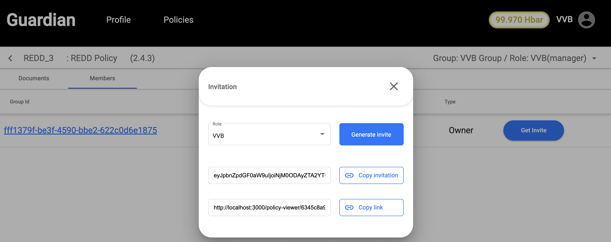<figcaption></figcaption></figure>

15\. Now, we create a new user as VVBNew and paste the link under accept invitation section as shown below:

<figure>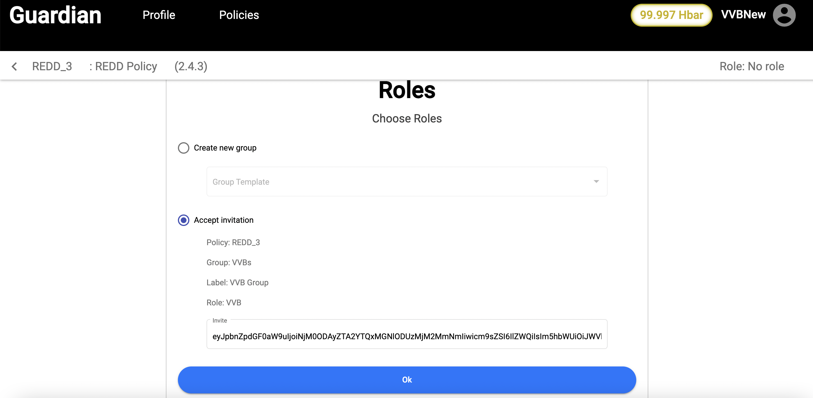<figcaption></figcaption></figure>

16\. Once clicked on OK in above screen, we now have an option to sign/ decline the Project. For demo purpose, we click on Sign button to validate the Project.

<figure>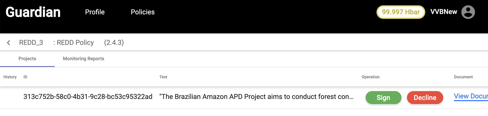<figcaption></figcaption></figure>


Note: If there are more than one VVB, we need atleast 70% consensus to get the finalized decision on the Project to proceed.


16\. Once the Project is validated, we log out as VVB and login as Project Proponent. Monitoring Report details should be added by clicking on Add Report

<figure>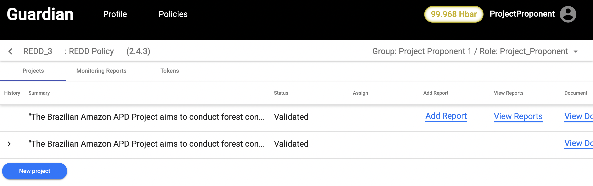<figcaption></figcaption></figure>

17\. Now, you log out and login to VVBNew. You will be able to view the Verifiable Credential by selecting View Document button. Once, you are ready to verify the monitoring report details, you can click on Sign button.

<figure>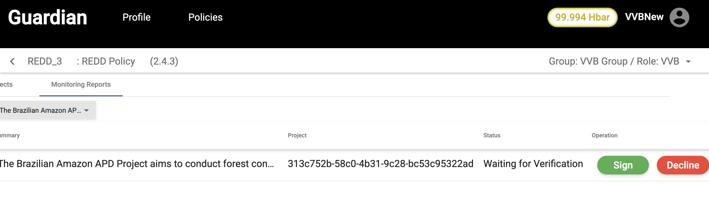<figcaption></figcaption></figure>

18\. Once, Monitoring report is verified, you log out as VVBNew and login as Standard Registry. Navigate to the Policies tab and click the Open button on the far right. You will be able to see Monitoring Reports tab, where you have an option to click on Mint button.

<figure>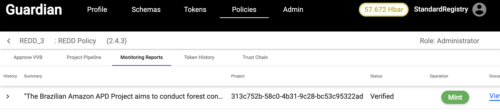<figcaption></figcaption></figure>

18\. Once, Minting process is completed, navigate to the Token History tab, where you have an option of viewing TrustChain. You can view TrustChain by clicking on View TrustChain button.

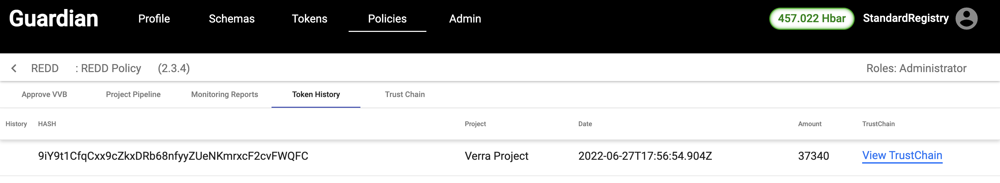

The Trust Chain view displays essential elements that can be publicly discovered. Elements include token information, Policy information, and all the essential information regarding the Verifiable Credentials that make up the Verifiable Presentation. You will notice "Cards" on the bottom of the screen. Those cards are Verifiable Credentials displayed in chronological order.

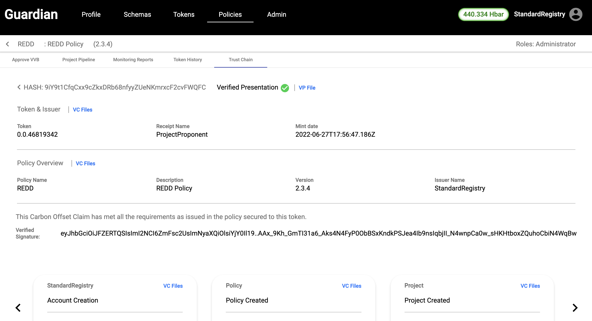
