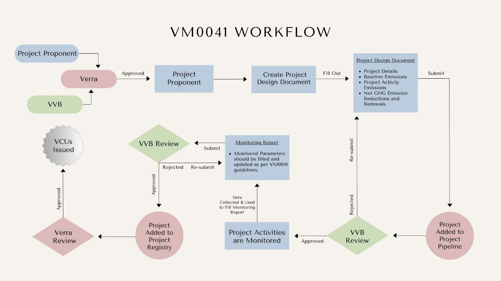

# 🏭 Verra VM0041

## Table of Contents

[Introduction](verra-vm0041.md#toc154152880)

[Key Objectives and Scope](verra-vm0041.md#toc154152881)

[Aspects of Methodology](verra-vm0041.md#toc154152882)

[Significance and Environmental Impact](verra-vm0041.md#toc154152883)

[Demo Video](verra-vm0041.md#toc154152884)

[Policy Workflow](verra-vm0041.md#toc154152885)

[Policy Guide](verra-vm0041.md#toc154152886)

[Available Roles](verra-vm0041.md#toc154152887)

[Important Documents & Schemas](verra-vm0041.md#toc154152888)

[Token (Verified Carbon Unit)](verra-vm0041.md#toc154152889)

[Step by Step](verra-vm0041.md#toc154152890)

### Introduction 

VM0041 is a methodology aimed at estimating enteric methane (CH4) emission reductions within the context of livestock production. This methodology focuses on suppressing or inhibiting methanogenesis in ruminant diets, specifically targeting emissions originating from enteric fermentation. By structuring a systematic approach to quantify reductions in CH4 emissions through the introduction of specific feed ingredients, VM0041 provides a framework for assessing and mitigating methane production within livestock operations.

The importance of reducing methane emissions cannot be overstated in the global effort to combat climate change. Methane, a potent greenhouse gas, contributes significantly to atmospheric warming, exerting a disproportionate impact on global warming compared to carbon dioxide over shorter time frames. Addressing methane emissions, particularly those stemming from enteric fermentation in livestock, presents a critical opportunity to mitigate climate change. VM0041's focus on targeted intervention through controlled feed ingredient introduction signifies a proactive step towards curbing methane emissions from ruminants, underscoring the methodology's pivotal role in advancing sustainable practices within the agricultural sector while contributing to broader environmental conservation efforts.

### Key Objectives and Scope 

#### Objectives:

* Emission Reduction: Targeting the reduction of enteric methane emissions from ruminants by introducing specific feed ingredients aimed at inhibiting or suppressing methanogenesis.
* Feed Ingredient Application: Ensuring compliance with feed and food regulations while considering the health impacts on animals by the introduced feed ingredient.
* Exclusion Criteria: Avoiding overestimation of emission reductions by excluding activities or feed ingredients not directly associated with methanogenesis suppression.

#### Scope:

* Ruminant Focus: Sole applicability to ruminant animals and specifically addresses emission reductions arising from enteric fermentation.
* Feed Ingredient Criteria: Compliance with stringent regulations, health considerations, and adherence to provided feeding instructions for the feed ingredient.
* Project Boundary: Encompasses all stages from ingredient production and transport to locations where the feed ingredient becomes part of the livestock production operation.

### Aspects of Methodology 

#### Quantification Methods:

* Baseline Emissions Assessment: Involves rigorous evaluation methodologies to quantify baseline emissions. This can include on-site direct measurements or utilizing Intergovernmental Panel on Climate Change (IPCC)-recommended methods based on country-specific or peer-reviewed biometric data.
* Project Emissions Calculation: Diverse approaches are available for estimating project emissions, encompassing on-site direct measurements, or applying published emission reduction factors derived from meta-analysis.

#### Project Implementation Conditions:

* Feed Ingredient Criteria Fulfillment: Stringent compliance conditions ensuring that the introduced feed ingredient meets the highest standards across various jurisdictions and is utilized as per manufacturer-defined instructions.
* Exclusionary Criteria: Explicitly excluding activities or feed ingredients that do not directly contribute to the suppression or inhibition of methanogenesis, preventing any overestimation of emission reductions.

### Significance and Environmental Impact 

VM0041 represents a pivotal methodology in addressing methane emissions within the livestock sector. By targeting enteric fermentation through controlled feed ingredient introduction, it contributes significantly to mitigating greenhouse gas emissions. This methodology not only establishes clear criteria for regulatory compliance but also highlights the importance of sustainable practices within livestock production for environmental conservation on a global scale.

### Demo Video 

[Youtube](https://youtu.be/yym5TjkxQAs?si=\_N-sE8IvMJS030Xk)

### Policy Workflow 

<figure><figcaption></figcaption></figure>

### Policy Guide 

This policy is published to Hedera network and can either be imported via Github (.policy file) or IPFS timestamp.

### Available Roles 

Project Proponent - The project proponent is responsible for executing the emission reduction project. The project proponent must adhere to the requirements outlined by Verra’s VCS program and provide evidence of the emission reductions achieved. Upon successful verification, the project proponent receives Verified Carbon Units (VCU) as an incentive for their emission reductions.

Verification and Validation Body (VVB) - The VVB plays a critical role in independently verifying and validating the project data submitted by the project proponent. They thoroughly assess the project's emission reduction potential, methodologies, and adherence to the policy guidelines. Based on their evaluation, the VVB either approves or rejects the project for registration.

Registry (Verra) – With Verra as the registry they take on responsibilities that encompass project intake, pipeline management, and final review of project descriptions and monitoring reports. This process ensures that emission reduction projects meet the highest standards before tokens are issued.

### Important Documents & Schemas 

1. Project Description - Project Participant information, standard project information, methodology information like baseline emissions, project emissions, etc.
2. Emissions Reduction – Schema included within the project information form; this is filled out by the project participant to calculate annual emission reductions.
3. Monitoring Report – The monitoring report is to be filled out based on the monitoring plan mentioned within the methodology.

### Token (Verified Carbon Unit) 

Verified Carbon Unit (VCU) credits, each equivalent to one tonne of CO2.

### Step by Step 

1. Create a new user and assign role as Project Proponent.

 (1) (1) (1).png>)

2. Create a New project by clicking on "New Project" button and enter all the required details.

 (1) (1) (1).png>)

 (1) (1) (1).png>)

3. Once project details are submitted, Verra adds the project to the project pipeline.

 (1) (1) (1).png>)

4. Now, we create a new user and assign its role as VVB

 (1) (1) (1).png>)

5. We need to set VVB name

 (1) (1).png>)

6. Once VVB name is set, it waits for SR to approve it.

 (1) (1).png>)

7. Now we login as SR and approve VVB.

 (1) (1).png>)

8. Now we login as the Project Proponent and assign project to VVB.

 (1).png>)

9. Now we login as VVB and validate the project by viewing project document details. Once validated, VVB clicks on Validate button.

 (1).png>)

10. Once validated, we login as Project Proponent and Add Monitoring Report.

 (1).png>)

11. Once report is submitted, we now login as VVB and validate the monitoring report by clicking on Verify button.

 (1).png>)

12. Once monitoring report is validated, we login as SR and click on Mint to mint the tokens.

 (1).png>)

13. Once minting is completed, we can view tokens in Token History tab

 (1).png>)

14. Trustchain can also be viewed by clicking on View TrustChain button:

 (1).png>)

 (1).png>)
