# 💻 iREC 7 Demo UI Guide

Following are the steps to run iREC 7 Policy.

1. We need to import the policy by using two steps : Either by importing the `IRec Policy 7 split documents (1666798058.496271367).policy` or through IPFS by entering the timestamp of the policy : 1674822624.800179003.

<figure>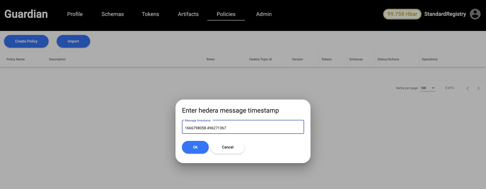<figcaption></figcaption></figure>

2\. Once it is selected, we can also preview the policy before importing it. To import, click on Import button as shown below:

<figure>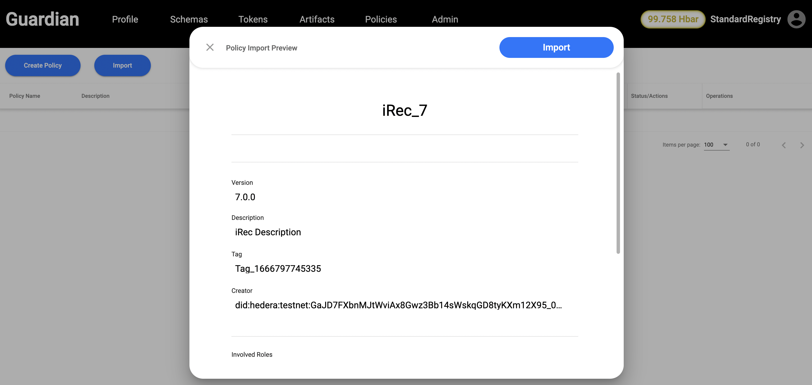<figcaption></figcaption></figure>

3\. Once imported, we can either run the policy in Dry run mode or we can publish it by clicking on publish button from the dropdown. For testing purpose, we will publish the policy.

<figure>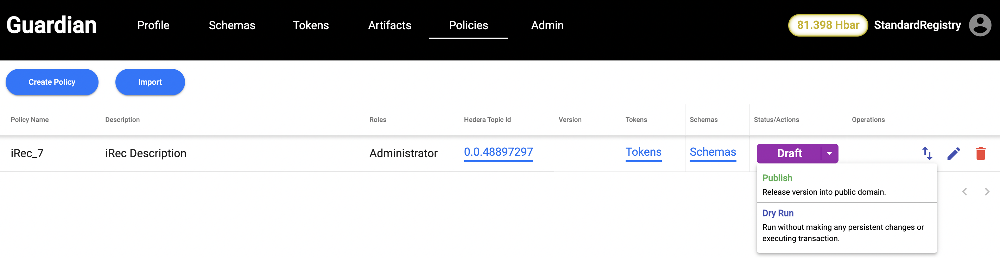<figcaption>
We will publish the policy now.
</figcaption></figure>

4\. Once the policy is published, we will logout and login as Registrant.Once we login as Registrant, we will setup Registrant role by selecting Standard Registry from the dropdown, generating Operator ID and Operator Key as shown below:

<figure>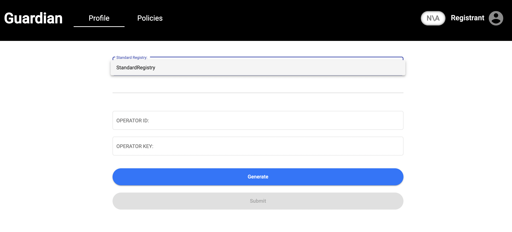<figcaption></figcaption></figure>

5\. Then, we need select Registrant role from the drop down and fill the Registrant application and submit it for approval from Standard Registry:

<figure>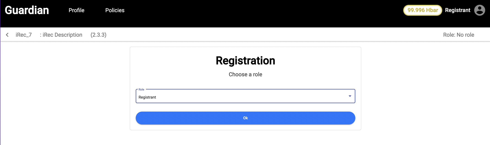<figcaption></figcaption></figure>

<figure>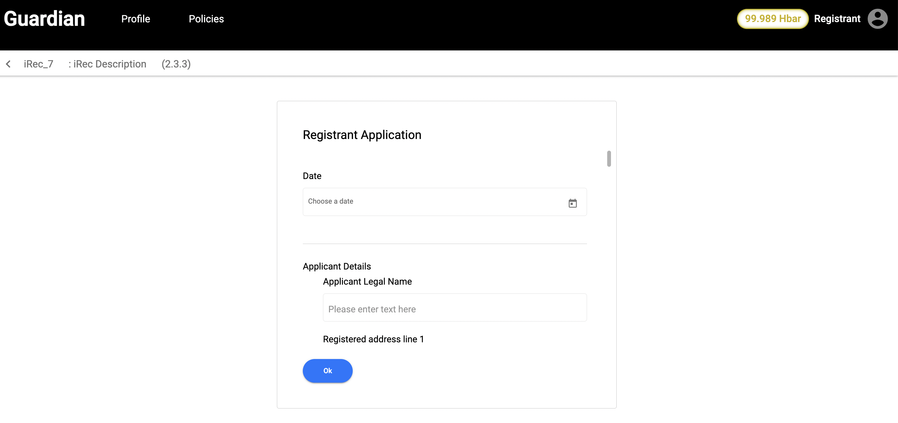<figcaption></figcaption></figure>

<figure>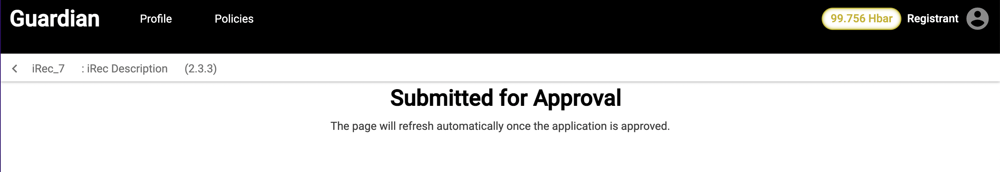<figcaption></figcaption></figure>

6\. Now, we login as Standard Registry and approve the Registrant role by clicking on Approve button:

<figure><figcaption></figcaption></figure>

7\. Once approved, we logout as Standard Registry and login as Registrant. As a registrant, we register device by entering all the device details.

<figure>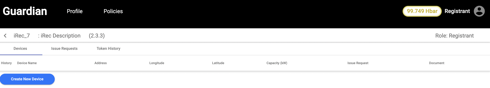<figcaption></figcaption></figure>

<figure>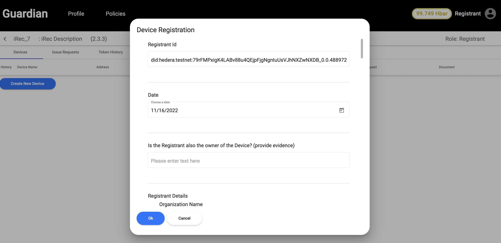<figcaption></figcaption></figure>

Once device details are entered, they are submitted for approval.

8\. We log back in as SD and after checking the device details, we can either approve/reject the device. We approve the device for now.

<figure>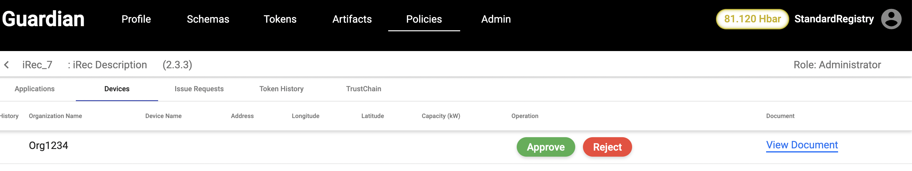<figcaption></figcaption></figure>

9\. Once device is approved, we log back in as Registrant and click on Create Issue Request as shown below:

<figure>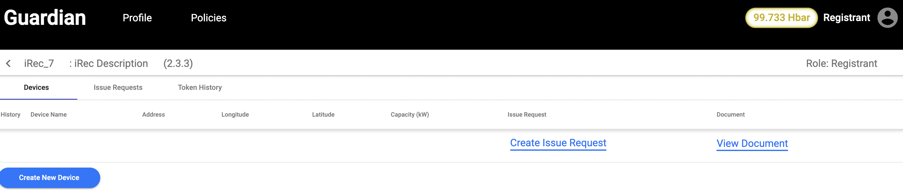<figcaption></figcaption></figure>

10\. Registrant fills the Issue Request form and submits it for approval.

<figure>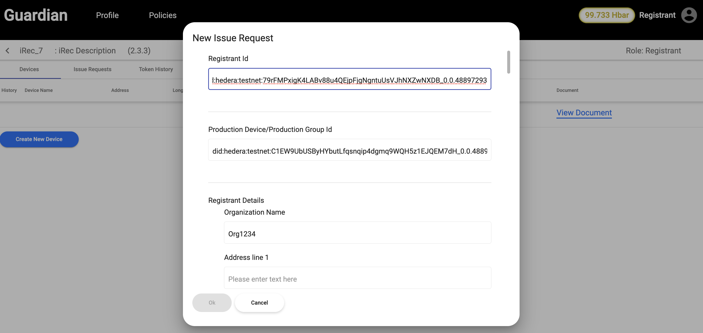<figcaption></figcaption></figure>

11\. We login as SD and view the Issue Request and approve it by clicking on approve button. Once Issue request is approved, tokens are minted if the MRV data is more than 1000 KW as it is the threshold for splitting the data into chunks.

<figure>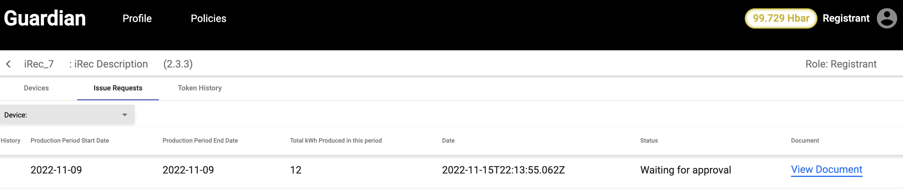<figcaption></figcaption></figure>

12\. We can check the Tokens minting status and Trustchain in Token History tab of Standard Registry:

<figure><figcaption></figcaption></figure>

13\. To view the trustchain, we need to click on View Trustchain in Token Histroy tab or Trustchain tab.

<figure><figcaption></figcaption></figure>
