# 💻 iREC 5 Demo UI Guide

This folder contains a sample file that is referenced in the Demo Guide

1. New iREC Policy (**IRec Policy 5 group (1663850151.496004277).policy**[)](https://github.com/hashgraph/guardian/tree/main/Demo%20Artifacts)

1.The Guardian reference implementation comes with two predefined users:

1. Standard Registry
2. Participant
3. Approver

2\. After running the installation commands, open a tab on your browser and navigate to [http://localhost:3000/](http://localhost:3000/). Typically, the way we start the reference implementation demonstration is by logging in as Standard Registry. Click the Demo Admin Panel drop-down located in the upper right-hand corner of the login screen and select Standard Registry user.

3\. You will now be prompted to configure your Standard Registry account. Press the Generate button to generate a Hedera Operator ID and an Operator Key and enter the details of your Standard Registry. Press Connect when finished. This will now create Hedera Consensus Service Topics, fill the account with test hBar, create a DID document, create a Verifiable Credential, etc.


4\. This could be one of the most interesting parts of the reference implementation. Now we will be creating the Policy. We have two ways to "create policies." The first way is to import an existing policy. This is the easiest way to get started. When you import a policy, all schemas and tokens that are required in the policy are automatically populated. To do this, you can use the sample policy that we have already uploaded to IPFS by entering the Hedera Message IDs.

```
iREC 1 : 1674820447.688663003
iREC 2 : 1674821041.273277003
iREC 3 : 1674821342.619996003
iREC 4 : 1674821702.668883536
iREC 5 : 1682691911.690728979
IRec Policy 6 search documents : 1674822383.822752346
IRec Policy 7 split documents : 1674822624.800179003
IRec Policy 8.1 MBP : 1674822811.925003914
IRec Policy 8.2 MBP : 1674823034.585480003
IRec 9 Module : 1677851469.448047161
```

<figure>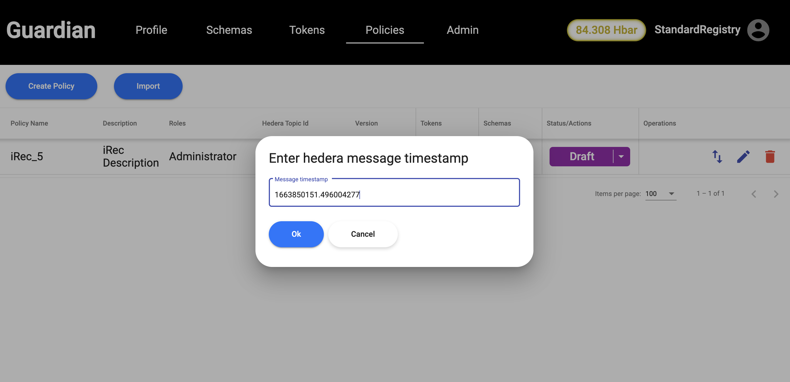<figcaption></figcaption></figure>

Once clicked on OK, we have an option to Preview the Policy before importing it.

<figure><figcaption></figcaption></figure>

Once Policy is imported successfully, you have two options : 1. to publish the policy, 2. To run the policy in Dry Run mode.

<figure>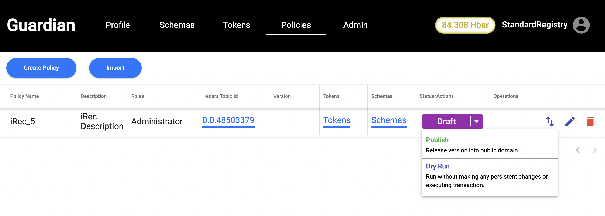<figcaption></figcaption></figure>

Let's click on Publish button to publish the Policy to Hedera network.

5\. Click on Standard Registry's profile icon and select "Log Out." We will now go back into the Admin Panel. This time we will select Registrant.

6\. Now, we can click on the Policies tab. This is where the specific actions required by the Policy Workflow will be found. We can click the Open button to the right of the iREC Policy, the Standard Registry created. This is where the custom user will be able to assign the role that was created by Standard Registry during the workflow creation process. In our case, we created the custom role of Registrant so the user will need to select the Registrant role from the drop down.

<figure><figcaption></figcaption></figure>

<figure>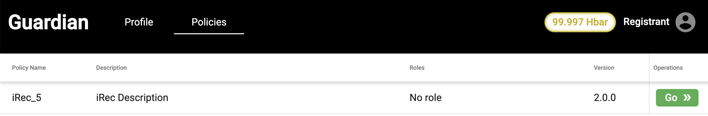<figcaption></figcaption></figure>

7\. Now, we create a group by selecting Registrant in the Dropdown. or we enter an invite link of the group received to join that particular group in the Accept invitation option.&#x20;

<figure>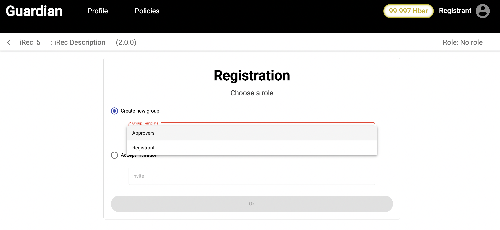<figcaption></figcaption></figure>

8\. Once Registrant option is selected from the dropdown, we get Group label field enabled. Group label can be given anything of our choice. Here, we are giving as Registrant Group for testing purpose.

<figure>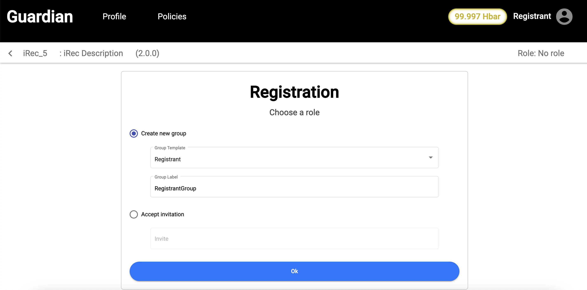<figcaption></figcaption></figure>

Once, Group label is entered, we click on OK button.

9\. Now we enter the Registrant Application details and click on Ok.

<figure>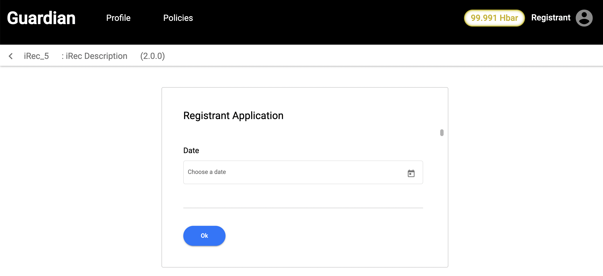<figcaption></figcaption></figure>

Once Submitted, Registrant waits for the approval of the application by Approver.

10\. Next step is logout as Registrant and login as Approver. This can be done by selecting Installer from the Admin panel and then selecting Standard Registry from the dropdown in Profile tab.

<figure>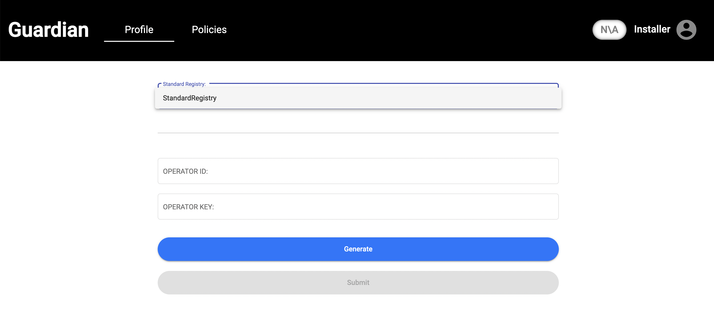<figcaption></figcaption></figure>

11\. Once Profile is created, we click on Policies tab and click on Go to view the Policy.

<figure>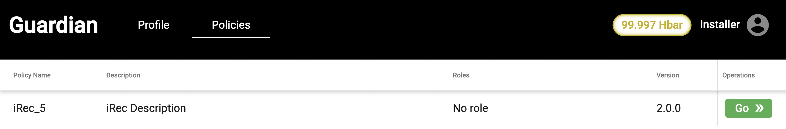<figcaption></figcaption></figure>

12\. Same as Registrant, you have an option to create group or accept invitation. But, the only difference over here is you need to select Approvers option in the group dropdown.

<figure>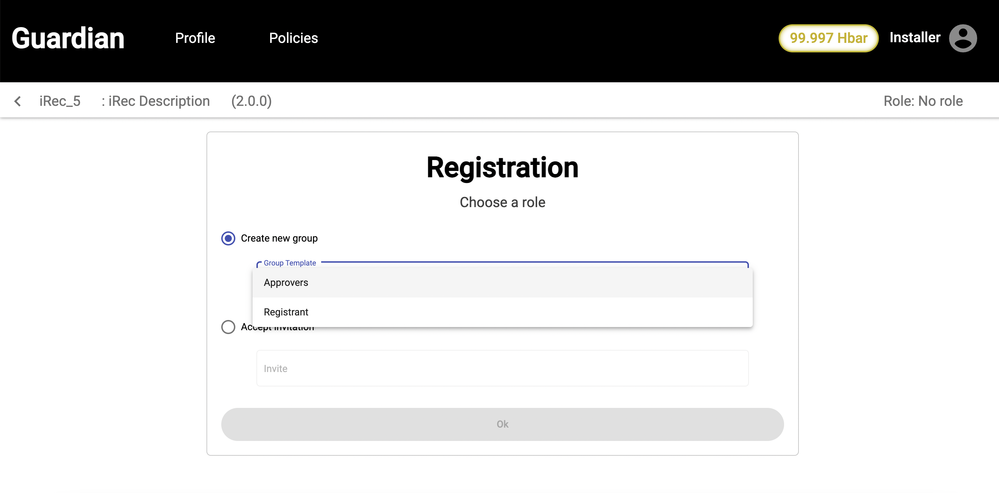<figcaption></figcaption></figure>

13\. Once Approver is created, now we get an option to Sign/Decline the Registrant application.

<figure>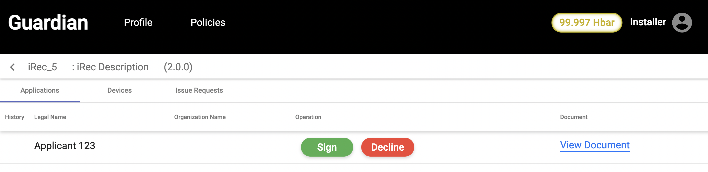<figcaption></figcaption></figure>


Note: If there are multiple approvers, we would need minimum of 70% consensus to reach the final result for an application.


14\. In our demo, I will create 2 more approvers (Approver1 and Approver2) by following the above Step 12.

15\. As there are 3 approvers, I would need minimum signatures of 2 approvers to reach the final decision (either signed or declined).

16\. When one of the approver, signs or declines the application by clicking on Sign button, we get the progress bar of the result as shown below

<figure>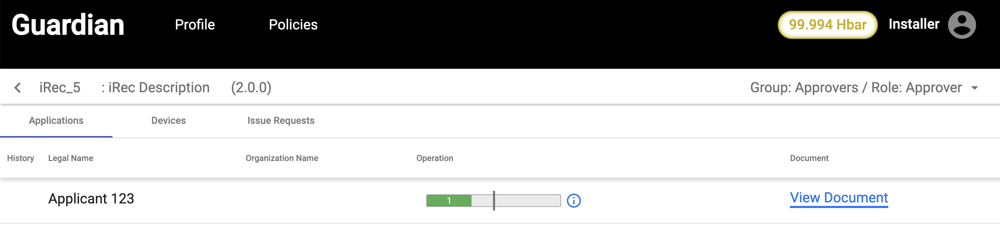<figcaption></figcaption></figure>


To get complete information on the status, we need to click on "i" icon


<figure>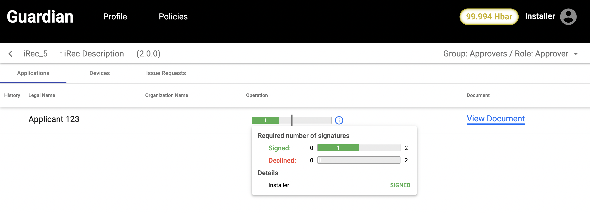<figcaption></figcaption></figure>

17\. For demo purpose, we will also sign the above application as an Approver by logging in as an Approver and following the step 15.

18\. Once, minimum of 2 approvers sign the application, Registrant application is signed successfully.

19\. Now, we login back as Registrant and click on Create New Device.

<figure>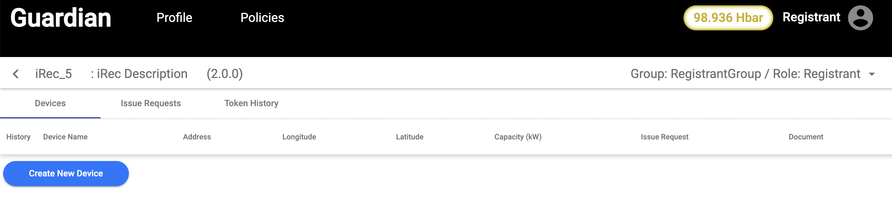<figcaption></figcaption></figure>

20\. Device Registration details needs to be filled and submitted.

<figure>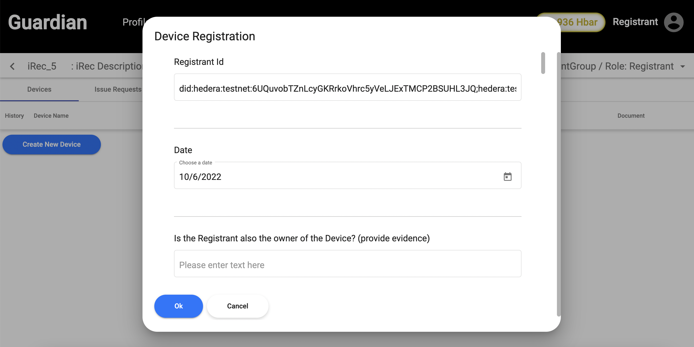<figcaption></figcaption></figure>

Once details are submitted, Registrant waits for the approval.

21\. Now, we login back as Approver1 and approves the device created by Registrant. Device is approved by clicking on Sign button.

<figure><figcaption></figcaption></figure>

22\. We logout as an Approver1 and login as Approver2 and approve the device by following step 21.

23\. Once, two approvers approve the device, the device is approved successfully. Now, we log back in as Registrant.

24\. Now, the Registrant creates an Issue Request by clicking on Create Issue Request.

<figure>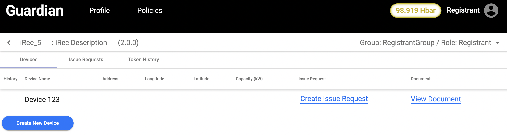<figcaption></figcaption></figure>

25\. Issue Request is created by entering the details as shown below.

<figure>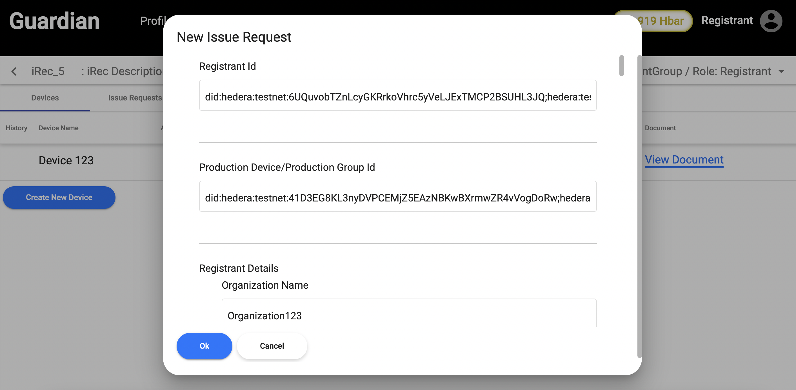<figcaption></figcaption></figure>

26\. Once the Issue Request is submitted, the request status can be checked by clicking on Issue Requests tab. &#x20;

<figure>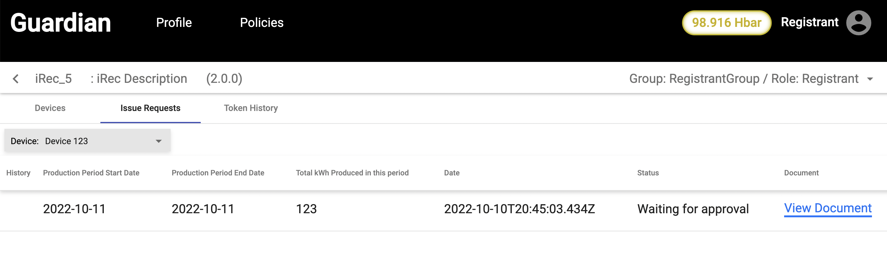<figcaption></figcaption></figure>

27\. Now, we login as Approver1 and go to Issue Requests tab and click on Sign button to approve the Issue Request. We can also view the document by clicking on View Document button.

<figure>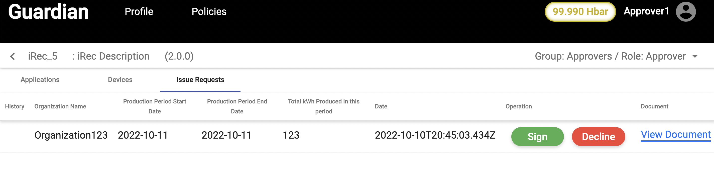<figcaption></figcaption></figure>

28\. We will logout as Approver1 and login as Approver2 and follow same steps as Step 27.

29\. Once, Issue Requests is being approved by minimum of 2 approvers, it is approved successfully.

30\. Now we login as Registrant and can check the Token History by clicking on Token History tab.

<figure>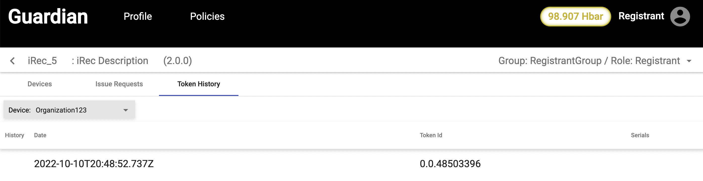<figcaption></figcaption></figure>

31\. To view TrustChain, we logout as Registrant and login as Standard Registry and click on View TrustChain.

<figure>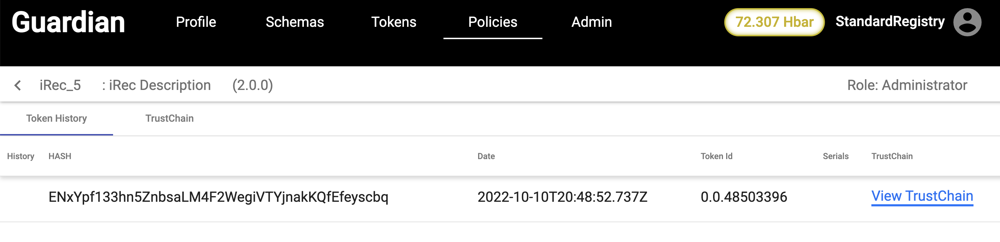<figcaption></figcaption></figure>

<figure>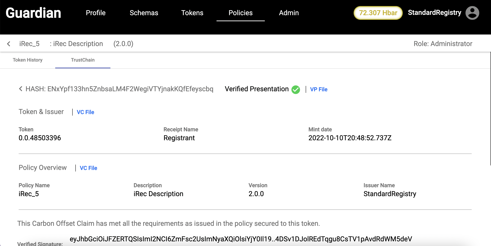<figcaption></figcaption></figure>
