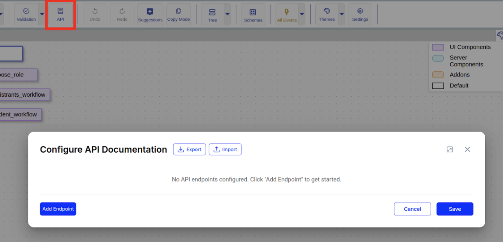
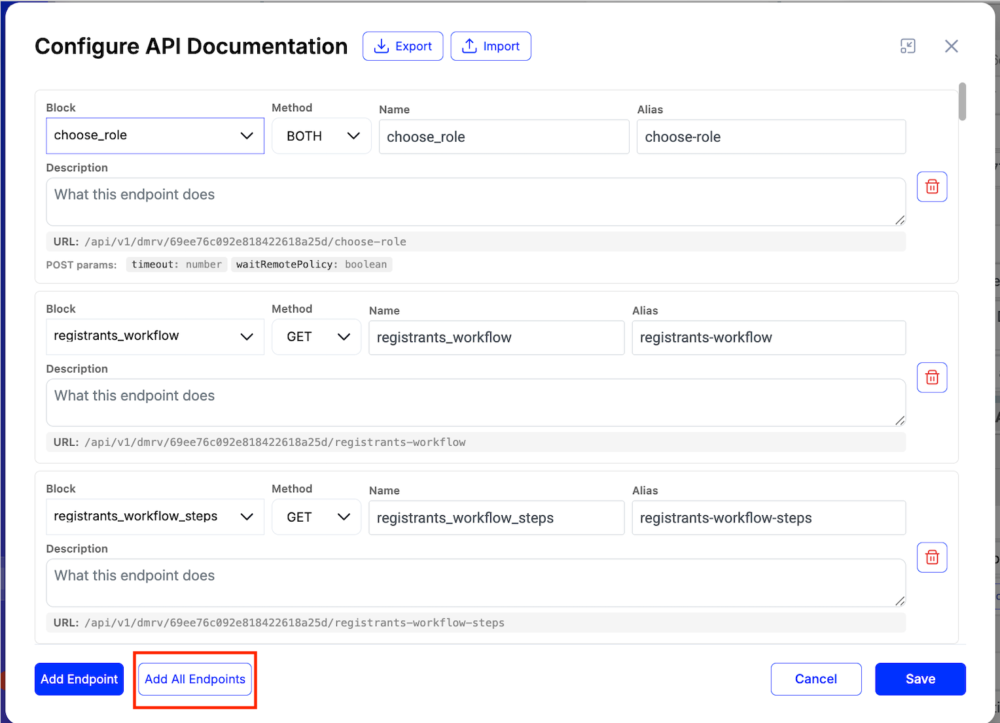
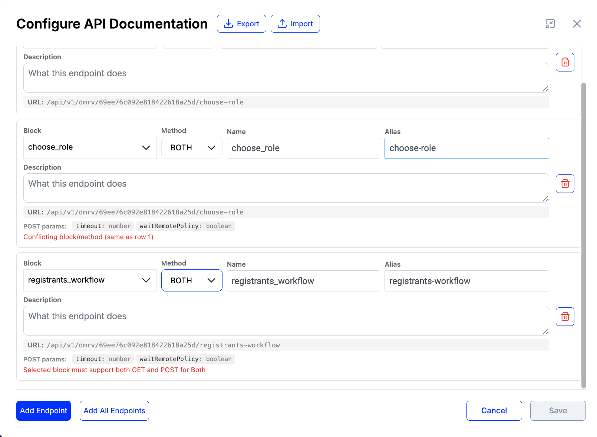

# Policy API Documentation & DMRV Aliases

## Summary

Policy authors can define clean, human-readable API endpoint aliases for their policies, giving each integration point a simple, descriptive name instead of a raw internal URL. These aliases, along with descriptions, can be configured directly in the policy editor and are published as browsable documentation, making it easier for external systems and third-party developers to integrate with a policy's API.

***

## 1. Configuring API Documentation

### 1.1. Open the Configuration Dialog

1. Open any policy in **Draft** status in the Policy Configurator.
2. Click the **API** button in the top toolbar.

<figure><figcaption></figcaption></figure>

### 1.2. Add Endpoints

1. Click **+ Add Endpoint**.
2. Fill in the fields for each row:

<table><thead><tr><th width="225.86328125">Field</th><th>Description</th></tr></thead><tbody><tr><td>Block</td><td>Select a block from the dropdown list</td></tr><tr><td>Method</td><td>Choose <code>BOTH</code>, <code>GET</code> or <code>POST</code></td></tr><tr><td>Name</td><td>Short name (auto-filled from block name)</td></tr><tr><td>Description</td><td>What the endpoint does</td></tr><tr><td>Alias</td><td>URL-friendly identifier. Either a single slug (<code>new-device</code>, <code>create-application</code>) or a path of slugs separated by <code>/</code> (<code>monitoring-reports/create</code>).</td></tr><tr><td>Preview URL</td><td>Read-only: <code>/api/v1/dmrv/{policyId}/{alias}</code></td></tr></tbody></table>

<figure><figcaption></figcaption></figure>

### 1.3. Add All Endpoints

Use the **Add All Endpoints** button at the top of the dialog (next to **+ Add Endpoint**) to auto-populate API documentation entries for every linked policy block in one click.

<figure><figcaption></figcaption></figure>

**Behavior:**

* Adds an entry for every eligible block in the current policy.
* **Skips blocks that already have an entry** — no duplicates are created.
* Generates a smart **Name** from the block name.
* Generates a smart **Alias** (URL-friendly: lowercase, hyphenated) from the block name/tag. The auto-generated alias is always a single segment; you can manually edit it into a path (e.g. `monitoring-reports/create`).

### 1.4. Validation Rules

* **Alias:** one or more segments of `a-z`, `0-9`, `-`, separated by single `/`. No leading, trailing, or consecutive slashes; no empty segments. Examples: `new-device`, `monitoring-reports/create`.
* **Block** and **Alias** must be unique
* **Block** and **Alias** are required
* **Method** must be supported by the selected **Block** (`GET`, `POST`, or both for `BOTH`)
* `GET + POST` on the same **Block** is allowed as two separate rows; any other combination on the same **Block** is rejected

Errors appear below the corresponding row.

<figure><figcaption></figcaption></figure>

### 1.5. Save

1. Click **Save** in the modal to apply changes locally.
2. Click **Save** in the toolbar to persist the policy to the database.

> **Note:** URL generation (both technical and DMRV) happens server-side on policy save.

***

## 2. Viewing Documentation

1. Go to **Policies → Manage Policies**.
2. Click the **Documentation** button (book icon) on a policy row.

<div align="left"><figure><figcaption></figcaption></figure></div>

3. The dialog shows all configured endpoints:

<figure><figcaption></figcaption></figure>

<table><thead><tr><th width="187.7109375">Column</th><th>Description</th></tr></thead><tbody><tr><td>Name</td><td>Endpoint name</td></tr><tr><td>Description</td><td>User-provided description</td></tr><tr><td>Method</td><td><code>BOTH</code> (blue), <code>GET</code> (green) or <code>POST</code> (orange)</td></tr><tr><td>URL</td><td>Technical URL to block by tag</td></tr><tr><td>Alias URL</td><td>External DMRV URL</td></tr><tr><td>Query Params</td><td>The endpoint parameters</td></tr><tr><td>Copy</td><td>Copies Alias URL to clipboard</td></tr></tbody></table>

***

## 3. Using the DMRV Proxy

### 3.1. Endpoint

```
ANY /api/v1/dmrv/:policyId/<alias-path>
```

`<alias-path>` is the configured alias as-is — a single segment (`new-device`) or a multi-segment path (`monitoring-reports/create`). The proxy captures everything after `:policyId` as the alias.

### 3.2. How It Works

```
Request: POST /api/v1/dmrv/{policyId}/monitoring-reports/create
            │
            ▼
   1. Capture alias path = "monitoring-reports/create"
   2. Validate alias against the rule (lowercase slug segments separated by '/')
   3. Load policy by policyId
   4. Find entry: alias="monitoring-reports/create", method="POST"
   5. Resolve: target="create_monitoring_report"
   6. Forward → setBlockDataByTag(user, policyId, "create_monitoring_report", body, ...)
   7. Return block response
```

### 3.3. Method Routing

<table><thead><tr><th width="130.65625">Request Method</th><th width="196.7578125">Internal Call</th><th>Equivalent Standard Endpoint</th></tr></thead><tbody><tr><td><code>GET</code></td><td><code>getBlockDataByTag</code></td><td><code>GET /api/v1/policies/:id/tag/:tag/blocks</code></td></tr><tr><td><code>POST</code></td><td><code>setBlockDataByTag</code></td><td><code>POST /api/v1/policies/:id/tag/:tag/blocks</code></td></tr></tbody></table>

### 3.4. Authentication

Standard Bearer token. Required permissions: `POLICIES_POLICY_EXECUTE`, `POLICIES_POLICY_MANAGE`.

### 3.5. Response Codes

<table><thead><tr><th width="134.70703125">Code</th><th>Meaning</th></tr></thead><tbody><tr><td><code>200</code></td><td>Success</td></tr><tr><td><code>400</code></td><td>Invalid alias path (does not match the slug-segments rule)</td></tr><tr><td><code>401</code></td><td>Unauthorized</td></tr><tr><td><code>404</code></td><td>Policy not found or alias not configured for this method</td></tr><tr><td><code>503</code></td><td>Block Unavailable (block exists but not accessible in current policy state)</td></tr></tbody></table>

### 3.6. Example

**Request (single-segment alias):**

```http
GET /api/v1/dmrv/69c3dbe9a4d2ac84f75cdfc4/choose-role-alias
Authorization: Bearer <token>
```

**Request (multi-segment alias):**

```http
POST /api/v1/dmrv/69c3dbe9a4d2ac84f75cdfc4/monitoring-reports/create
Authorization: Bearer <token>
Content-Type: application/json

{ "field": "value" }
```

**Response:**

```json
{
  "id": "2326c495-eb61-4119-aeab-1a5104176457"
}
```

***

## 4. API Reference&#x20;

`GET /api/v1/policies/:policyId/about`

Returns the configured documentation entries.

When the target block references a schema (e.g. `requestVcDocumentBlock`, `documentValidatorBlock`), the entry includes a `schemaId` field with the schema's IRI (without the leading `#`). The field is omitted for blocks that don't reference a schema.

**Response example:**

```json
[
  {
    "name": "reg_form",
    "description": "reg form",
    "target": "registrant_form_grid",
    "method": "GET",
    "alias": "reg",
    "url": "/api/v1/policies/69c3dbe9a4d2ac84f75cdfc4/tag/registrant_form_grid/blocks",
    "dmrvUrl": "/api/v1/dmrv/69c3dbe9a4d2ac84f75cdfc4/reg",
    "blockType": "interfaceDocumentsSourceBlock",
    "queryParams": [
      { "name": "page",          "type": "number",   "description": "Page number (0-based)" },
      { "name": "itemsPerPage",  "type": "number",   "description": "Items per page" },
      { "name": "sortField",     "type": "string",   "description": "Field name to sort by" },
      { "name": "sortDirection", "type": "string",   "description": "Sort direction (asc/desc)" },
      { "name": "filterByUUID",  "type": "string",   "description": "Filter by document UUID" },
      { "name": "savepointIds",  "type": "string[]", "description": "Savepoint IDs filter (JSON array)" }
    ]
  },
  {
    "name": "Create Application",
    "description": "Submit a new applicant registration",
    "target": "create_application",
    "method": "POST",
    "alias": "applications/create",
    "url": "/api/v1/policies/69c3dbe9a4d2ac84f75cdfc4/tag/create_application/blocks",
    "dmrvUrl": "/api/v1/dmrv/69c3dbe9a4d2ac84f75cdfc4/applications/create",
    "blockType": "requestVcDocumentBlock",
    "schemaId": "9bd1c75b-76df-4d3c-8775-1f76d18d7d8c",
    "queryParams": []
  }
]
```
