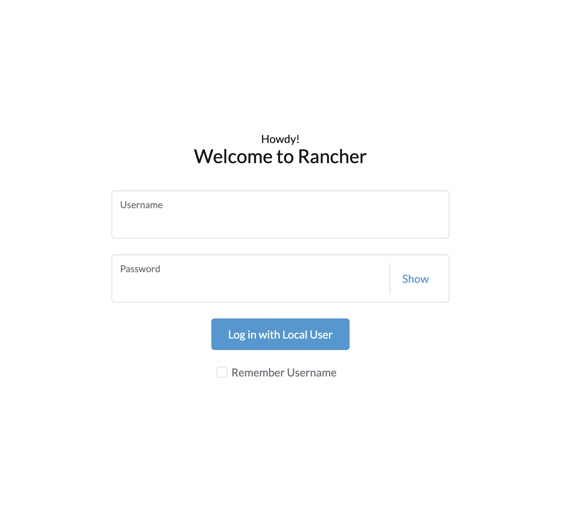

# Cloud deployment

This document describes how to deploy the platform on a cloud provider. Will cover detailed instructions for AWS and GCP, Azure.
We going to use Rancher as the cluster management tool, so virtually any cloud provider supported by Rancher could be used following this guide, even on-premises deployments or hybrid cloud deployments.

## Rancher deployment

First step is to setup a Rancher server, and for that we're going to assume this Rancher server is going to be created in the same cloud provider where the Guardian instance is going to be deployed, but this is not necessarily true, you could simply use a rancher container distribution and run it locally and from there deploy the Guardian instance to any cloud provider. But will be beneficial for us to have it running also in the cloud for future management and monitoring of the cluster.

### Rancher deployment on AWS

[Follow this official guide to deploy Rancher on AWS](https://ranchermanager.docs.rancher.com/getting-started/quick-start-guides/deploy-rancher-manager/aws)

### Rancher deployment on GCP

[Follow this official guide to deploy Rancher on GCP](https://ranchermanager.docs.rancher.com/getting-started/quick-start-guides/deploy-rancher-manager/gcp)

### Rancher deployment on Azure

[Follow this official guide to deploy Rancher on Azure](https://ranchermanager.docs.rancher.com/getting-started/quick-start-guides/deploy-rancher-manager/azure)

Once you have your Rancher server up and running, you can access it through the web interface, and you should see something like this:

You should be able to log in with the credentials you created during the installation process. Once you're logged in, you'll be able to manage your clusters and deploy new ones on any cloud provider. Additionally, you'll see a couple of default clusters created by Rancher, one of them is the local cluster, which is the one where Rancher is running, and the other one is the `sandbox` cluster, which is a cluster created by Rancher to test deployments and other features.

## Cluster deployment

Once you have your Rancher server up and running, next step is to deploy a kubernetes cluster on the cloud provider of your choice. For this guide we're going to use the managed k8s solutions provided by the cloud providers, but you could also use Rancher to deploy a cluster using VMs, a different distribution like k3s, or even skip this step and use the sandbox cluster provided by Rancher if you don't plan to use the instance for production Workloads.

### Cluster deployment on AWS EKS

[Follow this official guide to deploy an EKS cluster](https://ranchermanager.docs.rancher.com/how-to-guides/new-user-guides/kubernetes-clusters-in-rancher-setup/set-up-clusters-from-hosted-kubernetes-providers/eks)

### Cluster deployment on GCP GKE

[Follow this official guide to deploy a GKE cluster](https://ranchermanager.docs.rancher.com/how-to-guides/new-user-guides/kubernetes-clusters-in-rancher-setup/set-up-clusters-from-hosted-kubernetes-providers/gke)

### Cluster deployment on Azure AKS

[Follow this official guide to deploy an AKS cluster](https://ranchermanager.docs.rancher.com/how-to-guides/new-user-guides/kubernetes-clusters-in-rancher-setup/set-up-clusters-from-hosted-kubernetes-providers/aks)

## Guardian deployment

Once you have your cluster up and running, you can start deploying the different Guardian components. Not all of them are mandatory, and some of them can be replaced by managed services outside of the cluster.

For this guide we've divided the different manifests into several folders, which name is prefixed by a number, this is to indicate the order in which they should be deployed. The reason for this is that some of the components depend on others, so we need to deploy them in the right order to avoid errors and to ease service discovery.

### External (third-party services)

These are third party services that are not part of the Guardian platform, but are required for some of the Guardian components to work. You can choose to deploy them inside the cluster or use managed services outside of the cluster. For heavy workloads, the recommendation would be to use external dedicated services. We'll cover their basic setup, but to see all the details about installation and configuration, please refer to the official documentation of each service.

- mongo
- ipfs/kubo
- message-broker
- hashicorp vault
- prometheus and grafana
- mongo-express (optional)

### Internal (Guardian services)

These are the Guardian services that are part of the platform and are required for the platform to work. They are all deployed inside the cluster and are managed by Rancher. Depending on your needs, you may decide not to deploy some of them, like the web proxy (AKA frontend), so feel free to skip the ones that are not relevant for your use case.

- mrv-sender
- topic-viewer
- logger-service: requires message-broker
- auth-service: requires mongo, vault, logger-service
- policy-service: requires auth-service
- worker-service-1: requires ipfs-node, auth-service
- worker-service-2: requires ipfs-node, auth-service
- guardian-service: requires worker-service-1, worker-service-2, policy-service
- api-gateway: requires guardian-service
- application-events: requires guardian-service
- web-proxy: requires mongo-express (optional), api-docs (optional), mrv-sender (optional), api-gateway (optional)