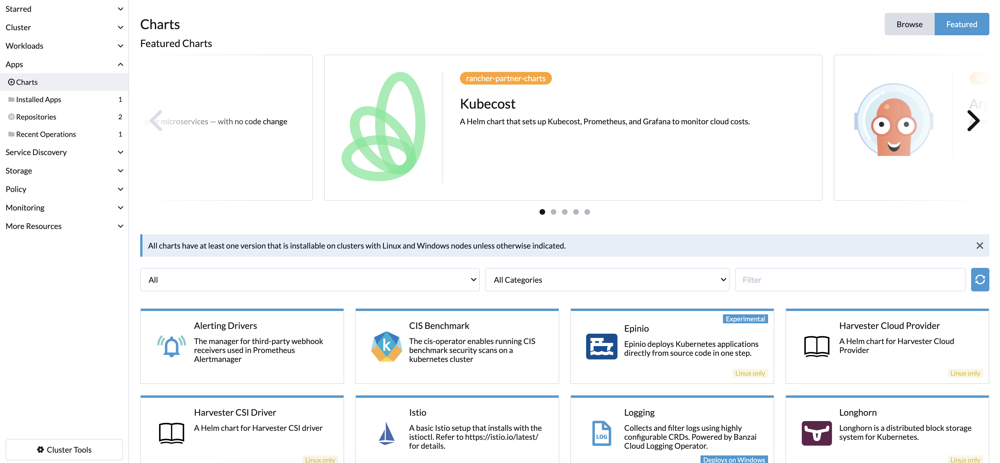

# ☁ Cloud Deployment

This document provides a comprehensive guide for deploying the platform on various cloud providers, including AWS, GCP, and Azure. The guide focuses on using Rancher as the cluster management tool, making it applicable to a wide range of cloud providers supported by Rancher, as well as on-premises and hybrid cloud deployments.

> _**NOTE:**_ The contents of this guide has been written and tested using Guardian 2.14.2 and Rancher 2.7, the latest stable version at writing time. The guide might not be applicable to different versions, specially major versions.

### Rancher Deployment

To begin the Rancher deployment process, the first step is setting up a Rancher server. We'll assume the Rancher server will be created in the same cloud provider as the Guardian instance, but it's important to note that this is not mandatory. Alternatively, you can use a Rancher container distribution and run it locally, enabling you to deploy the Guardian instance to any cloud provider. However, having the Rancher server running in the cloud will be beneficial for future cluster management and monitoring.

* Rancher deployment on AWS: [Follow this official guide to deploy Rancher 2.7 on AWS](https://ranchermanager.docs.rancher.com/v2.7/getting-started/quick-start-guides/deploy-rancher-manager/aws)
* Rancher deployment on GCP: [Follow this official guide to deploy Rancher 2.7 on GCP](https://ranchermanager.docs.rancher.com/v2.7/getting-started/quick-start-guides/deploy-rancher-manager/gcp)
* Rancher deployment on Azure: [Follow this official guide to deploy Rancher 2.7 on Azure](https://ranchermanager.docs.rancher.com/v2.7/getting-started/quick-start-guides/deploy-rancher-manager/azure)

Once you have your Rancher server up and running, you can access it through the web interface, and you should see something like this:

<figure><figcaption><p>Rancher login page</p></figcaption></figure>

You should be able to log in with the credentials you created during the installation process. Once you're logged in, you'll be able to manage your clusters and deploy new ones on any cloud provider. Additionally, you'll see a couple of default clusters created by Rancher, one of them is the local cluster, which is the one where Rancher is running, and the other one is the `sandbox` cluster, which is a cluster created by Rancher to test deployments and other features.

### K8s cluster deployment

After setting up your Rancher server successfully, the next step is to deploy a Kubernetes cluster on your preferred cloud provider. In this guide, we will utilize the managed Kubernetes solutions offered by cloud providers. However, you also have the option to deploy a cluster using VMs, a different distribution like k3s, or even use the Rancher-provided sandbox cluster if you do not intend to use it for production workloads. At the moment of writing this document, the recommended Kubernetes version for AWS and Azure is 1.25, and 1.26 for GCP.

* Cluster deployment on AWS EKS: [Follow this official guide to deploy an EKS cluster](https://ranchermanager.docs.rancher.com/v2.7/how-to-guides/new-user-guides/kubernetes-clusters-in-rancher-setup/set-up-clusters-from-hosted-kubernetes-providers/eks)
* Cluster deployment on GCP GKE: [Follow this official guide to deploy a GKE cluster](https://ranchermanager.docs.rancher.com/v2.7/how-to-guides/new-user-guides/kubernetes-clusters-in-rancher-setup/set-up-clusters-from-hosted-kubernetes-providers/gke)
* Cluster deployment on Azure AKS: [Follow this official guide to deploy an AKS cluster](https://ranchermanager.docs.rancher.com/v2.7/how-to-guides/new-user-guides/kubernetes-clusters-in-rancher-setup/set-up-clusters-from-hosted-kubernetes-providers/aks)

After the cluster is created, you'll be able to navigate to the cluster management section to see details for the cluster like nodes. In that section you can edit the cluster configuration, add nodes, etc.

You can also explore the cluster by clicking on the cluster name on the left side menu. In this view you can list and create all resources in the cluster, including namespaces, controller, access permissions, services, helm applications, monitoring, etc. From now on we'll focus on this "exploration view", which is the one you'll use to deploy the Guardian components.

#### How to deploy Kubernetes manifests on Rancher

An important part of the Rancher UI is the top header, specially the namespace dropdown. This dropdown allows you to select the namespace where you want to deploy the manifests. By default, Rancher will create a namespace named `default`, but you can create as many namespaces as you want. Get familiar with this dropdown and check it to see the selected namespace before panicking if you don't see the resources you expect to see under any section.

<figure><figcaption><p>Rancher header bar</p></figcaption></figure>

To deploy the manifests, you can use the Rancher web interface, or you can use the `kubectl` command line tool. For this guide we're going to use the command line tool. The reason to use the command line tool is because it allows to deploy an entire folder with a single command, but you can use the web interface if you prefer. Simply click on the :outbox\_tray:\[import yaml] button on the right of header bar on rancher ui for each file.

To use kubectl tool, you need first to install the tool and download the kubeconfig credentials file by clicking on the :page\_facing\_up:\[downlaod kubeconfig] icon on rancher header. You can also navigate to a kubectl console directly from the Rancher UI by clicking on the :terminal:\[kubectl shell] icon on rancher header.

### Guardian deployment

Once you have your cluster up and running, you can start deploying the different Guardian components. Not all of them are mandatory, and some of them can be replaced by managed services outside of the cluster. There is a [dedicated section](cloud-deployment.md#types-of-services) on this document with details about the different types of services and the deployment options for external services.

For this guide we've divided the different manifests into several folders, which name is prefixed by a number, this is to indicate the order in which they should be deployed. The reason for this is that some of the components depend on others, so we need to deploy them in the right order to avoid errors and to ease service discovery.

#### Nginx ingress controller

The first component we need to deploy is the Nginx ingress controller. This component is used to expose the different services to the outside world. You can find more details about this component in the official documentation, but for this guide we're going to use the default configuration.

Complete information about this topic can be found in [this link](https://kubernetes.github.io/ingress-nginx/deploy), but here is a summary for the installation steps for the cloud providers referred on this document.

**AWS**

```bash
kubectl --kubeconfig KUBECONFIG-FILE apply -f https://raw.githubusercontent.com/kubernetes/ingress-nginx/controller-v1.8.1/deploy/static/provider/aws/deploy.yaml
```

**GCP**

```bash
kubectl --kubeconfig KUBECONFIG-FILE apply -f https://raw.githubusercontent.com/kubernetes/ingress-nginx/controller-v1.8.1/deploy/static/provider/cloud/deploy.yaml
```

**Azure**

```bash
kubectl --kubeconfig KUBECONFIG-FILE apply -f https://raw.githubusercontent.com/kubernetes/ingress-nginx/controller-v1.8.1/deploy/static/provider/cloud/deploy.yaml
```

After this step is completed you should see a Load Balancer service created in your cluster with a external IP address where you'll have access to Guardian once it is deployed. You can check the status of the service by running the following command:

```bash
kubectl --kubeconfig KUBECONFIG-FILE -n ingress-nginx get svc -o wide

```

You can also find the load balancer using your cloud privider console. The domain name configuration and, DNS records and TLS certificates with SSL termination on the load balancer are out of the scope of this document.

#### Guardian manifests

Simply run the following commands to deploy the manifests. You can find more details about the different components below, in the manifests [folder structure section](cloud-deployment.md#manifests-folder-structure).

To use a namespace different than default one, you need to add the `--namespace <namespace>` flag to the commands above. And create the namespace before running the commands.

```bash
kubectl --kubeconfig KUBECONFIG-FILE apply -f ./k8s-manifests/1-config/
kubectl --kubeconfig KUBECONFIG-FILE apply -f ./k8s-manifests/2-service/
kubectl --kubeconfig KUBECONFIG-FILE apply -f ./k8s-manifests/3-controller/
```

> _**PRO-TIP:**_ if you plan to use the web ui, this command executed locally may help to deploy all manifests on a single shot by coping in your clipboard a huge text with all the manifests content together: `find k8s-manifests -type f | sort | xargs cat | pbcopy` for macos, or `find k8s-manifests -type f | sort | xargs cat | xsel -b` for linux users.

#### Manifests folder structure <a href="#manifests-folder-structure" id="manifests-folder-structure"></a>

**1-config**

This folder contains configuration manifests that are required for the rest of the components to work. You can find more details about the configuration in the relevant section fo the documentation, but for the demonstration of this document, the only important file is `0-general-config.yaml`, which contains the configuration for the different services. You can edit this file to change the configuration of the services. The rest of the files are related to the specific settings each individual service can override, based on the multi-environment feature.

**Multi-environment feature settings**

The key settings to turn on the multi-environment feature are GUARDIAN\_ENV and OVERRIDE. The first one is used to indicate the environment name, and the second one is used to indicate if the service should override the default configuration or not. If the service is not overriding the default configuration, it will use the default one. If the service is overriding the default configuration, it will use the configuration defined in the service manifest.

> _**NOTE:**_ when using the multi-environment feature, each service will try to read its config file from a file named `.env.gateway.${GUARDIAN_ENV}`, that file is not mounted in the manifests, so you'll need to update the corresponding controller manifests and re-deploy them, and deploy before the new configSet. See below a simplified example:

```yaml
apiVersion: apps/v1
kind: Deployment
metadata:
  name: foo-service
spec:
  replicas: 2
  selector:
    matchLabels:
      service: foo-service
  template:
    spec:
      containers:
          image: gcr.io/hedera-registry/foo-service
          name: foo-service
          volumeMounts:
            - mountPath: /usr/local/foo-service/configs/.env.foo.${GUARDIAN_ENV}
              name: foo-service
              subPath: .env
      volumes:
        - configMap:
            items:
              - key: .env.foo.${GUARDIAN_ENV}
                path: .env
            name: foo-service
          name: foo-service
```

**2-service**

This folder contains the manifests for the different services that needs to be created in the cluster. Not all of them are exposed to the outside world, and some of them are only used internally by other services.

> _**NOTE:**_ the manifest `web-proxy-ingress.yaml` creates the external routes for the exposed services. Some of them are potentially dangerous if exposed to the internet, for example, `/mongo-admin`, so please make sure you understand the implications of exposing them before doing so and disable the ones you don't need or protect them.

**3-controller**

This folder contains the manifests for the different controllers that needs to be created in the cluster. These controllers are used to manage the lifecycle of the different services, and to ensure they are always running and healthy. This is the folder you need to pay attention if you want to deploy service versions different than the provided one.

> _**NOTE:**_ you may face compatibility issues if you try to deploy different Guardian versions with the provided manifests. Check version release notes before.

> _**NOTE:**_ all the manifest modifications described in the whole document can be done also easily in the Rancher UI, navigating to the relevant section and editing the default deployed objects.

### Types of services <a href="#types-of-services" id="types-of-services"></a>

#### External (third-party services)

These are third party services that are not part of the Guardian platform, but are required for some of the Guardian components to work. You can choose to deploy them inside the cluster or use managed services outside of the cluster. For heavy workloads, the recommendation would be to use external dedicated services. The project included manifests described above cover their basic setup, but to see all the details about installation and configuration, please refer to the official documentation of each service.

* mongo
* ipfs/kubo
* message-broker
* hashicorp vault
* mongo-express

For production workloads it is recommended to use a more robust setup for these services, like a replica set for mongo, a cluster for ipfs, a cluster for the message broker, etc. Navigating to the Apps section of Rancher, you can find the official [Helm](https://helm.sh/) charts for these services, with Rancher support, which can be used to deploy them in a more robust way. As an example, you can follow the steps below to deploy a message broker cluster using the Rancher UI, you'll see something similar to this:

<figure><figcaption><p>Rancher charts section</p></figcaption></figure>

1. Navigate to the Apps section of Rancher.
2. Click on the :heavy\_plus\_sign:\[Charts] button.
3. Select the `nats-server` chart (use the search bar if neeeded), read the chart documentation and click on the install button.
4. Follow the installation steps selecting the namespace where you want to deploy the chart, and filling the required values, like in this case, the number of replicas. You can also edit the raw `values.yaml` file, with all the customizable options the chart provides.
5. Once the chart is successfully deployed you can navigate to the services section, see the details of the service, copy the dns name and update the relevant config map containing the connection string for the message-broker service.
   * because the internal guardian services read the configuration from environmental variables, you'll need to redeploy them to apply the changes. To do that navigate to the Rancher workloads section, select the relevant deployments and click on the :arrows\_clockwise:\[Redeply] button.

This same steps can be followed to deploy the rest of the external services, like mongo, ipfs, etc. using Helm charts. One particularly interesting one is kube-prometheus-stack, which is a collection of charts that can be used to deploy a full monitoring stack for the cluster, including prometheus, prometheus-alerts and grafana. In this particular case, Rancher has rebranded the chart as `rancher-monitoring`, so you can follow the same steps described above to deploy it.

#### Internal (Guardian services)

These are the Guardian services that are part of the platform and are required for the platform to work. They are all deployed inside the cluster and are managed by Rancher. Depending on your needs, you may decide not to deploy some of them, like the frontend, so feel free to skip the ones that are not relevant for your use case. For all of them, the project includes a service, a deployment manifest and a configuration sample manifest using config maps. These manifests are used to create the service and the deployment for the service. The deployment manifest is used to create the pods that will run the service, and the service manifest is used to create the service that will expose the pods to the rest of the cluster.

* mrv-sender
* topic-viewer
* logger-service: requires message-broker
* auth-service: requires mongo, vault, logger-service
* policy-service: requires auth-service
* worker-service-1: requires ipfs-node, auth-service
* worker-service-2: requires ipfs-node, auth-service
* guardian-service: requires worker-service-1, worker-service-2, policy-service
* api-gateway: requires guardian-service
* application-events: requires guardian-service
* frontend

Please, explore the rest of the documentation to learn more about the different services, their configuration, upgrading guides and so on.
