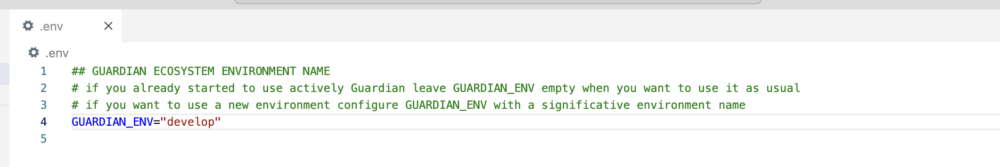
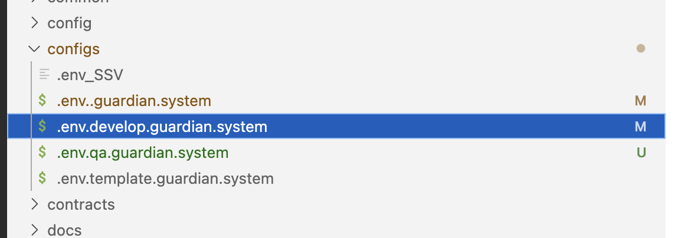
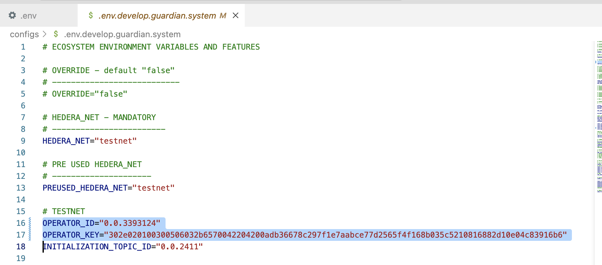
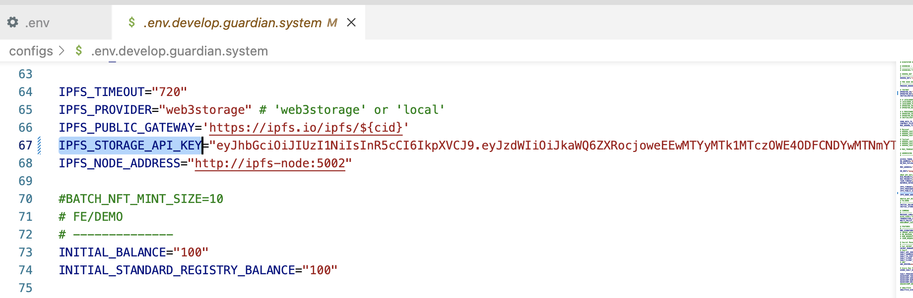
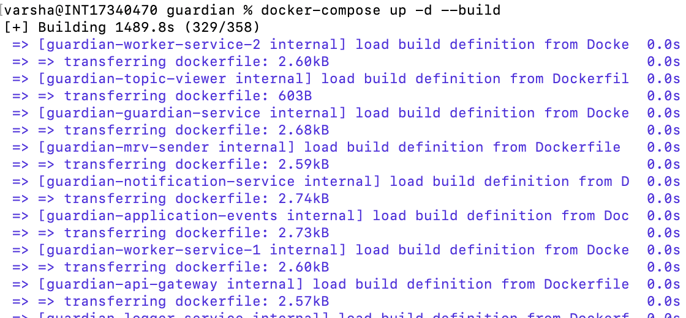
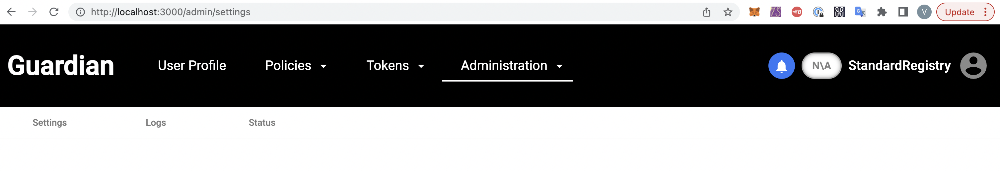

# Steps to deploy Guardian using a specific Environment( DEVELOP)

### Step 1: 
Create the .env file 
Set the GUARDIAN_ENV=”develop” in the .env file ( Refer .env.template as example)

<figure></figure>

### Step 2 : 

select the .env.develop.guardian.system file which is already provided as in example inside configs directory at the root level **/guardian/configs**

<figure></figure>

### Step 3: 

Set OPERATOR_ID , OPERATOR_KEY and IPFS_STORAGE_API_KEY in the .env.develop.guardian.system file inside configs Directory at the root level

<figure></figure>
<figure></figure>

### Step 4: Run docker compose up -d –build. 

<figure></figure>

Wait until all the services are started. 

<figure></figure>

### Step 5:  
Launch Guardian [http://localhost:3000](http://localhost:3000)

<figure></figure>

