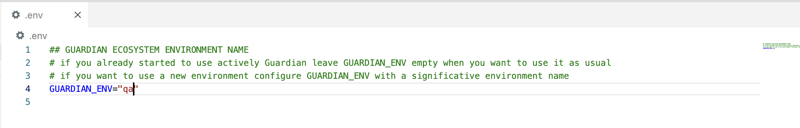
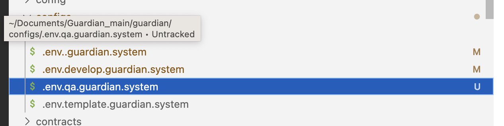
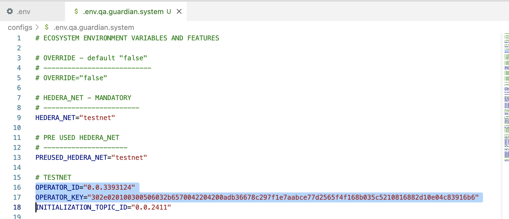
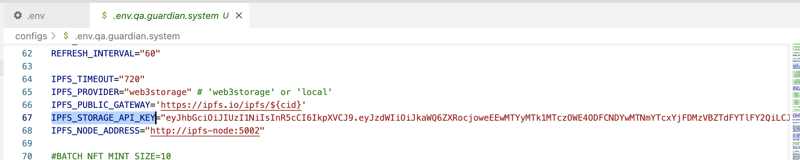
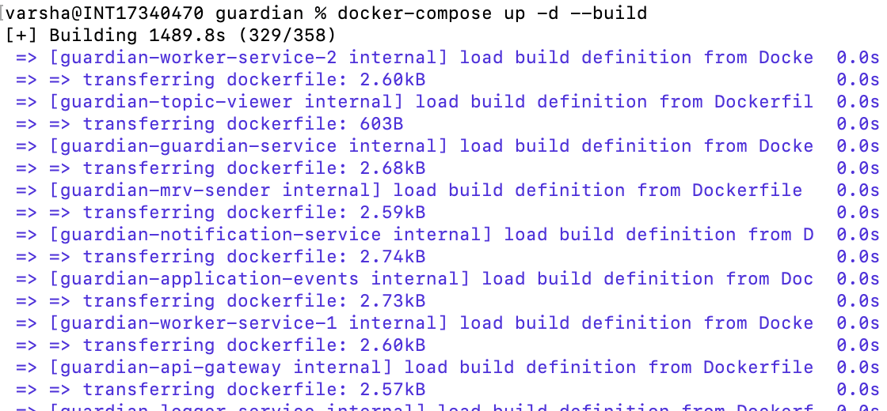
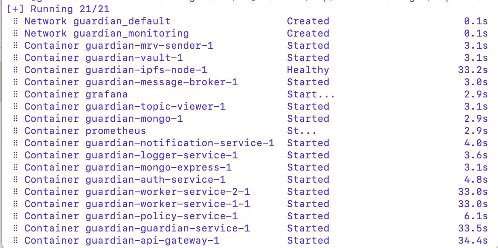
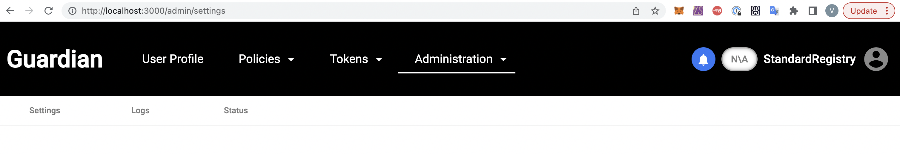

# Steps to deploy Guardian using a specific Environment ( QA)

### Step 1: 
Create the .env file 
Set the GUARDIAN_ENV=”qa” in the .env file ( Refer .env.template as example)

<figure></figure>

### Step 2: 

Create .env.qa.guardain.system file inside configs Directory at the root level: /guardian/configs. ( Refer .env.template.guardian.system as example)

<figure></figure>

### Step 3: 

Set OPERATOR_ID , OPERATOR_KEY and IPFS_STORAGE_API_KEY in the .env.qa.guardian.system file inside configs Directory at the root level

<figure></figure>
<figure></figure>

### Step 4: 
Run 
    $ docker compose up -d -–build. 

<figure></figure>

Wait until all the services are started. 

<figure></figure>

### Step 5:  
Launch Guardian [http://localhost:3000](http://localhost:3000)

<figure></figure>

