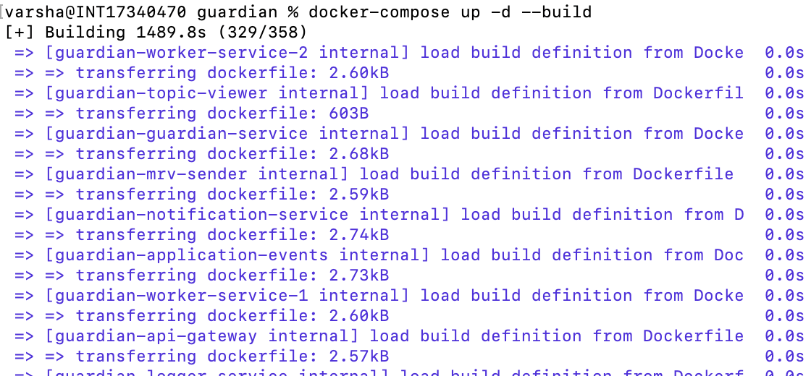

# Steps to deploy Guardian using default Environment. 

### Step 1: 
By default GUARDIAN_ENV=”” is Blank in the .env.template

Create .env file and leave the variable as Empty

```

GUARDIAN_ENV=””

```

<figure></figure>

 _**Note**_ : If you forget to create the .env file , the docker compose will evaluate the variable as empty, complainting with a warning. But the end result witll be the same.

### Step 2 : 

select the .env..guardian.system file which is already provided as example inside configs Directory at the root level. "/guardian/configs"

<figure></figure>

### Step 3: 
Set OPERATOR_ID , OPERATOR_KEY and IPFS_STORAGE_API_KEY in the .env..guardian.system file inside configs Directory at the root level

<figure></figure>
<figure></figure>

Step 4: Run docker compose up -d –build. 

<figure></figure>

Wait until all the services are started. 

<figure></figure>

Step 5:
Launch Guardian [http://localhost:3000](http://localhost:3000)

<figure></figure>

