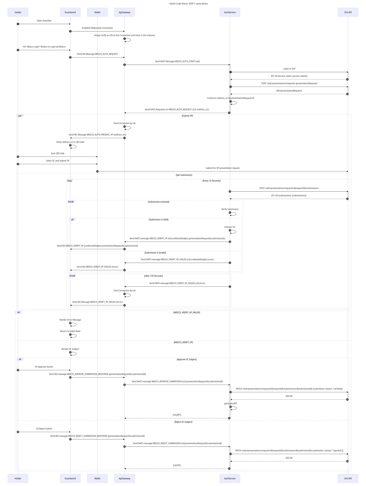
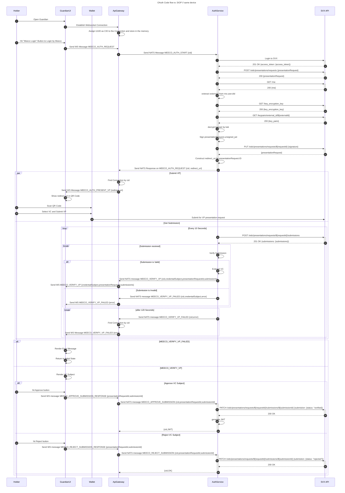

# How it works

<figure><figcaption><p>Meeco integration flow in the Guardian</p></figcaption></figure>

If you are using [Mermaid Flow](https://www.mermaidflow.app/) here is the script to help your visualization

````

````
