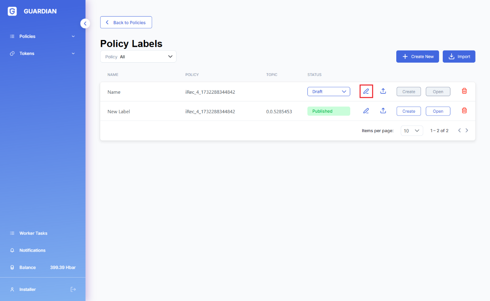

# 🔑 Bring your own DIDs

At the new user registration stage, Guardian allows to ‘bring your own DID’ (BYO DID) - externally-controlled DID - into the system instead of generating a new DID with Guardian. With BYO DID users will not be required to register the main DID private key with the Guardian instance. These users would be able to select one of the verification methods registered in their DID to be used for the signing of the VC/VP documents linked to their identity.

1. **New Standard Registry registration**
   1. **Hedera Account**

Enter the Hedera network account with non-0 hbar balance to be used by the system for the Hedera transactions associated with the new Standard Registry user’s DID.

*
  1. **DID Document**
     1. **Default DID**

When the ‘Generate new DID document’ option is selected, clicking on the Next button would result in Guardian generating a new dedicated DID to be used exclusively in Guardian based on the Hedera account ID entered at the previous step. Such DID would have the following format:

“did:hedera:{network}:{identifier}\_{topicId}”

Example:

"did:hedera:testnet:DZv8hKg4nsdS7qSAtUdmBgvcq5iiZ6E1aCWZvqJzNNbV\_0.0.2666979"

*
  *
    1. **Externally-controlled (custom) DID**

Selecting ‘Custom DID document’ option enables the dialogue text window where the externally-generated/controlled DID document can be pasted from the clip-board. The document must contain **Ed25519VerificationKey2018** and **Bls12381G2Key2020** verification methods to be useable by Guardian.

*
  1. **Keys**

For BYO DID of Standard Registries, in the cases where there are multiple verification methods Standard Registry users are required to specify which one of them is to be used in Guardian, and pass the corresponding private key into Guardian to be used for signatures.

*
  1. **VC Document**

Final step of the registration presents a form, based on the corresponding system schema, for the user to fill out.

1. **New User registration**
   1. **Select the Standard Registry to be associated with**

*
  1. **User Hedera Account**

Specify the existing Hedera account with non-0 hbar balance to be used for submitting transactions associated with this user’s DID.

*
  1. **DID Document**
     1. **Default DID**

See section 1.2.1.

*
  *
    1. **Custom DID**

See section 1.2.2

*
  1. **Keys**

See section 1.3.

1. **API**

**New**

POST: /profiles/did-document/validate

\- Validates new document and returns the list of its verification methods

POST: /profiles/did-keys/validate

\- Validates DID keys

**API** **Changes**

PUT: /:username

PUT: /push/:username

\- Added optional parameters (didDocument, didKeys) which can be used for passing BYO DID document during user registration stage
