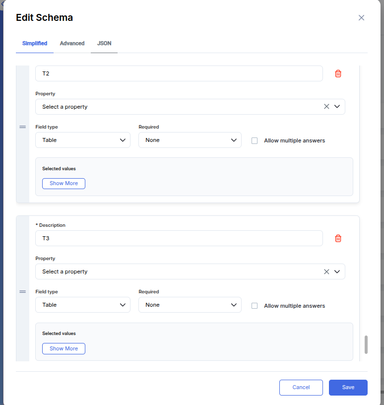

# Demo using UI

## 1. Purpose

Allow users to edit documents and view all their versions.

### 2. Mark a field as available for update

Go to Manage Schema. Select the desired schema or create a new schema. Select the field with the Simple type, and the “Updatable field” field will become available. Check this box. Save form.

<figure><figcaption></figcaption></figure>

**Note:** If the field type is not one of a Simple type, the value in the “Updatable Field” will be removed and will become non-editable.

<figure><figcaption></figcaption></figure>

## 3. Creating and Viewing Document Changes

Changes to a document can be created by the user who created the original document and is its publisher. For a user to edit a document, the document must not have the Revoked or Rejected status.

To create a new version, view the document in the published policy by clicking the “View Document” button, which will open the viewing form. If the current user is the document owner, a “Switch to Edit Mode” button will appear in the upper right corner.

<figure><figcaption></figcaption></figure>

“Switch to Edit Mode” will be available to the document owner provided that the selected version of the document is the latest (current) version. Clicking this button will open the document in Edit mode.

<figure><figcaption></figcaption></figure>

In Edit mode, document information is displayed, and a button is available to switch back to form view mode.

Fields marked as “Updatable field” will be editable. After changing these fields, click “Save Changes” (becomes available if any changes have been made to the form).

<figure><figcaption></figcaption></figure>

<figure><figcaption></figcaption></figure>

Close button: allowing you to continue making changes.

Save button: creates a new revision of a document and automatically switches to view mode.

If a document has multiple versions, a drop-down list of all document versions will appear.

<figure><figcaption></figcaption></figure>

If the form has been modified and the user clicks the “Switch to View mode” button, a dialog box will appear. In this dialog box, the user can save their changes and switch to view mode or immediately switch to view mode without saving the changes.

When you select the desired version, information from the selected version is displayed.

<figure><figcaption></figcaption></figure>

**Note**: A user who is not the owner of a document cannot edit it but can view all versions of the document.

<figure><figcaption></figcaption></figure>

By clicking the “Approve” button from the grid, the user creates their own document based on the original (first) version of the document.

<figure><figcaption></figcaption></figure>

When viewing the document history in “Trust Chain”, we can also see all versions of documents, starting from the most recent version and ending with the first one.

<figure><figcaption></figcaption></figure>

## 4. Indexer

Documents with multiple versions have a drop-down list with all versions. By default, the latest version of the document is selected.

<figure><figcaption></figcaption></figure>

When you select any version, information about the selected version is displayed.

<figure><figcaption></figcaption></figure>
