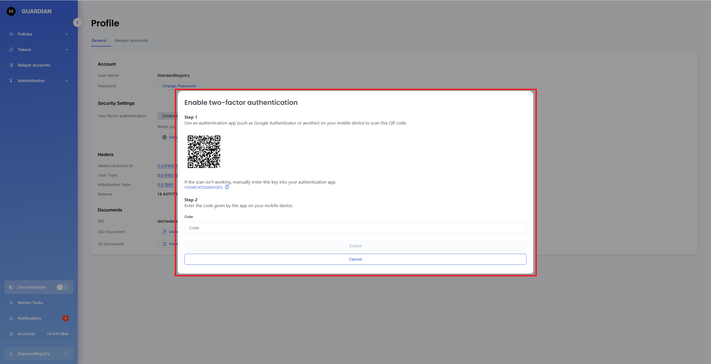
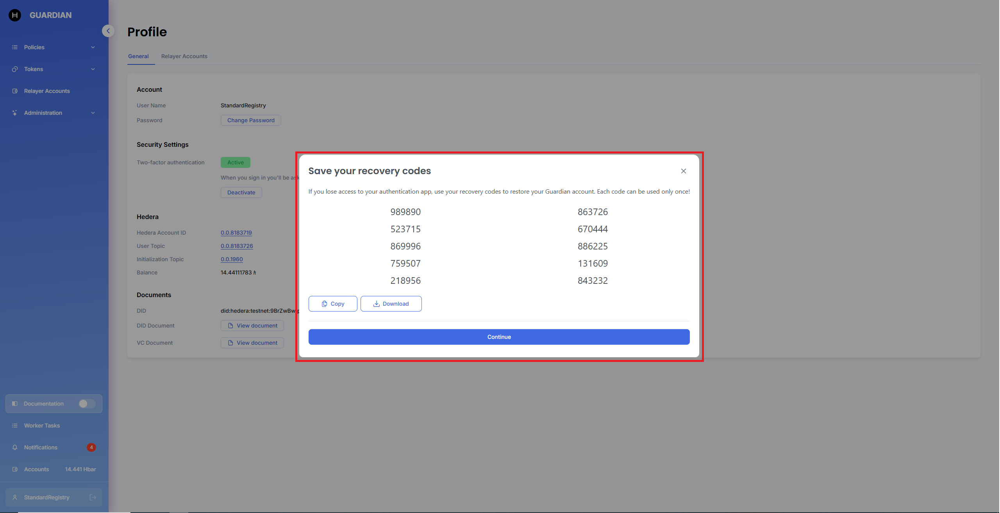
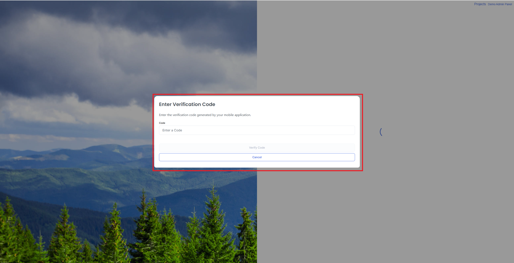
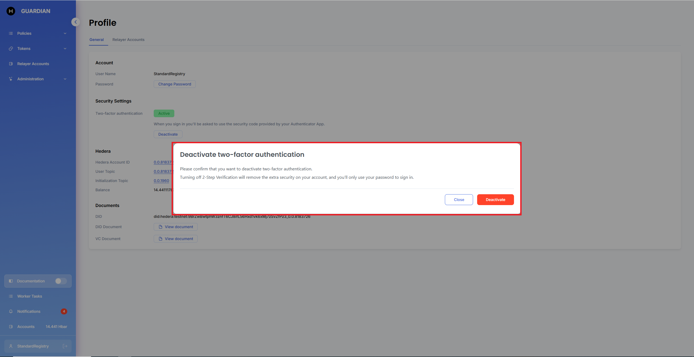
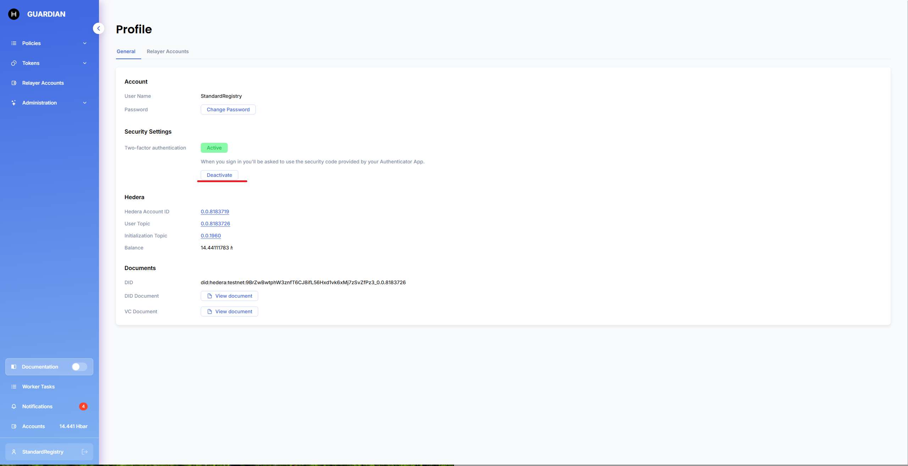

# 4108 Multifactor Authentication (2FA)

## Enable

To enable Multi-Factor Authentication, click the **Set up** button in your profile:

<figure><figcaption></figcaption></figure>

The Guardian will show a modal window with instructions on how to do it:

<figure><figcaption></figcaption></figure>

After enabling Multi-Factor Authentication, you can download recovery codes, which can be used to restore access to your account. There are a few options to save your backup codes: copying them or downloading them as a `.txt` file.

<figure><figcaption></figcaption></figure>

## Log In

Every time you try to log in to the Guardian, the system will show a modal to verify the login attempt:

<figure><figcaption></figcaption></figure>

&#x20;

If you lose access to your authentication app, send your recovery code to a person who has access to the DB.

## Disable

You can disable Multi-Factor Authentication by clicking the **Deactivate** button in your profile:

<figure><figcaption></figcaption></figure> <figure><figcaption></figcaption></figure>

