# 5247 Dry Run Mock Docs

## Overview

When testing a Guardian policy in **Dry Run** mode, blocks that interact with external services (IPFS, Hedera Topics, tokens, or third-party REST APIs) often cannot execute — there is no live environment for them to talk to. The **Mock Data** feature solves this by letting policy authors define and manage substitute responses for every external call a policy makes, enabling a fully self-contained, end-to-end dry-run test without any real network dependencies.

Mock data can be recorded automatically as the policy runs, entered manually, or imported from another policy's session — making it suitable for both exploratory testing and repeatable regression scenarios.

***

### Visual walk through

<div><figure>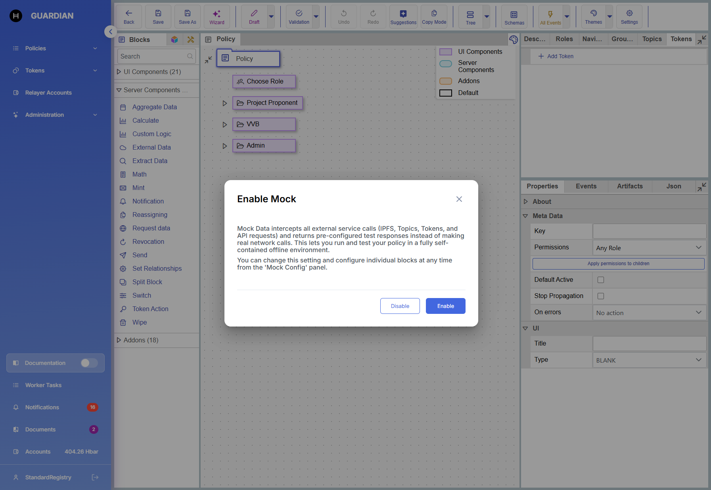<figcaption></figcaption></figure> <figure>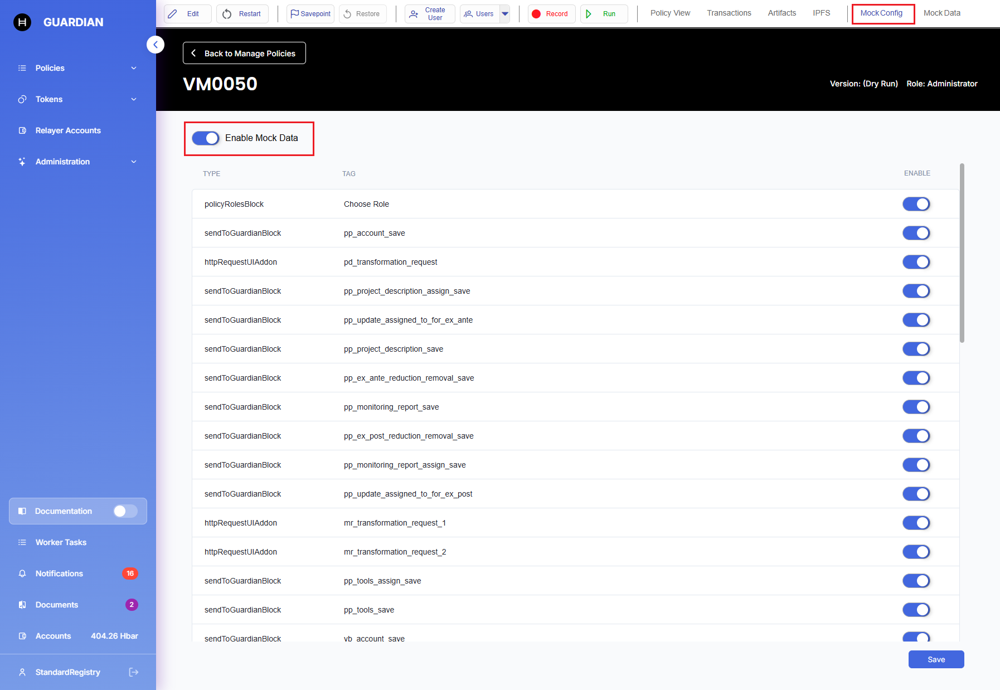<figcaption></figcaption></figure> <figure>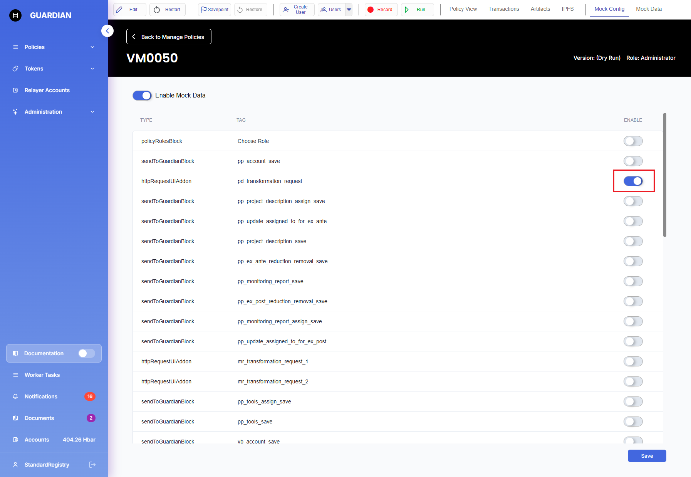<figcaption></figcaption></figure> <figure><figcaption></figcaption></figure> <figure>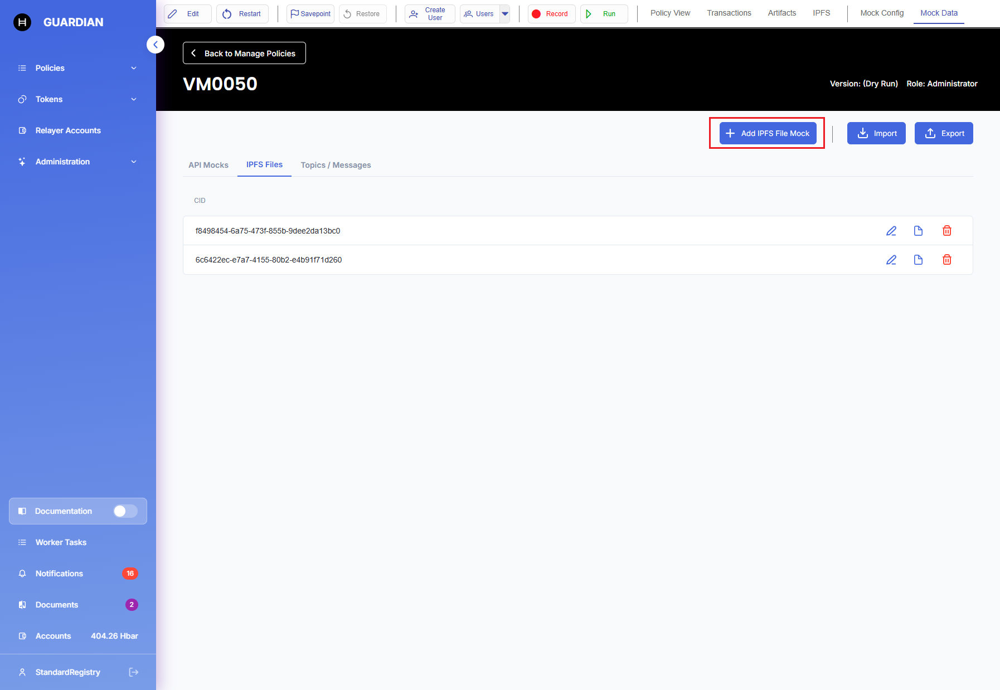<figcaption></figcaption></figure> <figure>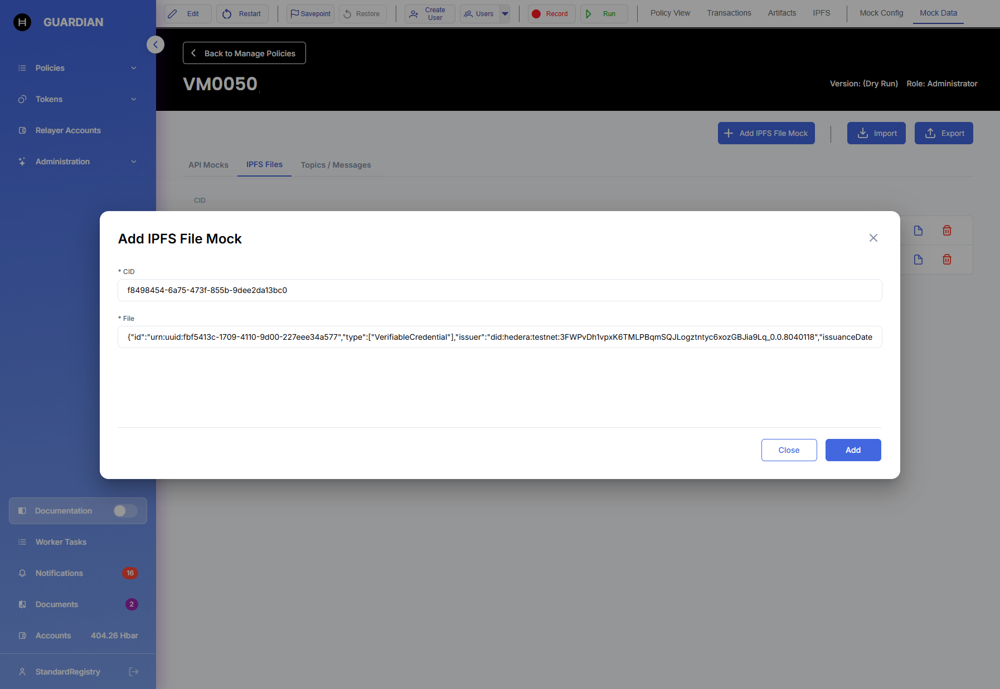<figcaption></figcaption></figure> <figure>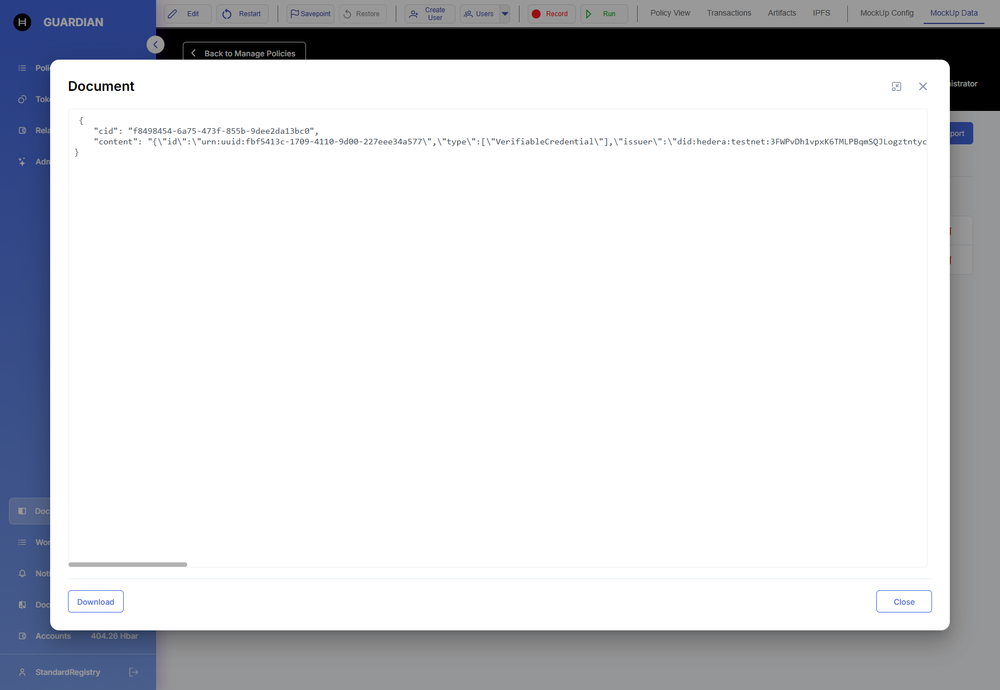<figcaption></figcaption></figure> <figure>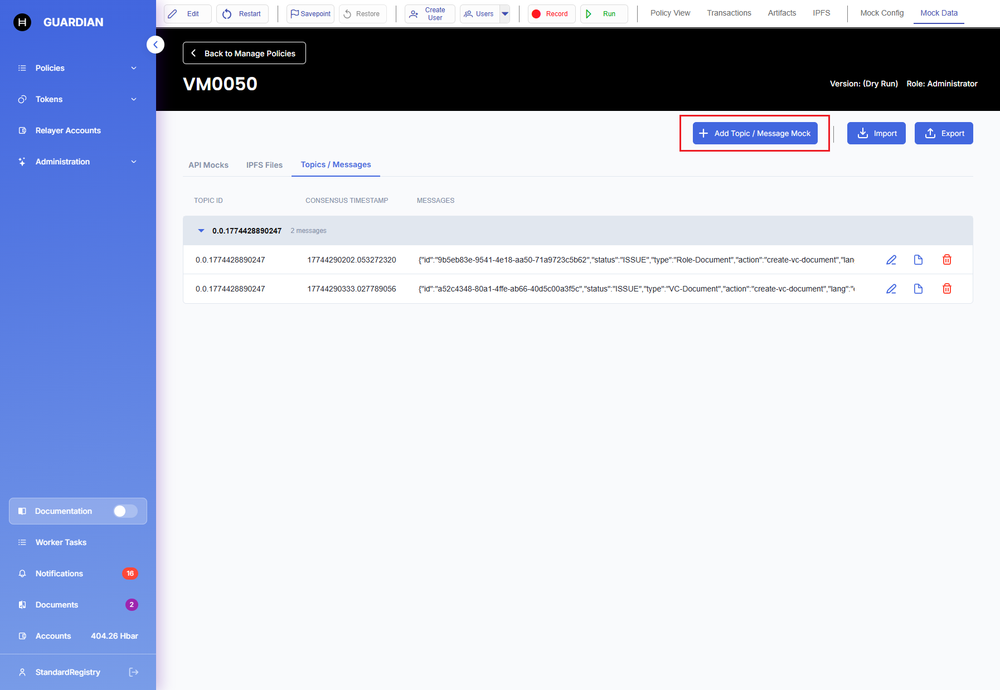<figcaption></figcaption></figure> <figure>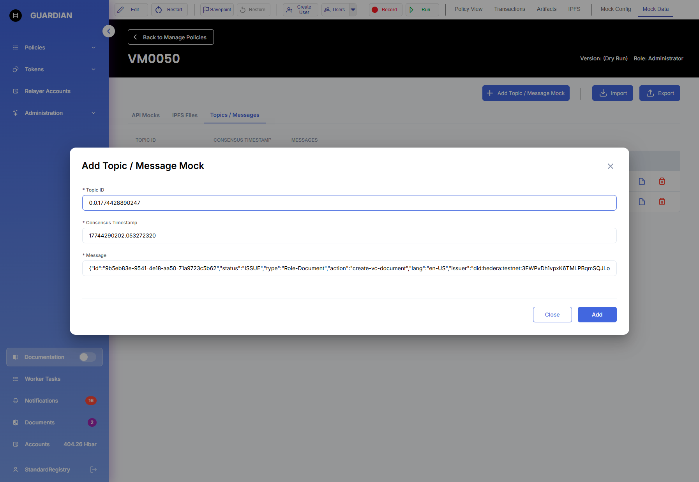<figcaption></figcaption></figure> <figure>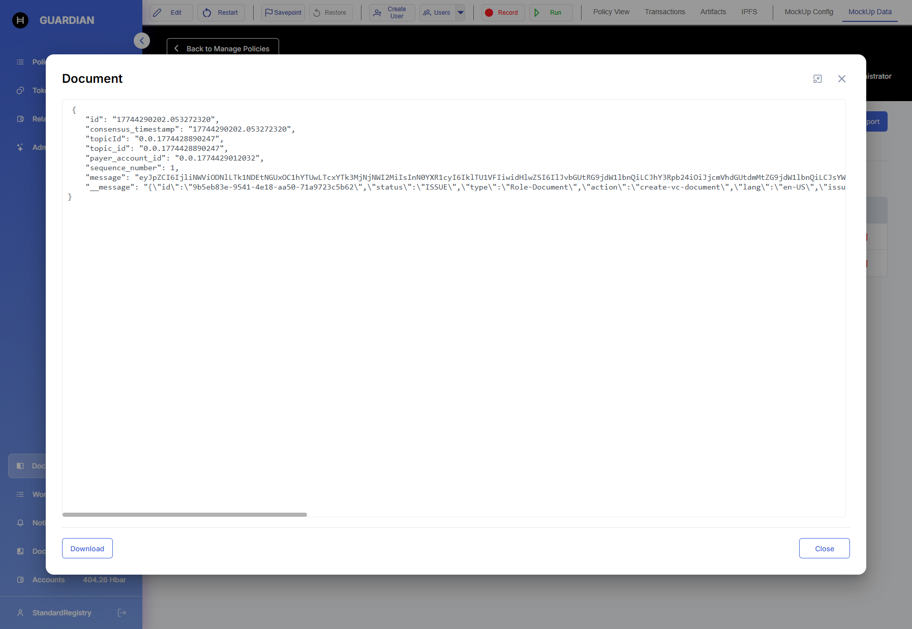<figcaption></figcaption></figure> <figure>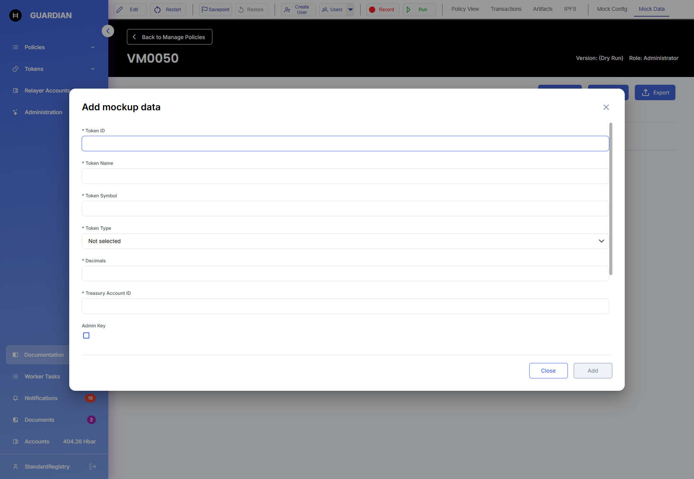<figcaption></figcaption></figure> <figure><figcaption></figcaption></figure> <figure>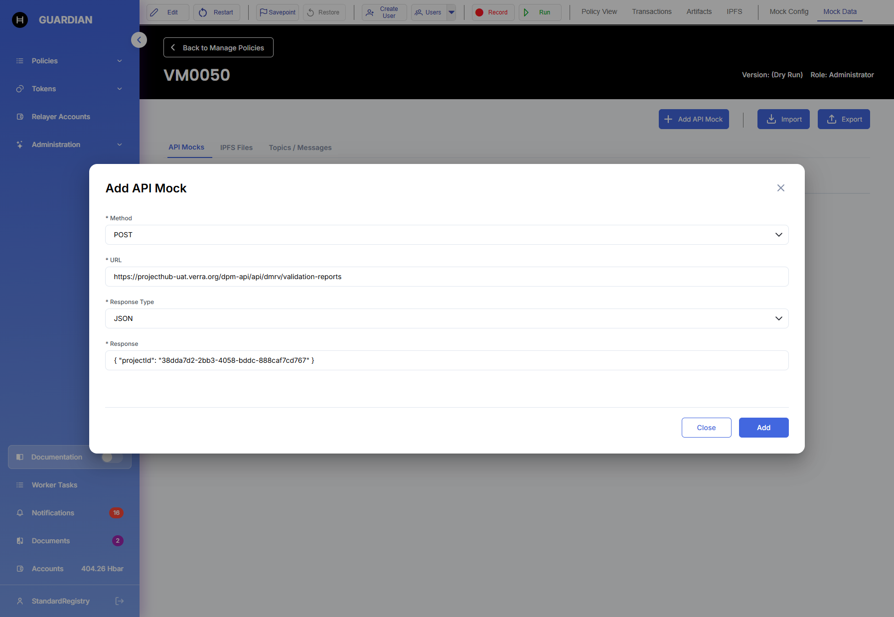<figcaption></figcaption></figure> <figure><figcaption></figcaption></figure> <figure>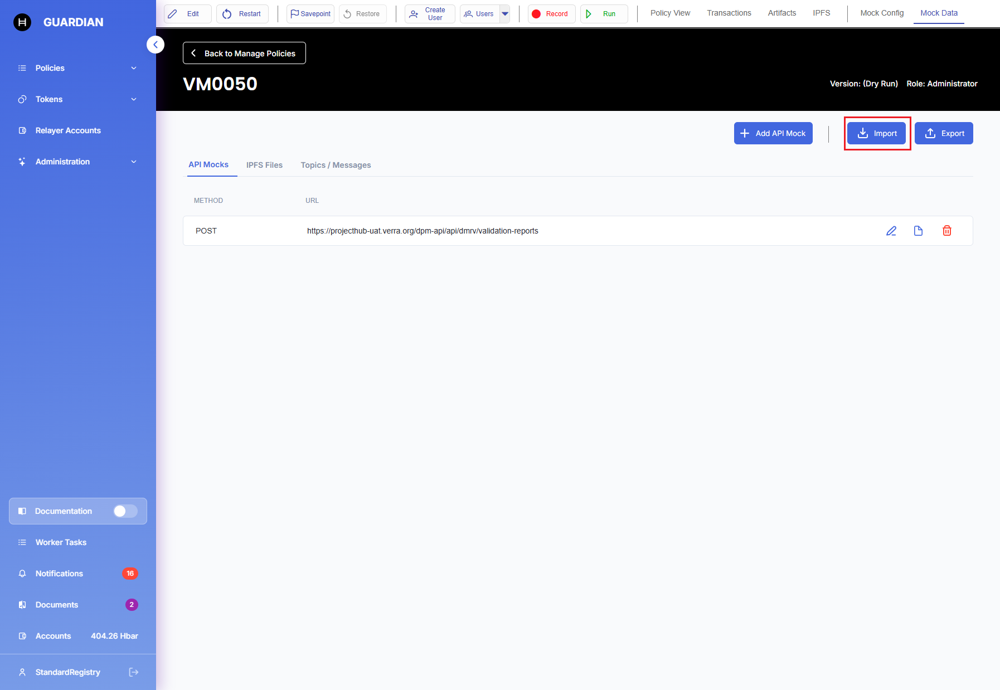<figcaption></figcaption></figure> <figure>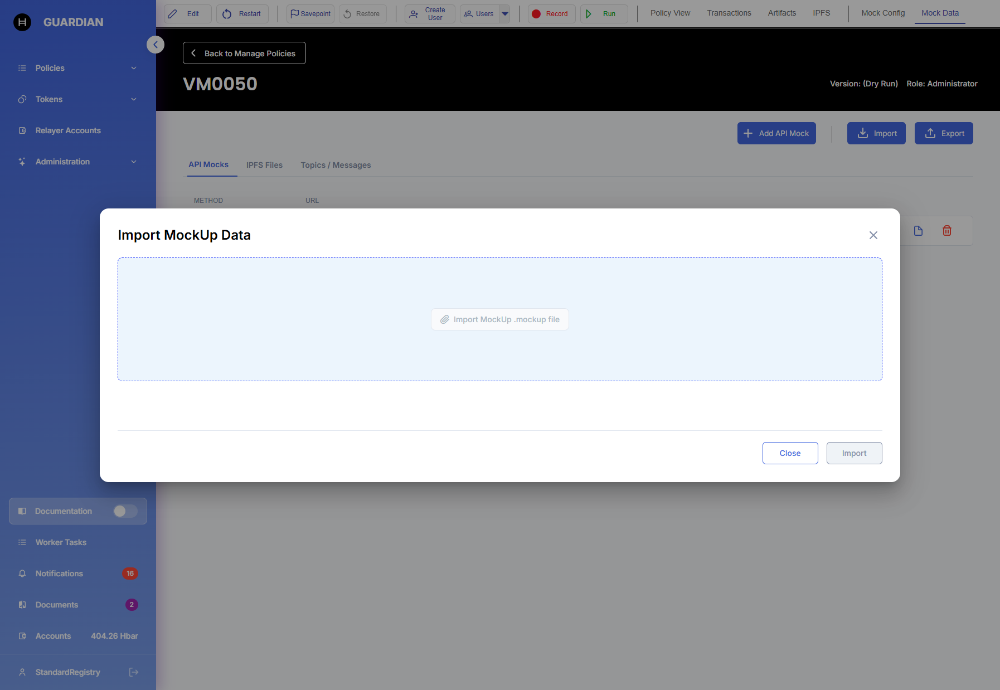<figcaption></figcaption></figure></div>

***

## Key Capabilities

| Capability                  | Description                                                                                                                      |
| --------------------------- | -------------------------------------------------------------------------------------------------------------------------------- |
| **Per-block configuration** | Enable or disable mocking individually for each block in the policy.                                                             |
| **Auto-recording**          | Live responses from external services are captured and stored automatically while the policy runs, so you can replay them later. |
| **Manual data entry**       | Add or edit mock responses directly in the UI without needing to make real external calls.                                       |
| **Cross-policy sharing**    | Export a mock dataset from one policy and import it into another, enabling coordinated multi-policy test scenarios.              |
| **Scoped mock types**       | Dedicated mock stores for IPFS files, Hedera topic messages, tokens, and generic REST API calls.                                 |

***

## Enabling Mock Data

### Option 1 — Enable at Dry Run Start

When you switch a policy to **Dry Run** mode for the first time, a dialog is shown:

> **"Enable Mock Data"**
>
> Mock Data intercepts all external service calls (IPFS, Topics, Tokens, and API requests) and returns pre-configured test responses instead of making real network calls. This lets you run and test your policy in a fully self-contained offline environment.
>
> You can change this setting and configure individual blocks at any time from the **Mock Config** panel.
>
> \[ **Enable** ]    \[ **Disable** ]

### Option 2 — Enable After the Session Has Started

If you skipped the prompt above or want to toggle mocking mid-session, open the **Mock Config** panel from the policy toolbar and use the master **Enable Mock Data** toggle. Changes take effect immediately for subsequent block executions.

### Option 3 — Configure Individual Blocks

In the **Mock Config** panel, each block that performs external calls is listed separately with its own enable/disable toggle. This is useful when you want some blocks to use real external calls while others use mocked responses.

***

## Mock Config and Mock Data Panels

There are two separate panels for managing mock data, both accessible from the policy editor toolbar while a Dry Run session is active:

* **Mock Config** — controls mocking globally via a master enable/disable toggle, and allows switching mocking on or off for each individual block. This is where you configure the mocking rules.
* **Mock Data** — manages the actual mock payloads (IPFS files, topic messages, tokens, and API responses). This is where you view, add, edit, and delete the data that mocked blocks will serve.

Each tab also displays any responses that were **recorded automatically** while the policy ran with mocking disabled for that block. Recorded entries appear inline alongside manually added entries and can be edited or deleted directly within the same view.

The **Mock Data** panel contains four sections:

### 1. IPFS

Stores mock responses for blocks that read from or write files to IPFS.

Each entry maps an **IPFS CID** to a file payload stored. When a policy block requests a file by CID, the mock layer returns the stored payload instead of making a real IPFS network request.

**Adding an entry:**

* Click **"+ Add IPFS File Mock"**
* Enter the expected CID and upload or paste the file content
* Click **Save**

### 2. Topics / Messages

Stores mock Hedera Consensus Service (HCS) messages for blocks that read from or submit to topics.

Each entry maps a **Topic ID** to an ordered list of messages. When a policy block reads from a topic, messages are served from this list in sequence.

**Adding an entry:**

* Click **"+ Add Topic / Message Mock"**
* Enter the Topic ID and add one or more message payloads (JSON)
* Click **Save**

### 3. API

Stores mock responses for blocks that call external REST APIs.

Each entry maps an **HTTP method + URL pattern** to a fixed response (status code, headers, and body). When a policy block makes an outbound HTTP request matching a URL pattern, the mock layer returns the configured response instead.

**Adding an entry:**

* Click **"+ Add API Mock"**
* Select the HTTP method (GET, POST, PUT, DELETE, etc.)
* Enter the URL or URL pattern (wildcards supported, e.g. `https://api.example.com/data/*`)
* Define the response: status code, Content-Type, and body (JSON or plain text)
* Click **Save**

***

## Cross-Policy Data Sharing

If you have two policies where **Policy A** writes data somewhere (e.g., to a Hedera topic) and **Policy B** reads that data, you can share mock data between them:



### Enable Mock Data in both policies

Enable Mock Data in **both** policies.



### Run Policy A

Run **Policy A** through the steps that produce the data. Responses are captured automatically.



### Export the mock data

In Policy A's **Mock Data** panel, click **Export Mock Data** → save the `.json` file.



### Import into Policy B

Open Policy B's **Mock Data** panel, click **Import Mock Data** → select the saved file.



### Use the shared responses

Policy B now has all the mock responses produced by Policy A available for its dry-run session.




The import merges the incoming entries with any existing mock data. Conflicting entries (same key / URL) will prompt you to choose whether to overwrite or keep the existing value.


***

## API Reference

Base path: `/api/v1/policies/{policyId}/dry-run/mock`

### Get Mock Configuration

```http
GET /api/v1/policies/{policyId}/dry-run/mock/config
```

Returns the current mock configuration for the policy's dry-run session, including the master enabled flag and the per-block enable/disable map.

**Path Parameters**

| Parameter  | Type   | Required | Description                          |
| ---------- | ------ | -------- | ------------------------------------ |
| `policyId` | string | ✅        | The unique identifier of the policy. |

**Response `200 OK`**

```json
{
  "enabled": true,
  "blocks": [
    { "uuid": "block-uuid-1", "enabled": true },
    { "uuid": "block-uuid-2", "enabled": false }
  ]
}
```

***

### Update Mock Configuration

```http
POST /api/v1/policies/{policyId}/dry-run/mock/config
```

Updates the mock configuration — master toggle and/or per-block overrides.

**Request Body**

```json
{
  "enabled": true,
  "blocks": [
    { "uuid": "block-uuid-1", "enabled": false }
  ]
}
```

**Response `200 OK`** — Returns the updated configuration object (same schema as GET above).

***

### Get Stored Mock Data

```http
GET /api/v1/policies/{policyId}/dry-run/mock/data
```

Returns all currently stored mock entries (IPFS, Topics, Tokens, and API) for this policy.

**Response `200 OK`**

```json
{
  "ipfs": [
    { "cid": "Qm...", "content": "<base64-encoded file content>" }
  ],
  "topics": [
    { "topicId": "0.0.12345", "messages": [ { "sequenceNumber": 1, "payload": {} } ] }
  ],
  "tokens": [
    { "tokenId": "0.0.67890", "state": { "balance": 1000, "decimals": 2 } }
  ],
  "api": [
    { "method": "GET", "url": "https://api.example.com/data", "status": 200, "body": {} }
  ]
}
```

***

### Save Mock Data

```http
POST /api/v1/policies/{policyId}/dry-run/mock/data
```

Saves (creates or updates) mock data entries. The request body follows the same schema as the GET response. Existing entries for the same key are overwritten; all other existing entries are preserved.

**Response `200 OK`** — Returns the complete updated mock data object.

***

### Export Mock Data

```http
GET /api/v1/policies/{policyId}/dry-run/mock/export
```

Exports all stored mock data as a downloadable compressed `.mock` file (zip archive), which contains separate files for each data type. The response is streamed with `Content-Disposition: attachment`.

**Response `200 OK`**

```http
Content-Type: application/zip
Content-Disposition: attachment; filename="mock-{currentDateTime}.mock"
```

***

### Import Mock Data

```http
POST /api/v1/policies/{policyId}/dry-run/mock/import
```

Imports mock data from a previously exported `.mock` file and merges it into the current mock dataset.

**Request Body** — `multipart/form-data`

| Field  | Type | Description                                                 |
| ------ | ---- | ----------------------------------------------------------- |
| `file` | file | A `.mock` file previously exported via the Export endpoint. |

**Response `200 OK`** — Returns the complete updated mock data object after the merge.

***

### Execute API Mock Request (Frontend Blocks)

```http
POST /api/v1/policies/{policyId}/dry-run/mock/request/api
```

Triggers a mocked external API call on behalf of a policy block whose logic executes on the **frontend** (client-side code blocks). The server resolves the request against the stored API mock entries and returns the configured response.

**Request Body**

```json
{
  "method": "GET",
  "url": "https://api.example.com/endpoint",
  "headers": { "Authorization": "Bearer ..." },
  "body": {}
}
```

**Response `200 OK`** — Returns the mock response as configured in the API mock store.

***

### Execute IPFS Mock Request (Frontend Blocks)

```http
POST /api/v1/policies/{policyId}/dry-run/mock/request/ipfs
```

Triggers a mocked IPFS file retrieval on behalf of a policy block whose logic executes on the **frontend**. The server resolves the CID against the stored IPFS mock entries and returns the configured payload.

**Request Body**

```json
{
  "cid": "QmExampleCID123..."
}
```

**Response `200 OK`** — Returns the mock file payload as configured in the IPFS mock store.

***

## Permissions

All Mock Data operations require the **`POLICIES_POLICY_UPDATE`** permission. Users without this permission will receive a `403 Forbidden` response from all mock API endpoints and will not see the Mock Config or Mock Data panels in the UI.
