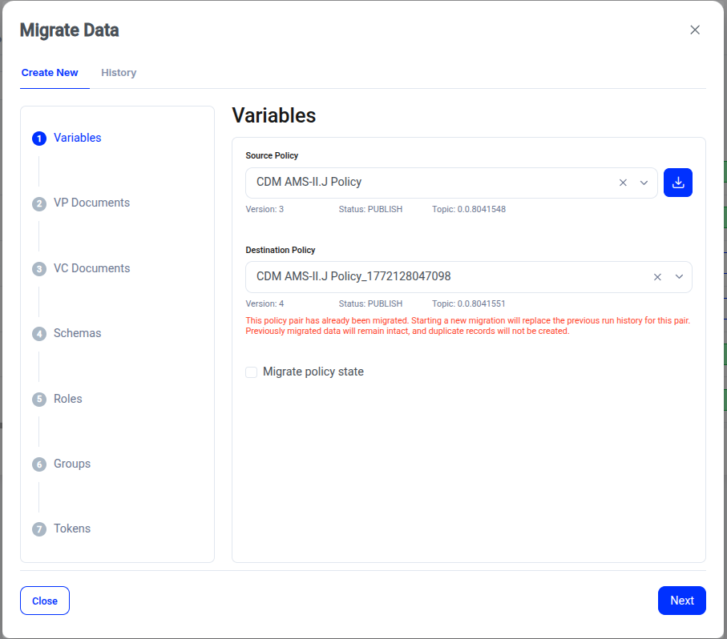

# Live Project Data Migration UI

1. [Step By Step Process](live-project-data-migration-ui.md#id-1.-step-by-step-process)
2. [Demo Video](live-project-data-migration-ui.md#id-2.-demo-video)

## 1. Step By Step Process

## 1. Exporting Policy Data

Data migration feature allows transfer of some or all policy artefacts and/or state into another policy (on the same of different Guardian instance) by exporting into and then importing the .data file.

To perform export press ‘**Export policy data**’ option in the Policy menu.

The operation is available for dry-run and published policies.

<figure><figcaption></figcaption></figure>

## 2. Importing/Exporting Keys for Dry Run Policies

To export/import virtual users’ keys and DID documents for dry-run policies press the corresponding ‘**Export virtual keys**’ or ‘**Import virtual keys**’ menu options.

They can be imported into another dry-run policy, where data was migrated from the current policy.

<figure><figcaption></figcaption></figure>

## 3. Migrating Policy State to Destination Policy

If Policy state flag is set in the ‘**Migrate Data**’ dialog, the entire policy state gets migrated into the destination policy.

This includes block states - steps, timers, multi-signs, split documents, aggregate documents, etc...

To get information about different steps in the below migration process screen, please refer to [Migration Process](../discontinuing-policy-workflow/apis-related-to-discontinuing-policy-workflow/migratepolicy-data.md)

<figure><figcaption></figcaption></figure>

## 4. Migrate Retire Pools

When ‘Migrate retire pools’ flag is selected, the migration process will re-create all selected existing retirement pools, from all contracts created by the ‘current’ instance, in the new retirement contract. The UI allows the user to map policy tokens and select the new retire contract.

<figure><figcaption></figcaption></figure>

## 5. Change VC Document during Migration

We have added ability to change VC which will be migrated by clicking on "**Edit document**" button under operations column:

<figure><figcaption></figcaption></figure>

<figure><figcaption></figcaption></figure>

When state migration is selected block mapping could be used to optimize the migrations.

<figure><figcaption></figcaption></figure>

For Policies with dynamic tokens mapping of token templates might be required.

<figure><figcaption></figcaption></figure>

## 6. Rerunning Migration

**Re-running migration for the same policy pair**

Even if migration for the selected Source Policy → Destination Policy pair was already executed, you can start a new migration with a new configuration.

* Previously migrated records will not be migrated again (deduplication/idempotency).
* Starting a new migration replaces the previous run history for this policy pair.
* As a result, you cannot resume the previous run if it was stopped or not completed.

Concurrent migration limitation:

You cannot start a new migration while another migration is already running.

* Wait until the current migration finishes.
* After that, you can start a new one.

<figure><figcaption></figcaption></figure>

### History

The History tab shows previously started migration runs and their statistics:

* Source Policy / Destination Policy — migration policy pair
* Total — total number of items in the run
* Failed — failed items (and percentage)
* Succeeded — percentage of successfully processed items

#### Resume

If a migration was stopped or interrupted (for example, due to a service restart), you can continue it from the same point using Resume.

#### Retry Failed Data

If some items failed, you can retry only the failed items using Retry Failed Data.

Failures may be caused not only by transient issues, but also by incorrect migration configuration mapping (Schemas/Roles/Groups/Tokens/Blocks).\
If the issue is configuration-related, start a new migration with an updated configuration.

<figure><figcaption></figcaption></figure>

## 2. Demo Video

[Youtube](https://youtu.be/stSudc82pZU?si=Nsv6RyM6I_NpRvwE\&t=110)
