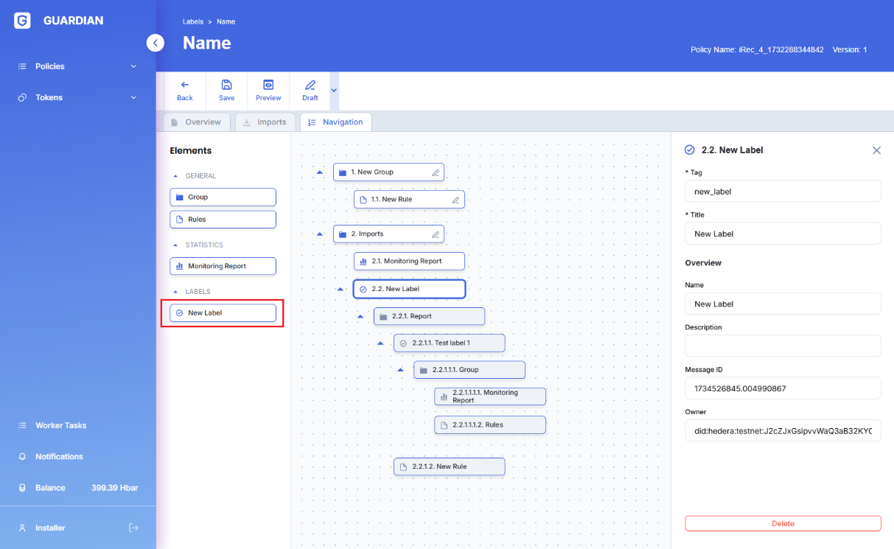

# Mobile operation for the Standard Registry

### **Creation of a new account**

The first adaptation relates to the redesign of the creation of new accounts. This redesign for mobile solves the overflow previously present while still maintaining the descriptions.

Here the images below show the selection of account type and selection of username and password in order to create a new account.

\
.png>).png>)

&#x20;

### New header for mobile

The header was also adapted for mobile for all types of users. The balance was maintained as one of the elements always present. The new header for mobile, these elements are always present.

The various menus and submenus (in case there are any) have been moved upon clicking on the hamburger menu, presenting the user with the following.

Also some information about the user is also presented, such as the name of the user (in this case "user1234") and his respective Hedera ID and HBar balance.

### Standard Registry first registration into Guardian

Some screens for the Standard Registry were also adapted, starting with the registration into Guardian after creating a username and password and also the mobile adaptation to associate Hedera credentials and initial form upon creating an account.

### Standard Registry creating / editing a token

Among the adaptations for the Standard Registry, the creation / edition of a new token was also added.

Below are the images show the creation of a "New Token" form for the Standard Registry.

.png>)

Here below are the images show the creation of a "Edit Token" form for the Standard Registry. On the left for a non published and on the right for a published token.

### Standard Registry importing policies flow (from IPFS)

The importing of policies was also adapted from the click on the "Import" button under the "Policies" menu, up until the preview of the policy the User is about to import.

.png>)

Below you can see the preview of the imported policy&#x20;

### Standard Registry publishing a draft of a policy

Finally, the publishing of a draft policy, defining its version, was also adapted.
