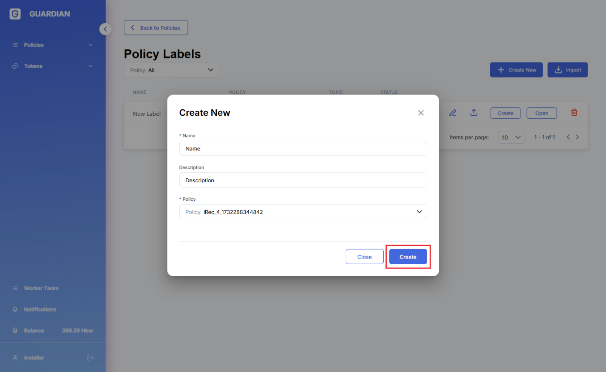

# 💻 User Guide

### 1. Icon & Tooltip :

Added notification icon and also tooltip with count of unread notifications:

### 2. View :

By clicking on notification button, users can view new notifications or the status of active long-running processes:

### 3. Marking all the unread notifications as Read :

Unread notifications are automatically marked as ‘read’ after viewing, alternatively users can remove the ‘unread’ status from all notifications manually by clicking on “Mark all as read”.

### 4. View Details :

Users can see the details of the status or progresses of the recent processes by clicking on “View”/”View details”

### 5. View All Notifications :

Users can see old notifications by clicking on “”View all notifications”. On the notifications status  grid, we can perform two operations on the notification: “Delete up to this point” and “Open”.

1. Policy definitions can now use new Notification block. Users can configure the message, title and type (ERROR, SUCCESS, INFO, WARN), link notification to policy (policy will be opened by clicking on notification), and User (ALL,CURRENT,POLICY\_OWNER,DOCUMENT\_OWNER,DOCUMENT\_ISSUER,GROUP\_OWNER,ROLE). If User == “ROLE”, users can setup appropriate role and also mark it as “Only for current user group”

