# Dry Run Mode using UI

1. [Step By Step Process](demo-guide-on-dry-run-operations.md#id-1.-step-by-step-process)
2. [Demo Video](demo-guide-on-dry-run-operations.md#id-2.-demo-video)

## 1. Step By Step Process

In this mode of operation all artifacts (files, documents and transactions) that are produced in the course of execution of the policy are stored in the local database but not sent out to Hedera or IPFS. The artifacts are stored in the database in a separate table specific for the ‘dry run’ mode. This also allows the trial for executing the workflow without real accounts.

### 1. Starting Dry Run Mode

There are different ways to start the Dry Run Mode after importing Policy.

#### 1.1 From the Policies Page

When the Policy is imported, its in Draft status by default. This status can be seen in the Status/Actions column. To change the Draft status to Dry Run status, click on the drop down arrow and select **Dry Run** option.

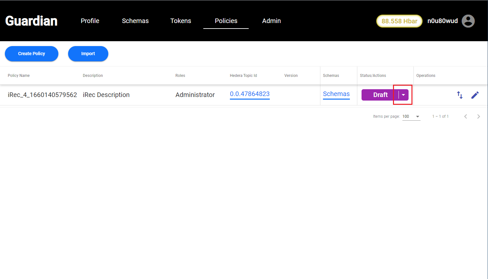

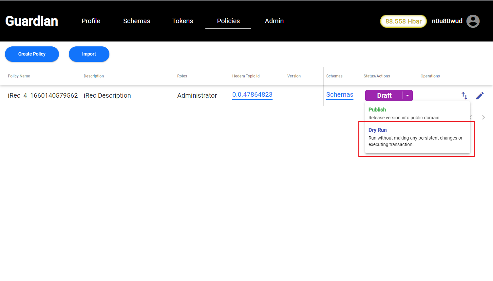

#### 1.2 From Policy Configurator Page:

When imported Policy is opened for editing, there's an option of changing the Policy status from Draft to Dry Run. The Dry Run option can be selected by clicking on drop down arrow and selecting **Dry Run** option as shown below:

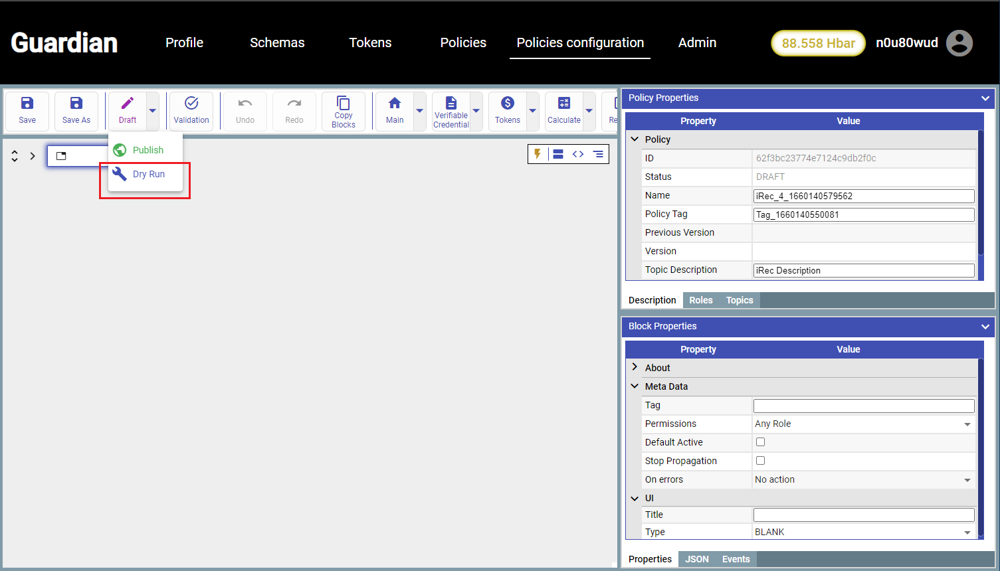

#### 1.3 By calling the API

Dry Run mode can be started by calling the following API:

```
PUT: /api/v1/policies/{policyId}/dry-run
```

To get complete information on the above API, please check : [#dry-run-policy](dry-run-mode-using-apis/running-policy-without-making-any-changes.md#dry-run-policy "mention")

### 2. Exit Dry Run and return to Draft status

There are different ways to exit from Dry Run to Draft mode.

#### 2.1 From the Policies Page

Policy, which are in the Dry Run status, can be changed to Draft/Publish state by selecting respective option from the drop down arrow. To change the Policy status to Draft, please select **Stop** option and to change the Policy status to Publish, please select **Publish** option.

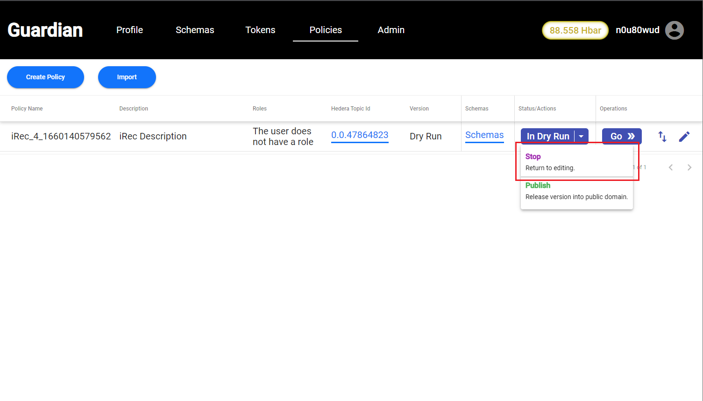

#### 2.2 From the Policy Configurator Page

Policy status can be changed from Dry Run to Draft/Publish by selecting from the drop down option in Policy Configurator Page.


#### 2.3 By calling the API

Dry Run mode can be exited to Draft status by calling following API:

```
PUT: /api/v1/policies/{policyId}/draft
```

To get complete information on the above API, please check : [#return-policy-to-editing](dry-run-mode-using-apis/returning-policy-to-editing.md#return-policy-to-editing "mention")

### 3. Opening of a running Policy in Dry Run mode

There are two ways to open the Policy in Dry Run mode:

#### 3.1 From the Policies Page

To open the Policy in Dry Run mode, click on a **Go** button in the Operation column.

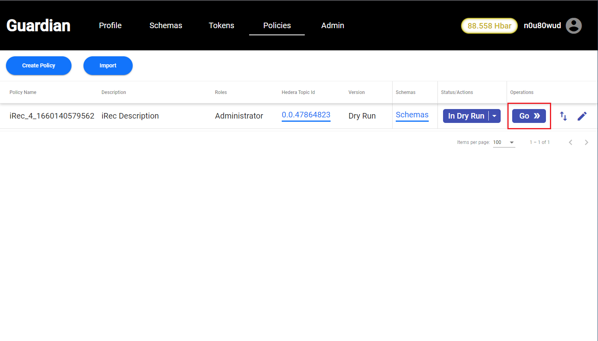

#### 3.2 From the Policy Configurator Page

There's a **Go** option in Policy Configurator page to view the Policy in Dry Run mode.

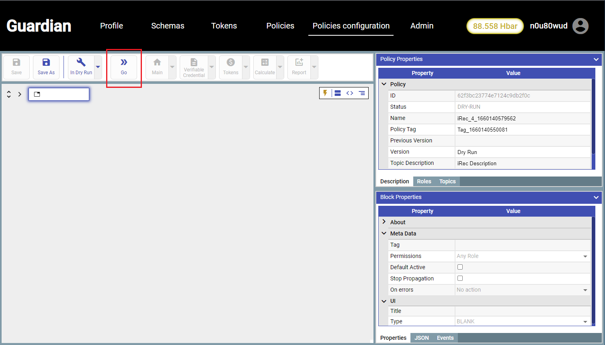

### 4. Policy Instance

#### 4.1 View Config

This option is used to navigate back to the Policy Configurator page to edit the Policy in Dry Run mode.

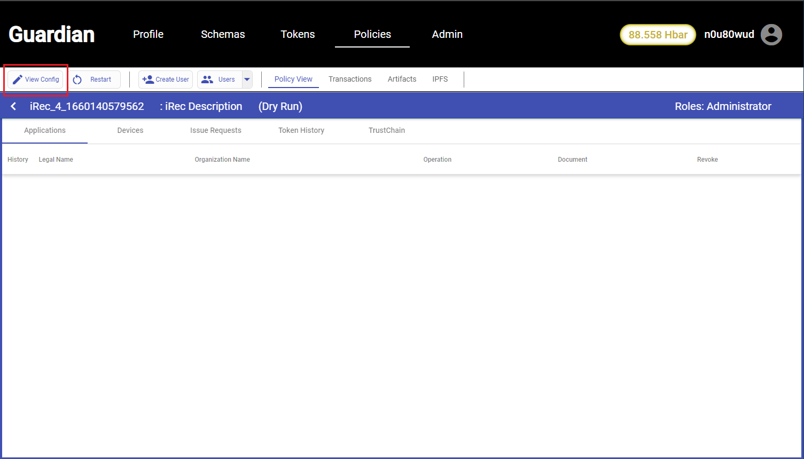

#### 4.2 Restart

Restart is used to reset the state of the Policy by removing all the records for the previous ‘Dry Run’ of the Policy. It can be performed by different ways:

#### 4.2.1 From Policy View Page

By clicking on **Restart** button, which is located beside View Config.

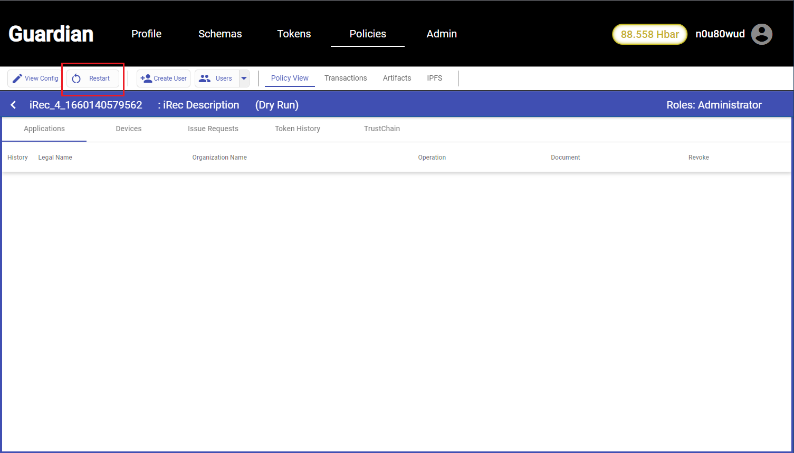

#### 4.2.2 By calling the API

Restart can also be performed by calling the following API:

```
POST: /api/v1/policies/{policyId}/dry-run/restart
```

To get complete information on above API, please check :[#restarts-the-execution-of-the-policy](dry-run-mode-using-apis/restarting-the-execution-of-policy.md#restarts-the-execution-of-the-policy "mention")

#### 4.3 Create User

The system provides a facility for the creation of ‘virtual’ users to enable the ‘Dry Run’ execution flow.

#### 4.3.1 From the Policy View Page

Virtual User can be created by clicking on **Create User** button as shown below:

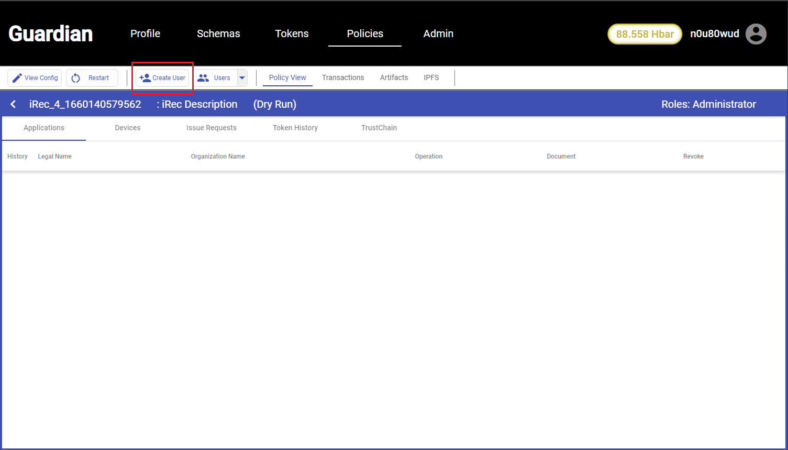

#### 4.3.2 By calling an API

Virtual User for Dry Run can also be created by calling following API:

```
POST: /api/v1/policies/{policyId}/dry-run/user
```

To get complete information on the above API, please check : [#create-a-new-virtual-account](dry-run-mode-using-apis/creating-virtual-account.md#create-a-new-virtual-account "mention")

#### 4.4 Users

Allows to switch between virtual accounts of users. For a single policy in the ‘Dry Run’ mode a Standard Registry can be operating as a single (virtual) user at any point in time. This is enforced on the server.

Virtual user can be selected in multiple ways:

#### 4.4.1 From the Policy View Page

Virtual user can be selected by clicking on respective users in the drop down list as shown below:

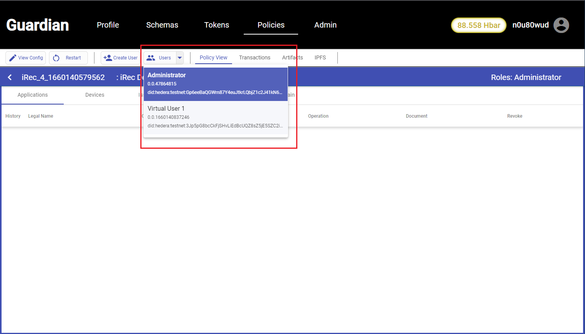

#### 4.4.2 By calling the API

Virtual user also can be selected by calling the following API:

```
POST: /api/v1/policies/{policyId}/dry-run/login
```

To get complete information on above API, please check : [#logs-virtual-user-into-the-system](dry-run-mode-using-apis/logging-virtual-user.md#logs-virtual-user-into-the-system "mention")

#### 4.5 Policy View

This option is used to view complete Policy with its tabs in it.


#### 4.6 Transactions

This tab shows the list of mock transactions performed as part of the execution of the policy. These transactions do not actually get executed, they will be performed when the policy runs in the production mode. These transaction records only exist in the local database.

These transactions can be viewed in different ways:

#### 4.6.1 From the Policy View Page

All the transactions can be viewed by clicking on **Transactions** tab as shown below:

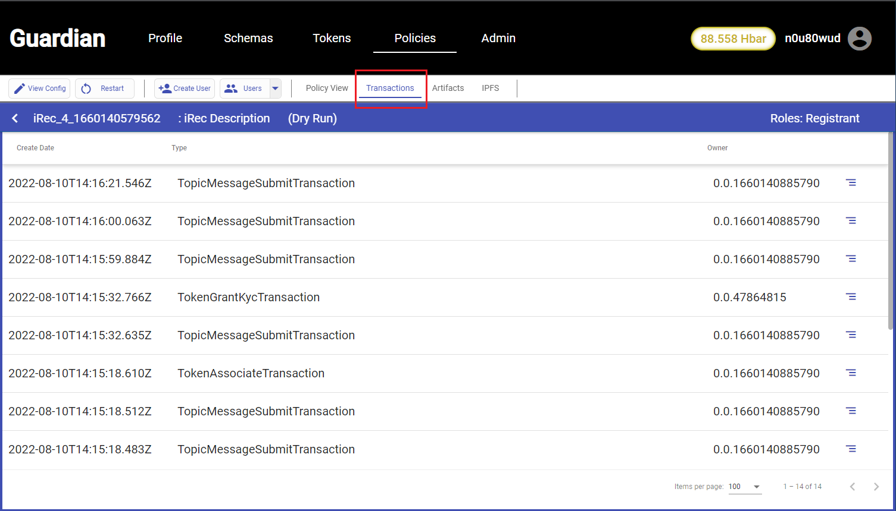

#### 4.6.2 By calling an API

Transactions can also be viewed by calling the following API:

```
GET: /api/v1/policies/{policyId}/dry-run/transactions?pageIndex=0&pageSize=100
```

To get more information on the above API, please check:[#returns-lists-of-virtual-transactions](dry-run-mode-using-apis/returns-list-of-transactions.md#returns-lists-of-virtual-transactions "mention")

#### 4.7 Artifacts

This tab contains the list of documents created during the execution of the Policy.

These Artifacts can be viewed in different ways:

#### 4.7.1 From Policy View Page

All the Artifacts can be viewed by clicking on **Artifacts** option as shown below:

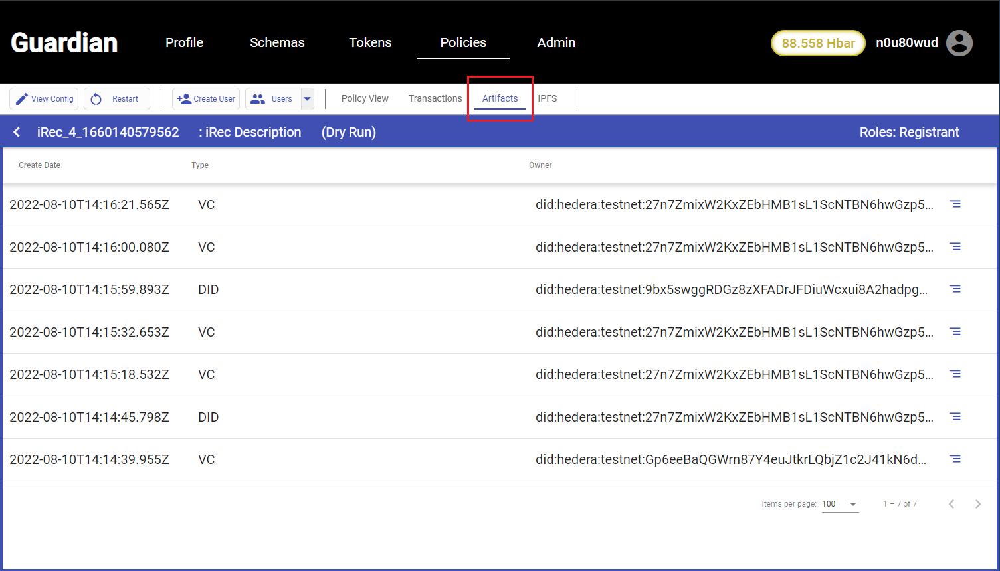

#### 4.7.2 By calling an API

We can also view Artifacts list by calling the following API:

```
GET: /api/v1/policies/{policyId}/dry-run/artifacts?pageIndex=0&pageSize=100
```

To get complete information on the above API, please check : [#returns-lists-of-virtual-artifacts](dry-run-mode-using-apis/returns-list-of-artifacts.md#returns-lists-of-virtual-artifacts "mention")

#### 4.8 IPFS

This tab shows the list of files that would have been saved in IPFS during the execution of the policy. In ‘Dry Run’ these files are not exported into IPFS and only exist in the local database.

There are different ways to view the list of files:

#### 4.8.1 From the Policy View Page

To view the list of the files, that will be stored in IPFS, click on **IPFS** option as shown below:

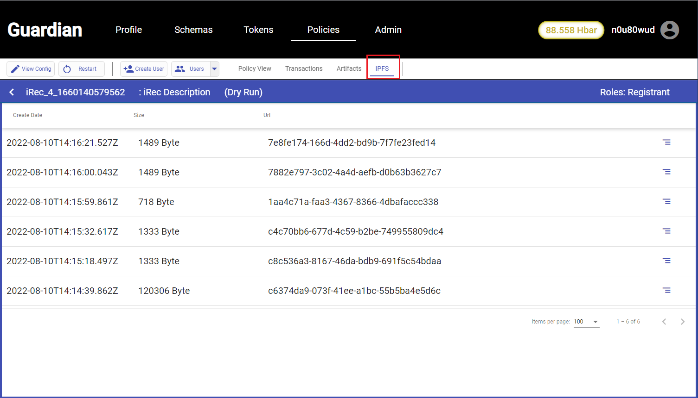

#### 4.8.2 By calling an API

The IPFS files list can also be viewed by calling the following API:

```
GET: /api/v1/policies/{policyId}/dry-run/ipfs?pageIndex=0&pageSize=100
```

To get complete information on above API, please check : [#returns-lists-of-ipfs-files.](dry-run-mode-using-apis/returns-list-of-ipfs-files.md#returns-lists-of-ipfs-files. "mention")

#### 4.9 Savepoint

Savepoint will allow to mark any of the action in the dry run as savepoint, which can restored from that point. This feature is similar to adding checkpoints in the execution workflow.

<figure><figcaption></figcaption></figure>

<figure><figcaption></figcaption></figure>

## 2. Demo Video

[Youtube](https://www.youtube.com/watch?v=fLoQcCOBgfU\&t=115s)
