# Data input via Forms, using Roles to partition user activities.

For a demo example of following steps, here is the policy timestamp: **1675164605.096601003**

## **Objective**

Construct a policy in which one group of users can individually fill in and submit documents for approval and view their own documents’ status, and another group of users can view and take approve/reject actions on any of these user documents.

## **Approach**

1. Assign ‘User’ and ‘Approver’ roles to users to partition them into groups where one can fill in forms and send resulting documents to approvals, and the other group would ‘approve/reject’ these documents.
2. Create schema and necessary policy elements to enable ‘form-filling in and submission’ and ‘approval’ workflows.

## **Preparation**

Create 3 containers which will be responsible for choosing a role, submission and approval documents correspondingly.

Assign these containers to appropriate Permissions: ‘no\_role’, ‘User’, or ‘Approver’, and add the first containers into the **RoleSelectionBlock**.

See detailed information about the Roles in [Example 1](creating-and-using-roles.md).

 (1) (1).png>)

## **Main section**

### **Creating the document**

#### 1. Create a schema for Policy data input

1.1 Go to ‘Schemas’ tab and create a new schema

 (1) (1) (1) (1) (1) (1) (1) (1) (1).png>)

1.2 To make sure there is some demo/test data content in this schema create 3 fields:

* **Organization name** of type ‘String’
* **Start Date** of type ‘Date’
* **End Date** of type ‘Date’
* **Amount** of type ‘Number to represent the amount of CO2 emissions for the time period (between the ‘Start Date’ and ‘End Date’)

.png>)

#### 2. To perform data input into the Policy the ‘**requestVcDocumentBlock**’ will be used

2.1 Since the scope of this example includes input of multiple documents the Policy requires logic similar to what is known as ‘loop’ or ‘iteration’.

For this ‘**interfaceStepBlock**’ is required with ‘**Cyclic**’ option enabled. This will allow to return to the initial state after the document was saved.

 (1) (1) (1) (1) (1) (1) (1) (1) (1).png>)

2.2 Add ‘**requestVcDocumentBlock**’ into the ‘_cyclic\_container_’

 (1) (1) (1) (1) (1) (1) (1) (1) (1).png>)

2.3 Then select the previously created Schema

 (1) (1) (1) (1) (1) (1) (1) (1) (1).png>)

2.4 Select ‘New UUID’ to configure automatic generation of unique IDs for each document

 (1) (1) (1) (1) (1) (1) (1) (1).png>)

2.5 By default ‘**requestVcDocumentBlock**’ is displayed as a Form covering the entire page. To prevent this choose ‘**DIALOG**’ value for the field ‘Type’.

 (1) (1) (1).png>)

#### 3. Save documents in the Database.

3.1 Add ‘**sendToGuardianBlock**’ into the container ‘_cyclic\_container’_ immediately after ‘_create\_new\_document’_

 (1) (1) (1) (1) (1) (1) (1) (1).png>)

3.2 Select data type and where to store the document

 (1) (1) (1) (1) (1) (1) (1).png>)

3.3 Create appropriate attributes to capture/store document status

Add ‘Status’ attribute and set the initial ‘New’ value for new documents

 (1) (1) (1) (1) (1) (1) (1).png>)

### **Displaying the documents**

1. To display documents ‘**interfaceDocumentsSourceBlock**_’ is used_

1.1 Add ’**interfaceDocumentsSourceBlock**_’_ into the ‘**user\_roles**_’_ container

 (1) (1).png>)

1.2 Specify the needed columns, their titles and where the values will be taken for display

.png>)

1.3 To retrieve the data from the database ’**documentsSourceAddon**_’ block is used_

1.3.1 Add ‘**documentsSourceAddon**_’ to the_ ‘**user\_grid**_’_

 (1) (1).png>)

1.3.2 Select where to retrieve the documents from

 (1) (1) (1) (1) (1) (1) (1).png>)

1.3.3 Select the schema upon which the selected documents should be based on

.png>)

1.3.4 Select _‘_**Owned by User**_’_ checkbox which would filter in only the documents that are created by this user (this will disable the ability to view other documents)

 (1) (1) (1) (1) (1) (1) (1) (1) (1).png>)

### **Approving the documents**

1. To display documents ‘**interfaceDocumentsSourceBlock**_’ is used_

1.1 As in the previous section we added ‘**interfaceDocumentsSourceBlock**_’_ and configured displayed columns

1.2 Add additional column which would contain the ‘**Approve**’ button

.png>)

1.3 Since the Approve button should be displayed only for new documents use two ‘**documentSourceAddon**’ block

 (2) (1).png>)

Configure both ‘**documentSourceAddon**’ blocks similarly to how it was in the previous sections, except here do not select the ‘_Owned by User_’ checkbox to allow the Approvers to see all documents (created by all users)

1.4 Separate the documents by status by means of creating the corresponding filters

 (1) (1) (1) (1) (1) (1).png>)

.png>)

2. To enable actions (in this example ‘Approve’ and ‘Reject’) the ‘**buttonBlock**’ block is used.

2.1 Best practice is to wrap the ‘**buttonBlock**’ block in a container

Switch off the ‘Default Active’ option to avoid specifying the button as an independent element and hide it

<figure>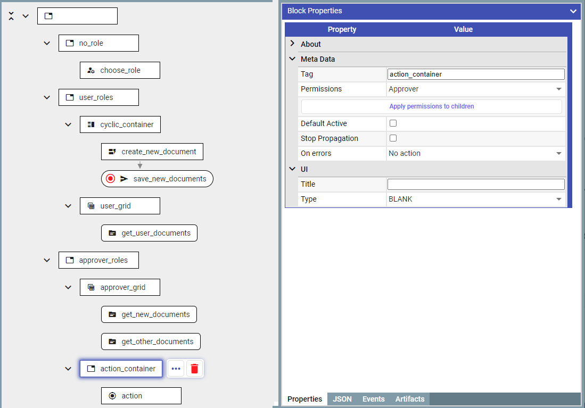<figcaption></figcaption></figure>

2.2 Create 2 buttons for ‘Approve’ and ‘Reject’ correspondingly.

<figure>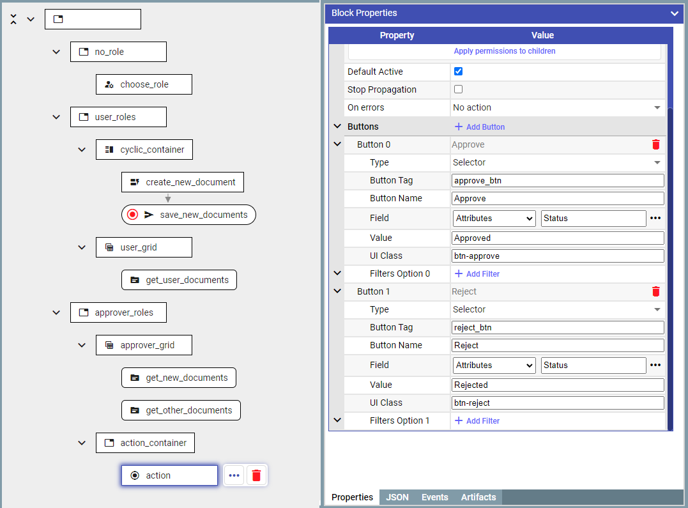<figcaption></figcaption></figure>

2.3 ‘**buttonBlock**’ is responsible only for the actions, in order to save the refreshed status of the documents.

Create 2 ‘**sendToGuardianBlock**’ blocks with the corresponding values for the ‘Status’.

<figure>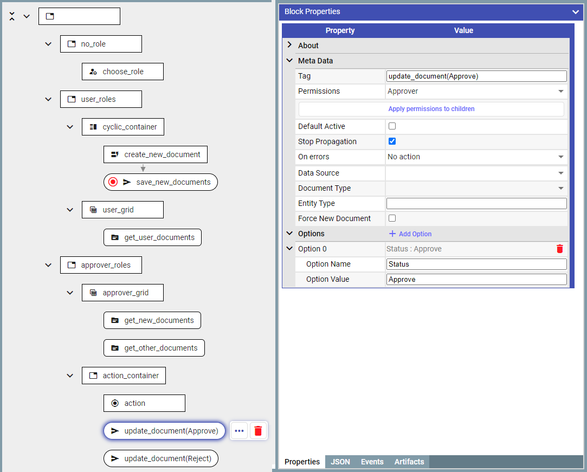<figcaption></figcaption></figure>

2.4 By default blocks are always directly connected to the next block (just below it). To decouple the blocks select ‘**Events**’ tab and switch off the default events for both blocks.

<figure>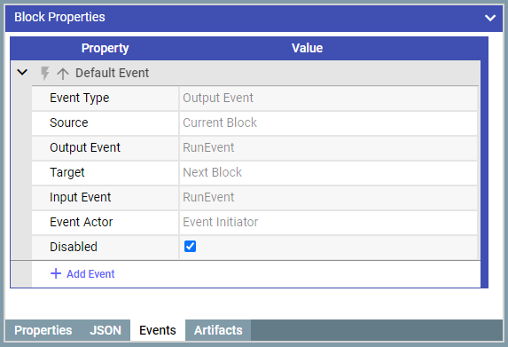<figcaption></figcaption></figure>

2.5 Connect events from the ‘**buttonBlock**’ with the corresponding ‘**sendToGuardianBlock**_’_ by selecting the _Events_ tab and create 2 new events.

<figure>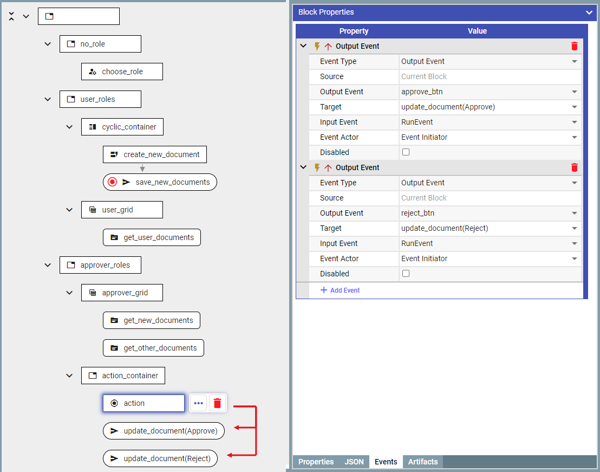<figcaption></figcaption></figure>

3. Return to the grid settings and add the created buttons into the previously prepared column

3.1 Set ‘_Type’_ to ‘BLOCK’

3.2 Set ‘_Bind Block_’ to the block which we can place into the column

3.3 In order to display the buttons for only new documents set the corresponding value for the ‘_Bind Group'_

<figure>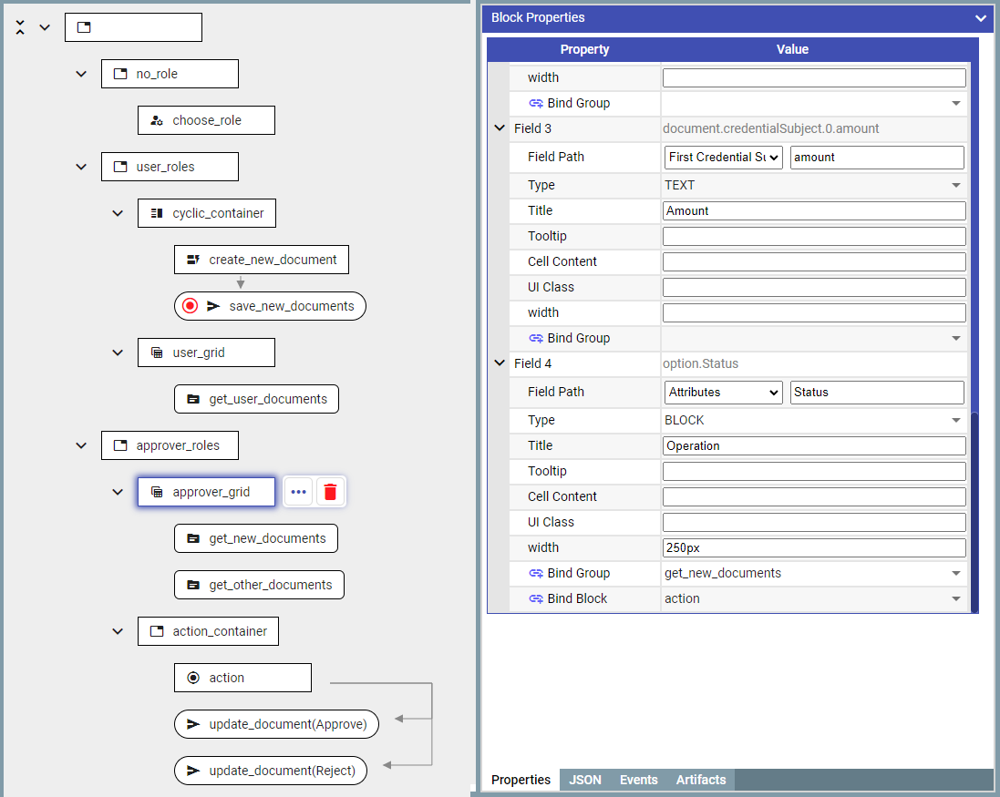<figcaption></figcaption></figure>

## Result

### 1. Choose a role

<figure>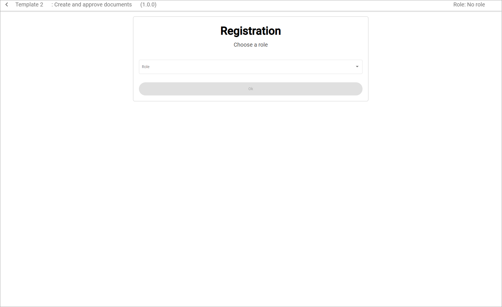<figcaption></figcaption></figure>

### 2. Create new document

<figure>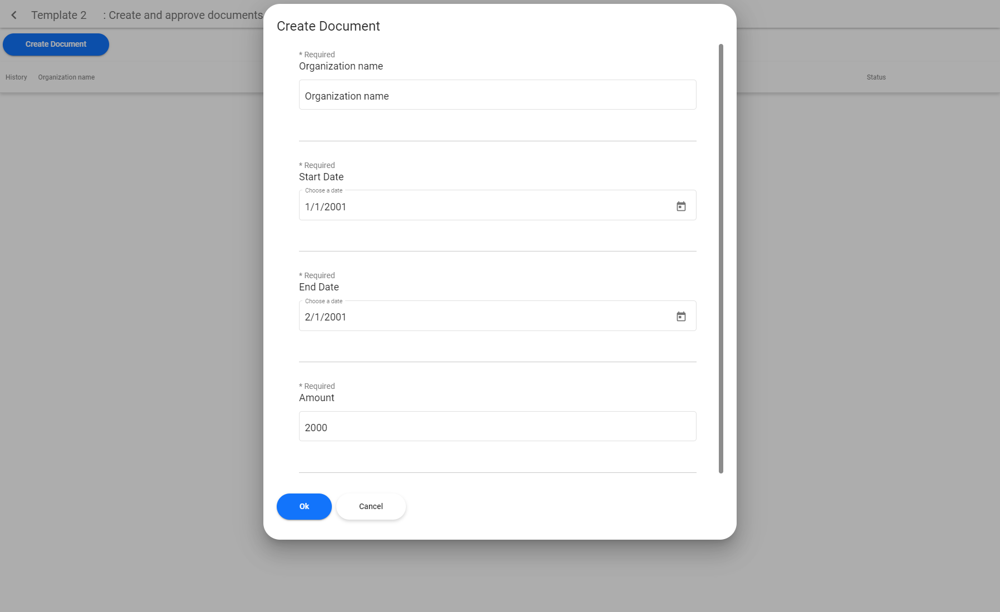<figcaption></figcaption></figure>

<figure>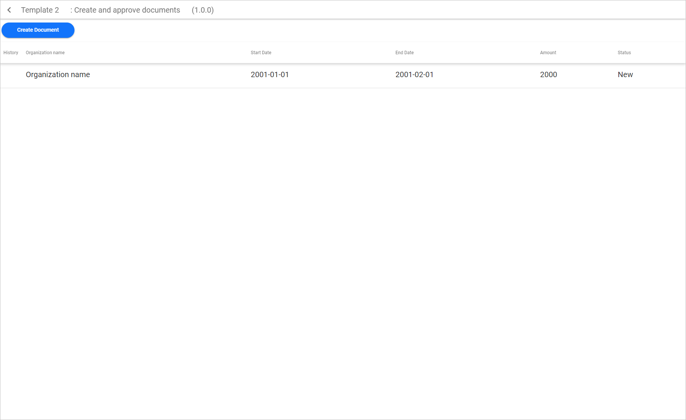<figcaption></figcaption></figure>

### 3. Approve

<figure>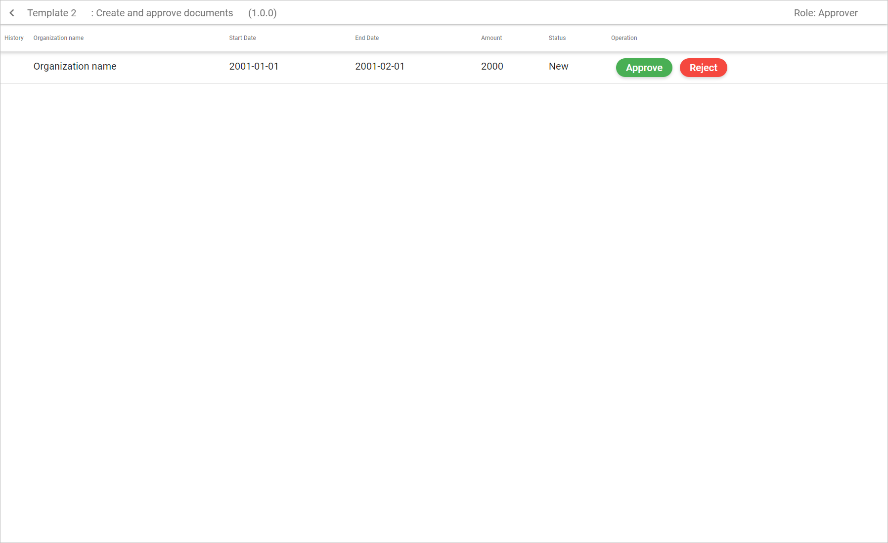<figcaption></figcaption></figure>

<figure>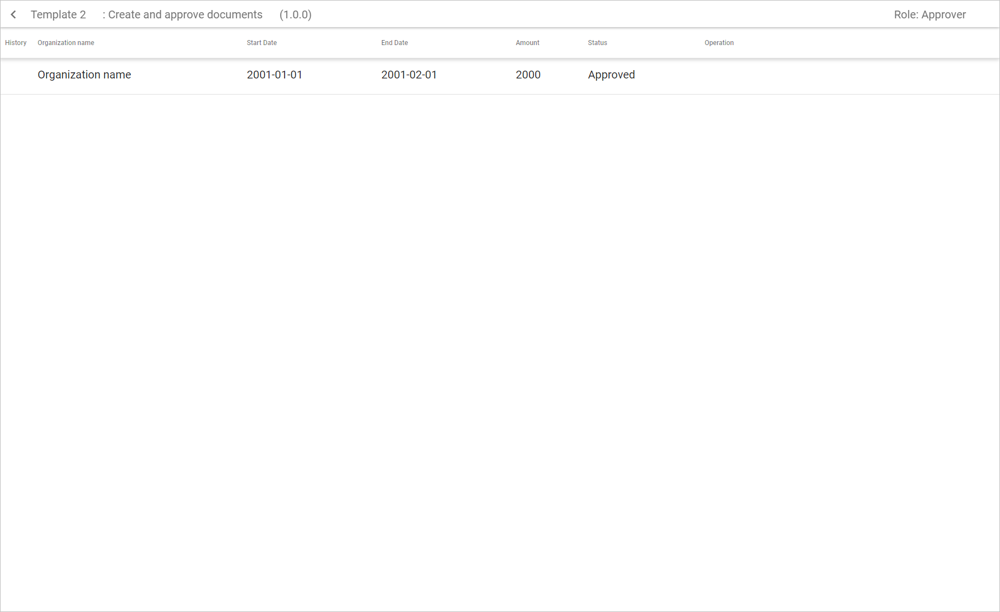<figcaption></figcaption></figure>
