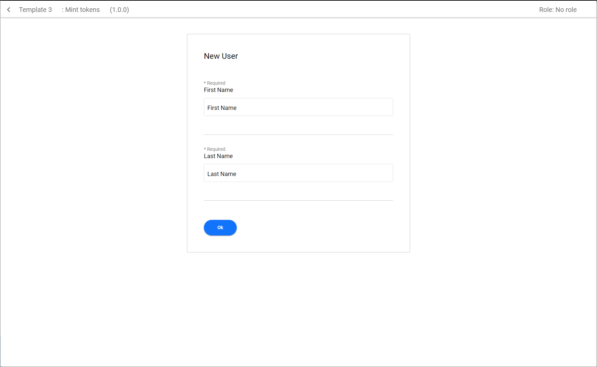
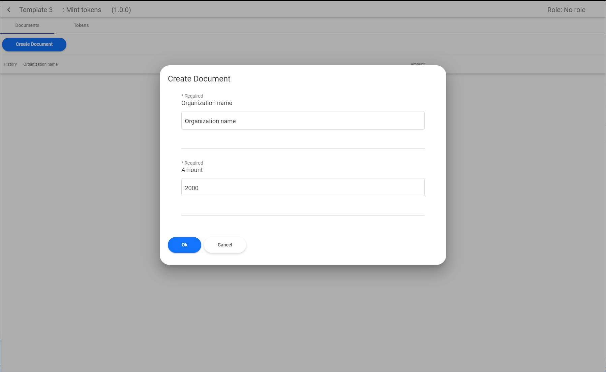
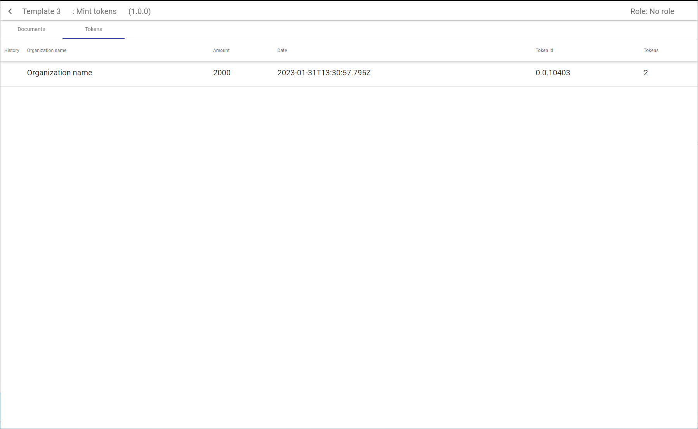

# 🪙 Token Operations

For a demo example of following steps, here is the policy timestamp: **1675164687.693099003**

## **Task Summary**

Create a token with which newly registered users would be automatically linked. After the registration these users would be able to create documents which would be used for minting tokens at the rate of 1 token to 1000 units of value in the document.

## **Preparation**

First step in the execution of the policy would be user registration. To enable this we will create a corresponding schema which would contain ‘**First name**_’ and ‘_**Last name**_’_ fields.

Second step of policy execution is data input and document submission. To enable this we will create a corresponding schema containing ‘**Organization name**_’_ and ‘**Amount’** fields

To enable document submission we will use document input block (**requestVcDocumentBlock**) and document persistence block (**sendToGuardianBlock**)

 (1) (1).png>)

**Please see** [**example 2**](data-input-via-forms-using-roles-to-partition-user-activities..md) **for the more in-depth guide of working with documents in Guardian Policies.**

### **Token operations**

1. Create a token instances of which will be minted.

Switch to the ‘**Tokens**’ tab and create a new token

.png>)

2. Please note we created a token with ‘_KYC’_ flag as ‘on’. This imposes the requirement to perform a KYC action on users before they can receive the token:

2.1 Link the token to the user via the ‘**tokenActionBlock**_**'**_

2.1.1 Add ‘**tokenActionBlock**_**’**_ immediately after the user registration

 (1).png>)

2.1.2 Select token and action type

 (1) (1).png>)

2.2 Set user KYC

2.2.1 Add ‘_**tokenActionBlock’**_ immediately after ‘_token\_associate’_

 (1) (1).png>)

2.2.2 Select token and the action type

 (1).png>)

3. User ‘**tokenActionBlock**_**’**_ to mint tokens

3.1 Add ‘**mintDocumentBlock**_**’**_ immediately after saving the new document (**save\_new\_documents**)

 (2).png>)

3.2 Select token which will be minted

 (1).png>)

3.3 Configure the formula which would define the amount of tokens minted

 (1).png>)

3.4 Configure the account where tokens will be sent to upon minting

 (1).png>)

### **Document Display**

1. To show documents use ‘**interfaceDocumentsSourceBlock**_**'**_

1.1 Add a new container in which the grid containing results would be placed

 (1).png>)

1.2 Ensure that ‘_documents’ and ‘tokens’ are displayed in separate tabs_

1.2.1 In the parent block set property ‘**Type’** to ‘Tabs’

 (1).png>)

1.2.2 Set the property ‘**Title’** to configure tab titles

1.3 Add **‘interfaceDocumentsSourceBlock**_**’** into the ‘_tokens_’_ container and configure its columns

 (1).png>)

1.4 Use ‘_**documentsSourceAddon’**_ block to retrieve data from the database.

 (2).png>)

## **Result:**

### Create User

<figure><figcaption></figcaption></figure>

### Create Project

<figure><figcaption></figcaption></figure>

### Mint Token

<figure><figcaption></figcaption></figure>
