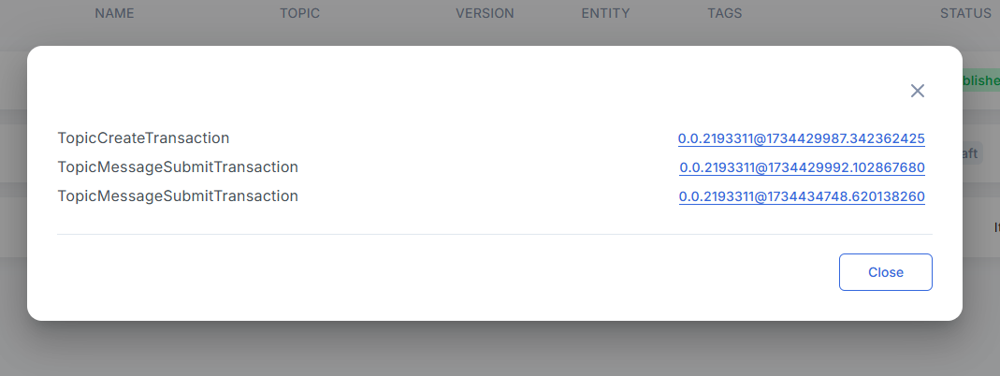
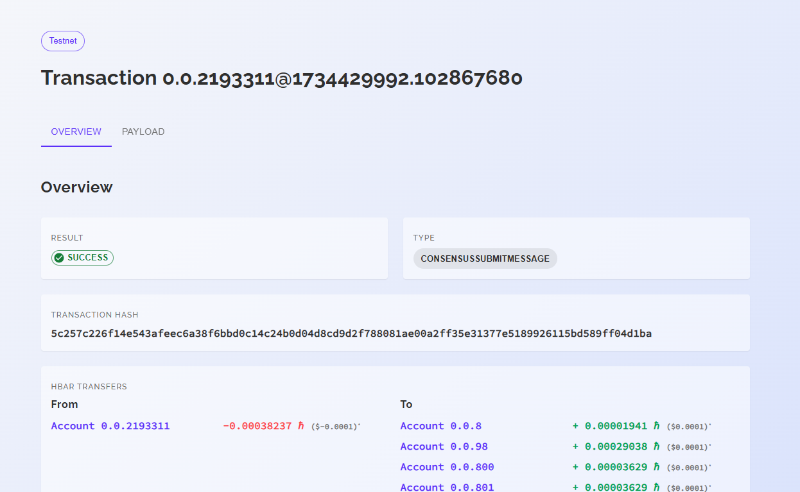

# 💻 Module Differentiation using UI

## 1. **Modules differentiation**

To compare the modules, click on Compare button in the Modules page as shown below:

.png>)

Once, compare button is clicked, we need to select the first and second modules to compare:

### 1.1 Result of comparison:

<figure><figcaption></figcaption></figure>

#### **1.1.1 Params**

1. “_**Events**_” – configures how differences in Events impact block comparison logic
   * “_**Don't compare**_” – event differences do not have effect on the block comparison
   * “_**All events**_” – event differences contributed to the decision of block comparison
2. “_**Properties**_” – configures how differences in Properties impact block comparison logic
   * “_**Don't compare**_” – Properties comparison results do not have any effect on the block comparison logic. (Only tag and block type are impactful for comparison).
   * “_**Only simple properties**_” – only simple Properties impact block comparison results
   * “_**All properties**_” – all Properties at all layers impact block comparison results
3. “_**Children**_” – configures if/how child blocks impact the comparison of the parent blocks
   * “_**Don't compare**_” – differences in child blocks do not impact the comparison results of the parent blocks
   * “_**Only child blocks of the first level**_” – only immediate children differences impact the comparison results of the parent blocks
   * “_**All children**_” – comparison results of all children in all layers are impactful on the results of the parent block comparison
4. “_**UUID**_” – configures if/how UUID and Hedera ID impact the comparison of the blocks
   * “_**Don't compare**_” – differences in UUID and Hedera ID (of schemas, tokens, topics, etc) do not impact the comparison results of the blocks.
   * “_**All UUID**_” – differences in UUID and Hedera ID are included in the comparison. When this option is enabled, for example, 2 tokens would be considered to be different even if their settings are absolutely the same. This is because their Hedera Token IDs would be different_._

#### **1.2.2 Sections**

1. “_**Description**_” – module description
2. “_**Module Blocks**_” – comparison results for the block structures
3. _**“Input Events”**_ – comparison results for the incoming events
4. _**“Output Events”**_ – comparison results for the outgoing events

**Color legend **_**–**_ the mapping of the meaning/description of available block colors with the ability to switch on/off types

1. “_**Green**_” – blocks are identical, including their child blocks
2. “_**Green/Yellow**_” – blocks are identical, but the child blocks have differences
3. “_**Yellow**_” – blocks are partially identical
4. “_**Red**_” – no matching blocks found

Block comparison structure can be expanded to view the comparison of their Properties:

.png>)

*
  *
    1. **Формат данных**

POST: /analytics/compare/modules

Input:

{

"moduleId1":"63……..1d7c" – ID of the first module

"moduleId2":"63……..1d7c" – ID of the second module

"eventsLvl":"0" – depth (level) of Event comparison (0/1)

"propLvl":"0" – depth (level) of Properties comparison (0/1/2)

"childrenLvl":"0" – depth (level) of child block comparison (0/1/2)

"idLvl":"0" – depth (level) of uuid comparison (0/1)

}\

Output:

{

"left" – information about the first policy

"right " – information about the second policy

"blocks" – table with block comparison results

}

POST: /analytics/compare/modules/export?type=csv

Input:

{

"moduleId1":"63……..1d7c" – ID of the first module

"moduleId2":"63……..1d7c" – ID of the second module

"eventsLvl":"0" – depth (level) of Event comparison (0/1)

"propLvl":"0" – depth (level) of Properties comparison (0/1/2)

"childrenLvl":"0" – depth (level) of child block comparison (0/1/2)

"idLvl":"0" – depth (level) of uuid comparision (0/1)

}\

Output:

сsv file
