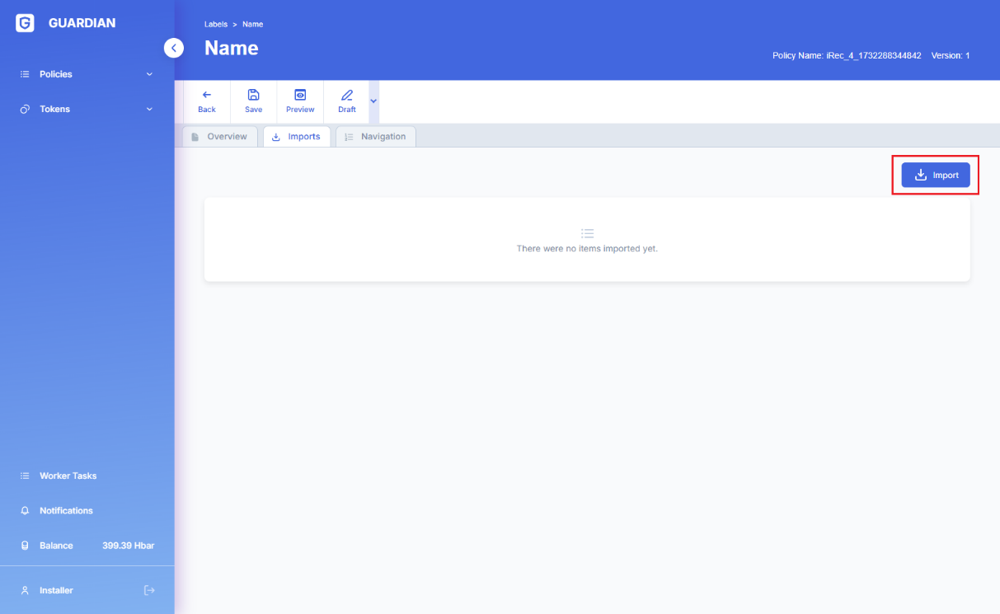
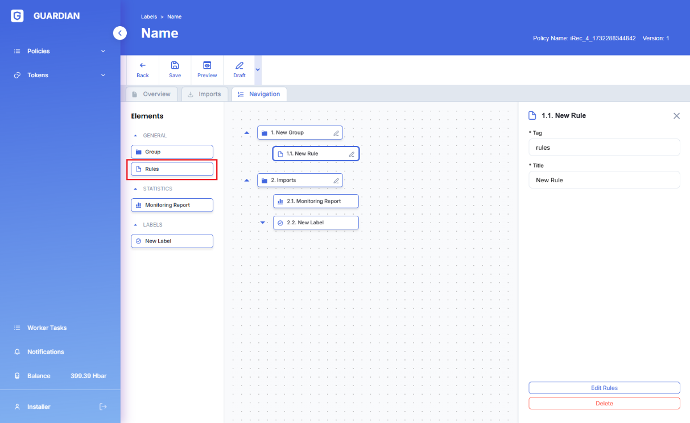

# Policy Labels UI

## **1. Permissions**

Access to Policy Labels functionality is controlled by the corresponding permissions settings.

<figure><figcaption></figcaption></figure>

## **2. Authoring Policy Labels**

### **2.1 Policy Labels view**

Users can review the list of existing labels and their statuses in the corresponding section of Guardian UI.

.png>)

### **2.2 Authoring**

A new Policy Label definition can be created by clicking on the ‘Create New’ button on the Policy Labels page.

.png>)

### **2.3 Configuration**

After the initial creation, Policy Label definitions must be configured further to be usable.

#### **2.3.1 Generic configuration**

Generic configuration of Policy Label definitions consists of name and description field. Label authors should configure meaningful names and descriptions for their labels as these are the attributes label users would rely on to understand the applicability of labels to their specific use-cases.

#### **2.3.2 Imports**

To include other published label definitions and statistics into the definition of a label being configured, these structural components must be imported into the context of the current label. Import operation links a parent label with the imported elements, which makes them available to the Label author in the side menu of the UI.

<figure><figcaption></figcaption></figure>

#### **2.3.3 Creating rules**

Label configurator consists of 3 sections

1\. Side menu, for displaying components which can be dragged-and-dropped into the label editor.

2\. Label editor, which hosts the components where they can be arranged into a hierarchical structure representing the evaluation logic.

3\. Component properties, which define specifics of the behavior of the individual components.

**2.3.3.1 Components: Groups**

Groups are components which define the general structure of Labels. Each group has its own name (title) in the navigation panel and represents a specific namespace in which components have access to each other's variables. Groups define sufficient validity conditions for the target documents.

**Configuration**

* **Tag** – the name of the namespace
* **Title** – title in the navigation panel
* **Rule** – defines the principle by which the group will be evaluated
  * **At least one** – the group is considered valid if at least 1 of the direct (immediate) child components is valid
  * **Every** – the group is considered valid if all direct (immediate) child components are valid

**2.3.3.2 Components: Rules**

Rules are defined in terms of variables, scores, formulas and conditions.

A Rule is considered ‘valid’ if all its conditions successfully verify for the set of provided data.

**Configuration**

* **Tag** – name of the namespace
* **Title** – title in the navigation panel

For components which are members of the same group, each component that is positioned below another component (i.e. ‘follows’ the prior component) has access to the variables of the previous component via its Tag.\\

**2.3.3.2.1 Editing Rules**

Rules can be edited in the corresponding area of the UI:

**Rules editor consists of 2 sections:**

1\. Schema hierarchy and content (fields) display, which allows users to find and select specific fields in schemas for use in the Label calculation/evaluation (see more detailed description in the Statistics documentation section) **.**

2\. Formula and Rules configurator (see more detailed description in the Statistics and Schema Rules documentation sections).

**Variables** (see more detailed description in the [Statistics and Schema Rules](../../usage-statistics/statistics.md) documentation sections).

**Scores** (see more detailed description in the [Statistics](../../usage-statistics/statistics.md) documentation section).

**Formulas (**&#x73;ee more detailed description in the [Statistics](../../usage-statistics/statistics.md) documentation section).

**Conditions** Formula and Rules configurator (see more detailed description in the [Schema Rules](../../schemas/schema-rules/) documentation section).

**2.3.3.3 Components: Statistics**

Existing Statistics can be used as components in Labels. As they don’t contain conditions they are always evaluated as valid when the Label which contains them is evaluated. Therefore, their primary function is to serve as data sources for other components in the Label, as their variables can be accessed directly by other components in the same namespace.

**2.3.3.4 Components: Labels**

Existing labels can be used as components of other (higher order) labels. The internal structure of such embedded labels remains unchanged.

**2.3.4 Saving**

It is recommended to frequently use ‘Save’ button to preserve the current state of the Label being edited.

<figure><figcaption></figcaption></figure>

**2.3.5 Preview**

Label authors can preview (i.e. ‘dry run’ test) their Label functioning once its definition is complete by clicking the ‘Preview’ button in the configurator UI. Such test evaluations require manual input of the test data.

<figure><figcaption></figcaption></figure>

<figure><figcaption></figcaption></figure>

<figure><figcaption></figcaption></figure>

<figure><figcaption></figcaption></figure>

Components which were successfully validated on the provided test data would be marked in green, the unsuccessful results are marked in red.


**Note**: Depending on the structure of the Label and the configuration of its rules it is not necessarily required for all Label components to be valid for the Label itself to be successfully validated. Groups can be configured such that some components do not validate, however the main top-level groups can be valid which is the main condition for Labels validity.


**2.3.6 Publishing**

To enable other users to find and use the Label it must be published.

<figure><figcaption></figcaption></figure>

### **2.4 Document Creation**

Once the Label has been published it can be used to create Label documents on specific token data.

<figure><figcaption></figcaption></figure>

**2.4.1 Targets**

The first step in the creation of a Label document is to select the target token (i.e. a VP document linked to the token).

<figure><figcaption></figcaption></figure>

**2.4.2 Label evaluation**

All steps defined in the Label evaluation flow must be followed.

<figure><figcaption></figcaption></figure>

**2.4.3 Results**

If a Label is evaluated as valid a corresponding document is created containing all Label information. This document can be published to make it accessible externally.

<figure><figcaption></figcaption></figure>

### **2.5 Viewing Label documents**

Existing Label documents can be accessed from the corresponding grid.

<figure><figcaption></figcaption></figure>

<figure><figcaption></figcaption></figure>

<figure><figcaption></figcaption></figure>

## **3. Labels Import\Export**

<figure><figcaption></figcaption></figure>

<figure><figcaption></figcaption></figure>

## **4. Indexer view**

### **4.1 Published Labels**

<figure><figcaption></figcaption></figure>

<figure><figcaption></figcaption></figure>

### **4.2 Published Label documents**

<figure><figcaption></figcaption></figure>

<figure><figcaption></figcaption></figure>

### **4.3 List of the Labels linked to the specific token VP document**

<figure><figcaption></figcaption></figure>

### **4.4 List of Labels linked to the specific token**

<figure><figcaption></figcaption></figure>

### **4.5 List of Labels linked to the specific NFT**

<figure><figcaption></figcaption></figure>

### **4.6 Viewing Label documents**

<figure><figcaption></figcaption></figure>

1. **API**

Post _/api/v1/policy-labels/_

Permissions: STATISTICS\_LABEL\_CREATE

Creating new Label definition

Get _/api/v1/policy-labels/_

Permissions: STATISTICS\_LABEL\_READ

Retrieve the list of Label definitions

Get _/api/v1/policy-labels/:definitionId_

Permissions: STATISTICS\_LABEL\_READ

Retrieve a label definition configuration by ID

Put _/api/v1/policy-labels/:definitionId_

Permissions: STATISTICS\_LABEL\_CREATE

Update Label configuration by ID

Delete /api/v1/policy-labels/:definitionId

Permissions: STATISTICS\_LABEL\_CREATE

Delete Label definition by ID

Put /api/v1/policy-labels/:definitionId/publish

Permissions: STATISTICS\_LABEL\_CREATE

Publish Label definition by ID

Put /api/v1/policy-labels/push/:definitionId/publish

Permissions: STATISTICS\_LABEL\_CREATE

Publish Label definition by ID asynchronously

Get /api/v1/policy-labels/:definitionId/relationships

Permissions: STATISTICS\_LABEL\_READ

Retrieve the list of components for Label configuration (schemas, policies, etc)

Post /api/v1/policy-labels/:policyId/import/file

Permissions: STATISTICS\_LABEL\_CREATE

Import Label configuration from a file

Get /api/v1/policy-labels/:definitionId/export/file

Permissions: STATISTICS\_LABEL\_READ

Export Label configuration to a file

Post /api/v1/policy-labels/import/file/preview

Permissions: STATISTICS\_LABEL\_CREATE

Preview of the imported file

Post /api/v1/policy-labels/components

Permissions: STATISTICS\_LABEL\_CREATE

Search for Labels and Statistics for importing into Label configuration

Get /api/v1/policy-labels/:definitionId/tokens

Permissions: STATISTICS\_LABEL\_READ

Retrieve the list of created tokens (VPs) for which a Label document can be created

Get /api/v1/policy-labels/:definitionId/tokens/:documentId

Permissions: STATISTICS\_LABEL\_READ

Retrieve token (VP) and all its dependencies by document ID

Post /api/v1/policy-labels/:definitionId/documents

Permissions: STATISTICS\_LABEL\_CREATE

Create a new Label document for token (VP)

Get /api/v1/policy-labels/:definitionId/documents

Permissions: STATISTICS\_LABEL\_READ

Retrieve a list of created Label documents

Get /api/v1/policy-labels/:definitionId/documents/:documentId

Permissions: STATISTICS\_LABEL\_READ

Retrieve Label document by ID

Get /api/v1/policy-labels/:definitionId/documents/:documentId/relationships

Permissions: STATISTICS\_STATISTIC\_READ

Retrieve linked Label documents by ID
