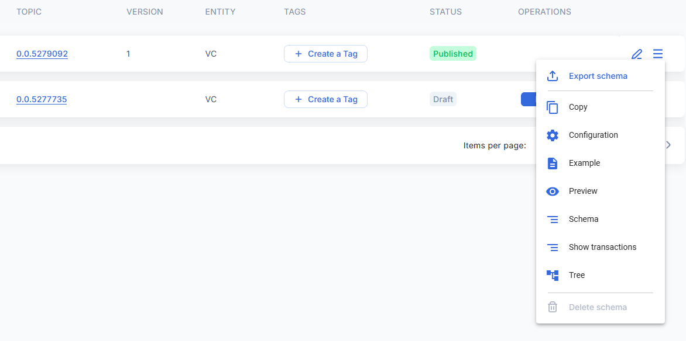

# 💻 Tagging using UI

## Tags

Document objects which can be attached to Schemas, Policies, Modules, Tokens, DID, VC and VP Documents by any credentialed entity at any time.

### **1. Structure**

#### **1.1 Object**

* _**uuid**_ – unique tag identificator, tags with the same uuid are considered to be the same
* _**name**_ – label visible to the user and the criteria upon which tags are grouped
* _**description**_ – optional text field to provide additional information about tags
* _**owner**_ – DID of the user who created the tag
* _**entity**_ – type of the document to which this tag is attached (_Schema, Policy, Token, Module, PolicyDocument_)
* _**target**_ – link to the document to which the tag is attached (Hedera message ID)
* _**localTarget**_ – ID of the document in the local Guardian database
* _**status**_ – tag status (_Draft, Published, History_)
* **operation** – current tag action (_Create, Delete_)
* _**topicId**_ – topic ID where the tag information will be published.
* _**messageId**_ – ID of the message in the topic where the tag is published.
* _**policyId**_ – Policy ID when the tag is linked to the document inside a policy (optional)
* _**uri**_ – uri of the additional document linked to the tag (optional)
* _**document**_ – additional document linked to the tag (optional)

#### **1.2 Message**

```
{
"id": "b8d249e8-ce63-4835-98fc-7ba7dab1df71",
"type": "Tag",
"action": "publish-tag",
"lang": "en-US",
"uuid": "ee95a359-41a4-45f6-bbf9-21559e252a52",
"name": "Label",
"description": "description",
"owner": "did:hedera:testnet:8AvszwobPqq5kHmWWq52cFg3i8wZo9oy8xSY1mBZsfD7_0.0.3916401",
"target": "1680189251.272591003",
"operation": "Create",
"entity": "Schema",
"cid": "bafkreifdxsx5bos2k3vbbupawwf7vbuhwhdscm6qvd2uiozo4aarxsv3g4",
"uri": "ipfs://bafkreifdxsx5bos2k3vbbupawwf7vbuhwhdscm6qvd2uiozo4aarxsv3g4"
}
```

### 2. Managing Tags

#### **2.1 Create**

Tags can be created by clicking on "Create Tag" button.



Tag can be created with label and the description as shown below:

.png>)

An additional document can be added/linked with the tag using _**Add Document** button and then selecting a suitable document schema_

 (2).png>)

#### **2.2 Remove**

Users (DIDs) who created a tag are able to remove it later.

.png>)

#### **2.3 View**

For documents displayed in the grid only the first (alphabetically) tag is shown.

 (3).png>)

Users can click on the tag icon to show the detailed information about all tag assigned to the document.

.png>)

Tags are grounded by labels. When a label is selected then a detailed information about all tags with this label is displayed below.

.png>)

#### **2.4 History**

Tags which have been imported with the Policy or Schema are marked as _**History.**_ These tags are not directly relevant to the new objects and are displayed for the convenience of the user (policy author). These historic tags are neither synchronized nor published when the new objects are published.

.png>)

#### **2.5 Tag updates (synchronization)**

Any credentialed entity can create/remove a tag on any object at any point of time independently from the Guardian instance where this tagable object (document etc) has been created. This presents a challenge for displaying the up-to-date state of 3rd party tags associated with the object, since continuous search and import/updates of such tags can affect UI responsiveness and general UX. Guardian users can refresh (or ‘pull’) 3rd party tags and update their display in their local Guardian instance by clicking on the corresponding icon (highlighted on the screenshot below).

 (1).png>)
