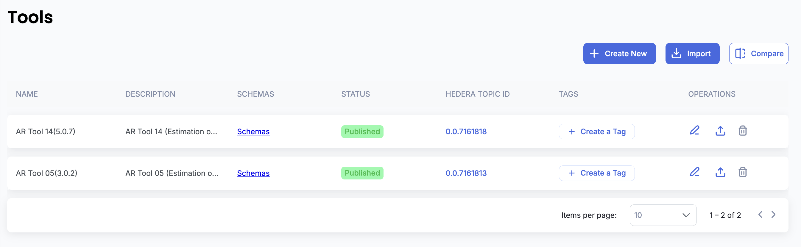

# Demo using UI

## 1. Import-Time Configuration

When importing a policy (via file or message), users can enable tamper-resistance by selecting a dedicated “Track policy changes” checkbox during the import process.

Once enabled:

* The system captures and stores the original state of the policy
* All future modifications can be compared against this original baseline


&#x20;If the checkbox is not selected, the policy will behave as a standard imported policy with no tamper-tracking enabled.


<figure><figcaption></figcaption></figure>

## 2. Data Model Enhancements

When tamper-resistance is enabled, the following additional fields are stored in the database to preserve the original policy state:

* **originalChanged** – Indicates whether the policy has diverged from its original state
* **originalHash** – Cryptographic hash of the original policy
* **originalZipId** – Reference to the stored original policy file
* **originalMessageId** – Reference to the original message (for message-based imports)

#### File-Based Import Behavior

* The original policy file is securely stored in the database
* A unique file ID is assigned and linked to the policy
* This file acts as the immutable baseline for all future comparisons

## 3. UI Enhancements

### 3.1 Policies Grid – Modified Column

A new **“Modified”** column is added to the Policies grid to surface tamper status at a glance.

**Possible States**

* **Compare** – The policy has been modified and can be compared with the original version
* **No Changes** – The policy matches its original imported state
* **Status Unavailable** – Original state is not available (e.g., tracking was not enabled)

<figure><figcaption></figcaption></figure>

### 3.2 Compare Action

* Clicking **Compare** opens a detailed diff view
* Users can visually inspect differences between:
  * Original imported policy
  * Current policy state

This helps users quickly understand _what_ changed and _where_.

<figure><figcaption></figcaption></figure>
