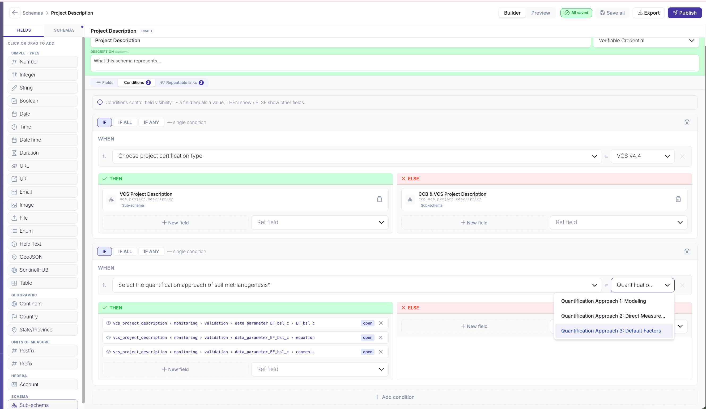
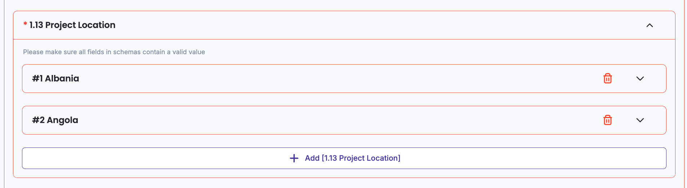
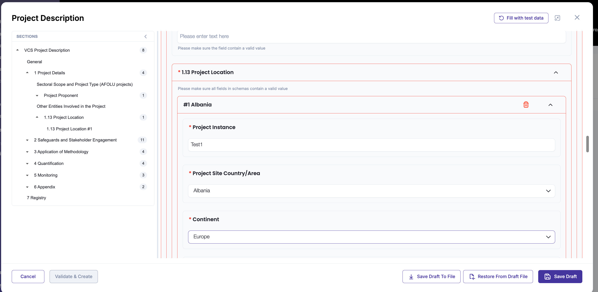
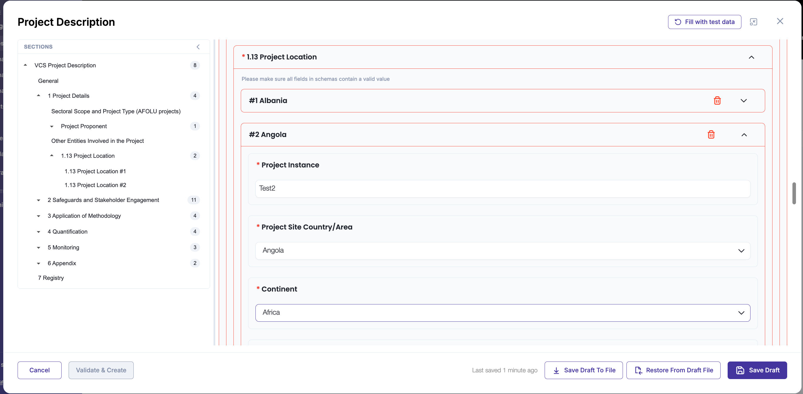
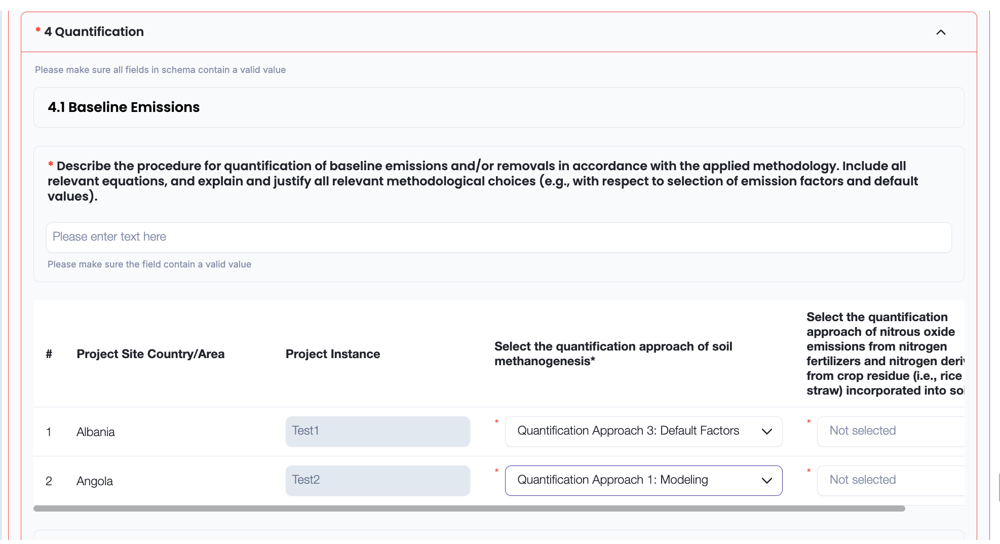
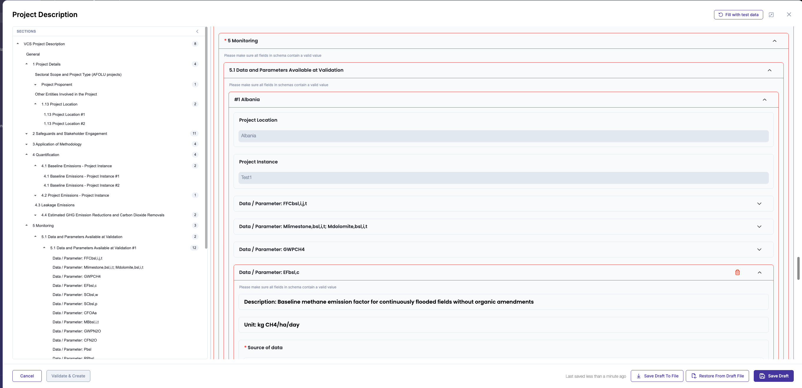
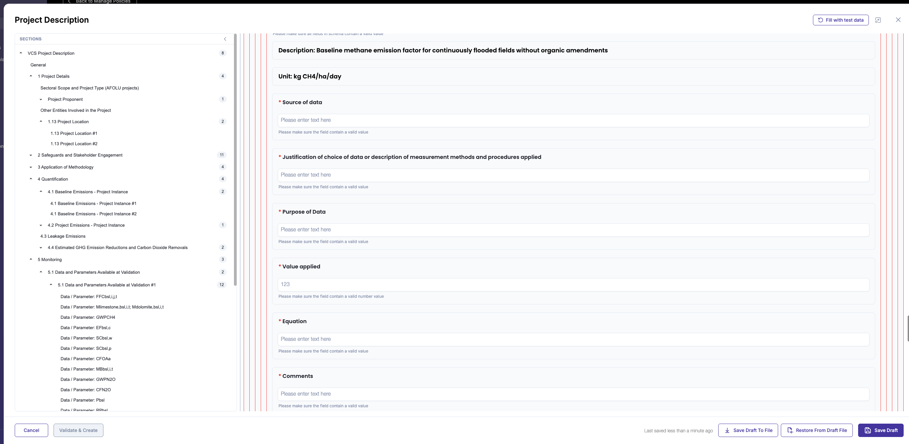
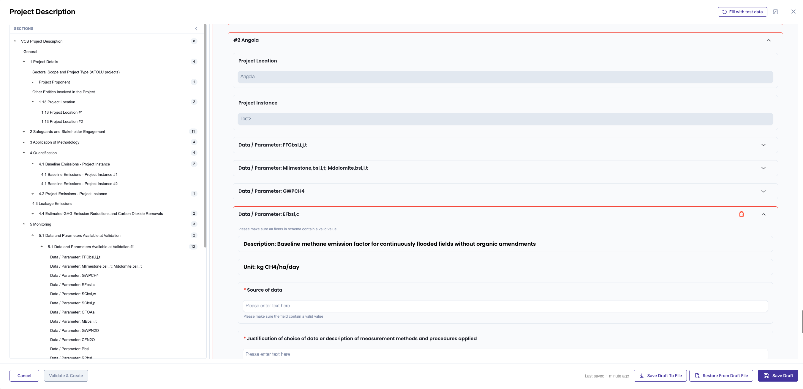
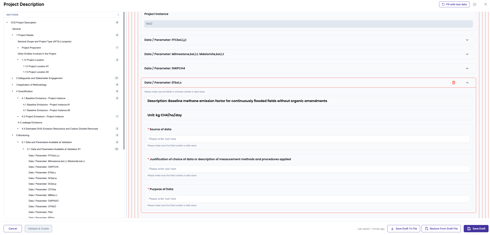

или---
icon: link
---

# Repeatable Field Links

A repeatable field — a field with **Allow multiple answers** enabled — lets a user add as many entries as they need. Repeatable field links tie those entries to the entries of other repeatable fields, so every variant carries its own, separate set of related fields — including fields that live in other schemas of the document.

Add an entry once, and a matching entry appears in every linked field. The entries stay paired as the form is filled in, so each variant is completed and kept on its own, without spilling into the others.

* Link any number of fields into one group — a field can drive several others, and a linked field can in turn drive the next, to any depth.
* Adding one entry creates a matching entry in every field of the group, paired one-to-one.
* Each entry is shown as its own block with a readable title, so variants never blur together.
* Values can be copied from an entry into its linked entries automatically.
* Each entry shows and hides its own fields, evaluated independently of the others.

> In this guide the example is a project with several locations: each location a user adds carries its own selections and its own set of fields.

## 1. Setting up a link

### Add a link in the schema editor

Open the schema and switch to the **Repeatable links** tab — the overview of the dependencies page, listing the links already defined:

To add a link:

* **Source array** — the repeatable field that drives the group (e.g. _Project Location_).
* **Dependent array** — the repeatable field that should follow the source (e.g. _Baseline Emissions_). It can live in another schema of the document.
* **Display name** (optional) — a field from the source entry used to label each entry.
* Click **Add link**. Repeat to add more links: one source can drive several dependents, and a dependent can itself be a source for the next field, growing the group.

### Copy values between entries (optional)

Before adding the link, use **Add value** to map a field from the source entry to a field in the dependent entry. The value is copied into the dependent entry automatically and shown read-only. A link can carry several pairs, listed under **Copied values**. A fully configured link with a copied-value pair, ready to add:

### Save the schema

Click **Save all**. Links, display names and copied values are stored with the schema and restored when it is reopened.

## 2. Conditions for linked entries

Conditions decide which fields an entry shows. Because the fields are linked, a condition can connect fields from different parts of the group, and it is checked separately for each entry.

### Add a condition

Open the schema and switch to the **Conditions** tab, then add a condition.

* Set the **When** clause: choose the controlling field — a field inside a linked entry — and the value that triggers the rule.
* You can pick fields from inside the linked entries here, not just top-level fields.

### Choose what the condition shows

In **THEN** (applied when the condition is true) and **ELSE**, add the target fields. Each target can be:

* **A single field** — show or hide one field.
* **A whole sub-schema block** — show or hide a group of fields at once. Selecting the block adds one target instead of listing every field it contains; it is marked with a **Sub-schema** tag in the list.

## 3. Filling the form

### Add entries

When the schema is used in a policy:

* Adding an entry to the source field creates a matching entry in every linked field.
* Linked entries have no manual add or remove buttons — they follow the source.
* Each entry is labelled with the source entry's display name.
* Copied fields arrive filled and read-only.

Add the source entries — here, two project locations:

Each location is its own block with its own fields:

Each linked section then gets a matching entry, labelled by the display name, with copied fields filled and read-only:

### Different fields for each entry

Each entry runs its conditions on its own, so the same field can be shown in one entry and hidden in another.

The first location chose _Quantification Approach 3_. In **5 Monitoring → 5.1 Data and Parameters Available at Validation**, its `EF_bsl_c` card is expanded and shows the conditional fields (Value applied, Equation, Comments):

The second location chose _Quantification Approach 1_, so the same card hides those fields:

### Delete an entry

Removing a source entry asks for confirmation, then removes the matching entry from every linked field. The remaining entries keep their own values.
