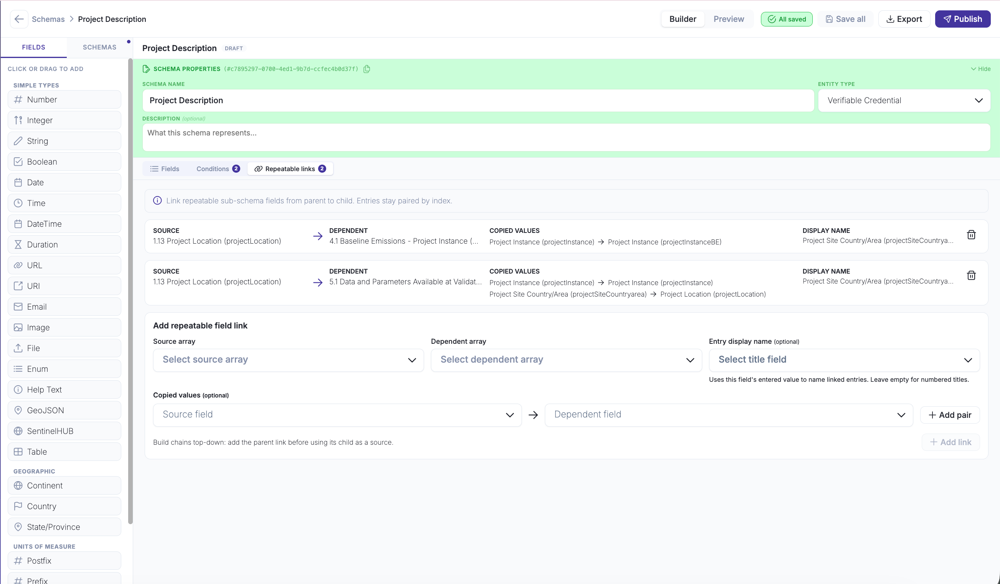
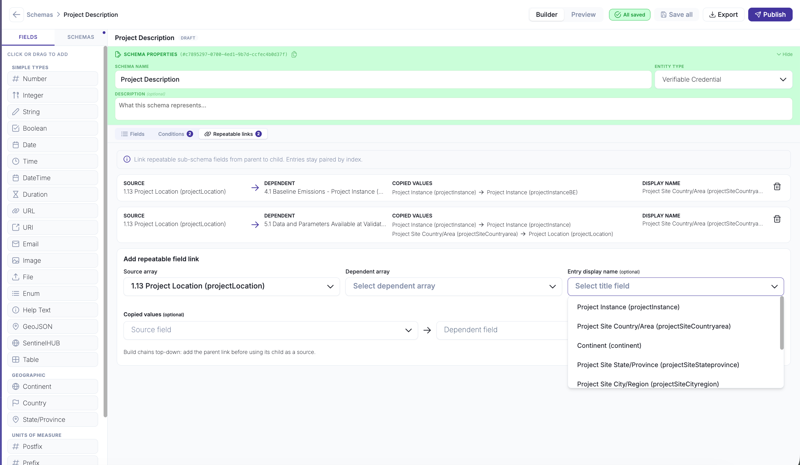
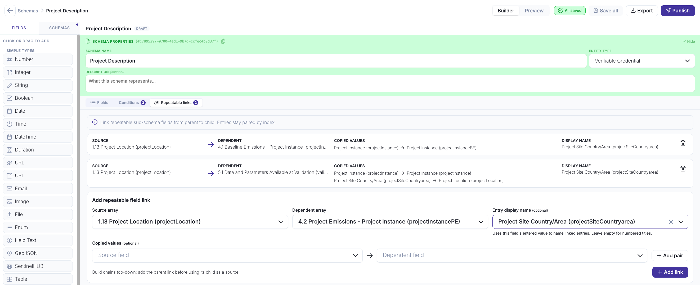
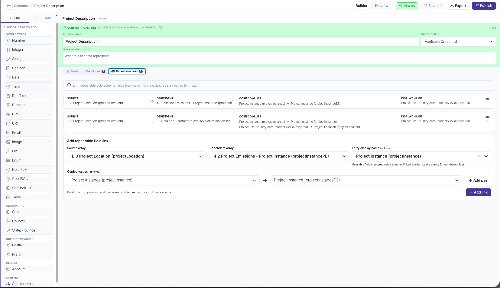
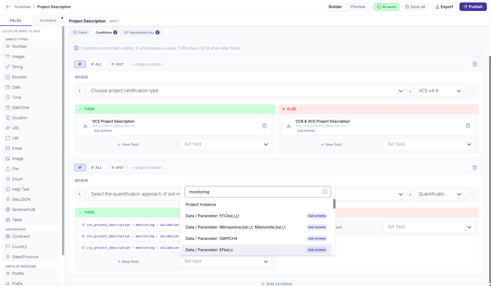

# Set up Repeatable Field Links

Configure a source repeatable field to drive one or more dependent repeatable fields, so that adding an entry in the source automatically creates a matching entry in every linked field. See [Repeatable Field Links](README.md) for an explanation of how linked entries behave at form-fill time.

#### Prerequisites

* The schema is open in the schema editor.
* The schema contains at least one repeatable field (**Allow multiple answers** enabled) to use as the source, and at least one more to use as the dependent.

#### Steps

**1. Open the Repeatable links tab**

Switch to the **Repeatable links** tab in the schema editor. The tab shows the existing links defined for this schema.

**2. Add a link**

Fill in the link form and click **Add link**:

* **Source array** — the repeatable field that drives the group (for example, _Project Location_).
* **Dependent array** — the repeatable field that should follow the source (for example, _Baseline Emissions_). It can live in a different schema of the same document.
* **Display name** (optional) — a field from the source entry that labels each entry in the form.

Repeat to add more links. One source can drive several dependents, and a dependent can itself become the source for the next field.

**3. Copy values between entries (optional)**

Before clicking **Add link**, use **Add value** to map a field from the source entry to a field in the dependent entry. The value is copied automatically and shown as read-only. Add as many pairs as needed — they appear under **Copied values** in the link form.

**4. Save the schema**

Click **Save all**. Links, display names, and copied value pairs are stored with the schema.

**5. Add conditions for linked entries (optional)**

Switch to the **Conditions** tab and add a condition.

* In **When**, choose the controlling field. Fields inside linked entries are available here — not just top-level schema fields. Set the value that triggers the rule.

* In **THEN** and **ELSE**, add the target fields. Each target can be a single field or a whole sub-schema block. Selecting a block adds one target instead of listing every field it contains; it is marked with a **Sub-schema** tag.

Click **Save all**.

#### Result

The schema stores the configured links and conditions. When the schema is used in a policy:

* Adding a source entry creates a matching entry in every linked field, labelled with the display name.
* Copied fields arrive filled and read-only.
* Each entry evaluates its conditions independently, so the same field can appear in one entry and be hidden in another.

#### Related

* Concept: [Repeatable Field Links](README.md)
