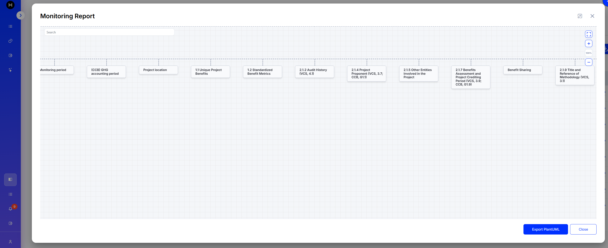
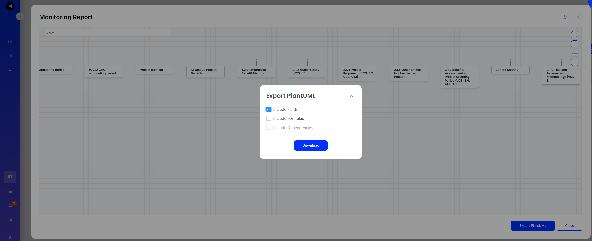

# Export Schema Tree as PlantUML

## 1. Opening Export Dialog

The Schema Tree can be exported as a PlantUML class diagram. To export, open the Schema Tree view by clicking the **Tree** button for the desired schema, then click the **Export PlantUML** button:

<figure><figcaption></figcaption></figure>

## 2. Export Options

The Export PlantUML dialog provides three checkboxes to control the level of detail:

* **Include Fields** — Adds field names and descriptions to each schema class. Enabled by default.
* **Include Formulas** — Adds formula packages with stereotyped elements (constants, variables, formulas, text) and cross-formula links.
* **Include Dependencies** — Expands the diagram to include formulas and schemas referenced by directly linked formulas. Requires **Include Formulas** to be enabled.

<figure><figcaption></figcaption></figure>

## 3. Exported File

Clicking **Download** generates and downloads a `.puml` file that can be rendered in any PlantUML-compatible tool (e.g., PlantUML online editor, IntelliJ IDEA, VS Code extensions).

The diagram includes:

* **Schema classes** with parent-child composition arrows
* **Fields** with names and descriptions (when enabled)
* **Formula packages** grouping constants, variables, formulas, and text elements (when enabled)
* **Cross-formula links** shown as dependency arrows (when enabled)
* **Color coding** per element type for easy visual identification
