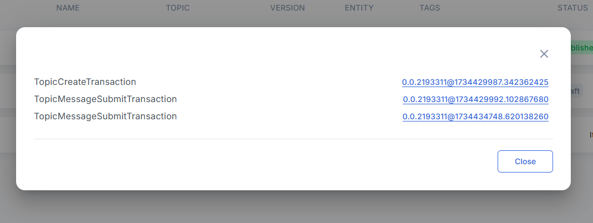

# Showing List of Hedera Transactions using

Users can select the "**Show transactions**" option in the grids’ pop-up menu to see the list of Hedera transactions related to the selected entity.

<figure><figcaption></figcaption></figure>

Each of the displayed items in the transactions list is clickable.&#x20;

<figure><figcaption></figcaption></figure>

It links directly to the external explorer service where users familiar with blockchain systems can explore the selected transaction parameters and content.

<figure><figcaption></figcaption></figure>

Entities API contains facilities to provide transaction related information on client requests:

* /api/v1/policies/:policyId/transactions
* /api/v1/schemas/:schemaId/transactions
* /api/v1/tokens/:tokenId/transactions
* /api/v1/contracts/:contractId/transactions
