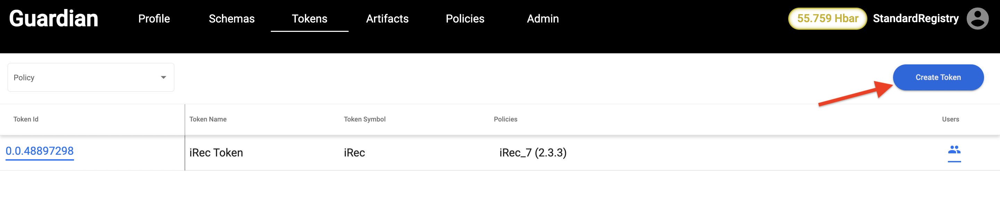
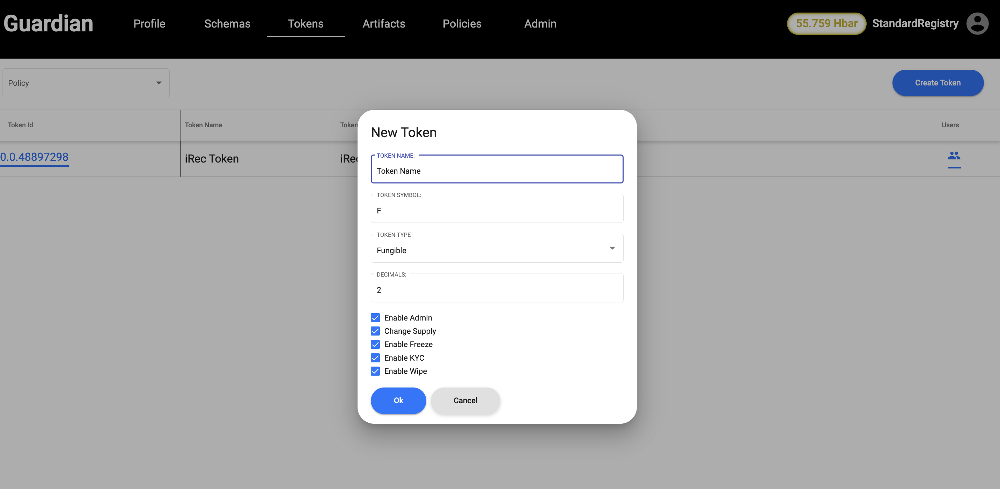

# 💻 Creating Token using UI

Following are the steps to create a token:

Step 1: Click on the Create Token button in the Tokens tab as shown below:

<figure><figcaption></figcaption></figure>

Step 2: Once button is clicked, we get a pop up box to enter token details such as Name, Symbol etc.

<figure><figcaption></figcaption></figure>

Following are the parameters required to complete the token creation process:

| Field Name    | Description                                                             | Exmaple              |
| ------------- | ----------------------------------------------------------------------- | -------------------- |
| Token Name    | Name of the token                                                       | iREC Token           |
| Token Symbol  | Symbol of the token                                                     | I                    |
| Token Type    | whether the token to be fungible and non fungible                       | F/N                  |
| Decimals      | Decimals to be allowed to the token                                     | 2                    |
| Enable Admin  | Enabled to make changes in the token settings even after creating token | Checked or Unchecked |
| Change Supply | Enabled to change the token supply                                      | Checked or Unchecked |
| Enable Freeze | Enabling Freezing of the token                                          | Checked or Unchecked |
| Enable KYC    | Enabling KYC when token is created                                      | Checked or Unchecked |
| Enable Wipe   | Enabled to wipe the token supply                                        | Checked or Unchecked |

