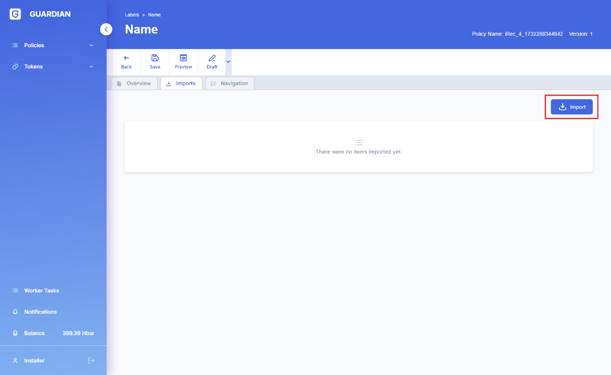
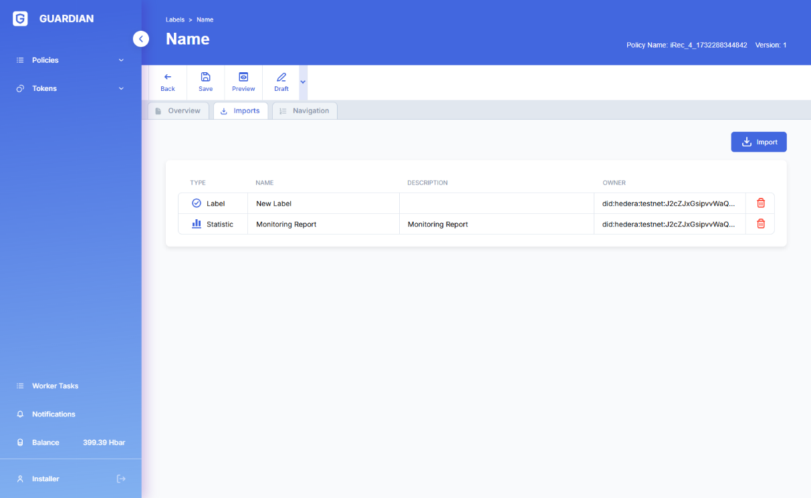
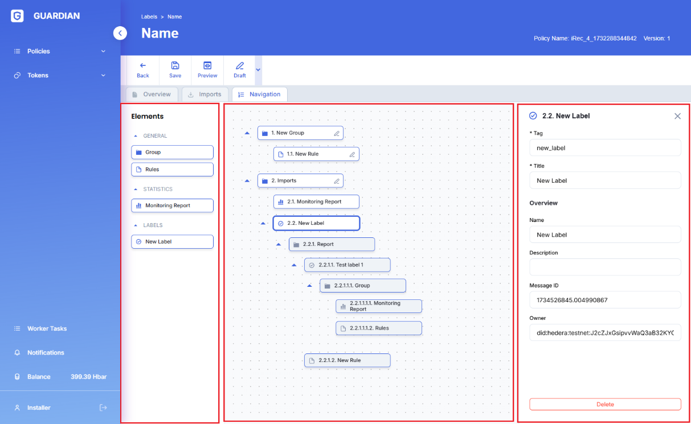

# 📱 Mobile Operation for the user

### **Creation of a new account**

The first adaptation relates to the redesign of the creation of new accounts. This redesign for mobile solves the overflow previously present while still maintaining the descriptions.

Here the images below show the selection of account type and selection of username and password in order to create a new account.

\
 (4).png>).png>)

### New header for mobile

The header was also adapted for mobile for all types of users. The balance was maintained as one of the elements always present. The new header for mobile, these elements are always present.

 (1).png>)\\

The various menus and submenus (in case there are any) have been moved upon clicking on the hamburger menu, presenting the user with the following.

Also some information about the user is also presented, such as the name of the user (in this case "user1234") and his respective Hedera ID and HBar balance.

 (1) (2).png>)\\

### **User first registration into Guardian**

As this is an integral part of using Guardian, the association with the users Hedera credentials and the Standard Registry of his choosing were adapted. The mobile adaptation to associate Hedera credentials and Standard Registry upon creating an account.

\\

### User policy registration application

The user registration form into a policy has also been redesigned. This makes the long form divisible in a more digestible manner, compartmentalizing each category of input into a page of its own. The mobile adaptation to the registration into a policy.

.png>)

The images below are the registration forms which have been redesigned

  (3) (1).png>)

### User creating a retire request

The "Create Retire Request" form was also adapted, as can be seen below.

### User Create / Join Multi Policy

The "Create / Join Multi Policy" form was also adapted, as can be seen below:

