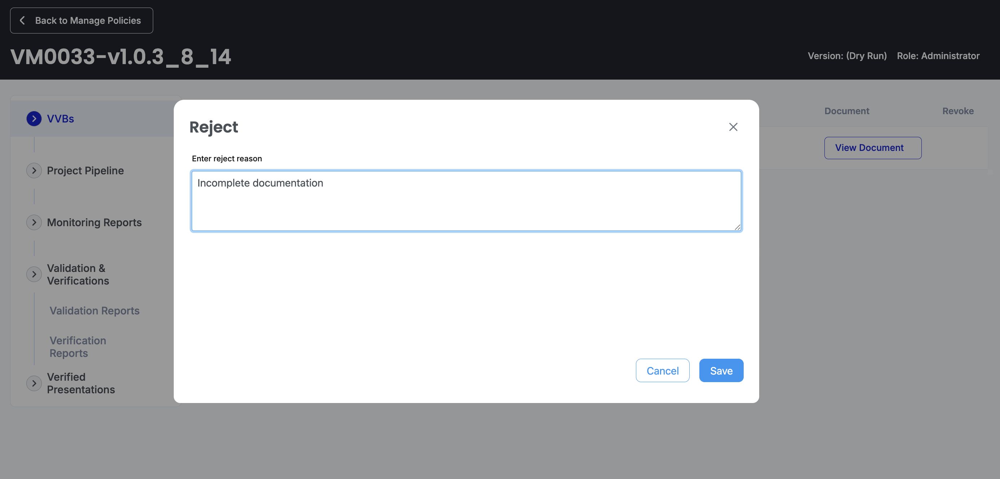
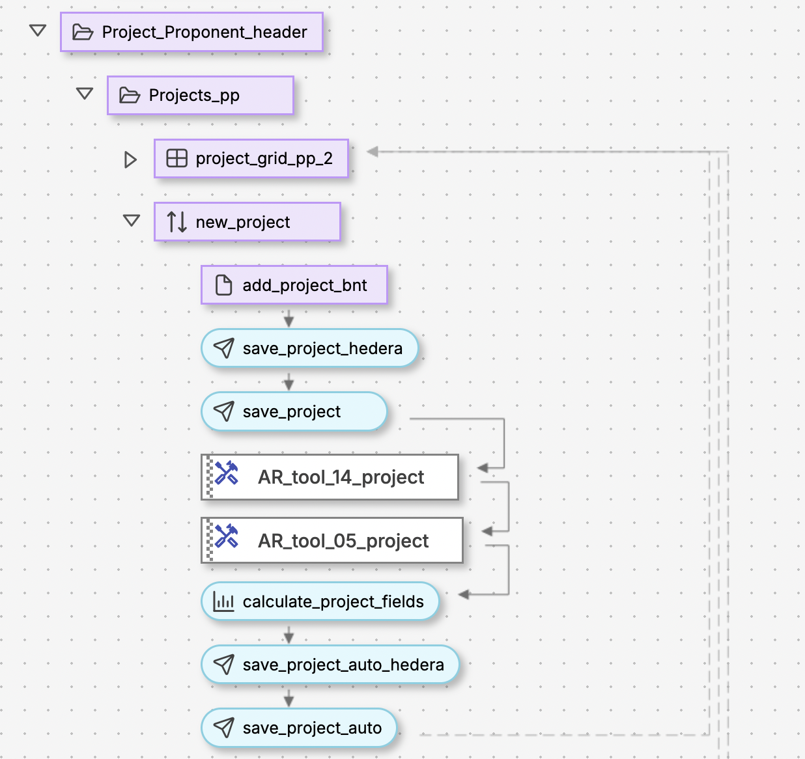
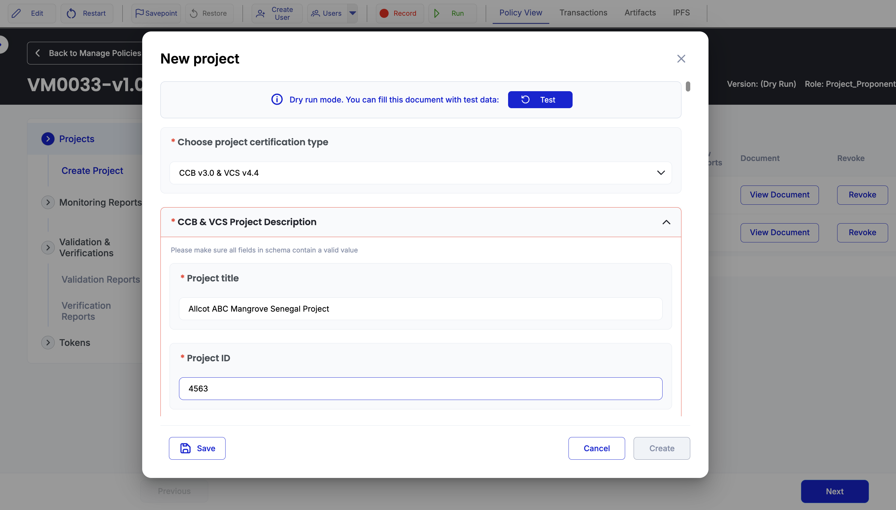

# Chapter 15: VM0033 Implementation Deep Dive

> Complete end-to-end analysis of VM0033 tidal wetland restoration policy implementation in Guardian

Chapter 14 covered individual workflow blocks. Chapter 15 dissects VM0033's complete policy implementation, showing how blocks connect into multi-stakeholder certification workflows that automate the entire lifecycle from project submission to VCU token issuance.

VM0033 represents Guardian's most advanced and production-ready methodology implementation, featuring complex emission calculations, multi-role workflows, and state management across the complete credit certification process.

.png>)

## VM0033 Architecture Overview

### Policy Structure and Organization

VM0033 follows Guardian's hierarchical block organization:

```
Root Container (interfaceContainerBlock)
├── Role Selection (policyRolesBlock)
├── OWNER Workflow (Standard Registry)
│   ├── VVB Management
│   ├── Project Pipeline
│   ├── Monitoring Reports
│   ├── Validation & Verification
│   └── Token Management
├── Project_Proponent Workflow
│   ├── Project Management
│   ├── Monitoring Reports
│   ├── VVB Selection
│   └── Token Tracking
└── VVB Workflow
    ├── Registration
    ├── Project Validation
    ├── Report Verification
    └── Document Management
```

### Key Policy Configuration

VM0033's policy metadata defines its scope and stakeholders:

```json
{
  "name": "VM0033-v1.0.3_8_14",
  "description": "This methodology outlines procedures for estimating net greenhouse gas (GHG) emission reductions and removals from tidal wetland restoration projects...",
  "policyRoles": ["Project_Proponent", "VVB"],
  "policyTokens": [{
    "templateTokenTag": "VCU",
    "tokenName": "Verified Carbon Unit",
    "tokenSymbol": "VCU"
  }],
  "codeVersion": "1.5.1"
}
```

### Role-Based Navigation Structure

VM0033 implements role-based navigation enabling each stakeholder type to access relevant workflow sections:

.png>)

_Figure 15.2: VM0033's role-based navigation configuration_

**OWNER (Standard Registry) Navigation:**

* VVB Management and Approval
* Project Pipeline Management
* Monitoring Reports Review
* Validation & Verification Oversight
* Trust Chain and Token History

.png>)

**Project\_Proponent Navigation:**

* Project Creation and Management
* Monitoring Report Submission
* VVB Assignment and Communication
* Token Tracking and Management

**VVB Navigation:**

* Registration and Credential Management
* Project Validation Assignments
* Monitoring Report Verification
* Validation/Verification Report Submission

## Use Case 1: VVB Approval Workflow Deep Dive

Let's examine VM0033's VVB approval workflow as our first detailed use case. This workflow demonstrates how Guardian's interfaceDocumentsSourceBlock, documentsSourceAddon, buttonBlock, and status update mechanisms work together to create an advanced approval system.

### The VVB Approval Interface Architecture

When a Standard Registry (OWNER) needs to approve VVB registrations, VM0033 creates an interface with three different document states and interactive approval controls.

#### 1. Main Interface Block Configuration

The VVB approval interface starts with an `interfaceDocumentsSourceBlock` that defines the UI layout:

```json
{
  "id": "14d69df0-bb61-4c65-abaf-4507cde54521",
  "blockType": "interfaceDocumentsSourceBlock",
  "defaultActive": true,
  "permissions": ["OWNER"],
  "tag": "vvb_grid_verra",
  "uiMetaData": {
    "fields": [
      {
        "title": "Owner",
        "name": "document.issuer",
        "type": "text"
      },
      {
        "title": "Text",
        "name": "document.credentialSubject.0.field0",
        "type": "text"
      },
      {
        "title": "Operation",
        "name": "option.status",
        "type": "block",
        "bindBlock": "approve_documents_btn",
        "width": "250px",
        "bindGroup": "vvb_grid_verra_documents_to_approve"
      },
      {
        "title": "Document",
        "name": "document",
        "type": "button",
        "action": "dialog",
        "dialogContent": "VC",
        "dialogType": "json",
        "content": "View Document",
        "uiClass": "link"
      },
      {
        "title": "Revoke",
        "name": "",
        "type": "block",
        "bindBlock": "revoke_vvb_verra_btn",
        "bindGroup": "vvb_grid_verra_documents_approved",
        "width": "100px"
      },
      {
        "title": "Operation",
        "name": "option.status",
        "type": "text",
        "width": "250px"
      }
    ]
  }
}
```

.png>)

**How This Creates the UI:**

* **Owner Column**: Shows the DID of who submitted the VVB registration (`document.issuer`)
* **Text Column**: Displays the first field from the VVB registration form (`document.credentialSubject.0.field0`)
* **Operation Column**: Contains approval/rejection buttons (when `bindGroup` matches "documents\_to\_approve")
* **Document Column**: "View Document" link that opens dialog with full VVB registration details
* **Revoke Column**: Revoke button (only for approved VVBs when `bindGroup` matches "documents\_approved")
* **Status Column**: Plain text showing current status

.png>)

#### 2. Document Source Configuration - The Filtering Engine

Three separate `documentsSourceAddon` blocks are used to populate VVB documents with different statuses in the same interface:

**A. Documents Waiting for Approval:**

```json
{
  "id": "e206551f-d96a-4b4f-b2a5-3f12182cbd67",
  "blockType": "documentsSourceAddon",
  "defaultActive": true,
  "permissions": ["OWNER"],
  "filters": [
    {
      "value": "vvb",
      "field": "type",
      "type": "equal"
    },
    {
      "value": "Waiting for Approval",
      "field": "option.status",
      "type": "equal"
    }
  ],
  "dataType": "vc-documents",
  "schema": "#41db8188-04c1-4f57-b73e-4b7d2efc797c",
  "tag": "vvb_grid_verra_documents_to_approve"
}
```

**B. Approved Documents:**

```json
{
  "id": "18d1f380-77d3-49bb-aaa0-09a9dbe29d9c",
  "blockType": "documentsSourceAddon",
  "defaultActive": false,
  "permissions": ["OWNER"],
  "filters": [
    {
      "value": "approved_vvb",
      "field": "type",
      "type": "equal"
    }
  ],
  "dataType": "vc-documents",
  "schema": "#41db8188-04c1-4f57-b73e-4b7d2efc797c",
  "tag": "vvb_grid_verra_documents_approved"
}
```

**C. Rejected Documents:**

```json
{
  "id": "eb1ee4f5-9b3c-4350-b5a8-516bbea728c8",
  "blockType": "documentsSourceAddon",
  "defaultActive": false,
  "permissions": ["OWNER"],
  "filters": [
    {
      "value": "rejected_vvb",
      "field": "type",
      "type": "equal"
    }
  ],
  "dataType": "vc-documents",
  "schema": "#41db8188-04c1-4f57-b73e-4b7d2efc797c",
  "tag": "vvb_grid_verra_documents_approved_rejected"
}
```

**How the Filtering Works:**

* **Multiple Filters = AND Logic**: `type = "vvb"` AND `option.status = "Waiting for Approval"`
* **defaultActive**: Only "waiting for approval" shows immediately (`defaultActive: true`), others show when status changes
* **Schema Filtering**: All use the same VVB registration schema (`#41db8188-04c1-4f57-b73e-4b7d2efc797c`)
* **Tag Matching**: The `bindGroup` in interface fields matches these `tag` values to show appropriate buttons

#### 3. Button Workflow Implementation

The approval buttons are defined in a separate `buttonBlock` that gets embedded in the interface:

```json
{
  "id": "95890b13-cc6f-4d03-afde-323c6337498d",
  "blockType": "buttonBlock",
  "defaultActive": false,
  "permissions": ["OWNER"],
  "tag": "approve_documents_btn",
  "uiMetaData": {
    "buttons": [
      {
        "tag": "Button_0",
        "name": "Approve",
        "type": "selector",
        "field": "option.status",
        "value": "APPROVED",
        "uiClass": "btn-approve"
      },
      {
        "tag": "Button_1",
        "name": "Reject",
        "type": "selector-dialog",
        "title": "Reject",
        "description": "Enter reject reason",
        "field": "option.status",
        "value": "REJECTED",
        "uiClass": "btn-reject"
      }
    ]
  },
  "events": [
    {
      "target": "update_approve_document_status",
      "source": "approve_documents_btn",
      "input": "RunEvent",
      "output": "Button_0",
      "disabled": false
    },
    {
      "target": "update_approve_document_status_2",
      "source": "approve_documents_btn",
      "input": "RunEvent",
      "output": "Button_1",
      "disabled": false
    }
  ]
}
```

**Button Behavior Differences:**

* **Approve Button (`Button_0`)**:
  * Type: `"selector"` = direct action
  * Sets `option.status = "APPROVED"` immediately
  * Triggers event to `update_approve_document_status` block
  * Green styling (`btn-approve`)
* **Reject Button (`Button_1`)**:
  * Type: `"selector-dialog"` = shows dialog first
  * Opens modal with title "Reject" and prompt "Enter reject reason"
  * User input gets captured before setting `option.status = "REJECTED"`
  * Triggers event to `update_approve_document_status_2` block
  * Red styling (`btn-reject`)



#### 4. Status Update Processing

When buttons are clicked, Guardian routes events to status update blocks:

```json
{
  "id": "a95abd22-d952-4471-aacc-af159704aefe",
  "blockType": "sendToGuardianBlock",
  "defaultActive": false,
  "permissions": ["VVB"],
  "entityType": "vvb",
  "dataSource": "database",
  "documentType": "vc",
  "tag": "update_approve_document_status"
}
```

**What Happens During Status Update:**

1. **Button Click**: User clicks "Approve" or "Reject"
2. **Event Trigger**: Button emits `Button_0` or `Button_1` events
3. **Event Routing**: Guardian routes to corresponding `update_approve_document_status` block
4. **Document Update**: `sendToGuardianBlock` updates document in database with new status
5. **Filter Refresh**: Document moves between filtered views automatically
6. **UI Update**: Interface refreshes to show updated document lists

### Complete VVB Approval Flow Summary

**Initial State:**

* VVB submits registration → Document created with `type: "vvb"`, `option.status: "Waiting for Approval"`
* Document appears in "documents to approve" filter with Approve/Reject buttons

**Approval Flow:**

* OWNER clicks "Approve" → `option.status` changes to "APPROVED" → Document type changes to `"approved_vvb"`
* Document disappears from "waiting for approval" and appears in "approved documents" with Revoke button

**Rejection Flow:**

* OWNER clicks "Reject" → Dialog opens for reason → `option.status` changes to "REJECTED" → Document type changes to `"rejected_vvb"`
* Document disappears from "waiting for approval" and appears in "rejected documents" section

This was one simple example of how Guardian's block system can create powerful, multi-state workflows with automatic UI updates and proper audit trails.

***

## Use Case 2: Project Submission and Calculation Workflow Deep Dive

Let's examine how Project\_Proponents submit PDDs and how VM0033 processes them through form generation, data storage, and calculation integration. This workflow showcases Guardian's ability to transform schemas into working forms and process complex scientific data.

### The Project Submission Architecture

When Project\_Proponents create new projects, VM0033 transforms your Part III PDD schema into a working form, processes the submission through automated calculations, and stores the results for validation workflows.

#### 1. Project Submission Form Block

The project submission starts with a `requestVcDocumentBlock` that generates forms from schema:

```json
{
  "id": "aaa78a11-c00b-4669-9022-bd2971504d70",
  "blockType": "requestVcDocumentBlock",
  "defaultActive": true,
  "permissions": ["Project_Proponent"],
  "uiMetaData": {
    "privateFields": [],
    "type": "dialog",
    "content": "New project",
    "dialogContent": "New project",
    "description": "New project"
  },
  "idType": "UUID",
  "schema": "#55df4f18-d3e5-4b93-af87-703a52c704d6",
  "presetFields": [],
  "tag": "add_project_bnt"
}
```



**How This Creates the Project Form:**

* **Schema Integration**: Guardian reads the PDD schema (`#55df4f18-d3e5-4b93-af87-703a52c704d6`) from Part III and automatically generates form fields
* **Dialog Type**: Opens as modal dialog (`type: "dialog"`) with title "New project"
* **UUID Generation**: Creates unique project identifier (`idType: "UUID"`)
* **Empty Presets**: No pre-populated fields (`presetFields: []`), users fill all data manually. They can be set as needed.
* **Permission Control**: Only Project\_Proponents can access this form



#### 2. Dual Storage Strategy Implementation

A two-path storage strategy is used after form submission:

**A. Database Storage (Working Documents):**

```json
{
  "id": "574168a5-ae6b-4736-8570-2fad76413915",
  "blockType": "sendToGuardianBlock",
  "defaultActive": false,
  "permissions": ["Project_Proponent"],
  "entityType": "project_form",
  "dataSource": "database",
  "documentType": "vc",
  "stopPropagation": true,
  "tag": "save_project"
}
```

**B. Hedera Storage (on chain):**

```json
{
  "id": "2b8e4132-1c5e-49fc-b6aa-26b40b7c23b5",
  "blockType": "sendToGuardianBlock",
  "defaultActive": false,
  "permissions": ["Project_Proponent"],
  "dataSource": "hedera",
  "documentType": "vc",
  "topic": "Project",
  "entityType": "project_form",
  "tag": "save_project_hedera"
}
```

**Storage Strategy Differences:**

| Aspect              | Database Storage                                     | Hedera Storage                               |
| ------------------- | ---------------------------------------------------- | -------------------------------------------- |
| **Purpose**         | Working documents, calculations, internal processing | Final validated documents, immutable records |
| **Cost**            | Free                                                 | HBAR transaction costs                       |
| **Speed**           | Instant                                              | 3-5 seconds for consensus                    |
| **Use Case**        | Draft submissions, calculation processing            | Validated projects, audit trails             |
| **stopPropagation** | `true` (prevents further processing)                 | `false` (continues workflow)                 |

#### 3. Event-Driven Calculation Processing

After database storage, VM0033 triggers tool calculations:

```json
{
  "events": [
    {
      "target": "AR_tool_14_project",
      "source": "save_project",
      "input": "input_ar_tool_14",
      "output": "RunEvent"
    }
  ]
}
```

**Calculation Engine Integration:**

The policy includes `customLogicBlock` elements that process the submitted PDD data and output final emission reduction calculations:

```json
{
  "id": "4b02c4d7-faec-4519-a1b1-ab1b9353ea9b",
  "blockType": "customLogicBlock",
  "defaultActive": false,
  "permissions": ["Project_Proponent"],
  "expression": "[1000+ lines of VM0033 methodology calculations - detailed in Part V]"
}
```

**Calculation Processing Overview:**

* **Temporal Boundary Calculations**: Peat depletion times and soil organic carbon depletion periods
* **Baseline Emissions**: CO2, CH4, and N2O emissions for each monitoring year and stratum
* **Project Emissions**: Project scenario emissions using same methodology approach
* **Carbon Stock Analysis**: Total stock approach vs stock loss approach determination
* **Net Emission Reductions**: Final emission reductions/removals calculations

_Note: The complete calculation implementation is covered in detail in Part V (Calculation Logic)._

### Complete Project Submission Flow Summary

**Step 1: Form Generation**

* Project\_Proponent clicks "New Project" → Guardian generates form from PDD schema
* Form includes all project details, baseline parameters, monitoring specifications from Part III

**Step 2: Data Submission**

* User completes form → `requestVcDocumentBlock` creates Verifiable Credential
* Document contains all submitted data plus generated UUID identifier

**Step 3: Storage Processing**

* `sendToGuardianBlock` saves document to database for processing
* `stopPropagation: true` prevents immediate Hedera storage (cost optimization)

**Step 4: Calculation Processing**

* Event routing triggers calculation engine (`customLogicBlock`)
* JavaScript processes all emission calculations using VM0033 methodology formulas
* Calculated results added to original document structure

**Step 5: Document Storage**

* Enhanced document (original + calculations) stored in database
* Document ready for validation assignment and approval workflows
* Later moved to Hedera after validation approval

**Key Technical Insights:**

1. **Schema-to-Form Integration**: Guardian automatically creates complex forms from JSON Schema definitions, eliminating manual UI development
2. **Event-Driven Processing**: Form submission triggers calculation workflows through Guardian's event system, enabling sophisticated processing chains
3. **Cost-Optimized Storage**: Working documents in database, final documents on blockchain optimizes cost while maintaining audit integrity
4. **Data Enhancement**: Original submissions enhanced with calculated results, maintaining both user input and processed outputs in single document
5. **Workflow Preparation**: Processed documents ready for multi-stakeholder validation workflows with complete calculation results

This demonstrates how VM0033 transforms simple form submissions into scientifically processed project documents ready for carbon credit certification workflows.

***

## OWNER (Standard Registry) Role Workflow

The OWNER represents the Standard Registry (Verra) and manages the overall certification program. VM0033 implements their workflow through a tabbed interface that organizes different operational areas.

### Verra Header Structure

The OWNER interface uses VM0033's `Verra_header` container that creates a tabbed navigation system:

```json
{
  "id": "62628fc5-d96d-4948-9666-5db5c6399f47",
  "blockType": "interfaceContainerBlock",
  "defaultActive": true,
  "uiMetaData": {
    "type": "tabs"
  },
  "permissions": ["OWNER"],
  "tag": "Verra_header",
  "children": [
    {
      "id": "5de9b842-b4e2-498c-b9a4-4321cf39b824",
      "blockType": "interfaceContainerBlock",
      "uiMetaData": {
        "type": "blank",
        "title": "Approve VVB"
      },
      "tag": "approve_VVB"
    }
  ]
}
```

**OWNER Navigation Tabs:**

* **Approve VVB**: VVB registration management (detailed in Use Case 1)
* **Projects Pipeline**: Project listing and status management
* **Monitoring Reports**: Report review and approval workflows
* **Validation & Verification**: Oversight of VVB activities
* **Trust Chain History**: Complete audit trail management
* **Token Management**: VCU issuance and token operations


### 1. VVB Management (`approve_VVB`)

**VVB Approval Workflow**: Detailed in Use Case 1, this section manages the complete VVB lifecycle from registration through approval and ongoing management.

### 2. Project Pipeline Management

**Project Status Oversight**: OWNER reviews all project submissions, approvals, and workflow progression across all Project\_Proponents.

### 3. Monitoring Reports Review

**Report Validation**: OWNER has oversight access to all monitoring reports and can review calculation accuracy and methodology compliance.

### 4. Validation & Verification Oversight

**VVB Performance Monitoring**: OWNER tracks VVB validation and verification activities, ensuring quality and compliance across all assignments.

### 5. Token Management and Trust Chains

**VCU Issuance Control**: OWNER controls final token minting decisions and maintains complete audit trails for all issued carbon credits.

***

## Project\_Proponent Role Workflow

The Project\_Proponent drives the main certification workflow from project creation through monitoring report submission. VM0033 policy provides them with a dedicated header container and navigation structure.

### Project\_Proponent Header Structure

The Project\_Proponent interface uses VM0033's `Project_Proponent_header` container:

```json
{
  "id": "0509ff35-6011-4945-849a-c39d690f0c8a",
  "blockType": "interfaceContainerBlock",
  "defaultActive": true,
  "uiMetaData": {
    "type": "tabs"
  },
  "permissions": ["Project_Proponent"],
  "tag": "Project_Proponent_header"
}
```

**Project\_Proponent Navigation Structure:**

* **Projects**: Project creation and management (`Projects_pp`)
* **Create Project**: Project submission workflow
* **Monitoring Reports**: Report submission (`Monitoring_Reports_pp`)
* **Validation & Verifications**: Status tracking (`Validation_and_Verification_PP`)
* **Tokens**: VCU receipt and management

### 1. Projects Section (`project_grid_pp_2`)

**Document Display**: Shows all projects owned by the current Project\_Proponent

* **Filtering**: Uses `onlyOwnDocuments: true` to show only user's projects
* **Status Tracking**: Displays project progression through certification stages
* **Action Buttons**: "New Project" for submissions, status-specific actions


### 2. New Project Submission (`new_project`)

**Form Generation**: The `requestVcDocumentBlock` creates forms from PDD schema (covered in Use Case 2)

* **Schema Reference**: `#55df4f18-d3e5-4b93-af87-703a52c704d6` (Part III PDD schema)
* **Processing Chain**: Form → Database Storage → Calculation Engine → Enhanced Document
* **Status Assignment**: New projects get `"Waiting to be Added"` status

### 3. VVB Assignment (`assign_vvb`)

**Assignment Interface**: After admin approval, projects become available for VVB assignment

```json
{
  "blockType": "interfaceDocumentsSourceBlock",
  "tag": "vvb_grid_pp",
  "permissions": ["Project_Proponent"],
  "uiMetaData": {
    "fields": [
      {
        "title": "VVB Name",
        "name": "document.credentialSubject.0.field0",
        "type": "text"
      },
      {
        "title": "Assign",
        "type": "block",
        "bindBlock": "assign_vvb_btn"
      }
    ]
  }
}
```

**Assignment Process**:

* Lists approved VVBs available for selection
* Assignment triggers `reassigningBlock` to transfer document ownership
* Project status changes to "Assigned for Validation"
* VVB gains access to project in their workflow

### 4. Monitoring Reports Section (`new_report`)

**Report Submission**: Uses same schema-to-form pattern as project submission

* **Schema Reference**: Monitoring report schema from Part III
* **Calculation Integration**: Triggers emission reduction calculations
* **VVB Workflow**: Submitted reports appear in VVB's verification queue

### 5. Validation & Verification Tracking

**Status Monitoring**: Project\_Proponent tracks validation and verification progress

* **Validation Status**: Shows when VVB completes validation process
* **Verification Status**: Displays monitoring report verification results
* **Communication**: Receives feedback and requests for additional information

### 6. Token Management

**VCU Receipt**: Final step where Project\_Proponent receives issued carbon credits

* **Token Display**: Shows minted VCUs with quantity and metadata
* **Transfer Capability**: Can transfer or retire tokens as needed
* **Audit Trail**: Complete history from project submission to token receipt

***

## VVB Role Workflow

VVBs provide independent validation and verification services. VM0033 policy structures their workflow through a dedicated header container with role-specific navigation.

### VVB Header Structure

The VVB interface uses VM0033's `VVB_Header` container:

```json
{
  "id": "0c43a214-3fcf-492f-826a-32d2712f6f7f",
  "blockType": "interfaceContainerBlock",
  "defaultActive": true,
  "uiMetaData": {
    "type": "tabs"
  },
  "permissions": ["VVB"],
  "tag": "VVB_Header"
}
```

**VVB Navigation Structure:**

* **VVB Documents**: Registration and credential management
* **Projects**: Project validation assignments (`Projects_vvb`)
* **Monitoring Reports**: Report verification (`Monitoring_Reports_vvb`)
* **Validation & Verifications**: Report submission (`Validation_and_Verification_vvb`)


### 1. VVB Registration (`new_VVB`)

**Registration Process**: VVBs must register and receive approval before accessing assignments

* **Form Submission**: `create_new_vvb` block generates registration form
* **Dual Storage**: Initial database storage, then Hedera after approval
* **Approval Workflow**: Goes through OWNER approval process (Use Case 1)

### 2. VVB Documents Dashboard

**Document Management**: Central hub for all VVB-related documents

* **Status Filtering**: Documents filtered by approval status
* **Action Items**: Shows pending approvals and active assignments
* **Historical Records**: Access to completed validation/verification work

### 3. Project Assignments (`Projects_vvb`)

**Assignment Interface**: Shows projects assigned to the VVB for validation

```json
{
  "blockType": "interfaceDocumentsSourceBlock",
  "tag": "project_grid_vvb",
  "permissions": ["VVB"],
  "filters": [
    {
      "field": "assignedTo",
      "type": "equal",
      "value": "[current VVB DID]"
    },
    {
      "field": "option.status",
      "type": "equal",
      "value": "Assigned for Validation"
    }
  ]
}
```

**Validation Process**:

* Review project documentation and calculations
* Conduct site visits and stakeholder interviews
* Submit validation report with approve/reject decision
* Update project status based on validation outcome

### 4. Monitoring Report Verification (`Monitoring_Reports_vvb`)

**Verification Queue**: Lists monitoring reports requiring verification

* **Document Filter**: Shows reports assigned to current VVB
* **Calculation Review**: Verify emission reduction calculations
* **Field Verification**: Confirm monitoring data accuracy
* **Verification Decision**: Approve or request corrections

### 5. Validation & Verification Reports (`Validation_and_Verification_vvb`)

**Report Submission**: VVBs submit detailed validation and verification reports

* **Validation Reports**: Document project eligibility and methodology compliance
* **Verification Reports**: Confirm monitoring data accuracy and calculations
* **Status Updates**: Reports trigger project status changes upon submission

### 6. Minting Events Participation

**Token Issuance**: VVBs participate in final token minting decisions

* **Final Review**: Last verification before token issuance
* **Minting Approval**: Confirm readiness for VCU generation
* **Audit Trail**: Complete validation/verification history attached to tokens

***

## End-to-End Workflow Integration

VM0033's real power emerges from connecting individual role workflows into seamless automation. Here's how documents flow through the complete certification process:

### Phase 1: Project Onboarding

1. **VVB Registration** → OWNER approval → VVB activation
2. **Project Submission** → Calculation processing → Admin review → Project listing

### Phase 2: Validation Assignment

3. **Project\_Proponent assignment** → VVB assignment → Ownership transfer
4. **VVB validation** → Site visits → Validation report → Project approval

### Phase 3: Monitoring and Verification

5. **Monitoring report submission** → Calculation updates → VVB verification
6. **Verification completion** → Status updates → Token minting preparation

### Phase 4: Token Issuance

7. **OWNER final review** → Token minting → VCU distribution → Audit trail completion

### Key Integration Patterns

**Document State Management**:

* Status-driven filtering ensures users see relevant documents
* Automatic UI updates when document states change
* Complete audit trails from submission to token issuance

**Role-Based Access Control**:

* Each role sees only relevant workflow sections
* Permission-based document access and modification rights
* Secure information isolation between stakeholders

**Event-Driven Processing**:

* Form submissions trigger calculation engines
* Status changes propagate across all stakeholder interfaces
* Automated notifications keep participants informed

**Cost-Optimized Storage**:

* Database storage for working documents and calculations
* Hedera storage for validated, final documents
* Strategic blockchain usage minimizes transaction costs

**Calculation Integration**:

* Schema submissions automatically trigger methodology calculations
* Enhanced documents contain both original data and calculated results
* Consistent calculation logic across project and monitoring phases

This end-to-end integration creates a seamless experience where stakeholders focus on their expertise while Guardian handles workflow coordination, document routing, and audit trail generation automatically.

***

## Key Implementation Takeaways

### 1. Role-Based Interface Design

VM0033 succeeds through clear separation of stakeholder interfaces. Each role sees only relevant documents and actions, reducing complexity while maintaining complete audit trails.

### 2. Document Lifecycle Management

Status-driven filtering automatically routes documents to appropriate stakeholders at each certification stage, eliminating manual coordination overhead.

### 3. Schema-Driven Development

Form generation from JSON schemas enables rapid methodology adaptation while ensuring data consistency across all workflow stages.

### 4. Event-Driven Architecture

Guardian's event system coordinates between roles without tight coupling, enabling flexible workflow modifications and easy extension for additional stakeholder types.

### 5. Cost-Optimized Blockchain Integration

Strategic use of database storage for working documents and Hedera storage for final records optimizes costs while maintaining audit integrity.

## Practical Implementation Guidance

### For Your Methodology Implementation:

**1. Start with VM0033 as Foundation:** Import VM0033.policy, replace schemas with your Part III designs, then modify role workflows and calculation logic.

**2. Map Stakeholder Workflows First:** Define your specific stakeholder roles and their document review processes before implementing detailed block configurations.

**3. Design Status Progression:** Plan document status values and transitions to drive automatic workflow routing between stakeholder roles.

**4. Implement Role Sections:** Create navigation sections for each stakeholder role, ensuring users see only relevant documents and actions.

**5. Test Complete Workflows:** Validate end-to-end document flows from initial submission through final token issuance with realistic test data.

***

## Advanced Implementation Patterns

### Navigation Structure Implementation

VM0033's navigation structure from the policy configuration drives the role-based interface organization:

```json
{
  "policyNavigation": [
    {
      "role": "Project_Proponent",
      "steps": [
        {
          "name": "Projects",
          "block": "Projects_pp",
          "level": 1
        },
        {
          "name": "Create Project",
          "block": "Projects_pp",
          "level": 2
        },
        {
          "name": "Monitoring Reports",
          "block": "Monitoring_Reports_pp",
          "level": 1
        },
        {
          "name": "Validation & Verifications",
          "block": "Validation_and_Verification_PP",
          "level": 1
        }
      ]
    },
    {
      "role": "VVB",
      "steps": [
        {
          "name": "VVB Documents",
          "block": "VVB Documents",
          "level": 1
        },
        {
          "name": "Projects",
          "block": "Projects_vvb",
          "level": 1
        },
        {
          "name": "Monitoring Reports",
          "block": "Monitoring_Reports_vvb",
          "level": 1
        }
      ]
    }
  ]
}
```

**Navigation Level System:**

* **Level 1**: Primary navigation tabs (main sections)
* **Level 2**: Sub-sections within primary tabs
* **Block Mapping**: Each navigation item maps to specific workflow blocks

### Container Block Hierarchy

VM0033's container organization creates the role-based workflow structure:

```
Root Container (policyRolesBlock)
├── OWNER → Verra_header (tabs)
│   ├── Approve VVB
│   ├── Projects Pipeline
│   ├── Monitoring Reports
│   ├── Validation & Verification
│   └── Trust Chain & Tokens
├── Project_Proponent → Project_Proponent_header (tabs)
│   ├── Projects
│   ├── Monitoring Reports
│   ├── Validation & Verification
│   └── Tokens
└── VVB → VVB_Header (tabs)
    ├── VVB Documents
    ├── Projects
    ├── Monitoring Reports
    └── Validation & Verification
```

### Role-Based Project Interface Implementation

Each role sees different views of the same project data through permission-based filtering:

**Project\_Proponent Project View:**

```json
{
  "id": "021d7c4b-945d-4618-b521-34f24c31fde3",
  "blockType": "interfaceDocumentsSourceBlock",
  "permissions": ["Project_Proponent"],
  "tag": "project_grid_pp_2",
  "uiMetaData": {
    "fields": [
      {
        "title": "Project",
        "name": "document.credentialSubject.0.project_details.G5",
        "type": "text"
      },
      {
        "title": "Status",
        "name": "option.status",
        "type": "text",
        "width": "170px"
      },
      {
        "title": "Assign",
        "name": "assignedTo",
        "type": "block",
        "bindBlock": "assign_vvb_btn",
        "bindGroup": "project_grid_pp_approved_projects"
      }
    ]
  }
}
```

**VVB Project View:**

```json
{
  "id": "31d0e29f-b950-4b43-bb0b-58aee9035c0c",
  "blockType": "interfaceDocumentsSourceBlock",
  "permissions": ["VVB"],
  "tag": "project_grid_vvb",
  "uiMetaData": {
    "fields": [
      {
        "title": "Project",
        "name": "document.credentialSubject.0.project_details.G5",
        "type": "text"
      },
      {
        "title": "Operation",
        "name": "option.status",
        "type": "block",
        "bindBlock": "approve_project_btn",
        "width": "250px",
        "bindGroup": "project_grid_vvb_projects"
      }
    ]
  }
}
```

**Key Interface Differences:**

* **Project\_Proponent**: Shows assign button, status text, focuses on project management
* **VVB**: Shows operation buttons for approval/rejection actions
* **OWNER**: Shows all projects with administrative oversight capabilities

### Document Filtering and Status Management

VM0033 uses advanced filtering to show role-appropriate documents:

**Project\_Proponent Filter (Own Documents Only):**

```json
{
  "blockType": "documentsSourceAddon",
  "onlyOwnDocuments": true,
  "filters": [
    {
      "field": "type",
      "type": "equal",
      "value": "project"
    },
    {
      "field": "option.status",
      "type": "equal",
      "value": "Waiting to be Added"
    }
  ]
}
```

**VVB Filter (Assigned Documents):**

```json
{
  "blockType": "documentsSourceAddon",
  "filters": [
    {
      "field": "assignedTo",
      "type": "equal",
      "value": "[current_user_did]"
    },
    {
      "field": "option.status",
      "type": "equal",
      "value": "Assigned for Validation"
    }
  ]
}
```

**OWNER Filter (All Documents):**

```json
{
  "blockType": "documentsSourceAddon",
  "filters": [
    {
      "field": "type",
      "type": "equal",
      "value": "project"
    }
  ]
}
```

**Status Progression Management:**

VM0033 manages document status through workflow stages:

1. **Project\_Proponent Submission**: `"Waiting to be Added"`
2. **OWNER Approval**: `"Approved for Assignment"`
3. **VVB Assignment**: `"Assigned for Validation"`
4. **VVB Validation**: `"Validated"`
5. **Monitoring Submission**: `"Under Verification"`
6. **VVB Verification**: `"Verified"`
7. **Token Minting**: `"Credited"`

Each status change triggers automatic document filtering updates across all user interfaces.

### Token Management Implementation

VM0033's token management connects calculation results to VCU issuance:

```json
{
  "blockType": "mintDocumentBlock",
  "tag": "mintToken",
  "permissions": ["OWNER"],
  "rule": "net_GHG_emissions_reductions_and_removals.NERRWE",
  "tokenId": "66754448-ac59-4758-bc43-b075334daced",
  "accountType": "default"
}
```

**Token Minting Process:**

1. **Calculation Completion**: `customLogicBlock` calculates final emission reductions
2. **Verification Approval**: VVB confirms calculation accuracy
3. **OWNER Review**: Final administrative approval
4. **Token Minting**: VCUs issued based on calculated emission reductions
5. **Transfer to Project\_Proponent**: Tokens transferred to project developer
6. **Trust Chain Generation**: Complete audit trail created and stored on Hedera

***

## Summary: VM0033 Policy Implementation

Chapter 15 demonstrated how VM0033 transforms Guardian's block system into production-ready multi-stakeholder workflows. Through detailed analysis of VVB approval workflows, project submission processes, and role-based interfaces, we examined how JSON configurations create working certification systems.

**Key Technical Achievements:**

1. **Role-Based Architecture**: Each stakeholder (OWNER, Project\_Proponent, VVB) receives tailored interfaces with appropriate permissions and document filtering
2. **Event-Driven Coordination**: Button clicks trigger status updates that automatically refresh filtered document views across all user interfaces
3. **Schema-Driven Form Generation**: Part III schemas automatically generate working forms with calculation integration
4. **Cost-Optimized Storage**: Strategic use of database vs Hedera storage minimizes blockchain costs while maintaining audit integrity
5. **Document Lifecycle Management**: Status-driven filtering routes documents through certification stages without manual coordination

VM0033 policy demonstrates Guardian's ability to implement complex environmental methodologies as automated workflows. The policy serves as both a working carbon credit system and a template for implementing other methodologies using similar patterns.

**Implementation Readiness**: VM0033's patterns directly apply to your methodology implementation. The role structures, document filtering, and workflow coordination patterns adapt to different stakeholder arrangements and certification requirements.

***

**Next Steps**: Chapter 16 explores advanced policy patterns including multi-methodology support, external data integration, and production optimization techniques using VM0033's proven implementation as a foundation.

**Prerequisites Check**: Ensure you have:

* [ ] Completed Chapters 13-14 (Policy architecture and block configuration)
* [ ] Access to VM0033.policy file for hands-on analysis
* [ ] Understanding of your methodology's stakeholder workflow requirements
* [ ] Part III schemas ready for integration

**Time Investment**: \~45 minutes reading + \~120 minutes hands-on VM0033 analysis and workflow tracing

**Practical Exercises**:

1. **VM0033 Workflow Tracing**: Follow a complete project lifecycle through VM0033's policy editor
2. **Calculation Analysis**: Examine VM0033's emission calculation engine and map to your methodology
3. **Role Simulation**: Test VM0033 workflows from each stakeholder perspective (OWNER, Project\_Proponent, VVB)
4. **Event Flow Mapping**: Trace key event connections that drive VM0033's automated workflows
