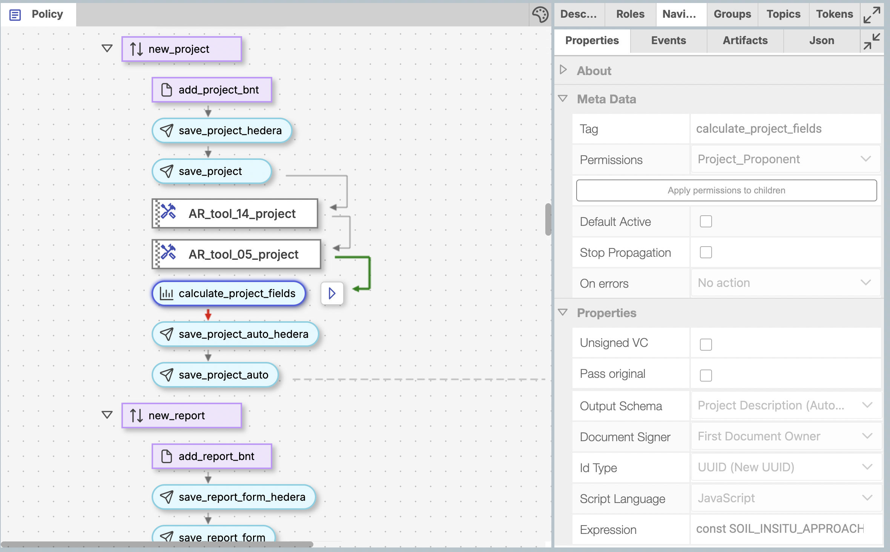

# Chapter 18: Custom Logic Block Development

> Converting methodology equations into executable code using Guardian's customLogicBlock

This chapter teaches you how to implement methodology calculations as working code that produces accurate emission reductions or removals. You'll learn to translate VM0033's mathematical formulas into executable functions, using the ABC Mangrove's real world data artifact as your validation benchmark. By the end, you'll write code that transforms methodology equations into verified carbon credit calculations.

## Learning Objectives

After completing this chapter, you will be able to:

- Translate methodology equations into executable JavaScript or Python code
- Implement formulas for baseline emissions, project emissions, and net emission reductions
- Process monitoring data through mathematical models defined in VM0033 methodology
- Validate equation implementations against Allcot test artifact input/output data
- Handle data precision and validation requirements for accurate calculations
- Structure mathematical calculations for production-ready environmental credit systems

## Prerequisites

- Completed Part IV: Policy Workflow Design and Implementation
- Understanding of VM0033 methodology and equations from Part I
- Basic programming knowledge for implementing mathematical formulas (JavaScript or Python)
- Access to validation artifacts: [equation implementations](../../_shared/artifacts/er-calculations.js), [test input data](../../_shared/artifacts/final-PDD-vc.json), and [Allcot validation spreadsheet](../../_shared/artifacts/VM0033_Allcot_Test_Case_Artifact.xlsx)

## Guardian customLogicBlock: Your Calculation Engine

### The Mathematical Execution Environment

Guardian's [customLogicBlock](../../../available-policy-workflow-blocks/customlogicblock.md) is your calculation engine for environmental methodologies - it's where mathematical equations become executable code. Think of it as a computational engine that processes monitoring data through formulas to produce emission reductions that match methodology equations precisely.

You can write your calculations in **JavaScript** or **Python** - Guardian supports both languages. Most of our examples use JavaScript, but the concepts apply equally to Python.

```javascript
// Guardian customLogicBlock structure - this is your equation implementation workspace
{
  "blockType": "customLogicBlock",
  "tag": "methodology_equation_implementation",
  "expression": "(function calc() {\n  // Implement methodology equations here\n  const documents = arguments[0] || [];\n  // Process monitoring data through scientific formulas\n  return calculatedResults;\n})"
}
```



### Understanding Your Input Data

Every customLogicBlock receives Guardian documents through `arguments[0]`. These contain the measured variables and parameters needed for your methodology equations - real data from environmental monitoring. Here's the data structure you'll process through mathematical formulas:

```javascript
// Real document structure from final-PDD-vc.json
const document = {
  document: {
    credentialSubject: [
      {
        // Real project information
        project_cert_type: "CCB v3.0 & VCS v4.4",
        project_details: {
          registry_vcs: {
            vcs_project_description: "ABC Blue Carbon Mangrove Project..."
          }
        },

        // The data your calculations need
        project_data_per_instance: [{
          project_instance: {
            // Baseline emissions data
            baseline_emissions: { /* monitoring data */ },
            // Project emissions data
            project_emissions: { /* monitoring data */ },
            // Where your calculations go
            net_ERR: {
              total_VCU_per_instance: 0  // You'll calculate this!
            }
          }
        }],

        // Project settings and parameters
        project_boundary: { /* boundary conditions */ },
        individual_parameters: { /* methodology parameters */ }
      }
    ]
  }
};
```

This is actual data from the ABC Blue Carbon Mangrove Project in Senegal - the same project used in our test case spreadsheet.

## Accessing Data Like a Pro

### Field Access Patterns from Production Code

Let's look at how VM0033's production code accesses data. These utility functions from [er-calculations.js](../../_shared/artifacts/er-calculations.js) make your code clean and readable:

```javascript
// These utility functions handle the complexity for you
function getProjectBoundaryValue(data, key) {
    return data.project_boundary_baseline_scenario?.[key]?.included ??
        data.project_boundary_project_scenario?.[key]?.included ??
        undefined;
}

function getIndividualParam(data, key) {
    return data?.individual_parameters?.[key] ?? undefined;
}

function getMonitoringValue(data, key) {
    return data?.monitoring_period_inputs?.[key] ?? undefined;
}

// Using these in your calculations
function processInstance(instance, project_boundary) {
    const data = instance.project_instance;

    // Get project settings cleanly
    const BaselineSoil = getProjectBoundaryValue(project_boundary, 'baseline_soil');

    // Get methodology parameters
    const GWP_CH4 = getIndividualParam(data, 'gwp_ch4');

    // Get monitoring data
    const SubmergenceData = getMonitoringValue(data, 'submergence_monitoring_data');
}
```

The `??` operator provides safe defaults when data might be missing.

## Building Your Calculation Engine

### The Main Calculation Function

Every customLogicBlock starts with a main function that processes the documents. Here's the pattern from VM0033's production code:

```javascript
// Main entry point - this is where your calculations begin
function calc() {
    // Guardian passes documents as arguments[0]
    const documents = arguments[0] || [];
    const document = documents[0].document;
    const creds = document.credentialSubject;

    let totalVcus = 0;

    // Process each project instance (some projects have multiple sites)
    for (const cred of creds) {
        for (const instance of cred.project_data_per_instance) {
            // This is where the real work happens
            processInstance(instance, cred.project_boundary);

            // Add up the verified carbon units
            totalVcus += instance.project_instance.net_ERR.total_VCU_per_instance;
        }

        // Set the total for this credential
        cred.total_vcus = totalVcus;
    }

    // Guardian expects this callback
    done(adjustValues(document.credentialSubject[0]));
}
```

### Processing Project Instances

Each project instance represents a restoration site. The `processInstance` function is where you implement the methodology calculations:

```javascript
function processInstance(instance, project_boundary) {
    const data = instance.project_instance;

    // Extract key parameters you'll need
    const crediting_period = getIndividualParam(data, 'crediting_period') || 40;
    const GWP_CH4 = getIndividualParam(data, 'gwp_ch4') || 28;
    const GWP_N2O = getIndividualParam(data, 'gwp_n2o') || 265;

    // Get project boundary settings
    const baseline_soil_CH4 = getProjectBoundaryValue(project_boundary, 'baseline_soil_ch4');
    const project_soil_CH4 = getProjectBoundaryValue(project_boundary, 'project_soil_ch4');

    // Process the main calculations
    processBaselineEmissions(data.baseline_emissions, /* parameters */);
    processProjectEmissions(data.project_emissions, /* parameters */);
    processNETERR(data.baseline_emissions, data.project_emissions, data.net_ERR, /* parameters */);
}
```

## Implementing Baseline Emission Equations

### From Methodology Equations to Code

Baseline emissions implement the scientific equations from VM0033 Section 8.1 - representing the "business as usual" scenario without restoration. Each equation in the methodology PDF more or less becomes a function in your code.

**Example: VM0033 Equation 8.1.1 - Soil CO2 Emissions**
```
Methodology Equation: GHGBSL,soil,CO₂,i,t = -(44/12) × ΔCBSL,soil,i,t × Ai,t
Code Implementation: asl.GHGBSL_soil_CO2_i_t = -(3.6666666666666665 * asl.delta_C_BSL_soil_i_t)
```

```javascript
function processBaselineEmissions(baseline, crediting_period, baseline_soil_CH4,
    soil_CH4_approach, GWP_CH4, baseline_soil_N2O, soil_N2O_approach, GWP_N2O) {

    // Process each monitoring year
    for (const yearRec of baseline.yearly_data_for_baseline_GHG_emissions ?? []) {
        const { year_t } = yearRec;

        // Process each stratum (different habitat types) within the year
        for (const stratum of yearRec.annual_stratum_parameters ?? []) {
            const { stratum_i } = stratum;
            const sc = stratum.stratum_characteristics ?? {};
            const asl = stratum.annual_stratum_level_parameters ?? {};

            // Here's where AR Tool calculations integrate
            asl.delta_CTREE_BSL_i_t_ar_tool_14 = stratum.ar_tool_14?.delta_C_TREE ?? 0;
            asl.delta_CSHRUB_BSL_i_t_ar_tool_14 = stratum.ar_tool_14?.delta_C_SHRUB ?? 0;

            // Calculate biomass changes (trees and shrubs)
            const const_12_by_44 = 0.2727272727272727; // Carbon conversion factor
            asl.delta_C_BSL_tree_or_shrub_i_t = const_12_by_44 *
                (asl.delta_CTREE_BSL_i_t_ar_tool_14 + asl.delta_CSHRUB_BSL_i_t_ar_tool_14);

            // Calculate soil CO2 emissions based on methodology approach
            if (asl.is_soil) {
                const method = sc.co2_emissions_from_soil;

                switch (method) {
                    case "Field-collected data":
                        // Direct measurements from field
                        asl.GHGBSL_soil_CO2_i_t = -(3.6666666666666665 * asl.delta_C_BSL_soil_i_t);
                        break;
                    case "Proxies":
                        // Using proxy data when direct measurement isn't available
                        asl.GHGBSL_soil_CO2_i_t = asl.GHG_emission_proxy_GHGBSL_soil_CO2_i_t;
                        break;
                    default:
                        // Sum of individual emission sources
                        asl.GHGBSL_soil_CO2_i_t =
                            (asl.GHGBSL_insitu_CO2_i_t ?? 0) +
                            (asl.GHGBSL_eroded_CO2_i_t ?? 0) +
                            (asl.GHGBSL_excav_CO2_i_t ?? 0);
                }
            } else {
                asl.GHGBSL_soil_CO2_i_t = 0;
            }

            // Calculate CH4 emissions if included in project boundary
            if (baseline_soil_CH4) {
                switch (soil_CH4_approach) {
                    case "IPCC emission factors":
                        asl.GHGBSL_soil_CH4_i_t = asl.IPCC_emission_factor_ch4_BSL * GWP_CH4;
                        break;
                    case "Proxies":
                        asl.GHGBSL_soil_CH4_i_t = asl.GHG_emission_proxy_ch4_BSL * GWP_CH4;
                        break;
                    default:
                        asl.GHGBSL_soil_CH4_i_t = asl.CH4_BSL_soil_i_t * GWP_CH4;
                }
            } else {
                asl.GHGBSL_soil_CH4_i_t = 0;
            }

            // Total baseline emissions per stratum
            asl.GHGBSL_soil_i_t = asl.A_i_t * (
                asl.GHGBSL_soil_CO2_i_t -
                asl.Deduction_alloch +
                asl.GHGBSL_soil_CH4_i_t +
                asl.GHGBSL_soil_N2O_i_t
            );
        }

        // Aggregate across all strata for this year
        const sum_delta_C_BSL_biomass = yearRec.annual_stratum_parameters
            .reduce((acc, s) => acc + (Number(s.annual_stratum_level_parameters
                .delta_C_BSL_biomass_i_t) || 0), 0);

        yearRec.GHG_BSL_biomass = -(sum_delta_C_BSL_biomass * 3.6666666666666665);
    }
}
```

## Implementing Project Emission Equations

### Translating VM0033 Section 8.2 Equations

Project emissions implement equations from VM0033 Section 8.2 - the restoration scenario calculations. These equations typically show reduced emissions and increased sequestration compared to baseline.

**Example: VM0033 Equation 8.2.3 - Project Biomass Change**
```
Methodology Equation: ΔCWPS,biomass,i,t = ΔCWPS,tree or shrub,i,t + ΔCWPS,herb,i,t
Code Implementation: asl.delta_C_WPS_biomass_i_t = asl.delta_C_WPS_tree_or_shrub_i_t + asl.delta_C_WPS_herb_i_t
```

```javascript
function processProjectEmissions(project, project_soil_CH4, project_soil_CH4_approach,
    GWP_CH4, project_soil_N2O, soil_N2O_approach, GWP_N2O) {

    for (const yearRec of project.yearly_data_for_project_GHG_emissions ?? []) {
        for (const stratum of yearRec.annual_stratum_parameters ?? []) {
            const asl = stratum.annual_stratum_level_parameters ?? {};
            const sc = stratum.stratum_characteristics ?? {};

            // AR Tool calculations for project scenario
            asl.delta_C_TREE_PROJ_i_t_ar_tool_14 = stratum.ar_tool_14?.delta_C_TREE ?? 0;
            asl.delta_C_SHRUB_PROJ_i_t_ar_tool_14 = stratum.ar_tool_14?.delta_C_SHRUB ?? 0;

            // Project biomass calculations (usually positive - sequestration!)
            asl.delta_C_WPS_tree_or_shrub_i_t = 0.2727272727272727 *
                (asl.delta_C_TREE_PROJ_i_t_ar_tool_14 + asl.delta_C_SHRUB_PROJ_i_t_ar_tool_14);

            asl.delta_C_WPS_biomass_i_t =
                asl.delta_C_WPS_tree_or_shrub_i_t + asl.delta_C_WPS_herb_i_t;

            // Project soil emissions (usually much lower than baseline)
            if (asl.is_soil) {
                const method = sc.co2_emissions_from_soil;

                switch (method) {
                    case "Field-collected data":
                        asl.GHGWPS_soil_CO2_i_t = -(3.6666666666666665 * asl.delta_C_WPS_soil_i_t);
                        break;
                    case "Proxies":
                        asl.GHGWPS_soil_CO2_i_t = asl.GHG_emission_proxy_GHGWPS_soil_CO2_i_t;
                        break;
                    default:
                        asl.GHGWPS_soil_CO2_i_t =
                            (asl.GHGWPS_insitu_CO2_i_t ?? 0) +
                            (asl.GHGWPS_eroded_CO2_i_t ?? 0) +
                            (asl.GHGWPS_excav_CO2_i_t ?? 0);
                }
            }

            // Total project soil emissions per stratum
            asl.GHGWPS_soil_i_t = asl.A_i_t * (
                asl.GHGWPS_soil_CO2_i_t -
                asl.Deduction_alloch_WPS +
                asl.GHGWPS_soil_CH4_i_t +
                asl.GHGWPS_soil_N2O_i_t
            );
        }

        // Year-level project emissions aggregation
        const sum_delta_C_WPS_biomass = yearRec.annual_stratum_parameters.reduce(
            (acc, s) => acc + (Number(s.annual_stratum_level_parameters.delta_C_WPS_biomass_i_t) || 0), 0);

        yearRec.GHG_WPS_biomass = -(sum_delta_C_WPS_biomass * 3.6666666666666665);
    }
}
```

## Implementing Net Emission Reduction Equations

### VM0033 Section 8.5 - The Final Scientific Calculation

This implements VM0033's core equation that transforms baseline and project emissions into verified carbon units (VCUs). Each line of code corresponds to specific equations in Section 8.5 of the methodology.

**Example: VM0033 Equation 8.5.1 - Net Emission Reductions**
```
Methodology Equation: NERRₜ = ΣGHGᵦₛₗ,ₜ - ΣGHGwₚₛ,ₜ - ΣGHGₗₖ,ₜ - ΣGHGwₚₛ,soil deduction,ₜ + FRPₜ
Code Implementation: rec.NERRWE = getGHGBSL(...) + getGHGWPS(...) + rec.FRP - rec.GHG_LK - rec.GHG_WPS_soil_deduction
```

```javascript
function processNETERR(baseline, project, netErrData, buffer_percentage, allowable_uncert, NERError) {

    // Combine baseline and project emissions by year
    const perYear = new Map();

    // Process baseline emissions
    for (const yr of baseline.yearly_data_for_baseline_GHG_emissions ?? []) {
        const total = (yr.annual_stratum_parameters ?? []).reduce((a, s) =>
            a + +(s.annual_stratum_level_parameters?.GHGBSL_soil_CO2_i_t ?? 0) *
                +(s.annual_stratum_level_parameters?.A_i_t ?? 0), 0);

        perYear.set(yr.year_t, {
            year_t: yr.year_t,
            sumation_GHG_BSL_soil_CO2_i_A_i: total,
            sumation_GHG_WPS_soil_CO2_i_A_i: 0
        });
    }

    // Process project emissions
    for (const yr of project.yearly_data_for_project_GHG_emissions ?? []) {
        const total = (yr.annual_stratum_parameters ?? []).reduce((a, s) =>
            a + +(s.annual_stratum_level_parameters?.GHGWPS_soil_CO2_i_t ?? 0) *
                +(s.annual_stratum_level_parameters?.A_i_t ?? 0), 0);

        if (perYear.has(yr.year_t)) {
            perYear.get(yr.year_t).sumation_GHG_WPS_soil_CO2_i_A_i = total;
        }
    }

    // Calculate annual net emission reductions
    netErrData.net_ERR_calculation_per_year = [...perYear.values()]
        .sort((a, b) => a.year_t - b.year_t)
        .map(rec => {
            // NERRWE calculation (Net Emission Reduction from Wetland Enhancement)
            rec.NERRWE = getGHGBSL(baseline.yearly_data_for_baseline_GHG_emissions, rec.year_t) +
                        getGHGWPS(project.yearly_data_for_project_GHG_emissions, rec.year_t) +
                        rec.FRP - rec.GHG_LK - rec.GHG_WPS_soil_deduction;

            // Apply methodology caps if configured
            rec.NERRWE_capped = rec.NERRWE;
            rec.NER_t = rec.NERRWE;

            // Apply uncertainty and error adjustments (this is crucial!)
            rec.adjusted_NER_t = rec.NER_t * (1 - NERError + allowable_uncert);

            return rec;
        });

    // Calculate buffer deductions and final VCUs
    const netErrArr = netErrData.net_ERR_calculation_per_year;

    netErrArr.forEach((rec, idx, arr) => {
        if (idx === 0) {
            // First year calculation
            rec.buffer_deduction = rec.NER_stock_t * buffer_percentage;
            rec.VCU = rec.adjusted_NER_t - rec.buffer_deduction;
        } else {
            // Subsequent years account for previous calculations
            const prevRec = arr[idx - 1];
            rec.buffer_deduction = calculateNetERRChange(
                rec.adjusted_NER_t, prevRec.adjusted_NER_t,
                rec.NER_stock_t, prevRec.NER_stock_t, buffer_percentage);
            rec.VCU = calculateNetVCU(rec.adjusted_NER_t, prevRec.adjusted_NER_t, rec.buffer_deduction);
        }
    });

    // Calculate total VCUs for this project instance
    netErrData.total_VCU_per_instance = netErrArr.reduce((sum, rec) => sum + (rec.VCU || 0), 0);
}
```

## Handling Real-World Data Challenges

### Defensive Programming Patterns

Real project data is messy. Projects miss monitoring periods, equipment fails, and data gets corrupted. They might send a different data type than you might expect. Your code needs to handle this gracefully:

```javascript
// Safe number conversion with defaults
function safeNumber(value, defaultValue = 0) {
    const num = Number(value);
    return isNaN(num) || !isFinite(num) ? defaultValue : num;
}

// Safe array access
const yearlyData = baseline.yearly_data_for_baseline_GHG_emissions ?? [];
const stratumParams = yearRec.annual_stratum_parameters ?? [];

// Division by zero protection
function calculateRate(numerator, denominator) {
    if (denominator === 0 || denominator === null || denominator === undefined) {
        return 0; // Or whatever makes sense for your methodology
    }
    return numerator / denominator;
}

// Range validation
function validateEmissionFactor(value, min = 0, max = 1000) {
    const num = safeNumber(value);
    if (num < min || num > max) {
        console.warn(`Emission factor ${num} outside expected range [${min}, ${max}]`);
        return Math.max(min, Math.min(max, num)); // Clamp to valid range
    }
    return num;
}
```

### Error Handling

```javascript
function processInstanceSafely(instance, project_boundary) {
    try {
        const data = instance.project_instance;

        // Validate required data exists
        if (!data.baseline_emissions || !data.project_emissions) {
            throw new Error("Missing required emissions data");
        }

        // Process with validation
        processInstance(instance, project_boundary);

        // Validate results make sense
        const totalVCU = data.net_ERR.total_VCU_per_instance;
        if (totalVCU < 0) {
            console.warn("Negative VCUs calculated - check input data");
        }

    } catch (error) {
        console.error(`Error processing instance: ${error.message}`);
        // Set safe defaults rather than crashing
        instance.project_instance.net_ERR.total_VCU_per_instance = 0;
    }
}
```

## Validation: Allcot Test Artifact as Your Benchmark

### Ensuring Mathematical Accuracy

The [Allcot test artifact](../../_shared/artifacts/VM0033_Allcot_Test_Case_Artifact.xlsx) is your validation benchmark - it contains input parameters and expected output results calculated manually according to VM0033 methodology equations. Your code must reproduce these results exactly to ensure mathematical accuracy.

Your equation implementations must produce the same results as the manual calculations to be valid.

```javascript
// Validation against Allcot test artifact results
// These are the manually calculated results from the methodology spreadsheet
const allcotValidationBenchmark = {
    2022: { VCU: 0.01 },        // Hand-calculated using VM0033 equations
    2023: { VCU: 0.29 },        // Each value validated by methodology experts
    2024: { VCU: 4.31 },
    2025: { VCU: 1307.66 },
    // ... complete 40-year projection
    total_VCU_40_years: 2861923.07  // Sum of all manually calculated VCUs
};

function validateEquationImplementation(calculatedResults) {
    let totalCalculated = 0;
    let validationReport = {
        passedTests: 0,
        totalTests: 0,
        maxError: 0,
        scientificallyValid: true
    };

    // Compare each year's calculation against manual spreadsheet results
    for (const yearResult of calculatedResults.net_ERR_calculation_per_year) {
        const year = yearResult.year_t;
        const calculatedVCU = yearResult.VCU;
        const benchmarkVCU = allcotValidationBenchmark[year]?.VCU;

        if (benchmarkVCU !== undefined) {
            const absoluteError = Math.abs(calculatedVCU - benchmarkVCU);
            const relativeError = benchmarkVCU !== 0 ? (absoluteError / benchmarkVCU * 100) : 0;

            validationReport.totalTests++;
            validationReport.maxError = Math.max(validationReport.maxError, relativeError);

            if (relativeError < 0.01) { // High precision: < 0.01% error
                validationReport.passedTests++;
            } else {
                console.warn(`Equation validation failed for Year ${year}:`);
                console.warn(`  Calculated: ${calculatedVCU.toFixed(6)}`);
                console.warn(`  Expected (manual): ${benchmarkVCU.toFixed(6)}`);
                console.warn(`  Error: ${relativeError.toFixed(6)}%`);
                validationReport.scientificallyValid = false;
            }
        }

        totalCalculated += calculatedVCU;
    }

    // Validate total against manual calculation
    const totalError = Math.abs(totalCalculated - allcotValidationBenchmark.total_VCU_40_years) /
                      allcotValidationBenchmark.total_VCU_40_years * 100;

    console.log('=== VALIDATION REPORT ===');
    console.log(`Equation Implementation vs Manual Calculation:`);
    console.log(`  Tests Passed: ${validationReport.passedTests}/${validationReport.totalTests}`);
    console.log(`  Max Error: ${validationReport.maxError.toFixed(6)}%`);
    console.log(`  Total VCU Error: ${totalError.toFixed(6)}%`);
    console.log(`  Validation Status: ${validationReport.scientificallyValid ? 'VALID' : 'INVALID'}`);

    return validationReport.scientificallyValid && totalError < 0.001; // Must be < 0.001% error
}
```

## Python Alternative

### Writing CustomLogicBlocks in Python

Guardian also supports Python for customLogicBlock development. The concepts are the same, just different syntax:

```python
def calc():
    """Main calculation function - Python version"""
    import sys
    documents = sys.argv[0] if len(sys.argv) > 0 else []

    if not documents:
        return {}

    document = documents[0]['document']
    creds = document['credentialSubject']

    total_vcus = 0

    for cred in creds:
        for instance in cred.get('project_data_per_instance', []):
            process_instance(instance, cred.get('project_boundary', {}))
            total_vcus += instance['project_instance']['net_ERR'].get('total_VCU_per_instance', 0)

        cred['total_vcus'] = total_vcus

    return document['credentialSubject'][0]

def process_baseline_emissions(baseline, **kwargs):
    """Process baseline emissions - Python version"""
    gwp_ch4 = kwargs.get('GWP_CH4', 28)

    for year_rec in baseline.get('yearly_data_for_baseline_GHG_emissions', []):
        year_t = year_rec['year_t']

        for stratum in year_rec.get('annual_stratum_parameters', []):
            asl = stratum.get('annual_stratum_level_parameters', {})

            # Calculate emissions with safe defaults
            ch4_baseline = asl.get('CH4_BSL_soil_i_t', 0)
            asl['GHGBSL_soil_CH4_i_t'] = ch4_baseline * gwp_ch4
```

Choose the language you're more comfortable with - both produce identical results.

## Testing Your Code

### Quick Testing Tips

While Chapter 21 covers comprehensive testing, here are quick validation techniques while you're developing:

**1. Console Logging for Debug**
```javascript
debug('Processing year:', year_t);
debug('Baseline emissions:', asl.GHGBSL_soil_CO2_i_t);
debug('Project emissions:', asl.GHGWPS_soil_CO2_i_t);
```

**2. Guardian's Built-in Testing**
Use Guardian's customLogicBlock testing interface (covered in Chapter 21) to test with real [final-PDD-vc.json](../../_shared/artifacts/final-PDD-vc.json) data.

**3. Unit Testing Individual Functions**
```javascript
// Quick test of a calculation function
function testSoilEmissions() {
    const testData = { delta_C_BSL_soil_i_t: 100, A_i_t: 10 };
    const result = calculateSoilCO2Emissions(testData);
    const expected = -(3.6666666666666665 * 100) * 10;
    debug('Test passed:', Math.abs(result - expected) < 0.01);
}
```

## Real Results: ABC Mangrove Project

### Production Calculation Results

Using VM0033's calculation engine with the ABC Blue Carbon Mangrove Project data, here are the actual VCU projections over the 40-year crediting period(data added till 2055 only):

| Year | VCU Credits | Year | VCU Credits | Year | VCU Credits | Year | VCU Credits |
| ---- | ----------- | ---- | ----------- | ---- | ----------- | ---- | ----------- |
| 2022 | 0.01        | 2032 | 104,012.50  | 2042 | 122,680.75  | 2052 | 75,559.80   |
| 2023 | 0.29        | 2033 | 110,576.46  | 2043 | 120,929.68  | 2053 | 72,200.65   |
| 2024 | 4.31        | 2034 | 115,770.40  | 2044 | 118,625.12  | 2054 | 69,072.40   |
| 2025 | 1,307.66    | 2035 | 119,502.79  | 2045 | 115,610.59  | 2055 | 66,174.64   |

**Total Project Impact: 2,861,923 VCU credits over 40 years**

This demonstrates what your code should produce - substantial carbon credits from mangrove restoration that follow the methodology calculations exactly.

## Chapter Summary

You've learned how to translate scientific equations from environmental methodologies into executable code that produces verified carbon credits. The key principles:

- **Equation-to-Code Translation** - Every methodology equation becomes a function in your customLogicBlock
- **Scientific Precision Required** - Use defensive programming to handle edge cases while maintaining mathematical accuracy
- **Allcot Test Artifact is Your Benchmark** - Your code must reproduce manual calculations exactly for scientific validity
- **Field Access Utilities** enable clean implementation of complex mathematical formulas
- **Both JavaScript and Python supported** - choose the language that best implements your equations

Your equation implementations are the foundation of environmental credit integrity. When coded properly, they transform scientific methodology equations into verified carbon units that represent real, measured emission reductions from restoration projects.

The next chapter explores Formula Linked Definitions (FLDs) for managing parameter relationships, and Chapter 21 covers comprehensive testing to ensure your calculations are production-ready.

---