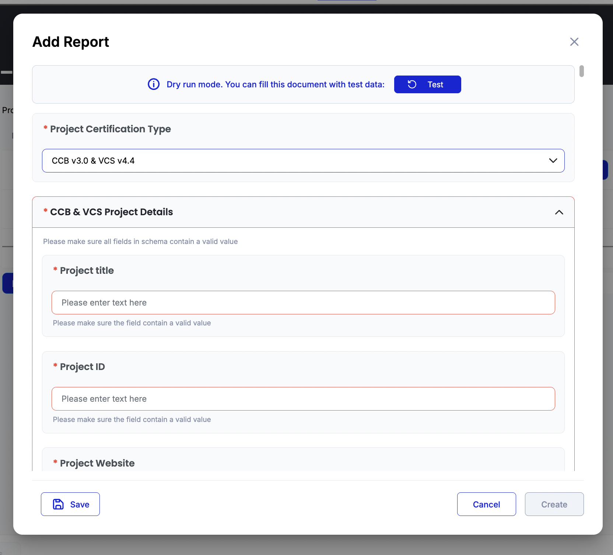

# Chapter 22: End-to-End Policy Testing

> Testing complete methodology workflows across all stakeholder roles using Guardian's dry-run capabilities and VM0033 production patterns

Part V covered calculation writing and testing within individual blocks. Chapter 22 takes you beyond component testing to validate entire methodology workflows. Using Guardian's dry-run mode and VM0033's multi-stakeholder patterns, you'll learn to test complete project lifecycles from PDD submission through VCU token issuance.

Real-world methodology deployment demands testing workflows that span months of project activity, multiple stakeholder roles, and hundreds of documents. Guardian's dry-run system lets you simulate these workflows without blockchain costs or time delays.

## Multi-Role Testing Framework

### Virtual User Management in Dry-Run Mode

Guardian's dry-run mode creates a sandbox environment where you can simulate multiple users working simultaneously on different parts of your methodology. This approach mirrors production deployment while keeping testing fast and cost-effective.

**Setting Up Dry-Run Testing Environment:**

1. **Import VM0033 Policy** - Start with the [VM0033 policy](../../_shared/artifacts/vm0033-policy.json) from shared artifacts
2. **Enable Dry-Run Mode** - Switch policy status from Draft to Dry-Run
3. **Create Virtual Users** - Set up users for each role (Project Proponent, VVB, OWNER)
4. **Execute Complete Workflows** - Test full project lifecycle with role transitions

.png>)

.png>)

.png>)

### Creating Virtual Users for Multi-Role Testing

Guardian allows Standard Registry users (OWNER role) to create virtual users for testing different stakeholder workflows. This feature enables testing approval chains and document handoffs. You can do so via API as well.

**Testing User Progression Pattern:**

1. **Project Developer** submits PDD using VM0033 project description schema
2. **Standard Registry** reviews and lists project on their platform
3. **VVB** accepts validation assignment from project proponent and conducts project review
4. **VVB** submits validation report with project assessment
5. **Standard Registry** approves or rejects project based on VVB validation
6. **Project Developer** submits monitoring reports over crediting period
7. **VVB** verifies monitoring data and submits verification reports
8. **Standard Registry** issues VCU tokens based on verified emission reductions

### VM0033 Complete Workflow Testing

Let's walk through testing VM0033's complete workflow using the navigation structure from the [policy JSON](../../_shared/artifacts/vm0033-policy.json). This demonstrates how dry-run testing validates stakeholder interactions across the full methodology implementation.

#### Project Proponent Workflow Testing

**Step 1: Project Creation and PDD Submission**

The Project Proponent starts by accessing the "Projects" section and creating a new project using VM0033's PDD schema.

.png>)

Testing should validate:

* PDD form captures all required VM0033 parameters
* Conditional schema sections display based on certification type (VCS vs VCS+CCB)
* Calculation inputs integrate with custom logic blocks
* Document submission creates proper audit trail

.png>)

**Step 2: VVB Selection and Assignment**

After PDD submission and approval by registry, the project developer selects a VVB for validation. Testing confirms:

* VVB selection interface displays approved VVB list
* Assignment notification reaches selected VVB
* Project status updates reflect VVB assignment
* Document access permissions transfer correctly

.png>)

.png>)

#### VVB Workflow Testing

**Step 3: Project Validation Process**

VVBs access assigned projects through their dedicated interface. Validation testing includes:

* Project document review and download capabilities
* Validation checklist and assessment tools
* Site visit data collection and documentation
* Validation report submission using VM0033 validation schema

.png>)

.png>)

.png>)

**Step 4: Monitoring Report Verification**

During the crediting period, VVBs verify monitoring reports:

* Annual monitoring data review and validation
* Field measurement verification against monitoring plan
* Calculation accuracy assessment using VM0033 test artifacts
* Verification report submission with emission reduction confirmation





#### Standard Registry (OWNER) Workflow Testing

**Step 5: Project Pipeline Management**

Standard Registry manages the complete project pipeline:

* Project listing approval after successful validation
* VVB accreditation and performance monitoring
* Monitoring report review and compliance tracking
* Token issuance authorization based on verified reductions
* A verified presentation of tokens minted, each mint must have a trace of all the steps and data backing it.

### Testing Workflow State Transitions

Guardian policies manage complex state transitions across multiple documents and stakeholders. Effective testing validates these transitions handle edge cases and error conditions properly.

**Document Status Flow Testing:**

```
PDD: Draft → Submitted → Under Review → Validated → Approved
Monitoring Report: Draft → Submitted → Under Verification → Verified → Credits Issued
VVB Status: Applicant → Under Review → Approved → Active → Suspended/Revoked
```

**Potential Error Conditions:**

* VVB rejection scenarios and resubmission workflows
* Incomplete document submission handling
* Calculation errors and correction procedures
* Role permission violations and access control
* Concurrent user conflicts and resolution

## Integration Testing with Production-Scale Data

### Large Dataset Processing Validation

VM0033 projects can involve hundreds of hectares with complex stratification requiring extensive monitoring data. Testing with realistic data volumes validates performance and accuracy under production conditions.

**Creating Test Datasets Based on VM0033 Allcot Case:**

Using the VM0033\_Allcot\_Test\_Case\_Artifact.xlsx as foundation, create expanded datasets:

```javascript
// Generate multiple project instances for load testing
function generateTestProjects(baseProject, count) {
  const testProjects = [];
  for (let i = 0; i < count; i++) {
    const project = JSON.parse(JSON.stringify(baseProject));
    project.project_details.G5 = `Test Project ${i + 1}`;
    project.baseline_scenario.area_data.total_project_area = 100 + (i * 50);
    testProjects.push(project);
  }
  return testProjects;
}

// Test concurrent project submissions
const multipleProjects = generateTestProjects(vm0033BaseProject, 25);
```

### Multi-Year Monitoring Period Simulation

VM0033 projects can operate over 100-year crediting periods with annual monitoring in best scenarios. Testing long-term scenarios validates data consistency and calculation accuracy across extended timeframes using data patterns from our [VM0033 test case artifact](../../_shared/artifacts/VM0033_Allcot_Test_Case_Artifact.xlsx).

Testing should validate:

* Calculation consistency across monitoring/crediting periods
* Carbon stock accumulation tracking over decades
* Emission reduction trend validation

## Cross-Component Integration Validation

### Schema-Workflow-Calculation Integration Testing

Part VI testing validates that components from Parts III-V work together seamlessly. This integration testing catches issues that component testing misses.

**Schema Field Mapping Validation:**

Using VM0033's schema structure, test field key consistency:

```javascript
// Verify schema field keys match calculation block references
const pddSchema = vm0033Policy.schemas.find(s => s.name === "PDD Schema");
const calculationBlock = vm0033Policy.blocks.find(b => b.tag === "er_calculations");

// Test field key mapping
function validateFieldMapping(schema, calculationCode) {
  const schemaFields = extractFieldKeys(schema);
  const calculationReferences = extractFieldReferences(calculationCode);

  const unmappedFields = calculationReferences.filter(
    ref => !schemaFields.includes(ref)
  );

  if (unmappedFields.length > 0) {
    console.error("Unmapped calculation references:", unmappedFields);
    return false;
  }
  return true;
}
```

**Important blocks for integration testing:**

Test document flow through complete policy execution:

1. **requestVcDocumentBlock** captures schema data correctly
2. **customLogicBlock** processes schema fields without errors
3. **sendToGuardianBlock** stores calculated results properly
4. **mintTokenBlock** uses calculation outputs for token quantities

### External Tool Integration

VM0033 integrates AR-Tool14 and AR-Tool05 for biomass and soil carbon calculations. Make sure you validate that these tools work correctly within complete policy execution.

## Testing Best Practices and Procedures

### Incremental Testing Approach

Start with simple workflows and progressively add complexity. This approach isolates issues and builds confidence in policy functionality.

**Testing Progression:**

1. **Single User, Single Document** - Basic PDD submission and processing
2. **Single User, Complete Project** - Full project lifecycle for one user type
3. **Multi-User, Single Project** - Role interactions and handoffs
4. **Multi-User, Multiple Projects** - Concurrent operations and scaling
5. **Production Simulation** - Full-scale testing with realistic data volumes

### Dry-Run Artifacts and Validation

Guardian's dry-run mode creates artifacts that help validate testing results and provide audit trails for methodology compliance.

**Dry-Run Artifacts:**

* **Transaction Log**: Mock blockchain transactions that would occur in production
* **Document Archive**: Complete document history with version tracking
* **IPFS Files**: Files that would be stored in distributed storage
* **Token Operations**: Credit issuance and transfer records
* **Audit Trail**: Complete workflow execution history


### Test Data Management and Version Control

Maintain test datasets that evolve with your methodology. Version control ensures testing remains valid as policies change.

**Sample Test Data Organization:**

```
test-data/
├── vm0033-base-cases/
│   ├── simple-project.json
│   ├── complex-stratified-project.json
│   └── multi-year-monitoring.json
├── edge-cases/
│   ├── zero-emissions.json
│   ├── maximum-parameters.json
│   └── error-conditions.json
└── performance/
    ├── large-dataset.json
    ├── concurrent-users.json
    └── long-term-simulation.json
```

Each test case should include:

* Input parameters matching your schema structure
* Expected calculation results from methodology spreadsheets
* Documentation explaining test scenario purpose
* Success criteria and validation checkpoints

## Chapter Summary

End-to-end testing validates that your methodology digitization works correctly under real-world conditions. Guardian's dry-run capabilities provide the foundation for this testing, enabling multi-role workflows, production-scale data processing, and component integration validation.

### Key Testing Strategies:

**Multi-Role Testing Framework:**

* Virtual user creation and management
* Complete stakeholder workflow simulation
* Role transition and permission testing
* Document handoff validation

**Production-Scale Validation:**

* Large dataset processing performance
* Multi-year monitoring period simulation
* Concurrent user and project handling
* Integration with external systems

**Cross-Component Integration:**

* Schema-workflow-calculation consistency
* Field mapping and data flow validation
* External tool integration testing
* End-to-end document processing

### Testing Workflow:

1. **Setup dry-run environment** with VM0033 policy configuration
2. **Create virtual users** representing each methodology stakeholder
3. **Execute complete workflows** following VM0033 navigation patterns
4. **Validate integration** between schemas, workflows, and calculations
5. **Test production scenarios** with realistic data volumes and timeframes
6. **Document results** and maintain test case version control

This testing approach ensures your methodology implementation handles the complexity and scale requirements of production carbon credit programs while maintaining accuracy and compliance with methodology requirements.

***

**Next Steps:** Chapter 23 covers API integration and automation, building on the testing foundation established here to enable programmatic methodology operations and external system integration.
