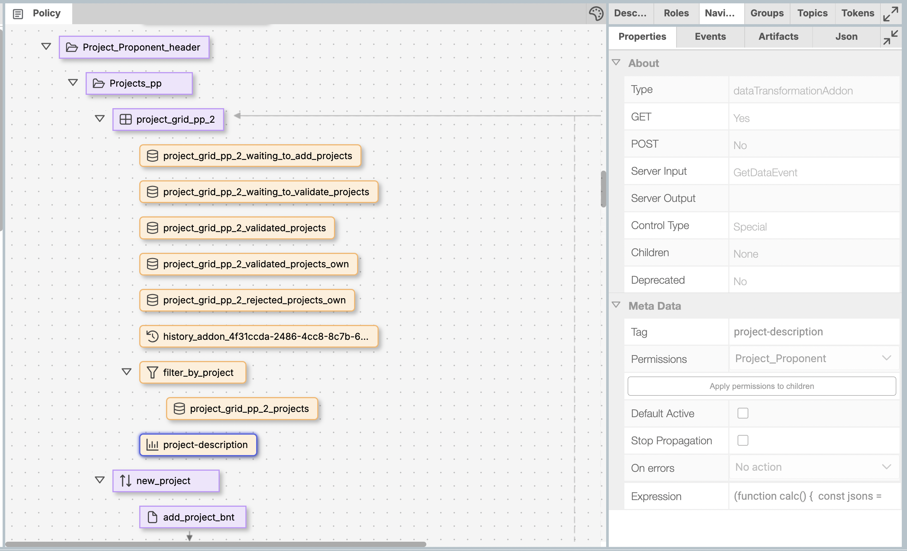
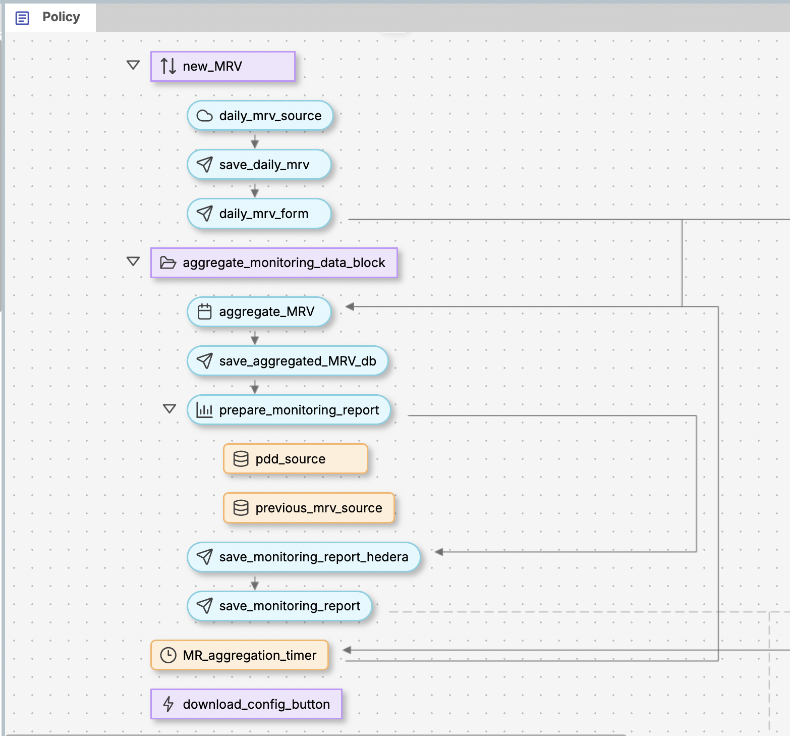

# Chapter 27: Integration with External Systems

> Strategies for data exchange between Guardian and external platforms

This chapter demonstrates two critical integration patterns for connecting Guardian policies with external environmental registry systems. You'll learn how to transform Guardian data for external platforms like Verra Project Hub and how to receive MRV data from external devices and systems.

## Integration Architecture Overview

Guardian's policy workflow engine supports bidirectional integration with external systems through specialized workflow blocks and API endpoints. This enables Guardian to function as both a data provider and consumer in complex environmental certification ecosystems.

**Two Primary Integration Patterns:**

1. **Data Transformation for External Systems**: Converting Guardian project data to external system formats
2. **External Data Reception**: Accepting monitoring data from external devices and aggregating systems

## Use Case 1: Transforming Data for External Systems

### Introduction to dataTransformationAddon

Guardian's `dataTransformationAddon` block enables transformation of Guardian project data into formats required by external registry systems. This block executes JavaScript transformation code that converts Guardian document structures into external API formats.

**Primary Applications:**

* Submitting project data to Verra Project Hub
* Integrating with Gold Standard registry systems
* Preparing data for CDM project submissions
* Custom registry platform integration

### VM0033 DataTransformation Implementation

The VM0033 policy demonstrates production-grade data transformation in the project-description block:

```json
{
  "id": "819d94e8-7d1d-43c1-a228-9b6fa1982e3f",
  "blockType": "dataTransformationAddon",
  "defaultActive": false,
  "permissions": ["Project_Proponent"],
  "onErrorAction": "no-action",
  "uiMetaData": {},
  "expression": "(function calc() { /* transformation code */ })"
}
```



### Transformation Code Structure

The dataTransformationAddon block executes JavaScript code that transforms Guardian documents into any format needed. Here's the core transformation pattern from VM0033:

```javascript
(function calc() {
  const jsons = [];
  if (documents && documents.length > 0) {
    documents.forEach((doc) => {
      const document = doc.document;

      // Build external registry format
      const json = {
        id: '',
        projectNumber: null,
        accountId: '',
        standardTemplate: '',
        standardTemplateName: '',
        methodologyTemplateTitle: '',
        methodologyTemplate: '',
        projectName: '',
        projectDescription: '',
        website: null,
        projectSubmissionStatus: 'Draft',
        fetchProjectBoundaryFromCalculationInput: false,
        estimatedProjectStartDate: '',
        creditPeriod: {
          startDate: '',
          endDate: '',
        },
        projectSize: null,
        averageAnnualVolume: null,
        // ... complete transformation structure
      };

      // Map Guardian fields to external format
      if (document.credentialSubject && document.credentialSubject.length > 0) {
        const credentialSubject = document.credentialSubject[0];

        // Direct field mapping
        json.projectName = credentialSubject.projectTitle || '';
        json.projectDescription = credentialSubject.projectObjective || '';
        json.website = credentialSubject.projectWebsite || null;

        // Complex nested mappings
        if (credentialSubject.creditingPeriod) {
          json.creditPeriod.startDate = credentialSubject.creditingPeriod.startDate || '';
          json.creditPeriod.endDate = credentialSubject.creditingPeriod.endDate || '';
        }

        // Conditional transformations
        if (credentialSubject.projectBoundary) {
          json.fetchProjectBoundaryFromCalculationInput = true;
          json.calculationInputs = {
            projectBoundaryProject: credentialSubject.projectBoundary.project || [],
            projectBoundaryBaseline: credentialSubject.projectBoundary.baseline || []
          };
        }
      }

      jsons.push(json);
    });
  }
  return jsons;
})()
```

### Data Transformation Best Practices

**1. Field Mapping Strategy**

```javascript
// Use defensive programming for nested objects
const projectData = credentialSubject?.projectDetails?.data || {};
const creditPeriod = credentialSubject?.creditingPeriod || {};

// Provide defaults for required external fields
json.projectSubmissionStatus = credentialSubject.status || 'Draft';
json.projectType = credentialSubject.projectType || '14'; // Default for project hub
```

**2. Data Type Conversions**

```javascript
// Date format transformations
json.estimatedProjectStartDate = credentialSubject.startDate ?
  new Date(credentialSubject.startDate).toISOString().split('T')[0] : '';

// Numeric conversions
json.projectSize = credentialSubject.projectArea ?
  parseFloat(credentialSubject.projectArea) : null;
```

**3. Complex Object Transformations**

```javascript
// VCS-specific transformations
if (credentialSubject.vcsDetails) {
  json.vcs = {
    afoluActivities: credentialSubject.vcsDetails.activities || [],
    projectValidatorId: credentialSubject.assignedVVB || null,
    additionalProjectTypes: credentialSubject.vcsDetails.additionalTypes || [],
    earlyAction: credentialSubject.vcsDetails.earlyAction || null
  };
}

// Location data transformation
if (credentialSubject.projectLocations) {
  json.locations = credentialSubject.projectLocations.map(loc => ({
    country: loc.country,
    region: loc.region,
    coordinates: {
      latitude: loc.lat,
      longitude: loc.lng
    }
  }));
}
```

## Use Case 2: Receiving Data from External Systems

### External Data Reception Architecture

Guardian's `externalDataBlock` enables reception of monitoring data from external devices, IoT sensors, and third-party MRV systems. This pattern can be used for automated monitoring reports and real-time project tracking. It is the approaches used in Gold standard's metered energy cooking policy implemented on Guardian.



**External Data Flow:**

1. Project validation triggers MRV configuration generation. Download config button binds to validated projects.
2. Download MRV configuration file
3. External devices/servers use the config to prepare a VC and send data to `/external` endpoint
4. `externalDataBlock` processes and validates incoming data
5. Data aggregates into monitoring reports with a frequency set in the timer block.

### MRV Configuration Download Pattern

Guardian implements a download-based pattern for external data integration. When a project is validated, a comprehensive MRV configuration file becomes available for download:

```json
{
  "url": "https://guardianservice.app/api/v1/external",
  "topic": "0.0.6365927",
  "hederaAccountId": "0.0.1752750328257",
  "hederaAccountKey": "302e020100300506032b6570042204205ee9abd705b66b67ebd324c717df5c66551e1be5f02f1746585389683b38970e",
  "installer": "did:hedera:testnet:EL6mjqKzu6W4fcuSbXXY9Z3GrdWLrqFSZKM5r6wmXVyv_0.0.4967862",
  "did": "did:hedera:testnet:8XJydX2sCfLL55CsdZqW3qE4n5TT1MGYQuDgz8ZNbawG_0.0.1752750228712",
  "type": "4b1f8509-0c5e-4165-b779-a440507abe42",
  "schema": {
    "@context": {
      "@version": 1.1,
      "@vocab": "https://w3id.org/traceability/#undefinedTerm",
      "id": "@id",
      "type": "@type",
      "f9008ddc-f1f6-476c-8eb8-41ac7d05985c": {
        "@id": "schema:f9008ddc-f1f6-476c-8eb8-41ac7d05985c#f9008ddc-f1f6-476c-8eb8-41ac7d05985c",
        "@context": {
          "device_id": {"@type": "https://www.schema.org/text"},
          "policyId": {"@type": "https://www.schema.org/text"},
          "ref": {"@type": "https://www.schema.org/text"},
          "date_from": {"@type": "https://www.schema.org/text"},
          "date_to": {"@type": "https://www.schema.org/text"},
          "eg_p_d_y": {"@type": "https://www.schema.org/text"}
        }
      }
    }
  },
  "context": {
    "type": "4b1f8509-0c5e-4165-b779-a440507abe42",
    "@context": ["schema:4b1f8509-0c5e-4165-b779-a440507abe42"]
  },
  "didDocument": {
    "id": "did:hedera:testnet:8XJydX2sCfLL55CsdZqW3qE4n5TT1MGYQuDgz8ZNbawG_0.0.1752750228712",
    "@context": "https://www.w3.org/ns/did/v1",
    "verificationMethod": [
      {
        "id": "did:hedera:testnet:8XJydX2sCfLL55CsdZqW3qE4n5TT1MGYQuDgz8ZNbawG_0.0.1752750228712#did-root-key",
        "type": "Ed25519VerificationKey2018",
        "controller": "did:hedera:testnet:8XJydX2sCfLL55CsdZqW3qE4n5TT1MGYQuDgz8ZNbawG_0.0.1752750228712",
        "publicKeyBase58": "99mGcpmbJaqUeMP5d6xYuUazcsNz8HHGRE3Rq1uoAFwm"
      }
    ]
  },
  "policyId": "6878b442dc6c9d1d13744cf8",
  "policyTag": "Tag_1752740851403",
  "ref": "did:hedera:testnet:8XJydX2sCfLL55CsdZqW3qE4n5TT1MGYQuDgz8ZNbawG_0.0.1752750228712"
}
```

### External Data Submission Endpoint

Guardian exposes an `/external` endpoint for receiving data from external systems:

**Endpoint Structure:**

```
POST /api/v1/policies/{policyId}/blocks/{blockId}/external
```

**Authentication:**

```javascript
// Bearer token authentication
Authorization: Bearer <project_token>
```

**Data Payload Format:**

```json
{
  "document": {
    "@context": ["https://www.w3.org/2018/credentials/v1"],
    "type": ["VerifiableCredential"],
    "credentialSubject": {
      "type": "MonitoringData",
      "id": "did:hedera:testnet:...",
      "accountId": "0.0.123456",
      "amount": 1250.5,
      "date": "2024-09-15",
      "period": "2024-Q3",
      "deviceId": "SENSOR_001",
      "location": {
        "lat": 37.7749,
        "lng": -122.4194
      },
      "measurements": {
        "co2Flux": 12.5,
        "soilMoisture": 0.85,
        "temperature": 22.3
      }
    }
  },
  "ref": "project_document_reference"
}
```

### ExternalDataBlock Implementation

The `externalDataBlock` handles incoming external data with validation and processing:

```typescript
@ActionCallback({
  output: [
    PolicyOutputEventType.RunEvent,
    PolicyOutputEventType.RefreshEvent,
    PolicyOutputEventType.ErrorEvent
  ]
})
async receiveData(data: IPolicyDocument) {
  const ref = PolicyComponentsUtils.GetBlockRef<AnyBlockType>(this);

  // Verify document signature and schema
  let verify: boolean;
  try {
    const VCHelper = new VcHelper();
    const res = await VCHelper.verifySchema(data.document);
    verify = res.ok;
    if (verify) {
      verify = await VCHelper.verifyVC(data.document);
    }
  } catch (error) {
    ref.error(`Verify VC: ${PolicyUtils.getErrorMessage(error)}`);
    verify = false;
  }

  // Get document owner and validate relationships
  const user: PolicyUser = await PolicyUtils.getDocumentOwner(ref, data, null);
  const documentRef = await this.getRelationships(ref, data.ref);
  const schema = await this.getSchema();

  // Create and validate document
  let doc = PolicyUtils.createVC(ref, user, VcDocument.fromJsonTree(data.document));
  doc.type = ref.options.entityType;
  doc.schema = ref.options.schema;
  doc.signature = verify ? DocumentSignature.VERIFIED : DocumentSignature.INVALID;
  doc = PolicyUtils.setDocumentRef(doc, documentRef);

  // Validate using child validator blocks
  const state: IPolicyEventState = { data: doc };
  const error = await this.validateDocuments(user, state);
  if (error) {
    throw new BlockActionError(error, ref.blockType, ref.uuid);
  }

  // Trigger workflow events
  await ref.triggerEvents(PolicyOutputEventType.RunEvent, user, state);
  await ref.triggerEvents(PolicyOutputEventType.RefreshEvent, user, state);
}
```

### MRV Sender Integration

Guardian includes an MRV sender tool that simulates external data submission. The source code is available here - https://github.com/hashgraph/guardian/tree/main/mrv-sender

**Key Configuration Elements:**

* **URL**: External endpoint (`https://guardianservice.app/api/v1/external`)
* **Hedera Integration**: Account ID and private key for blockchain transactions
* **Schema Context**: Complete JSON-LD schema definition with field types
* **DID Documents**: Verification methods and authentication keys
* **Policy References**: Policy ID, tag, and document reference for linking

**Data Generation Options:**

* **Values Mode**: Use specific values for each field
* **Templates Mode**: Use predefined data templates
* **Random Mode**: Generate random values within specified ranges

## Chapter Summary

This chapter demonstrated Guardian's bidirectional integration capabilities through two essential patterns:

**Data Transformation for External Systems** using `dataTransformationAddon` blocks enables Guardian to export project data in formats required by external registries. The VM0033 implementation shows production-grade JavaScript transformation code that converts Guardian documents into external system formats.

**External Data Reception** using `externalDataBlock` and MRV configurations enables automated monitoring data collection from external devices and systems. The metered energy policy pattern demonstrates how projects generate downloadable MRV configuration files that external systems use to submit data back to Guardian.

**Key Implementation Elements:**

* JavaScript-based data transformation within Guardian policy blocks
* Comprehensive MRV configuration files with schema definitions and DID documents
* Hedera blockchain integration for secure data transactions
* Schema validation and document verification for incoming data
* Timer-based aggregation for monitoring report generation

These integration patterns enable Guardian to function as a comprehensive platform in environmental certification ecosystems, supporting both automated data collection and seamless registry integration.

**Next Steps**: Chapter 28 will explore advanced Guardian features including multi-methodology support, AI-powered search capabilities, and future platform developments.

***

## Artifacts and References

### Related Documentation

* [External Data Workflow Block](../../_shared/docs/available-policy-workflow-blocks/external-data-workflow-block.md)
* [Custom Logic Block](../../_shared/docs/available-policy-workflow-blocks/customlogicblock.md)
* [VM0033 Policy JSON](../../_shared/artifacts/vm0033-policy.json)

### Code Examples

* [dataTransformationAddon Configuration](./#vm0033-datatransformation-implementation)
* [External Data Submission Format](./#external-data-submission-endpoint)
* [MRV Configuration Structure](./#mrv-configuration-download-pattern)
