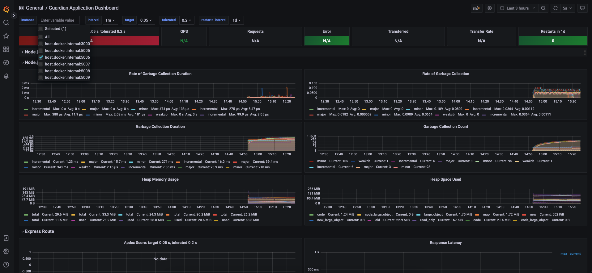

# 📉 Monitoring tools

Now, the Guardian application provides some ways to monitor its services using two widely used open-source applications.

[Prometheus](https://prometheus.io/) and [Grafana](https://grafana.com/) are powerful monitoring tools commonly used to observe and analyze the performance and health of applications. In the context of monitoring the Guardian application, Prometheus and Grafana provide a comprehensive solution to collect, store, visualize, and alert on various metrics and data points.

Prometheus is an open-source monitoring system that excels at collecting and storing time-series data. It is designed to monitor highly dynamic and distributed environments, making it an ideal choice for modern application architectures. Prometheus employs a pull-based model, where it periodically scrapes metrics data from configured targets, such as application instances or infrastructure components.

With Prometheus, you can instrument your Guardian application to expose various metrics, such as request latency, error rates, resource utilization, and custom application-specific metrics. Prometheus stores this data in a time-series database, allowing you to query historical metrics and generate meaningful insights. Additionally, Prometheus offers a flexible querying language called PromQL, which enables advanced data analysis and aggregation.

Grafana is a popular open-source data visualization and analytics platform that complements Prometheus by providing a feature-rich dashboarding solution. It allows you to create visually appealing and customizable dashboards to monitor and analyze metrics collected by Prometheus. Grafana supports a wide range of visualization options, including graphs, tables, heatmaps, and alerts.

We have integrated Prometheus with Grafana, allowing you to create real-time dashboards that display critical metrics and provide a holistic view of your Guardian application's performance. These dashboards can help you identify bottlenecks, track trends, and troubleshoot issues promptly. Grafana also allows you to set up alerts based on predefined thresholds or complex rules, ensuring that you receive notifications when important metrics cross certain boundaries.

Together, Prometheus and Grafana form a robust monitoring stack for the Guardian application, enabling you to gain valuable insights into its behavior and performance. By leveraging the power of Prometheus for data collection and Grafana for data visualization, you can proactively monitor your application, make data-driven decisions, and ensure a seamless user experience.

These services are being scraped by Prometheus, which was defined to running here [**http://localhost:9090**](http://localhost:9090/). At this point, you can create your queries.

* api-gateway
* guardian-service
* auth-service
* policy-service
* topic-viewer
* mrv-sender

A complete dashboard was created by default using the Grafana application to present interesting metrics. This dashboard can be accessed here once you have the Guardian application running -> [**http://localhost:9080**](http://localhost:9080/).

<figure><figcaption></figcaption></figure>

\
