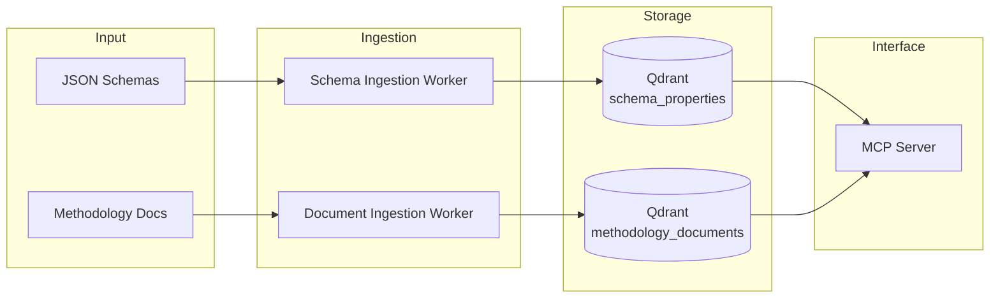

# Hedera Guardian AI Toolkit

[](LICENSE)
[](https://www.python.org/downloads/)
[](https://modelcontextprotocol.io/)

The Hedera Guardian is an innovative open-source platform that streamlines the creation, management, and verification of digital environmental assets. It leverages a customizable Policy Workflow Engine and Web3 technology to ensure transparent and fraud-proof operations, making it a key tool for transforming sustainability practices and carbon markets. Turning a methodology PDF into a working Guardian policy requires extracting hundreds of parameters, rules, and conditions, then building schema definitions by hand — a process that can take months.

This toolkit accelerates that work. It processes methodology documents (PDF, DOCX) into a searchable vector database and exposes them through a [Model Context Protocol](https://modelcontextprotocol.io/) (MCP) server. Domain experts can search methodology content using natural language and build Guardian schemas -- all through Claude Desktop or any MCP-compatible client.

## How It Works

1. **Place methodology documents** (PDF, DOCX) in a folder
2. **Ingestion workers** process, parse, and index them into a Qdrant vector database
3. **The MCP server** connects Qdrant to Claude Desktop (or any MCP client)
4. **Ask Claude** to search documents or generate Guardian schemas

| Regular Claude | Claude with MCP Tools |
|---|---|
| Uses general internet knowledge | Searches your local documents |
| May make educated guesses | Shows exact document sources |
| Cannot create files | Generates Excel schema files |
| Generic responses | Methodology-specific answers |

This setup turns Claude into a **controlled research assistant** that only uses information from the documents you provide.

## Key Capabilities

- **Semantic Document Search** -- Hybrid dense + sparse vector search with Reciprocal Rank Fusion across methodology PDFs and DOCX files
- **Guardian Schema Generation** -- Full CRUD for Hedera Guardian policy schemas in Excel format, with validation, conditional visibility, and visualization
- **Document Processing Pipeline** -- Table extraction, formula-to-LaTeX conversion, OCR, and contextual chunking via [Docling](https://github.com/docling-project/docling)
- **GPU-Accelerated Processing** -- Optional CUDA acceleration for layout analysis, table recognition, and OCR on scanned documents
- **MCP Integration** -- 12 tools for search and schema building, compatible with Claude Desktop, Claude Code, and any MCP client

**Under the hood:** Async-first I/O with Qdrant + BGE-M3 ONNX embeddings | Resumable checkpoint-based pipelines | Docker Compose with health checks, memory limits, and model caching

## Architecture



## Packages

```text
packages/
├── vector_store/                  # Shared async Qdrant + BGE-M3 ONNX layer
├── document_ingestion_worker/     # PDF/DOCX → chunked vector embeddings
├── schema_ingestion_worker/       # JSON schemas → property-level embeddings
├── hedera_guardian_mcp_server/    # MCP server (search + schema tools)
└── policy_schema_builder/         # Guardian Excel schema builder
```

| Package | Description | Docs |
|---------|-------------|------|
| **vector_store** | Shared async Qdrant connector with BGE-M3 ONNX embeddings (dense + sparse). Base layer for all search and ingestion operations. | [README](packages/vector_store/README.md) |
| **document_ingestion_worker** | Parallel document processing pipeline. Converts PDF/DOCX into contextual chunks with table extraction, formula-to-LaTeX, and OCR via Docling. | [README](packages/document_ingestion_worker/README.md) · [CONFIG](packages/document_ingestion_worker/CONFIG.md) |
| **schema_ingestion_worker** | Async JSON schema ingestion pipeline. Discovers, parses, and indexes schema properties into Qdrant for semantic search. | [README](packages/schema_ingestion_worker/README.md) · [CONFIG](packages/schema_ingestion_worker/CONFIG.md) |
| **hedera_guardian_mcp_server** | MCP server exposing search and schema builder tools over StreamableHTTP and stdio transports. | [README](packages/hedera_guardian_mcp_server/README.md) · [CONFIG](packages/hedera_guardian_mcp_server/CONFIG.md) |
| **policy_schema_builder** | Excel-based Guardian schema builder with CRUD operations, validation, conditional visibility, and schema visualization. | [README](packages/policy_schema_builder/README.md) |

Packages without a separate CONFIG.md document their configuration in their README.

### Package Dependencies

```text
vector_store  ← shared async Qdrant + embeddings layer
  ├── document_ingestion_worker
  ├── schema_ingestion_worker
  └── hedera_guardian_mcp_server ──uses──▶ policy_schema_builder

policy_schema_builder  ← standalone
```

## Quick Start

```bash
# Prerequisites: Docker 20.10+, Git, and Node.js 22+ (see docs/QUICKSTART.md for all options)

git clone <repository-url> && cd hedera-guardian-ai-toolkit
cp .env.example .env              # Unix/macOS (Windows: copy .env.example .env)

docker compose up -d              # Start Qdrant + MCP server (first run: builds images)

# Add your PDF/DOCX files to data/input/documents/, then:
docker compose run --rm document-ingestion-worker    # First run: ~15 min (build + model download)
# Low memory (8-12GB)? Use: docker compose -f docker-compose.yml -f docker-compose.low-memory.yml run --rm document-ingestion-worker

# Verify: MCP server at http://localhost:9000
npx @modelcontextprotocol/inspector --server-url http://localhost:9000/mcp
```

The `.env.example` defaults work for local development. See [.env.example](.env.example) for the full variable reference and each package's CONFIG.md for details.

For Claude Desktop integration, see [QUICKSTART.md Step 7](docs/QUICKSTART.md#step-7-connect-claude-desktop-optional) or the [User Guide](docs/USER-GUIDE.md#claude-desktop-integration).

## Deployment Profiles

| Profile | Target | Command modifier |
|---------|--------|-----------------|
| **Standard** (16GB+ RAM) | Default setup, full capabilities | `docker compose up -d` |
| **GPU** (NVIDIA CUDA) | Faster document processing | `docker compose -f docker-compose.yml -f docker-compose.gpu.yml ...` |
| **Low-memory** (8-12GB) | Laptops, reduced footprint | `docker compose -f docker-compose.yml -f docker-compose.low-memory.yml ...` |

| Service | Role | Lifecycle |
|---------|------|-----------|
| **Qdrant** | Vector database | Always running |
| **MCP Server** | AI search endpoint | Always running |
| **Document Ingestion Worker** | Indexes documents | Run once, then stops |
| **Schema Ingestion Worker** | Indexes schemas | Run once, then stops |

See [DOCKER.md](docs/DOCKER.md) for volumes, health checks, and detailed configuration.

## Documentation

- **Getting started?** [QUICKSTART.md](docs/QUICKSTART.md)
- **Using with Claude Desktop?** [USER-GUIDE.md](docs/USER-GUIDE.md)
- **Deploying with Docker?** [DOCKER.md](docs/DOCKER.md)
- **Contributing code?** [CONTRIBUTING.md](docs/CONTRIBUTING.md)

| Document | Audience | Description |
|----------|----------|-------------|
| [QUICKSTART.md](docs/QUICKSTART.md) | New users | Step-by-step setup and first semantic search |
| [USER-GUIDE.md](docs/USER-GUIDE.md) | Domain experts | Complete usage guide with Claude Desktop, schema generation workflows |
| [DOCKER.md](docs/DOCKER.md) | DevOps, operators | Docker services, volumes, GPU setup, memory configuration |
| [CONTRIBUTING.md](docs/CONTRIBUTING.md) | Developers | Code style, testing, local development workflow |
| [MODELS.md](docs/MODELS.md) | Developers, operators | ML/AI models inventory, configuration, resource requirements |

### Package Documentation

| Package | README | CONFIG |
|---------|--------|--------|
| Vector Store | [README](packages/vector_store/README.md) | -- |
| Document Ingestion Worker | [README](packages/document_ingestion_worker/README.md) | [CONFIG](packages/document_ingestion_worker/CONFIG.md) |
| Schema Ingestion Worker | [README](packages/schema_ingestion_worker/README.md) | [CONFIG](packages/schema_ingestion_worker/CONFIG.md) |
| MCP Server | [README](packages/hedera_guardian_mcp_server/README.md) | [CONFIG](packages/hedera_guardian_mcp_server/CONFIG.md) |
| Policy Schema Builder | [README](packages/policy_schema_builder/README.md) | -- |

## Getting Help

- **Bug reports and questions:** [GitHub Issues](../../issues)
- **Contributing:** See [CONTRIBUTING.md](docs/CONTRIBUTING.md) for development setup and guidelines

## License

This project is licensed under the MIT License - see the [LICENSE](LICENSE) file for details.

> **Note:** The document processing components (`document_ingestion_worker`) use AGPL-3.0 licensed dependencies ([Docling](https://github.com/docling-project/docling)). If you deploy these components as a network service, you must make the source code available to users.
