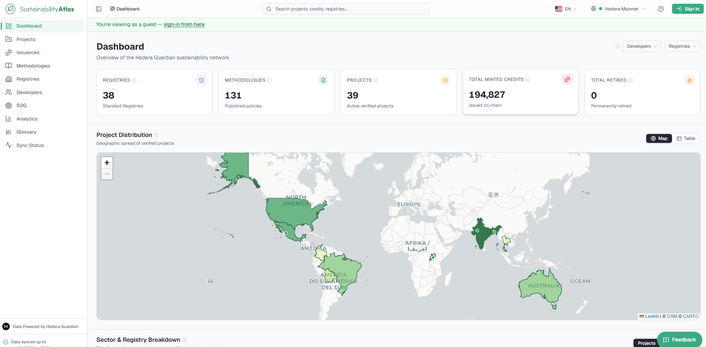
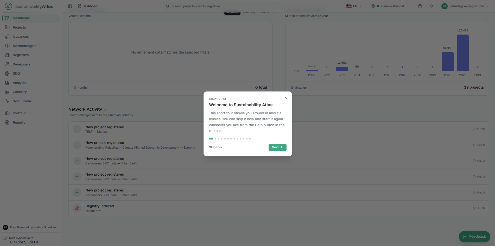
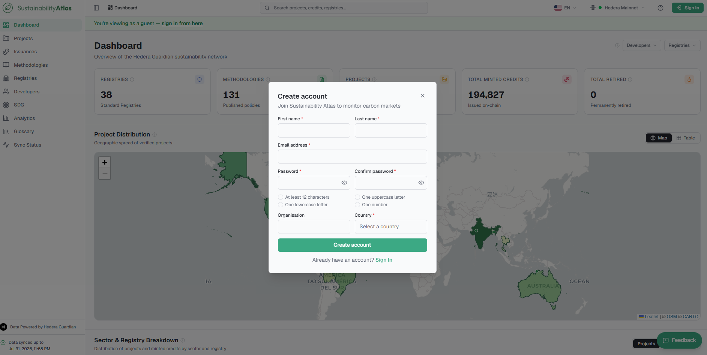
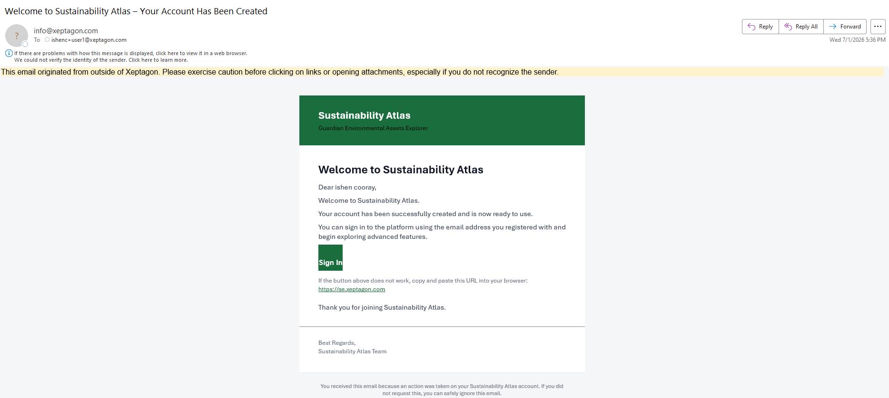
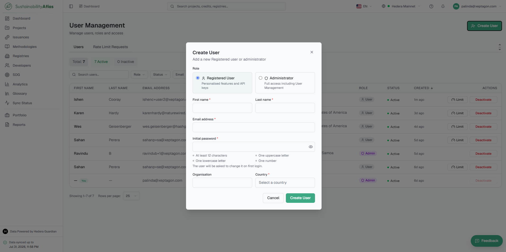
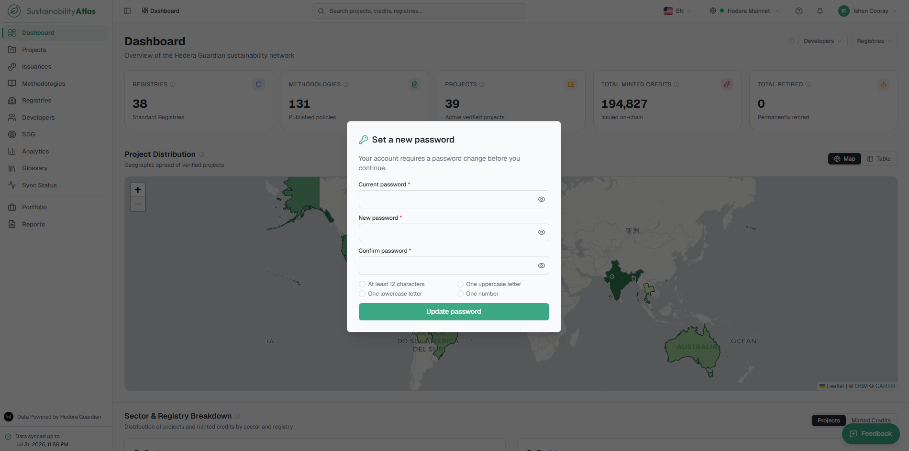
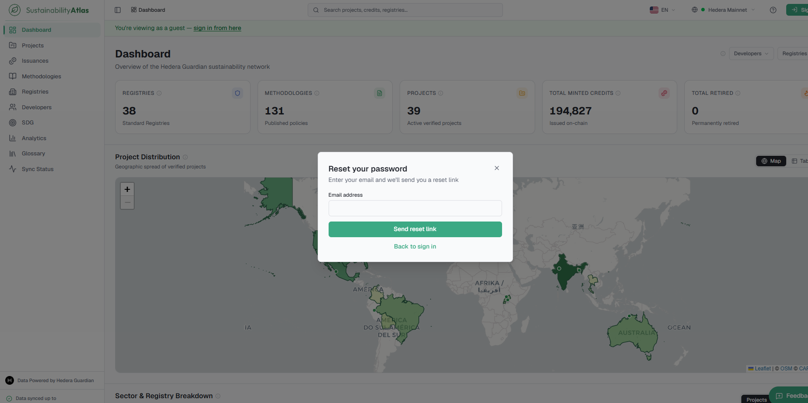
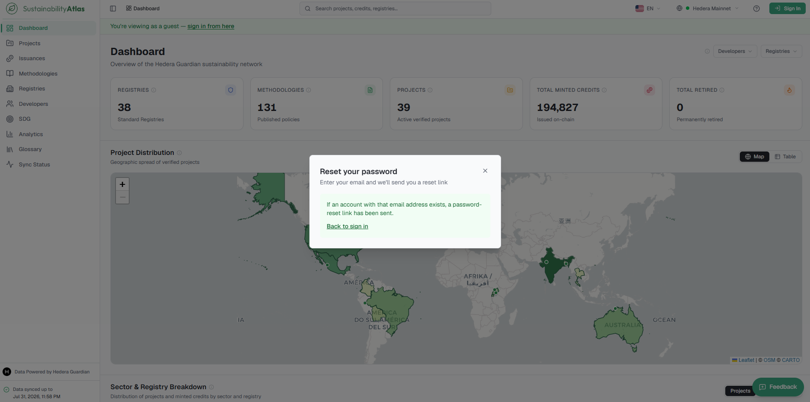

# 01 — Getting Started

This chapter covers your first visit to the Atlas: what can be seen without an account, the guided tour that introduces the interface, how to create an account and verify your email address, how to sign in, and what to do when you have forgotten your password.

## Opening the Atlas

Opening the Atlas in any modern browser lands the user on the Dashboard, and everything on it is already loaded. Signing in is not required to read the data.

A green banner across the top indicates guest viewing and offers a "sign in from here" link, which can be ignored indefinitely.

As a guest, a user can browse every project, credit, methodology, registry, developer and SDG in the catalogue, use every filter, sort every table, compare projects side by side, read the analytics views, look terms up in the glossary and check how current the data is on the Sync Status page.

## The guided tour

The first time a user signs in, a short guided tour starts by itself, walking round the interface in about a minute: the sidebar, global search, the language and network selectors, the dashboard figures, then the Projects page for filters, the table and quick filters, and finally personal features, how to report a problem, and where to find help.

While the tour is running:

* **Next** and **Back** move between steps; a row of dots shows progress, and a dot can be clicked to jump to that step.
* **Skip tour**, the "×" in the corner, and the Escape key all end the tour immediately.
* The arrow keys work too: right arrow or Enter for the next step, left arrow to go back.
* The page underneath is paused — clicking a highlighted button does nothing while the tour is open, so the user does not navigate away mid-step.
* The tour moves between pages on its own, starting on the Dashboard and moving to Projects partway through. The network choice is preserved as it goes.

The tour can be replayed at any time from the Help (?) menu or from Account Settings.

## Create an Account

Creating an account unlocks the personal features of the Atlas — the Portfolio, saved quick filters, the Reports page, notifications and API keys. Browsing the data itself does not require one.

### Steps

1. Click **Sign In** in the top-right corner, then **Create account**. The sign-up form opens.
2. Enter your first name, last name, email address, country and a password. Organisation is an optional extra.
   * As the password is typed, a live checklist appears showing each rule and ticking it off as it is satisfied — typically a minimum length plus a mix of upper case, lower case and digits.
3. Submit the form. A neutral confirmation message appears.

4. Open the verification email sent to the address given and click the link.
   * The link is single use and expires after 24 hours. Clicking an old link, clicking one twice, or verifying an address that was already confirmed produces a "verification failed" message.

### Result

The screen confirms the email address has been verified. You can now sign in with the email address and password you registered.

## Sign In

Signing in gives access to personal features such as the Portfolio, saved quick filters, Reports, and API keys.

### Prerequisites

* A verified account.

### Steps

1. Click **Sign In** in the top-right corner.
2. Enter your email address and password.
3. Submit the form.

### Signing in to an account created by an administrator

If an administrator created the account, the administrator fills in the registering user's details and provides a temporary password. On the first login, the user is required to set a new password before continuing.

### Result

You are signed in. The green guest banner disappears, the Portfolio and Reports entries appear in the sidebar, and — on a first sign-in — the guided tour starts automatically.

## Reset a Forgotten Password

Resets the password on an existing account using the email address it was registered with.

### Steps

1. On the sign-in dialog, click **Forgot password?**.
2. Enter the email address and submit.
   * The response is deliberately neutral — it does not confirm whether an account exists for that address.

3. If an account exists, an email with a reset link follows. Open it to reach the **Set a new password** page.
4. Enter the new password. The same live rule checklist as on sign-up shows which requirements have been satisfied.
5. Submit the form.

### Result

The page confirms the change and invites sign-in with the new password.

---

### Related & Workflow Progression

* ← **Previous**: [Introduction](README.md) — Overview of the Sustainability Atlas platform
* **Step 1 of 14**: **Getting Started** — Account onboarding, sign-in, and product tour
* → **Next**: [02 — Navigating the Atlas](02-navigating-the-atlas.md) — Sidebar navigation, search, and interface controls
