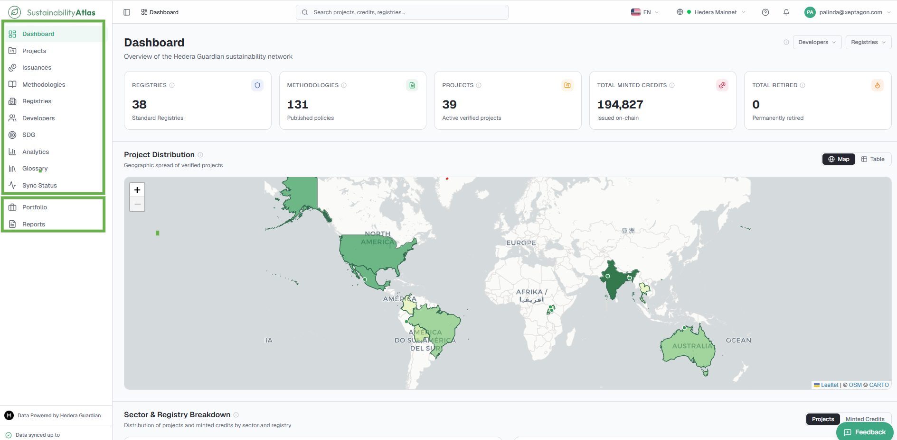
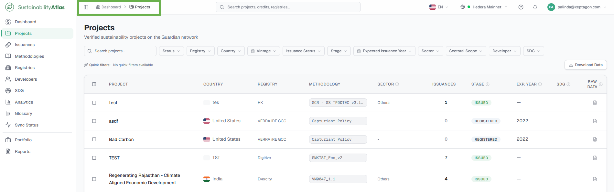
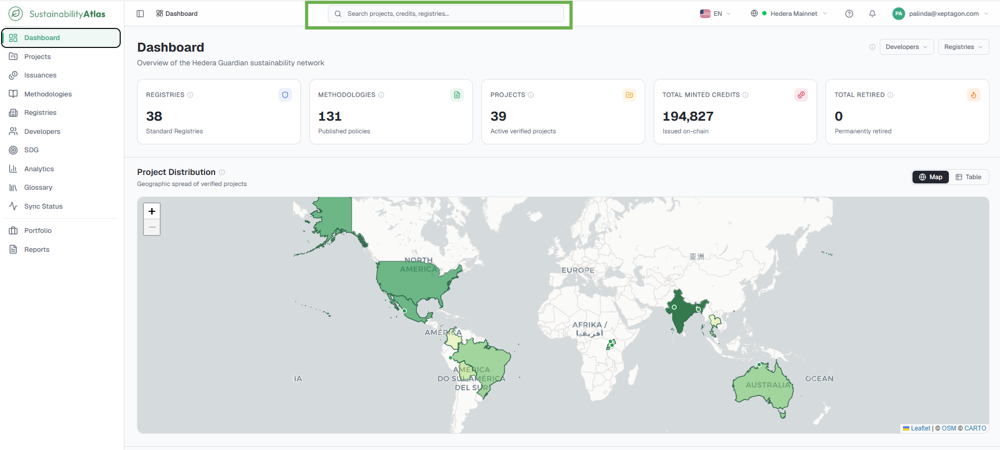
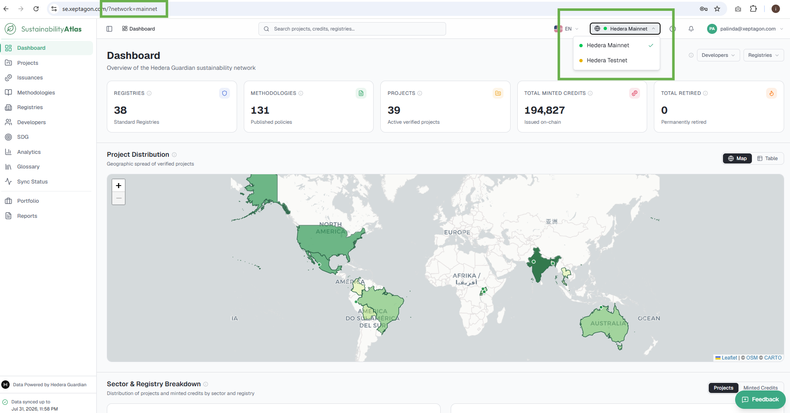
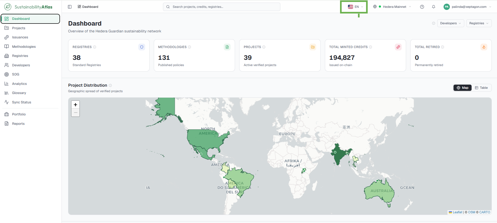
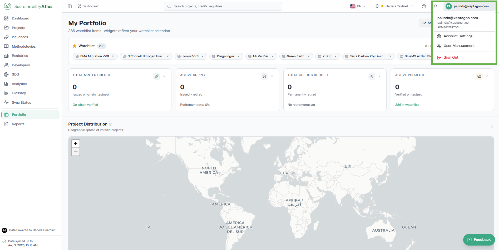
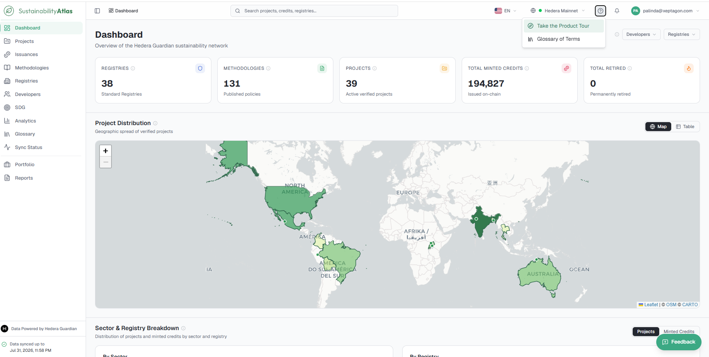
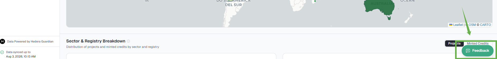
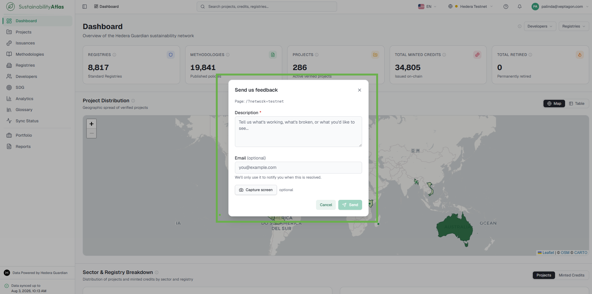

# 02 — Navigating the Atlas

The functional parts of the interface that are always on screen: the sidebar, breadcrumbs, global search, the network and language selectors, notifications, the account and help menus, and the feedback control.

## The sidebar

The sidebar runs down the left-hand edge and is the main way of moving around.

| Destination | What is found there |
| --- | --- |
| Dashboard | At-a-glance statistics overview of everything in the Sustainability Atlas |
| Projects | Every sustainability project in the Guardian |
| Issuances | Every credit token issued on chain |
| Methodologies | The published policy workflows projects are verified against |
| Registries | The standard registries operating on the network |
| Developers | The organisations that build and run the projects |
| SDG | Project contributions mapped to the UN Sustainable Development Goals |
| Analytics | Cross-cutting views of the same data for different audiences |
| Glossary | Plain-language definitions of the terminology |
| Sync Status | How current the data is and how the pipeline is behaving |

Below a thin divider at the bottom of that list, two more entries appear once signed in:

| Destination | What is found there |
| --- | --- |
| Portfolio | A private dashboard, driven by the user's watchlist |
| Reports | Configured exports and impact summaries |

## Breadcrumbs

The top bar shows the current location as a trail: *Dashboard › Projects › record name*. Every step except the last is a link, so the breadcrumb is the quickest way back up a level.

## Global search

The search box in the middle of the top bar searches the entire Atlas at once — projects, methodologies, registries and issued credits together — rather than only the current page.

* Typing begins showing results once at least two characters have been entered.
* Arrow up and arrow down move through the results, Enter opens the highlighted one, and Escape closes the list. A mouse works as expected.
* Results are limited to the network currently selected. If an expected record does not appear, check the network selector before concluding it is missing.

## Network selector

The Atlas can read either the Hedera **mainnet** — the live network carrying real, financially meaningful credits — or the **testnet**, the network used for trials and rehearsals. The selector in the top bar switches between them, and a coloured dot shows which one is active.

Switching networks reloads every figure on the page. Counts, charts, tables and search results are all scoped to the selected network, and a project that exists on testnet generally does not exist on mainnet or vice versa.

The choice is stamped into the address bar as `?network=…`. A useful consequence: copying the URL out of the address bar and sending it to a colleague shows them the same data, on the same network.

## Language selector

Next to the network selector, the language selector switches the interface between English and Español, with a flag and language code showing the current choice.

## Notifications

Notifications require a signed-in account. The bell in the top bar signals when something happens to a project on the Portfolio watchlist — a new issuance, a retirement or a transfer.

Clicking the bell opens the panel:

* **All** and **Unread** tabs switch between everything and only what has not been read.
* Clicking a notification marks it read and expands it to show the detail — the project, registry, methodology and volume involved.
* **Mark all as read** clears the badge without deleting anything.
* **Clear all** removes them permanently. It asks first: the button changes to "Click again to confirm," and only the second click actually clears.
* **Load more** at the bottom fetches older items in batches.
* New notifications arrive live while the panel is open; no refresh is needed.

## Account menu

The account menu is located in the top-right corner of the application header. When signed in, it displays the user's initials and email address. Selecting it opens a dropdown that provides access to:

* **Account Settings** – manage profile information, change the account password, view request limits, manage API keys, review account activity logs, and access the interactive product tour.
* **User Management** – available only to administrators: view all platform users, create new user accounts, edit user information, activate or deactivate users, and manage roles and permissions.
* **Sign out**

## Help menu

The Help menu is represented by the **?** icon in the top-right corner of the application header.

* **Take the Product Tour** launches an interactive guided walkthrough of the platform.
* **Glossary of Terms** provides definitions of terminology used throughout the platform.

## Feedback

The Feedback feature enables users to quickly report issues, suggest improvements, or share their experience. The Feedback button is available on every page in the bottom-right corner of the application.

---

### Related & Workflow Progression

* ← **Previous**: [01 — Getting Started](01-getting-started.md) – Account onboarding and product tour
* **Step 2 of 15**: **Navigating the Atlas** – Interface controls, sidebar, and search
* → **Next**: [03 — Dashboard](03-dashboard.md) – Landing page overview and platform metrics
