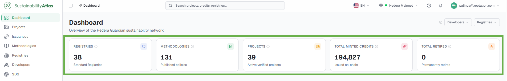
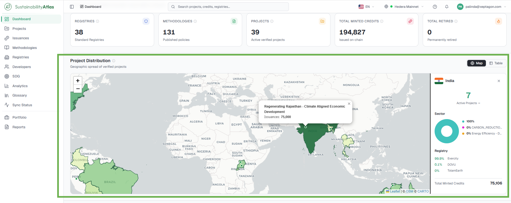
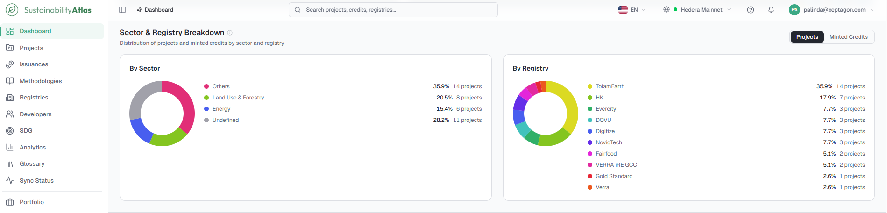
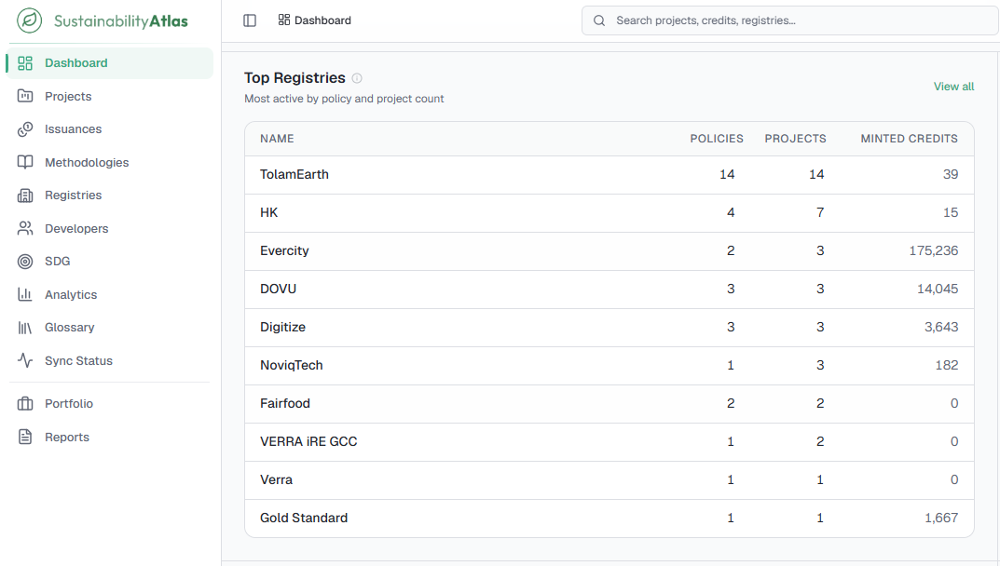
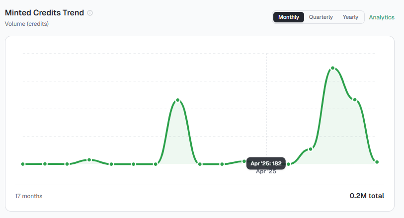

# 03 — Dashboard

The Dashboard is the page a user lands on when opening the Atlas. It answers "how big is this network, where is it, and what has been happening lately" in a single screen, and every panel is a doorway into the detailed pages behind it.

Everything on the Dashboard is scoped to the selected network and, if set, to the dashboard filter.

## The five stat cards

Across the top sit five cards. Each shows a headline figure, a short subtitle and a change indicator comparing the current total against the previous year. Every card is a link to the full list behind the number, and hovering the info icon explains exactly what is counted.

| Card | What it counts | Where it leads |
| --- | --- | --- |
| Registries | Unique standard registries with any data at all — methodologies, projects, users or issuances. | [Registries](07-registries-developers-sdgs.md#registries) |
| Methodologies | Unique published policy methodologies across the registries. | [Methodologies](06-methodologies.md) |
| Projects | Sustainability projects registered and verified on the network. | [Projects](04-projects.md) |
| Total Minted Credits | Credits minted on chain across all matching projects. | [Issuances](05-issuances-and-credits.md) |
| Total Retired | Credits permanently retired — taken out of circulation for offsetting. | [Issuances](05-issuances-and-credits.md) |

## Project Distribution

A world map coloured by project count: the darker the green, the more projects that country hosts. Small dots mark individual project locations where the Atlas has coordinates. Clicking a country opens a side panel breaking down what is there.

## Sector & Registry Breakdown

Two donut charts side by side: **By Sector** and **By Registry**. A toggle above switches what is measured between Projects (a count) and Minted Credits (issued volume).

Small slices are grouped into *Other* so the chart stays readable. Clicking a row in the legend opens the Projects page already filtered to that sector or registry.

## Top Registries

A compact ranking of the most active registries, ordered by project count, with columns for Policies (distinct methodologies published) and Minted Credits (total issued on chain under it).

## Minted Credits Trend

A time series of issuance volume. The Monthly / Quarterly / Yearly toggle changes the grouping: monthly for recent detail, yearly for long-run shape. The caption shows how many periods are being displayed.

## Retirement Trend

The same idea applied to retirements — credits permanently removed from circulation for offsetting. Read together with the issuance trend, this shows whether credits are being used or merely created.

## Vintage Distribution

Issued credits grouped by vintage year — the year the emission reduction actually happened, which is not the same as the year the credit was issued. A cluster of credits in one vintage often reflects one large project reaching verification, so the caption also shows how many projects contribute.

## Network Activity

A reverse-chronological feed of recent changes across the network — new project registrations, credit issuances, policy publications and verifications — each with a relative timestamp ("3 hours ago"). It is the quickest way to see whether the network has been busy without reading any charts.

## When a panel says there is no data

Every panel has its own empty message ("No countries match the selected filters," "No issuance data matches the selected filters," and so on). That wording is deliberate: it means the query ran and came back with nothing, not that the panel failed. Widen or clear the dashboard filter, or check that the correct network is selected.

---

### Related & Workflow Progression

* ← **Previous**: [02 — Navigating the Atlas](02-navigating-the-atlas.md) – Interface controls and global search
* **Step 3 of 15**: **Dashboard** – Platform metrics, overview cards, and network activity
* → **Next**: [04 — Projects](04-projects.md) – Verified sustainability project catalogue
