# 04 — Projects

The Projects module provides a centralized view of all verified sustainability projects available on the Sustainability Atlas platform. Users can search, filter, browse, and access detailed information about projects registered on the Hedera Guardian network.

## The projects table

Every verified sustainability project on the selected network appears here, one row per project. Clicking any row opens the full record.

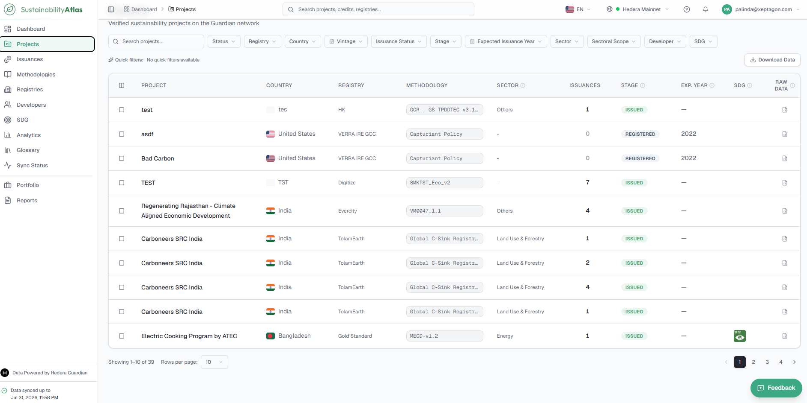

The filter bar behaves consistently across all list pages within the Atlas. Users can search by project name and combine multiple filters to narrow the displayed results; all selected filters work together.

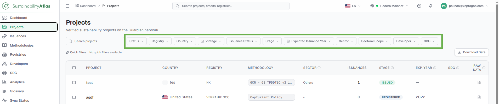

### Columns

| Column | What it means |
| --- | --- |
| Project | The project's name as submitted to its registry. |
| Country | Host country, shown with its flag. |
| Registry | The standard registry the project is registered with. |
| Methodology | The policy workflow it is verified against. |
| Sector | Broad activity type — renewable energy, forestry, waste, and so on. |
| Issuances | Number of issuances so far. |
| Stage | Position of the project in the project lifecycle: Registered → Validated → MRV Submitted → Verified → Issued. |
| Exp. Year | The year credits are first expected to be issued. |
| SDG | Icons for the UN Sustainable Development Goals the project contributes to; hover for goal names. |
| Raw Data | Opens the original on-chain documents behind the row. |

### Filters

| Filter | Notes |
| --- | --- |
| Status | The registry-reported project status. |
| Registry | One or more registries. |
| Country | Host country. |
| Vintage | A year range rather than a single year. |
| Issuance Status | Pre-Issuance for projects that have not minted credits yet, Issued for those that have. The single most useful filter for separating pipeline from delivered supply. |
| Stage | Lifecycle stage, as in the Stage column. |
| Expected Issuance Year | Applies to pre-issuance projects only. |
| Sector | Broad activity type. |
| Sectoral Scope | The finer classification underneath sector. |
| Developer | The organisation running the project. |
| SDG | One or more Sustainable Development Goals. |

## Save a Quick Filter

A quick filter saves a combination of search criteria and filters for future use — for example, *Gold Standard + SDG 13: Climate Action + Vintage 2022*. This is particularly useful when the same set of projects is searched for frequently. Saved searches preserve the selected filter configuration, so it can be reapplied without selecting each filter again.

### Prerequisites

* A signed-in account. Guests can filter but not save searches.

### Steps

1. Apply the required search criteria and filters on the Projects page.
2. Click **Save Search** at the end of the filter bar.
3. In the Save Search dialog, enter a descriptive name for the search.
4. Review the list of **Active Filters** that will be saved.
5. Click **Save Search** to store the filter configuration.

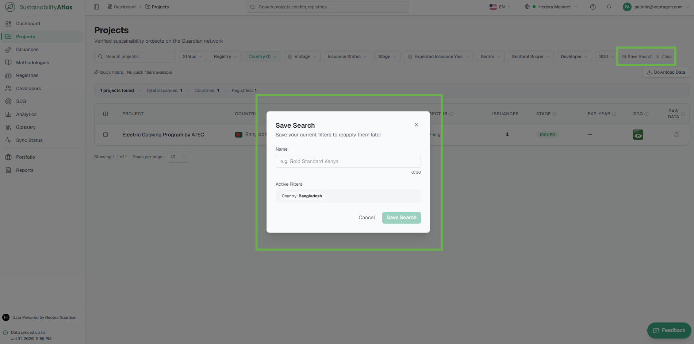

### Result

The saved search appears among your quick filters. Selecting it reapplies the whole filter configuration in one click.

## Download Project Data

Exports the project list for offline analysis, reporting, or data sharing. The exported file includes the projects currently displayed in the table: if search criteria or filters have been applied, only the matching project records are included.

### Steps

1. Navigate to the **Projects** page.
2. Apply any required search criteria or filters (optional).
3. Click the **Download Data** button in the upper-right corner of the project list.

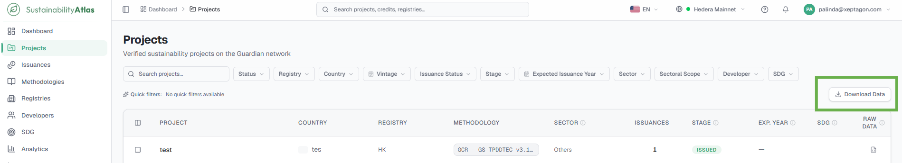

### Result

The platform generates the project data file and downloads it to your device.

## Compare Projects

Compares key attributes of multiple sustainability projects side by side — metadata, registry information, credit issuance, and other characteristics — to quickly identify similarities and differences. Up to four projects can be compared simultaneously.

### Steps

1. Navigate to the **Projects** page.
2. Select the checkbox next to each project you wish to compare.
3. Once two or more projects have been selected, the **Compare** button appears at the bottom of the page.
4. Click **Compare** to open the comparison view.

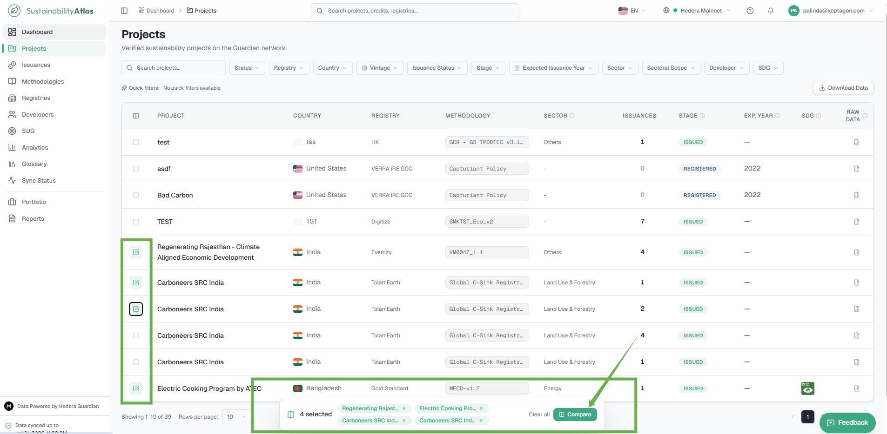

### Result

The comparison view opens with the selected projects side by side.

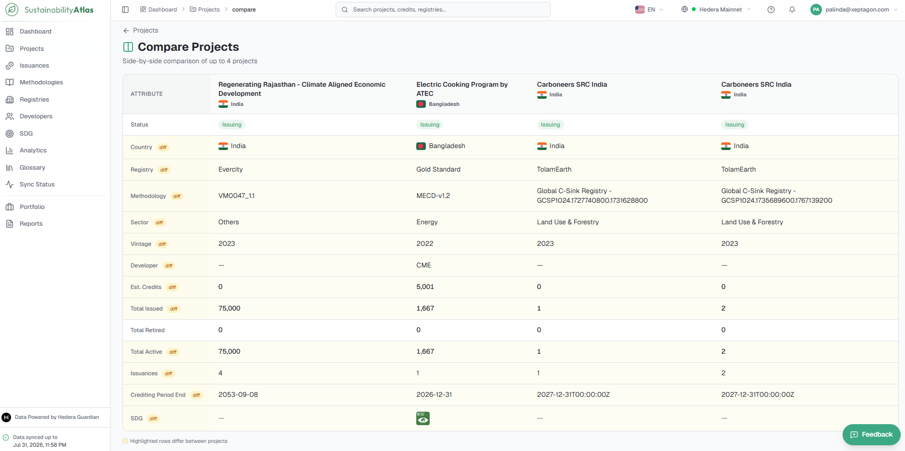

## The project record

The Project Details page provides comprehensive information about an individual sustainability project. It consolidates project metadata, lifecycle progress, issuance information, location details, and advanced technical data into a single view, organised into tabs. Users reach it by selecting a project from the Projects list.

### Summary

A high-level overview of the selected project in a single view:

* **Key Facts** – essential project information such as methodology, registry, developer, country, status, sector, crediting period, vintage, and estimated credits.
* **Milestone Tracker** – a visual representation of the project's progress through the lifecycle stages: Registration, Validation, MRV Submission, Verification, and Issuance.
* **Project Location** – the project's geographical location on an interactive map.

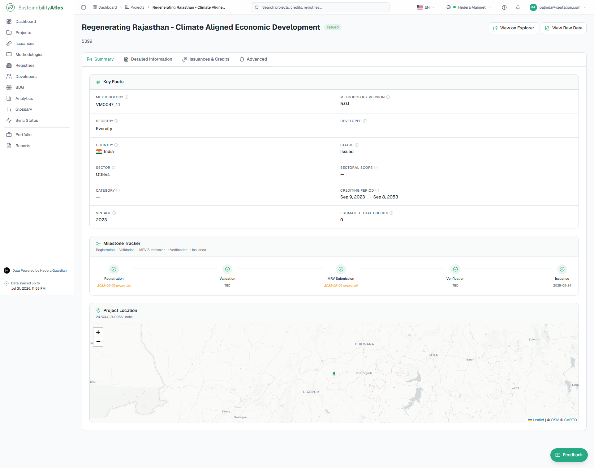

### Detailed Information

The complete set of project records and schema fields submitted during project registration and lifecycle activities — the full underlying data, where the Summary tab presents only the key information.

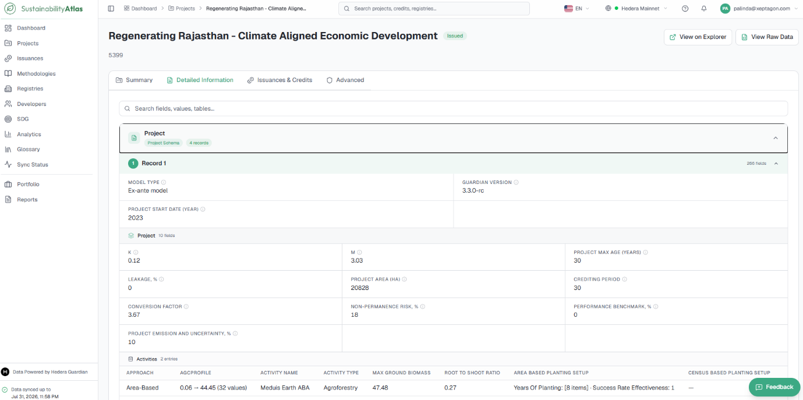

### Issuances & Credits

An overview of the carbon credits issued for the selected project and their current lifecycle status: issuance, transfers, retirements, and active balances, with detailed information about each individual issuance.

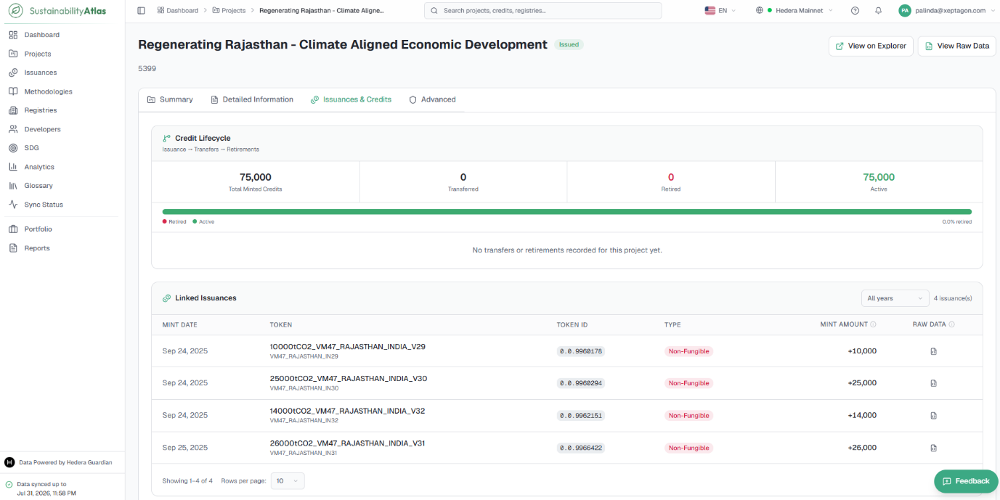

### MRV External Data

Appears only for projects with monitoring, reporting and verification data submitted by external systems — sensor feeds, meter readings, automated monitoring records.

It is separated from Detailed Information because the two differ in kind: one holds documents a person wrote and submitted, the other machine-generated records that can run to hundreds of thousands of rows. Records are loaded a page at a time per schema rather than all at once.

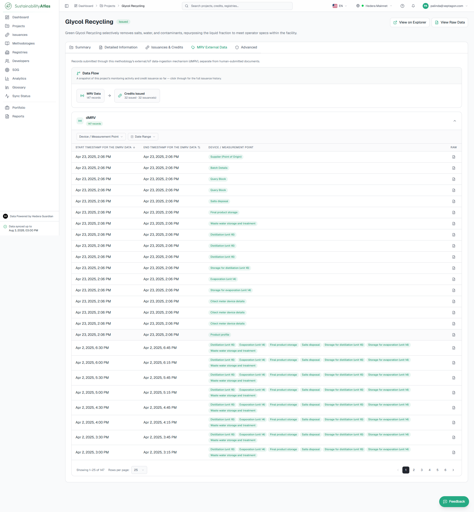

### Advanced

The complete technical representation of the selected project: all schema fields, nested records, technical attributes, and system-generated information captured throughout the project's lifecycle. Intended for users who require in-depth project information beyond the standard summary and detailed metadata.

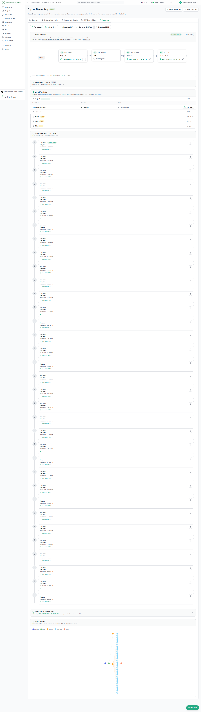

## Raw Data and HashScan

Wherever a **Raw Data** action appears — in the table's last column, on the Advanced tab, or beside a document — it opens the original on-chain record as structured JSON, with its own search box for finding a field inside a large document. This is the ground truth behind every derived figure in the Atlas.

A **View on HashScan** link opens the same record in Hedera's public block explorer, taking the user outside the Atlas entirely — the point being to confirm independently that the record exists on the ledger and has not been altered.

---

### Related & Workflow Progression

* ← **Previous**: [03 — Dashboard](03-dashboard.md) – Landing page overview and platform metrics
* **Step 4 of 15**: **Projects** – Verified sustainability project catalogue and metadata
* → **Next**: [05 — Issuances and Credits](05-issuances-and-credits.md) – Issued carbon credit tokens, mintings, and serial ranges
