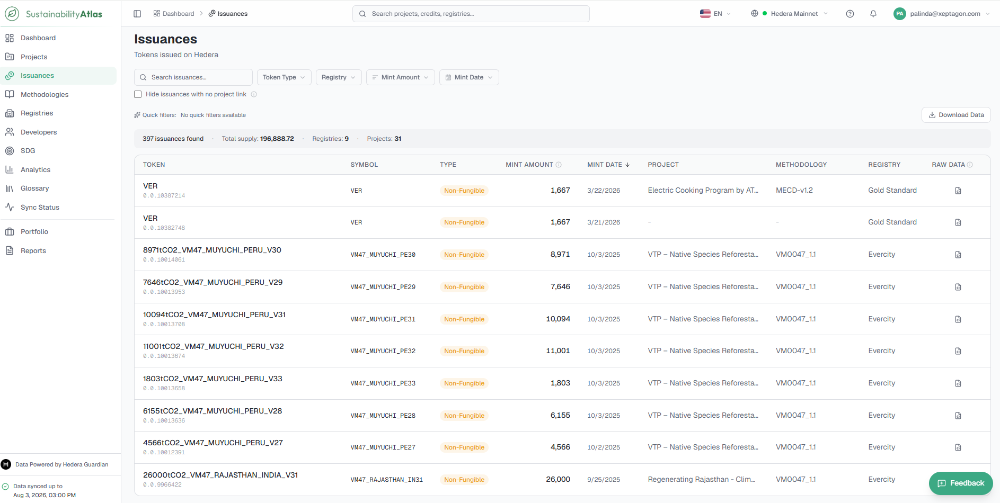
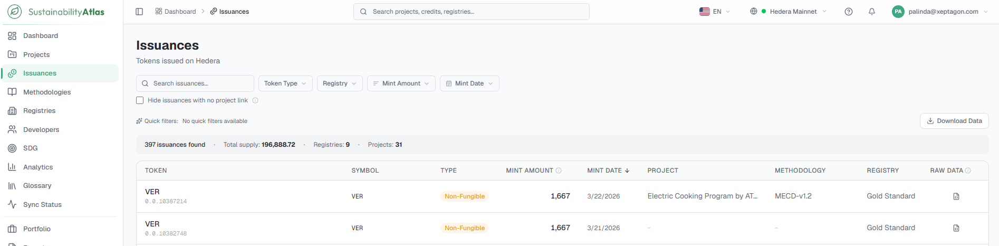
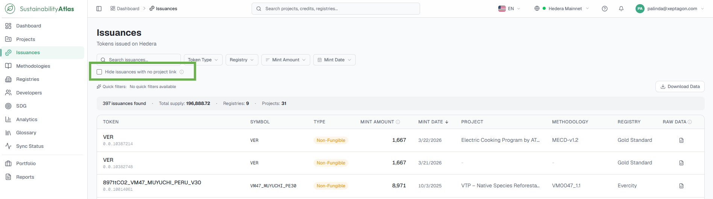
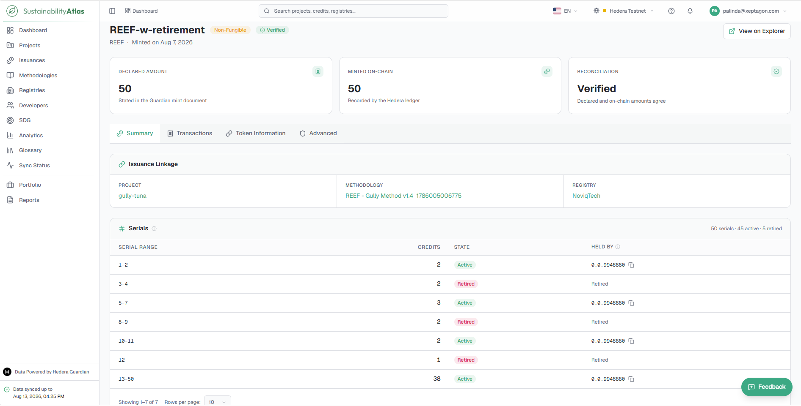
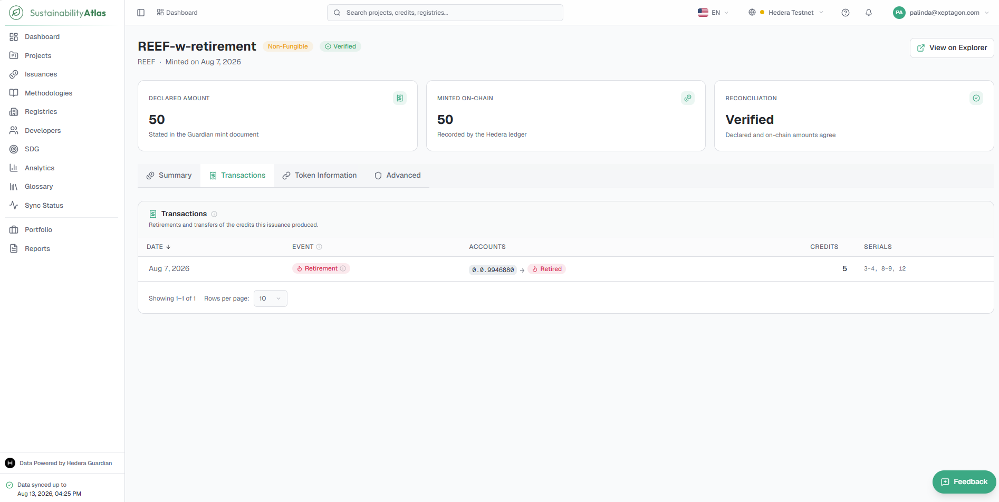
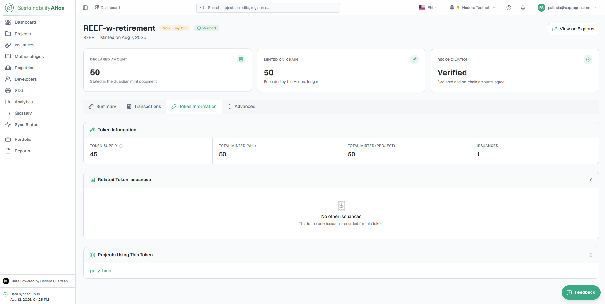
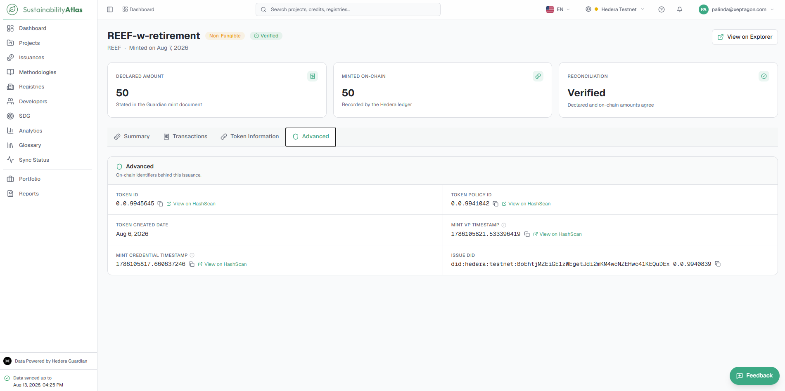

# 05 — Issuances and Credits

The Issuances module provides a centralized view of all carbon credit issuances recorded on the Hedera network. It enables users to search, filter, and explore issued carbon credit tokens together with their associated projects, methodologies, registries, and issuance details.

## The issuances table

Each row is a credit token issued on the selected Hedera network.

The filter bar behaves exactly as it does on Projects — search text plus any combination of filters, with a live result count and a summary strip showing total supply and how many registries and projects the results span.

### Columns

| Column | What it means |
| --- | --- |
| Token | The token's name. |
| Symbol | Token symbol. |
| Type | Fungible or non-fungible. Fungible credits are interchangeable units; non-fungible ones (NFTs) have individually identifiable serial numbers. |
| Mint Amount | How many credits were minted. For NFTs this is a count of serials rather than a tonnage. |
| Mint Date | Date on which the credits were minted. |
| Project | The project the issuance is attributed to, linked through to its record. |
| Methodology | The policy the project was verified under. |
| Registry | The registry behind that methodology. |
| Raw Data | Opens the underlying issuance record for technical review. |

### Filters

| Filter | Notes |
| --- | --- |
| Token Type | Fungible or non-fungible. |
| Registry | One or more registries. |
| Mint Amount | A numeric range rather than an exact value. |
| Mint Date | A date range. |
| Hide issuances with no project link | A checkbox, on by default. See [Unlinked issuances](#unlinked-issuances). |

### Details tab fields

| Field | Description |
| --- | --- |
| Token Supply | The current number of token units in circulation. Where the Atlas can connect to the Hedera Mirror Node, this value is retrieved in real time and identified with a Live badge, reflecting the current state of the ledger rather than the most recent synchronization. |
| Total Minted (All) | The total number of token units ever minted for the selected Token ID across all associated projects. |
| Total Minted (Project) | The total number of token units minted for the project from which the user accessed the token. |
| Last Mint Date | The date on which the token was most recently minted. |
| Token Creation Date | The date on which the token was originally created on the blockchain. |

## Unlinked issuances

Some tokens on the ledger cannot (yet) be matched to a project in the catalogue. That usually means the project's own records have not been indexed yet, or the token was minted outside the normal policy flow.

Unchecking **Hide issuances with no project link** reveals them — useful when auditing coverage, or hunting for a token known to exist but missing from the filtered view.

## The issuance record

Clicking a row opens that issuance as a single minting event rather than the token as a whole. This matters because one token is often minted several times, for different projects and vintages; a token-level page cannot tell those apart.

The header carries the token name, symbol, type and whether the issuance reconciles, followed by three headline figures: the amount declared, the amount minted on-chain, and the reconciliation status. Content is then split across four tabs, and the active tab appears in the address bar so you can link straight to it.

### Summary

Where the issuance came from and what it produced: the project, methodology and registry it belongs to, and its serial ranges.

Serials are listed as ranges (e.g. 1–42,278) rather than forty-two thousand rows with the number of credits, whether they are active or retired, and which account holds them. A range is split whenever the state or the holder changes, so every serial inside one is identical in both respects. The holder column is blank for retired credits, which no longer have one, and while ownership is still being synced.

### Transactions

Retirements and transfers of this issuance's credits, newest first, with the date, the accounts involved, how many credits moved and which serials.

An issuance can show retired credits here and still list no retirement transaction. That is not a gap in the page: retirement is counted from the ledger marking serials destroyed, but a retirement transaction only exists where the registry used Guardian's retirement contract. Credits wiped outside it are genuinely retired, yet nothing on-chain records who did it or when. The page says so where it happens.

### Token Information

The token behind the issuance: current supply, credits minted across every project using that token and for this issuance's project alone, the token's other issuances, and the projects sharing it.

A token serving several projects is normal. The issuance itself always belongs to exactly one shown under Summary.

### Advanced

The on-chain identifiers: token id, policy topic, creation date, issuer DID, and the consensus timestamps of both the mint credential and its verifiable presentation. Each can be copied, and those that resolve on Hedera link straight to HashScan.

---

### Related & Workflow Progression

* ← **Previous**: [04 — Projects](04-projects.md) – Verified sustainability project catalogue
* **Step 5 of 15**: **Issuances and Credits** – Issued carbon credit tokens, mintings, and serial ranges
* → **Next**: [06 — Methodologies](06-methodologies.md) – Published policy workflows, rules, and decoding statuses
