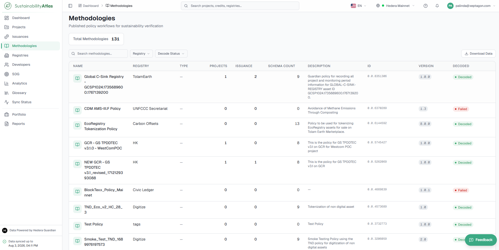
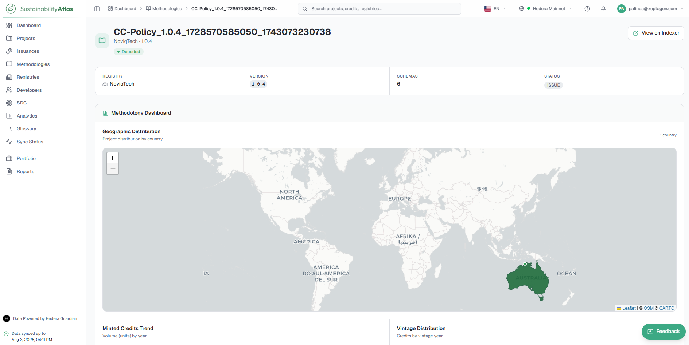
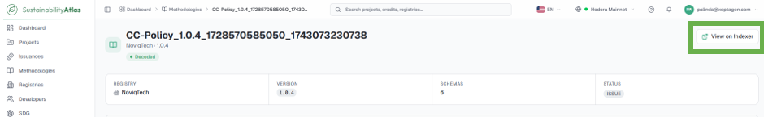
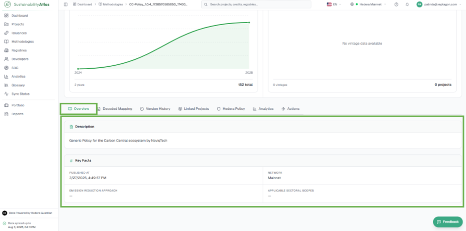
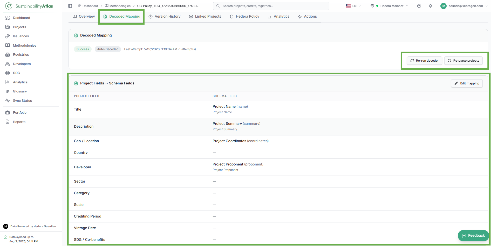
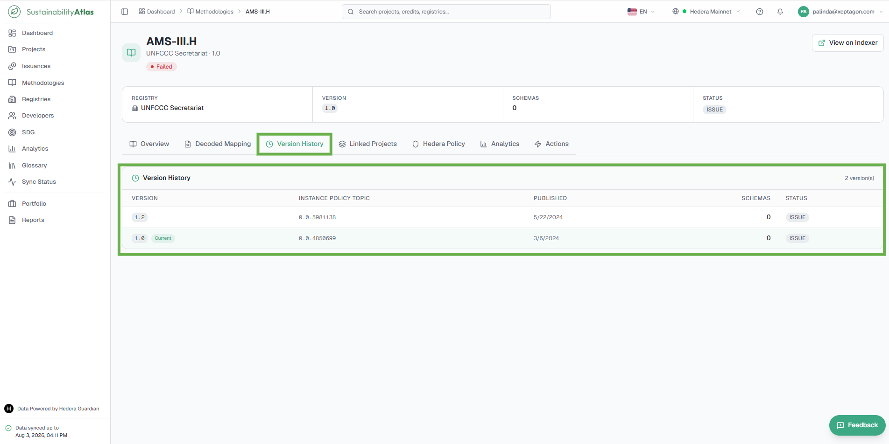
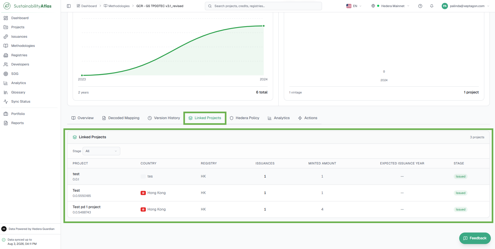
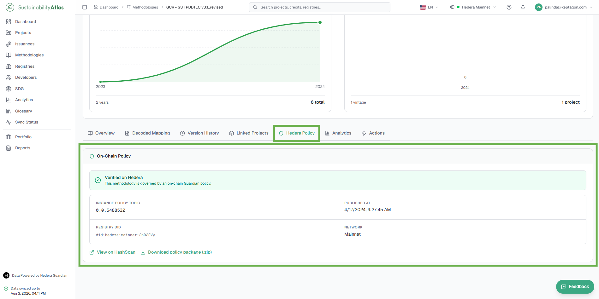
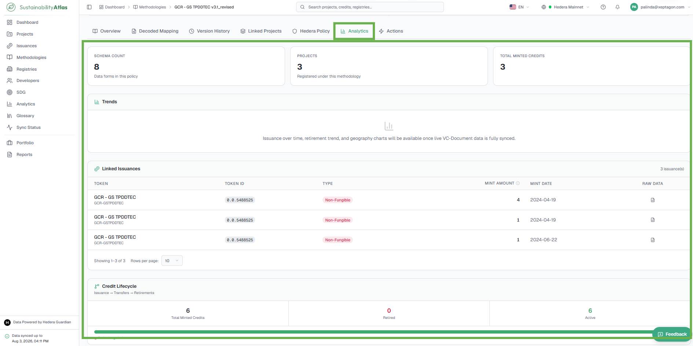

# 06 — Methodologies

The Methodologies module provides a centralized catalog of all sustainability methodologies and policy workflows published on the Hedera Guardian network. A methodology defines the rules, calculations, monitoring requirements, and verification processes that projects must follow to generate sustainability assets such as carbon credits.

## The methodologies table

One row per methodology on the selected network. Users can locate methodologies by searching on name and filtering by Registry and Decode Status; multiple filters can be combined.

### Columns

| Column | What it means |
| --- | --- |
| Name | Name of the methodology or policy. |
| Registry | Registry or organization responsible for publishing the methodology. |
| Type | Classification of the methodology where applicable. |
| Projects | Number of projects currently using the methodology. |
| Issuance | Total issuances generated by projects using the methodology. |
| Schema Count | Number of decoded data forms contained within the methodology. |
| Description | Short summary describing the methodology purpose. |
| ID | Unique Guardian Policy ID recorded on-chain. |
| Version | Published methodology version. |
| Decoded | Whether the Atlas has successfully read the policy's structure. |

### Filters

* Search by methodology name
* Registry
* Decode Status

Multiple filters can be combined to narrow the results.

### Decode statuses

"Decoding" is the Atlas reading a published policy and working out which of its data forms describes a project and how that form's fields map onto the columns seen elsewhere — project name, country, developer, sector, crediting period and so on. It is what turns a raw policy into a browsable catalogue.

| Status | What it means |
| --- | --- |
| Decoded | The policy was read successfully. Projects under it show full detail. |
| Decoding | Work is in progress. Come back shortly. |
| Failed | The Atlas could not read the policy. Projects under it may show fewer fields than usual. The methodology record shows the reason. |
| Not decoded | It has not been attempted yet. |

The methodologies list refreshes itself roughly every fifteen seconds, so a methodology currently decoding changes status without a page reload.

## The methodology record

Clicking a row opens the methodology's page. A summary strip carries its registry, version, schema count and status, with a **View on HashScan** link for the on-chain policy. Content is split into tabs.

The **View on Indexer** button opens the methodology in the Guardian Indexer, allowing users to inspect the original indexed blockchain record and technical metadata.

### Overview

The methodology's description and key facts: when it was published, the network, its emission reduction approach and the sectoral scopes it applies to. Where the description is missing from the source, the tab says so rather than showing an empty block.

If enough linked data exists, a Methodology Dashboard also appears with charts covering geographic distribution of projects, issuance trend by year, and vintage distribution. It is hidden when there is too little data to draw anything meaningful.

### Decoded Mapping

Displays how the Atlas has translated a Guardian policy into standardized business fields. It provides transparency into the mapping between Atlas project attributes and the original schema fields defined within the methodology, allowing users to understand how project information is extracted and presented throughout the platform.

The purpose of the decoded mapping:

* Understand how methodology data is transformed into business-readable project information.
* Verify the relationship between standardized Atlas fields and the original Guardian schema.
* Troubleshoot missing or incorrectly mapped project information.
* Maintain consistent data extraction across all projects using the methodology.

#### Decoder Status fields

| Field | Description |
| --- | --- |
| Status | Indicates whether the methodology has been successfully decoded (for example, Success). |
| Decode Method | Identifies how the methodology was decoded, such as Auto-Decoded. |
| Last Attempt | Displays the date, time, and number of decoding attempts performed. |

Administrative actions (**Re-run Decoder**, **Re-parse Projects**, **Edit Mapping**) are available to administrators only — see [Administration](13-administration.md#methodology-records-decoded-mapping-tab).

### Version History

A chronological record of every published version of the selected methodology, showing how it has evolved over time and which version is currently active. Each published version represents a distinct Guardian policy instance and maintains its own on-chain identity.

### Linked Projects

All projects that have been created using the selected methodology, together with their issuance status and key project metrics — a direct view of methodology adoption and the lifecycle stage of each implementing project.

### Hedera Policy

The blockchain provenance of the selected methodology: the on-chain Guardian policy metadata used to publish and govern it, allowing users to independently verify its authenticity and access the original policy package.

#### Hedera Policy fields

| Field | Description |
| --- | --- |
| Instance Policy Topic | The Hedera Consensus Service topic ID associated with the published Guardian policy instance. This uniquely identifies the methodology on-chain. |
| Published At | Date and time the policy was published to the Hedera network. |
| Registry DID | The decentralized identifier (DID) of the registry that published the methodology. |
| Network | The Hedera network on which the policy is published (for example, Mainnet or Testnet). |

### Analytics

Headline figures for this methodology — schema count, project count and total minted credits, each with a one-line explanation. Additional trend charts are noted as forthcoming.

### Actions

Operational information and management actions related to the methodology itself. Rather than displaying project or issuance data, it presents metadata about the underlying Guardian policy and allows users to compare methodology versions where applicable.

---

### Related & Workflow Progression

* ← **Previous**: [05 — Issuances and Credits](05-issuances-and-credits.md) – Issued carbon credit tokens and mintings
* **Step 6 of 15**: **Methodologies** – Published policy workflows, rules, and decoding statuses
* → **Next**: [07 — Registries, Developers and SDGs](07-registries-developers-sdgs.md) – Standard registries, project developers, and SDG alignment
