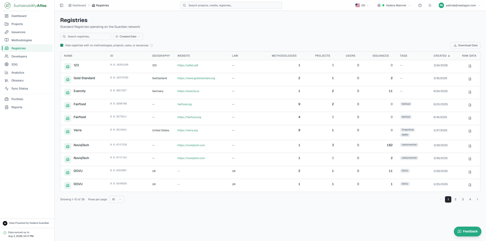
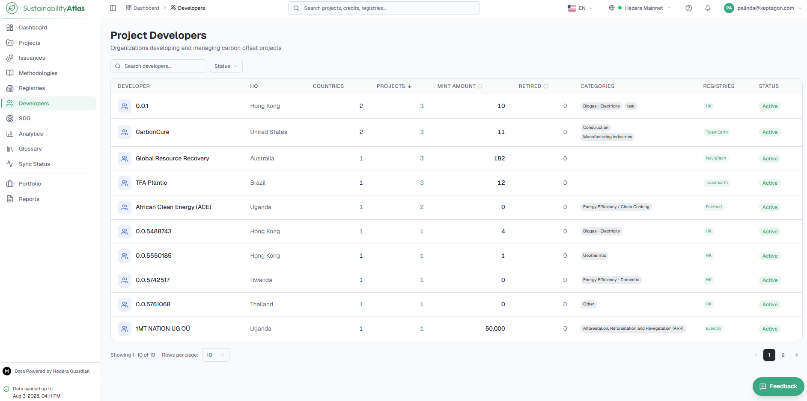
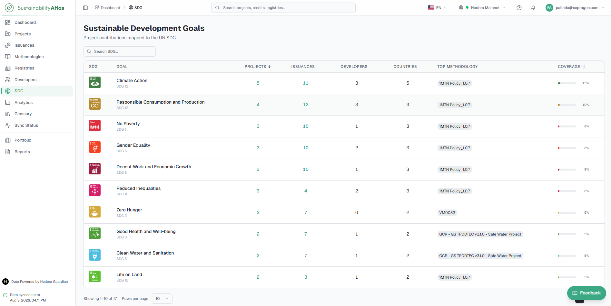

# 07 — Registries, Developers and SDGs

The Atlas's three reference catalogues and the columns of each.

* **Registries** represent the organizations responsible for publishing methodologies, verifying sustainability projects, and administering the issuance of environmental credits.
* **Developers** are the organizations that design, implement, and operate sustainability projects.
* **SDG** presents the United Nations Sustainable Development Goals, allowing users to explore how projects contribute to global sustainability objectives.

## Registries

A consolidated catalogue of sustainability registries operating on the Hedera Guardian network. Each registry acts as the governing authority for one or more methodologies and their associated sustainability projects, allowing users to explore registry ecosystems, compare activity, and navigate to related methodologies, projects, and issuances.

| Column | What it means |
| --- | --- |
| Name | Registry name. Selecting it opens the Registry Details page. |
| ID | Guardian registry identifier. |
| Geography | Country or region where the registry operates. |
| Website | Official registry website (when available). |
| Law | Applicable legal jurisdiction or governing law. |
| Methodologies | Number of methodologies published by the registry. |
| Projects | Number of registered projects under the registry. |
| Users | Number of registered users associated with the registry. |
| Issuances | Total number of credit issuances created under the registry. |
| Tags | Registry classifications or descriptive labels. |
| Created | Registry creation date. |
| Raw Data | Opens the underlying Guardian record in structured JSON format. |

## Developers

The organizations responsible for designing, implementing, and managing sustainability projects — each developer's project portfolio, issuance activity, and areas of expertise.

| Column | What it means |
| --- | --- |
| Developer | The organisation's name. |
| HQ | Where it is headquartered. |
| Countries | How many countries it operates projects in. |
| Projects | How many projects it runs. |
| Issued | Total credits issued across all its projects. |
| Retired | How many of those have been permanently retired for offsetting. |
| Categories | The kinds of project it works on. |
| Registries | Which registries it works with. |
| Status | Its current state. |

## Sustainable Development Goals (SDG)

The United Nations Sustainable Development Goals represented across sustainability projects within the Atlas, with summary statistics showing the scale of activity associated with each goal.

| Column | What it means |
| --- | --- |
| SDG | Official United Nations SDG icon. |
| Goal | Name and number of the Sustainable Development Goal. Selecting the goal opens its detailed page. |
| Projects | Number of projects contributing to the SDG. Clicking the value opens the corresponding filtered project list. |
| Issuances | Total credit issuances generated by projects mapped to the SDG. |
| Developers | Number of organisations contributing projects to the SDG. |
| Countries | Number of countries where contributing projects are located. |
| Top Methodology | Methodology most frequently associated with projects contributing to the SDG. |
| Coverage | Percentage of all Atlas projects mapped to the SDG, displayed as a progress indicator. |

---

### Related & Workflow Progression

* ← **Previous**: [06 — Methodologies](06-methodologies.md) – Published policy workflows, rules, and decoding statuses
* **Step 7 of 15**: **Registries, Developers and SDGs** – Standard registries, project developers, and SDG alignment
* → **Next**: [08 — Analytics](08-analytics.md) – Market analytics, cross-cutting trend views, and distributions
