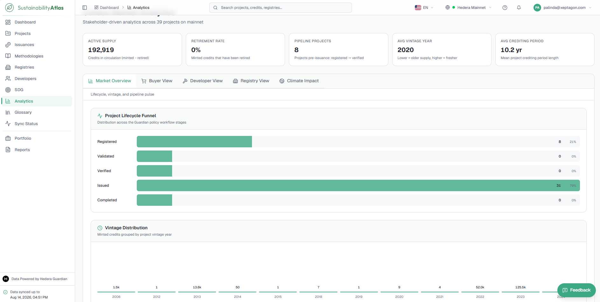
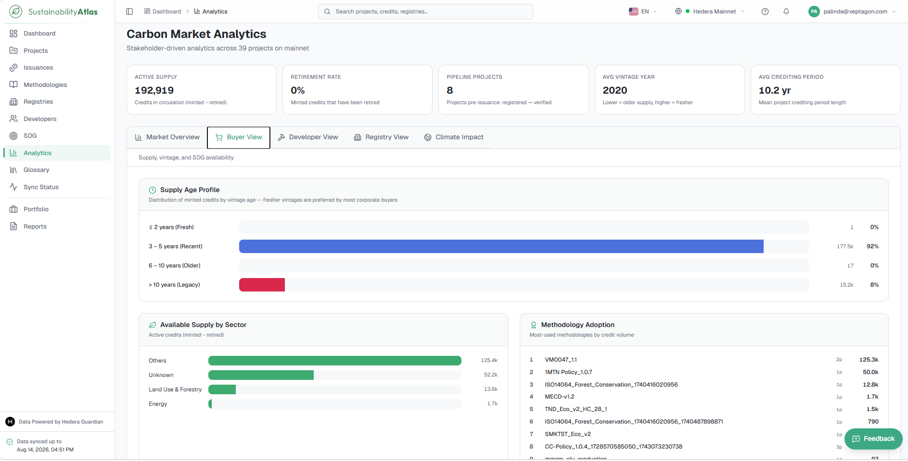
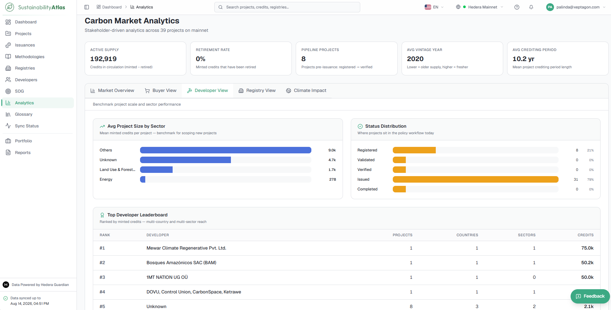
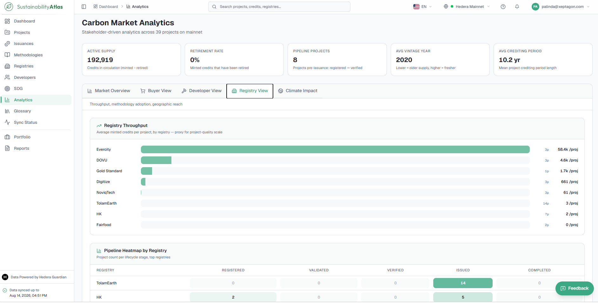
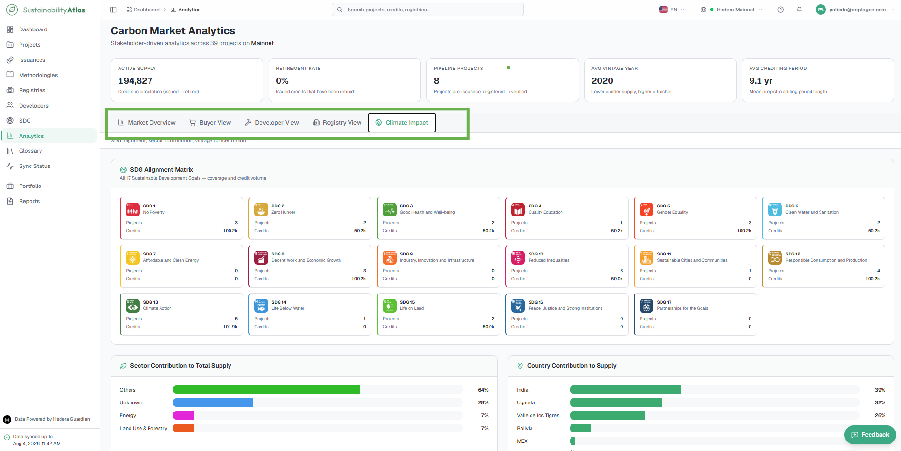

# 08 — Analytics

The Analytics page provides aggregated, cross-cutting views of all sustainability and carbon credit data indexed by the Atlas. While the Dashboard answers *"how big is this network and what is happening right now,"* Analytics answers *"what do these trends mean for my specific role and decision-making."* 

It combines data across projects, credit issuances, methodologies, registries, developers, and SDGs to reveal market-wide trends, supply availability, pipeline velocity, and climate impact.

Everything on the Analytics page is dynamically scoped to the network selected in the top bar.

---

## The Headline KPI Strip

Five high-level summary cards sit prominently above the stakeholder tabs. These headline metrics remain visible regardless of which tab is selected, providing immediate market context.

| Metric | What it tells you | How it is calculated |
|---|---|---|
| **Active Supply** | Volume of credits currently available in circulation. | Total issued credits minus total permanently retired credits (`Total Issued - Total Retired`). |
| **Retirement Rate** | Share of issued credits that have been retired for offsetting. | Percentage ratio of retired credits to total issued credits (`Retired / Issued * 100`). High rates indicate active credit utilization rather than dormant inventory. |
| **Pipeline Projects** | Projects progressing through verification stages that have not yet issued credits. | Count of all registered, under validation, and verified projects awaiting their initial credit issuance. Represents future market supply. |
| **Avg Vintage Year** | The average vintage year across all issued credits. | Weighted average vintage year of issued supply. Lower numbers indicate older supply, while higher numbers indicate newer, fresher vintages. |
| **Avg Crediting Period** | The mean duration of project crediting lifecycles. | Average length (in years) across projects with verified start and end crediting dates. |

---

## The Five Stakeholder Views

The core of the Analytics page is structured into five specialized stakeholder views accessible via top tab navigation. Underneath the tabs, a one-line description contextualizes the focus of the active view.

---

### 1. Market Overview

*Lifecycle, vintage, and pipeline pulse.* 

The general-purpose dashboard designed for broad market analysis, ecosystem health monitoring, and macro-level trends.

- **Project Lifecycle Funnel** — Displays project distribution across the five core workflow stages: *Registered*, *Under Validation*, *Verified*, *Issued*, and *Completed*. Each stage shows total project count and its relative percentage share of the network. A sharp drop-off between stages highlights potential administrative or verification bottlenecks in the pipeline.
- **Vintage Distribution** — A bar chart grouping issued credits by their vintage year (the year the emission reduction or removal occurred). Hovering over any vintage bar shows the exact credit volume and number of contributing projects.
- **Top Sectors by Credits Issued** — Horizontal comparative bars showing credit volume concentration across different sustainability sectors (e.g., Forestry, Renewable Energy, Waste Management).
- **Top Host Countries by Credits** — Ranked listing of leading project host countries, displaying country rank, project count, and total credit volume generated.

---

### 2. Buyer Overview

*Supply availability, vintage freshness, and SDG co-benefit availability.*

Tailored for credit buyers, corporate sustainability officers, and procurement desks seeking high-integrity credits that match specific portfolio criteria and ESG requirements.

- **Supply Age Profile** — Categorizes total issued supply into four freshness tiers:
  - **Fresh** (≤ 2 years old) — High buyer demand for recent carbon accounting compliance.
  - **Recent** (3–5 years old) — Stable supply tier.
  - **Older** (6–10 years old) — Mature vintages.
  - **Legacy** (> 10 years old) — Historical issuances.
- **Available Supply by Sector** — Displays active, unretired credits remaining in circulation broken down by sector. Unlike the cumulative issuance view, this chart isolates purchasable inventory.
- **Methodology Adoption** — Top methodologies ranked by issuance volume and active project count, helping buyers identify widely adopted and standardized project methodologies.
- **SDG Co-benefit Coverage** — Interactive cards for UN Sustainable Development Goals showing project counts and associated credit volumes, enabling buyers with dual-mandate corporate requirements to target specific socio-environmental co-benefits.

---

### 3. Developer View

*Benchmark project scale, sector performance, and competitor landscape.*

Designed for project developers, carbon project originators, and investors evaluating project sizing, sector benchmarks, and market positioning.

- **Avg Project Size by Sector** — Computes the average credits issued per project within each sector. Serves as a vital benchmark for feasibility studies and capacity sizing.
- **Status Distribution** — Shows how active projects across the ecosystem are distributed across pipeline stages, providing competitive insight into industry-wide project maturation.
- **Top Developer Leaderboard** — A detailed ranking table highlighting the most active project developer organizations across the network.

| Column | Description |
|---|---|
| **Rank** | Position based on total credit issuance volume (`#1`, `#2`, etc.). |
| **Developer** | Name of the project developer organization. |
| **Projects** | Total number of projects managed by the developer. |
| **Countries** | Number of distinct countries the developer operates in. |
| **Sectors** | Number of distinct sector categories covered. |
| **Credits** | Cumulative credits issued across all developer projects. |

---

### 4. Registry View

*Throughput, methodology governance, and cross-registry pipeline comparison.*

Built for standard registries, auditing bodies, and regulators monitoring issuance throughput, methodology utilization, and pipeline distribution.

- **Registry Throughput** — Evaluates issuance efficiency by displaying the average credit issuance volume processed per project for each registry (`credits / projects`).
- **Pipeline Heatmap by Registry** — A cross-matrix mapping top standard registries against the five project lifecycle stages (*Registered*, *Validation*, *Verified*, *Issued*, *Completed*). Cells are color-coded by density, highlighting at a glance where each registry's projects are concentrated.
- **Registry Market Share** — Proportional breakdown of total network credit volume governed under each standard registry.

---

### 5. Climate Impact

*SDG alignment, sector contribution, geographic reach, and vintage concentration risk.*

Created for sustainability analysts, ESG auditors, and impact investors seeking to measure and report on non-carbon sustainable development impacts and environmental portfolio risks.

- **SDG Alignment Matrix** — Comprehensive breakdown of UN Sustainable Development Goals, displaying the exact number of contributing projects and credit volume mapped to each goal, with color-coded SDG branding.
- **Sector Contribution to Total Supply** — Percentage share of total network credits delivered by each intervention type (e.g., Nature-Based Solutions, Energy Efficiency, Methane Capture).
- **Country Contribution to Supply** — Geographic distribution showing each host nation's percentage contribution to overall network supply.
- **Vintage Concentration Risk** — Color-coded risk assessment distribution based on vintage age bands, alerting impact teams to over-reliance on aging carbon vintages.

---

## Analytical Guidelines & Interpretation

When analyzing metrics and distributions across the Analytics module, keep the following distinctions in mind:

### 1. Credits vs. Projects (Scale Distortion)
Credits (tonnes of $CO_2e$) and Project Counts represent fundamentally different units of analysis. A sector or country with only two or three large industrial or forestry projects may represent over 60% of total issued credits while accounting for less than 5% of project counts. Always verify whether a chart visualizes credit volume or project frequency.

### 2. Active Supply vs. Total Issued
Total Issued credits represent the cumulative historical volume minted since inception. Active Supply represents circulating volume (`Issued - Retired`). For market liquidity and available inventory, always reference Active Supply.

### 3. Vintage Year vs. Issuance Year
The vintage year denotes when the actual environmental reduction or removal occurred. The issuance year is when the credit token was minted on the blockchain ledger. A credit minted in 2024 may carry a 2021 vintage. Analytics charts explicitly categorize by verified vintage year.

### 4. Indexed Ledger Truth
All figures and distributions are computed directly from on-chain Guardian messages and tokens synchronized up to the timestamp shown in the sidebar. Analytics reflects verified, published ledger data rather than predictive estimates or off-chain speculative listings.

---

### Related & Workflow Progression

* ← **Previous**: [07 — Registries, Developers and SDGs](07-registries-developers-sdgs.md) – Standard registries, project developers, and SDG alignment
* **Step 8 of 15**: **Analytics** – Market analytics, cross-cutting trend views, and distributions
* → **Next**: [09 — Portfolio](09-portfolio.md) – Personal watchlist management and custom dashboard widgets
